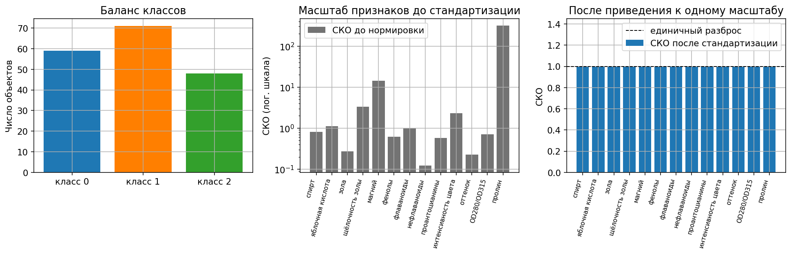
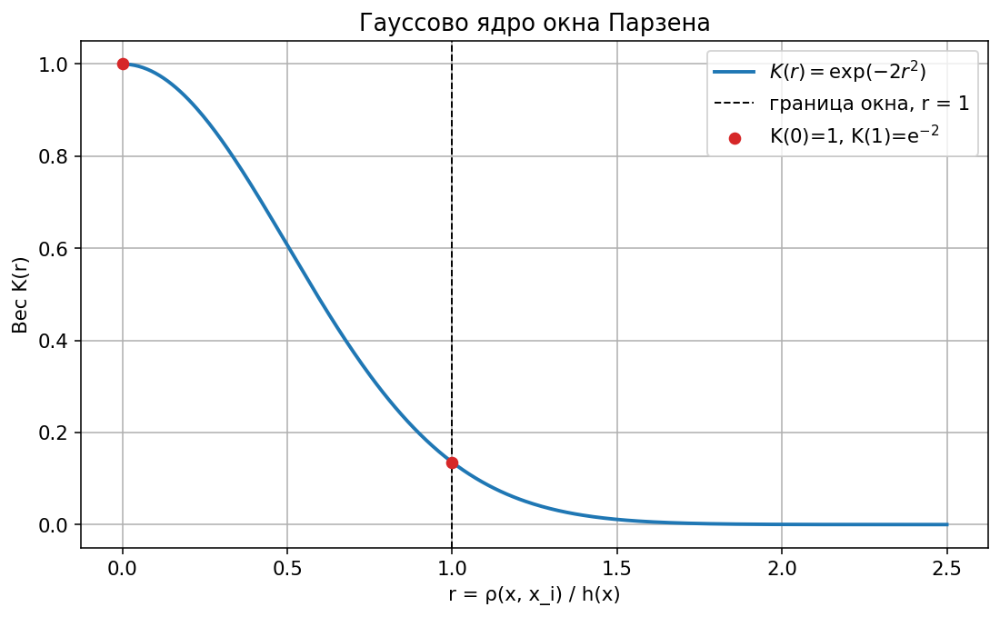
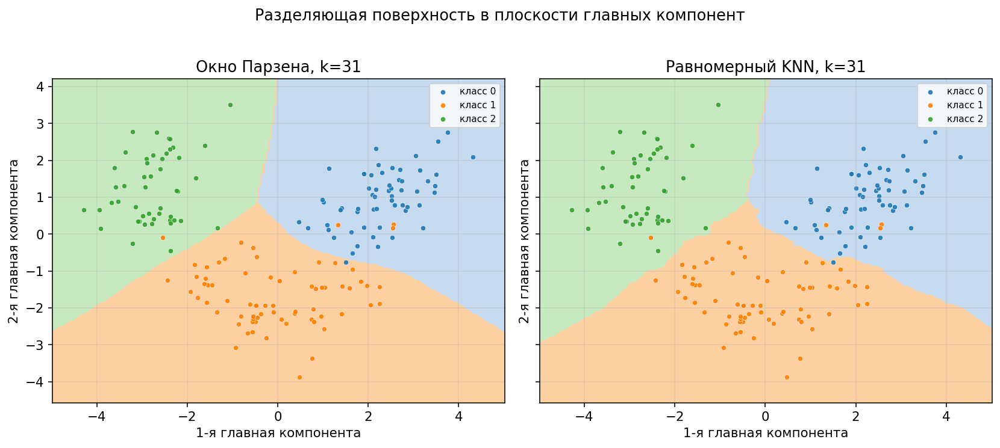
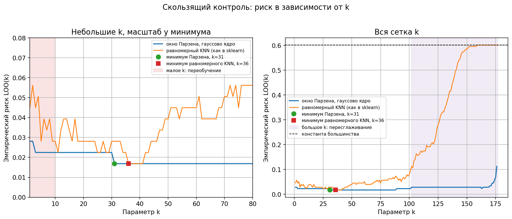
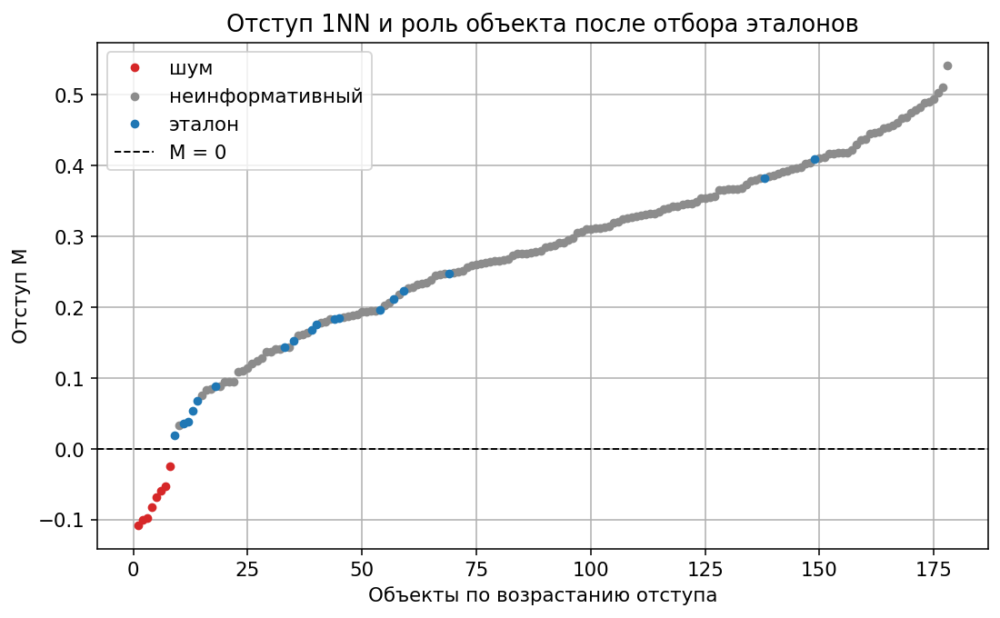
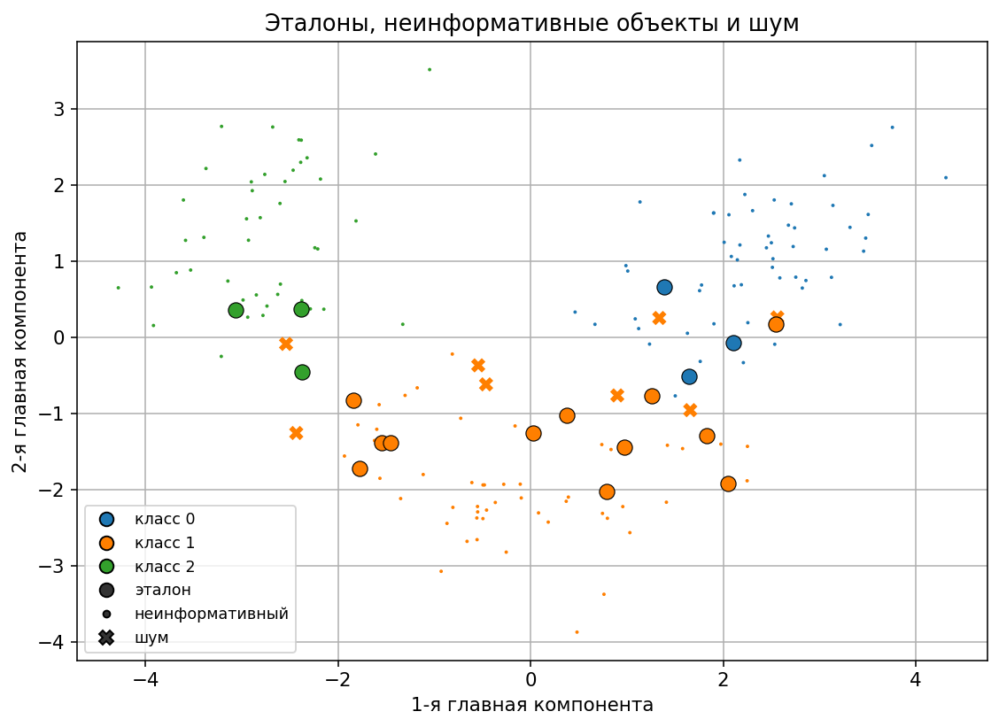
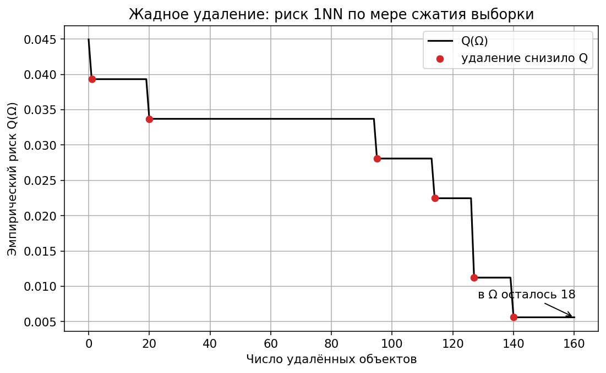
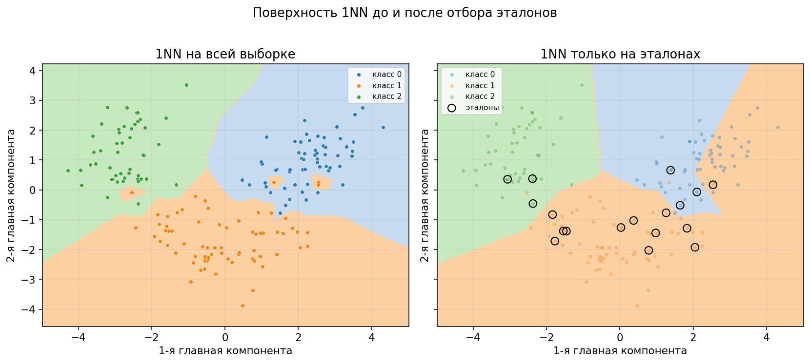
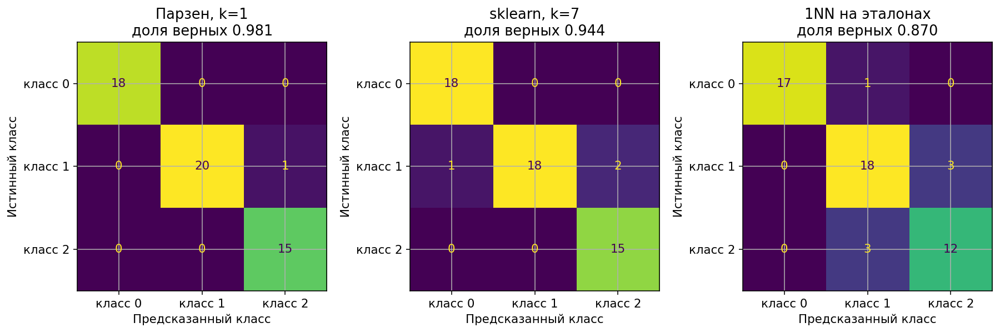
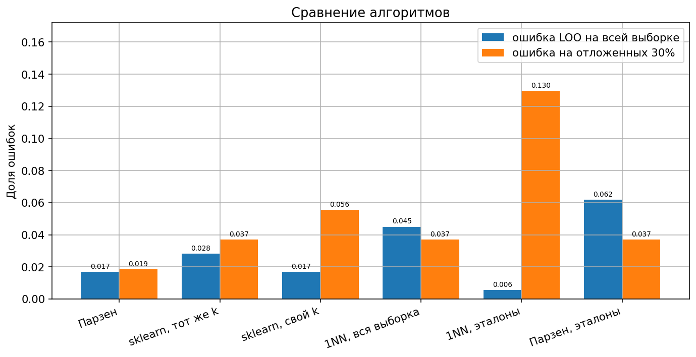

# Лабораторная работа №2. Метрическая классификация

Реализованы KNN с окном Парзена переменной ширины (гауссово ядро), подбор $k$ скользящим контролем и жадное удаление не-эталонов для 1NN.

Запуск:

```bash
python students/aleksandruk-bs/lab2/source/train.py
```

Датасет берётся из `sklearn.datasets.load_wine` в момент запуска.

## Датасет и метрика

[Wine](https://scikit-learn.org/stable/modules/generated/sklearn.datasets.load_wine.html) — три культивара по 13 химическим признакам (спирт, кислоты, фенолы, пролин и т.д.). В sklearn классы называются `class_0`, `class_1`, `class_2`.

| | значение |
|---|---|
| объектов | 178 |
| признаков | 13 |
| пропусков | 0 |
| класс 0 | 59 |
| класс 1 | 71 |
| класс 2 | 48 |
| обучение / тест | 124 / 54, стратификация по классу |



Константа «всегда класс 1» ошибается на $107/178 \approx 0{,}601$. Это ориентир для большого $k$: когда окно накрывает почти всю выборку, классификатор сваливается в большинство.

Признаки в разных единицах. СКО пролина $314$ (диапазон $278$–$1680$), СКО нефлаваноидов $0{,}12$, СКО магния $14{,}2$, СКО спирта $0{,}81$. До нормировки евклидово расстояние почти целиком определяется пролином. Перед расстояниями признаки приводятся к нулевому среднему и единичному разбросу (`StandardScaler`). В скользящем контроле по всей выборке масштаб считается по всем объектам: один вынутый объект сдвигает среднее на $1/178$. На отложенной выборке масштаб считается только по обучению.

Расстояние — метрика Минковского. После нормировки веса признаков $w_j = 1$, степень $p = 2$, то есть обычная евклидова метрика:

$$
\rho(x, x_i) = \left( \sum_{j=1}^{n} w_j \lvert x_j - x_j^{(i)} \rvert^p \right)^{1/p}.
$$

## Окно Парзена переменной ширины

Обычный KNN даёт соседу вес по рангу: $w(i, x) = [i \le k]$. В окне Парзена вес зависит от расстояния, а ширина окна у каждого объекта своя — расстояние до $(k+1)$-го соседа:

$$
a(x; X^\ell, k, K) = \operatorname{argmax}_{y \in Y} \sum_{i=1}^{\ell} [y_i = y] \cdot K\left( \frac{\rho(x, x_i)}{\rho(x, x^{(k+1)})} \right).
$$

$h(x) = \rho(x, x^{(k+1)})$ — переменная ширина. Ядро гауссово:

$$
K(r) = \exp(-2r^2).
$$

$K(0) = 1$, на границе окна $K(1) = e^{-2} \approx 0{,}135$. Сумма идёт по всей выборке: у гауссова ядра нет жёсткого обрезания, объекты дальше $(k+1)$-го соседа всё ещё голосуют, но быстро затухают. При равенстве сумм берётся меньшая метка класса.



Ядро задаёт гладкость границы. Параметр $k$ задаёт ширину окна и этим влияет на качество аппроксимации. На рисунке ниже при одном и том же $k = 31$ гауссово окно даёт более гладкие области, равномерное голосование — более ломаную границу. Картина построена в плоскости двух главных компонент (на них приходится $36{,}2\% + 19{,}2\% = 55{,}4\%$ разброса). Классификатор для этого рисунка обучен уже в этой плоскости; числа в таблицах посчитаны в исходных 13 признаках.



## Подбор $k$ скользящим контролем

При фиксированном $k$ оценка несмещённая: контрольный объект $x_i$ исключается из обучения, расстояние до самого себя не считается.

$$
\mathrm{LOO}(k, X^\ell) = \frac{1}{\ell} \sum_{i=1}^{\ell} \left[ a\left(x_i; X^\ell \setminus \{x_i\}, k, K\right) \neq y_i \right] \to \min_k.
$$

Минимум по сетке $k$ уже чуть оптимистичен: $k$ выбрано на той же выборке. Это проверяет отложенные 30%.



Сетка $k = 1, \ldots, 176$ для Парзена (нужен $(k+1)$-й сосед среди оставшихся $177$) и $k = 1, \ldots, 177$ для равномерного голосования.

| $k$ | Парзен, ошибок | равномерный KNN, ошибок |
|---:|---:|---:|
| 1 | 5 | 8 |
| 5, 10, 20 | 4 | 5 |
| 31 | **3** | 5 |
| 36 | 3 | **3** |
| 50 | 3 | 7 |
| 80 | 3 | 10 |
| 100 | 4 | 14 |
| 150 | 5 | 104 |
| максимум | 20 ($k=176$) | 107 ($k=177$) |

У Парзена риск $3/178 \approx 0{,}017$ держится на всём отрезке $k = 31, \ldots, 88$ (58 значений). Берётся левый край, $k = 31$: дальше риск не падает, а окно только шире. У равномерного KNN тот же минимум $3/178$ на коротком отрезке $k = 36, \ldots, 41$.

Левая заливка на графике — малое $k$. При $k = 1$ Парзен ошибается 5 раз, равномерный KNN — 8. На хорошо разделимой выборке переобучение слабое, но край виден: единичные соседи чаще попадают в шум.

Правая заливка — большое $k$. Равномерный KNN с $k \approx 100$ уже заметно хуже минимума и к $k = 177$ совпадает с константой большинства ($107/178$). Парзен держится около $0{,}02$ почти до $k = 160$ и в самом конце поднимается только до $20/178$. Далёкие объекты у гауссова ядра почти не голосуют, поэтому широкое окно не превращается в подсчёт большинства. Ширина $k$ сдвигает рабочую точку, а вид ядра решает, как быстро большое окно портит аппроксимацию.

## Сравнение со sklearn

Эталон — `sklearn.neighbors.KNeighborsClassifier` с `weights="uniform"`, `metric="euclidean"`, `algorithm="brute"`. Это прямое голосование $k$ ближайших, вес $w(i, x) = [i \le k]$. Своя реализация Парзена — гауссов вес от расстояния до $(k+1)$-го соседа.

Предсказания LOO своей равномерной версии и sklearn совпали при $k = 31$ и при $k = 36$: расхождений 0.

| Алгоритм | $k$ | ошибок LOO | доля верных | F1 macro |
|---|---:|---:|---:|---:|
| Парзен | 31 | 3/178 | 0,983 | 0,984 |
| sklearn, тот же $k$ | 31 | 5/178 | 0,972 | 0,973 |
| sklearn, свой минимум LOO | 36 | 3/178 | 0,983 | 0,984 |
| 1NN, вся выборка | 1 | 8/178 | 0,955 | 0,956 |

При общем $k = 31$ гауссово окно ошибается реже равномерного голосования (3 против 5). В своём минимуме sklearn догоняет Парзен по числу ошибок. 1NN — это равномерный KNN при $k = 1$, на полной выборке он слабее обоих.

Скорость, медиана повторов на этой машине:

| Операция | своя реализация | sklearn |
|---|---:|---:|
| один проход LOO, $k = 31$ | 1,3 мс | 0,50 с |
| предсказание 54 тестовых объектов | 0,71 мс | 5,3 мс |

В LOO матрица расстояний считается один раз на всю выборку. sklearn для каждого из 178 вынутых объектов ищет соседей заново, отсюда разрыв примерно в 400 раз. На одном предсказании теста разрыв около 8 раз: там обе стороны считают расстояния один раз.

## Отбор эталонов

Ищется подмножество $\Omega \subseteq X^\ell$, на котором 1NN ошибается не чаще, чем на полной выборке. Знаменатель — объём исходной выборки, а не $|\Omega|$: снятый объект всё равно надо классифицировать.

$$
Q(\Omega) = \frac{1}{\ell} \sum_{i=1}^{\ell} \left[ a(x_i; \Omega \setminus \{x_i\}) \neq y_i \right].
$$

Если $x_i$ уже вынут из $\Omega$, соседи — это всё $\Omega$. Если $x_i$ ещё в $\Omega$, он из соседей исключается.

Жадное удаление. Старт $\Omega := X^\ell$. Пока есть объект, удаление которого не повышает $Q$, снимается тот, у которого новое $Q$ меньше. При равенстве сначала снимается объект, на котором 1NN уже ошибается, затем объект с большим отступом: он глубже внутри своего класса. Последний объект класса не удаляется, иначе этот класс нельзя назначить.

Отступ считается один раз на полной выборке. $\rho_{\text{свой}}$ — расстояние до ближайшего другого своего, $\rho_{\text{чужой}}$ — до ближайшего чужого:

$$
M(x_i) = \frac{\rho_{\text{чужой}} - \rho_{\text{свой}}}{\rho_{\text{чужой}} + \rho_{\text{свой}}}.
$$

$M < 0$ значит, что ближайший чужой ближе своего: 1NN на полной выборке ошибается. Таких объектов 8, и это ровно 8 ошибок 1NN ($8/178$).

Роли после остановки алгоритма:

- эталон — остался в $\Omega$, без него $Q$ вырастает;
- шум — удалён и $M < 0$;
- неинформативный — удалён и $M \ge 0$, свой класс узнаётся и без него.



| Роль | объектов | отступ, мин … макс |
|---|---:|---|
| шум | 8 | $-0{,}108 \ldots -0{,}024$ |
| эталон | 18 | $0{,}020 \ldots 0{,}409$ |
| неинформативный | 152 | $0{,}034 \ldots 0{,}542$ |

Все 8 объектов с $M < 0$ удалены. Часть эталонов лежит глубже внутри класса и держит свой участок: отступ у них доходит до $0{,}41$. Средний отступ неинформативных ($0{,}30$) выше, чем у эталонов ($0{,}17$).

На плоскости главных компонент шум сидит на чужой стороне или на стыке классов, неинформативные заполняют середину сгустков, эталоны обведены чёрным.



$Q$ падает с $8/178$ до $1/178$. Строго снизили риск 6 удалений, остальные 154 снятия $Q$ не меняют: это сжатие выборки. В $\Omega$ остаётся 18 объектов из 178, все три класса на месте. Жадное удаление на всей выборке заняло $1{,}0$ с. На обучении (124 объекта → 12 эталонов) медиана трёх прогонов — $0{,}41$ с. С этим временем ниже сравнивается экономия на предсказании.



Поверхность 1NN до и после отбора — снова в плоскости главных компонент. Справа обучение только на проекциях 18 эталонов, отобранных в исходном пространстве. Кольцо, которое в проекции попало в чужую область, в 13 признаках может быть далеко: на две компоненты приходится лишь $55\%$ разброса.



## С отбором эталонов и без

Отбор минимизирует $Q$ именно для 1NN. Для Парзена на $\Omega$ параметр $k$ подбирается заново: $k = 31$, найденный на 178 объектах, для 18 эталонов накрывает почти всех и голос становится слишком ровным. На эталонах минимум снова на левом краю, $k = 1$.

| Алгоритм | множество | $k$ | ошибок |
|---|---|---:|---:|
| 1NN | вся выборка | 1 | 8/178 |
| 1NN | 18 эталонов | 1 | 1/178 |
| Парзен | вся выборка | 31 | 3/178 |
| Парзен | 18 эталонов | 1 | 11/178 |

$1/178$ у 1NN на эталонах — это тот самый $Q$, который жадный алгоритм уменьшал. Как оценка нового метода на новых объектах она оптимистична. Парзен на тех же 18 точках ошибается чаще, чем на полной выборке: опоры мало, а ядро при $k = 1$ всё ещё подмешивает дальних эталонов.

Честная проверка — отложенные 30%. И $k$, и $\Omega$ выбираются только по 124 объектам обучения.

На обучении LOO Парзена равен $3/124$ почти при всех $k$ от 1 до 119. Минимум достигается уже при $k = 1$, его и берём. Внутри этого плато конкретное $k$ риск не меняет. У равномерного KNN тот же уровень $3/124$ впервые достигается при $k = 7$. Таких $k$ на сетке 14, последнее — $k = 53$. На обучении отбор эталонов доводит LOO 1NN с $7/124$ до $0/124$ и оставляет 12 эталонов (105 неинформативных, 7 шумовых).

| Алгоритм | $k$ на обучении | $|\Omega|$ | ошибок на тесте | доля верных | F1 macro |
|---|---:|---:|---:|---:|---:|
| Парзен | 1 | 124 | 1/54 | 0,981 | 0,981 |
| sklearn, тот же $k$ | 1 | 124 | 2/54 | 0,963 | 0,964 |
| sklearn, свой LOO | 7 | 124 | 3/54 | 0,944 | 0,945 |
| 1NN, вся обучающая выборка | 1 | 124 | 2/54 | 0,963 | 0,964 |
| 1NN, эталоны | 1 | 12 | 7/54 | 0,870 | 0,870 |
| Парзен, эталоны | 1 | 12 | 2/54 | 0,963 | 0,964 |

Время одного предсказания 1NN на тех же 54 тестовых объектах. Замер — медиана: пачка из 200 вызовов, 7 повторов. До отбора опора — 124 объекта обучения, после — 12 эталонов.

| | до отбора | после отбора |
|---|---:|---:|
| объектов опоры | 124 | 12 |
| расстояний на 54 запроса | 6 696 | 648 |
| память опоры (признаки и метки) | 13 888 байт | 1 344 байта |
| время предсказания 54 объектов | 0,59 мс | 0,078 мс |

Опора меньше в $124/12 \approx 10{,}3$ раза, и ровно во столько же раз меньше расстояний и байт. По часам ускорение в $7{,}6$ раза: $0{,}59 / 0{,}078$. Фиксированная стоимость вызова не даёт отношению времён дойти до $10{,}3$.

Один такой проход экономит $0{,}59 - 0{,}078 = 0{,}51$ мс. Жадное удаление на обучении стоит $0{,}41$ с. Отбор окупается примерно после $410 / 0{,}51 \approx 800$ проходов по 54 объекта, это порядка $4 \cdot 10^{4}$ запросов. Один тест эти $0{,}41$ с не возвращает. Выигрыш появляется, когда сжатую опору используют многократно: в памяти лежит в десять раз меньше объектов, и каждый следующий 1NN смотрит в $648$ соседей вместо $6\,696$.

При $k = 1$ ширина окна Парзена — расстояние до второго соседа, остальные объекты голосуют с гауссовым весом. Поэтому Парзен при $k = 1$ и равномерный KNN при $k = 1$ — разные правила: на тесте 1 ошибка против 2.



Единственная ошибка Парзена — объект класса 1, отнесённый к классу 2. sklearn при своём $k = 7$ трижды путает класс 1 с соседями. 1NN на 12 эталонах ошибается 7 раз: нулевой LOO на обучении на новые точки не переносится. Парзен на тех же 12 эталонах ошибается 2 раза — ядро частично компенсирует редкую опору.



Синий столбец — LOO по всей выборке, параметры подобраны по ней. Оранжевый — тест, параметры подобраны только по обучению. У 1NN на эталонах синий столбец $0{,}006$ и оранжевый $0{,}130$ стоят рядом именно поэтому: первый — минимизированный $Q$, второй — новые объекты.

## Сводная таблица

| Алгоритм | $k$, вся выборка | ошибки LOO | $k$, обучение | ошибки теста | F1 теста |
|---|---:|---:|---:|---:|---:|
| Парзен, гауссово окно | 31 | 3/178 | 1 | 1/54 | 0,981 |
| sklearn, тот же $k$ | 31 | 5/178 | 1 | 2/54 | 0,964 |
| sklearn, свой $k$ | 36 | 3/178 | 7 | 3/54 | 0,945 |
| 1NN, вся выборка | 1 | 8/178 | 1 | 2/54 | 0,964 |
| 1NN, эталоны | 1 | 1/178 | 1 | 7/54 | 0,870 |
| Парзен, эталоны | 1 | 11/178 | 1 | 2/54 | 0,964 |

$|\Omega|$ на полной выборке — 18 из 178, на обучении — 12 из 124.

## Реализация

| Пункт | Где |
|---|---|
| загрузка Wine, стандартизация, отложенная выборка | `dataset.py` |
| метрика Минковского, $w_j$, гауссово ядро | `knn.py` |
| окно Парзена переменной ширины | `parzen_predict_from_distances` |
| равномерное голосование $k$ ближайших | `uniform_predict_from_distances` |
| LOO, объект исключён с диагонали расстояний | `loo_distance_matrix`, `loo_curve` |
| жадное удаление, отступ, роли | `prototypes.py` |
| графики и таблицы | `train.py` |

Свой алгоритм — в `knn.py` и `prototypes.py`. sklearn используется для данных, разбиения, стандартизации, PCA, метрик и эталонного `KNeighborsClassifier`.

## Выводы

1. Без стандартизации евклидова метрика смотрит на пролин. После приведения к одному масштабу классы вина разделяются.
2. Окно Парзена с $K(r) = \exp(-2r^2)$ и шириной до $(k+1)$-го соседа на полной выборке достигает $3/178$ при $k = 31, \ldots, 88$. Взято наименьшее такое $k$.
3. Малое $k$ чуть повышает риск (5 и 8 ошибок при $k = 1$). Большое $k$ доводит равномерный KNN до константы большинства ($107/178$), Парзен деградирует позже и слабее ($20/178$). Ядро держит гладкость, $k$ — ширину окна.
4. При фиксированном $k$ LOO не использует расстояние до самого объекта. Минимум по сетке $k$ проверяется отложенной выборкой.
5. При $k = 31$ Парзен точнее sklearn с равномерными весами (3 ошибки против 5). В своём минимуме $k = 36$ sklearn выходит на те же 3 ошибки. LOO у матрицы расстояний быстрее поэлементного sklearn примерно в 400 раз, одно предсказание — примерно в 8 раз.
6. Жадное удаление на всей выборке занимает $1{,}0$ с и оставляет 18 эталонов. $Q$ 1NN падает с $8/178$ до $1/178$. Восемь объектов с $M < 0$ уходят как шум, 152 — как неинформативные.
7. На обучении отбор стоит $0{,}41$ с и сжимает опору со 124 до 12 объектов. Предсказание 1NN на 54 тестовых объектах ускоряется с $0{,}59$ мс до $0{,}078$ мс, в $7{,}6$ раза; расстояний и байт меньше в $10{,}3$ раза. Один тест эти $0{,}41$ с не окупает: порог — около 800 таких проходов.
8. $1/178$ — критерий, который алгоритм минимизировал. На отложенных объектах 1NN по 12 эталонам даёт 7 ошибок из 54 против 2 у 1NN на всей обучающей выборке. Парзен на тех же эталонах ошибается 2 раза: редкую опору вытягивает ядро.
9. На тесте лучший результат у Парзена на полной обучающей выборке: 1 ошибка из 54.
