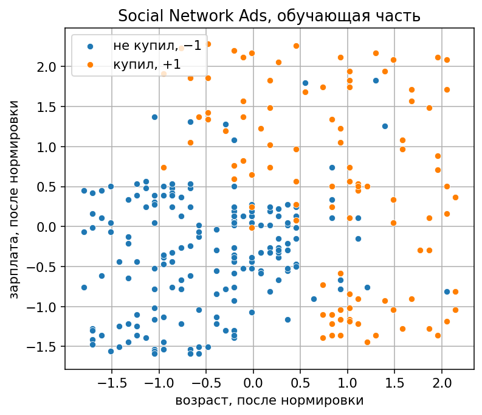
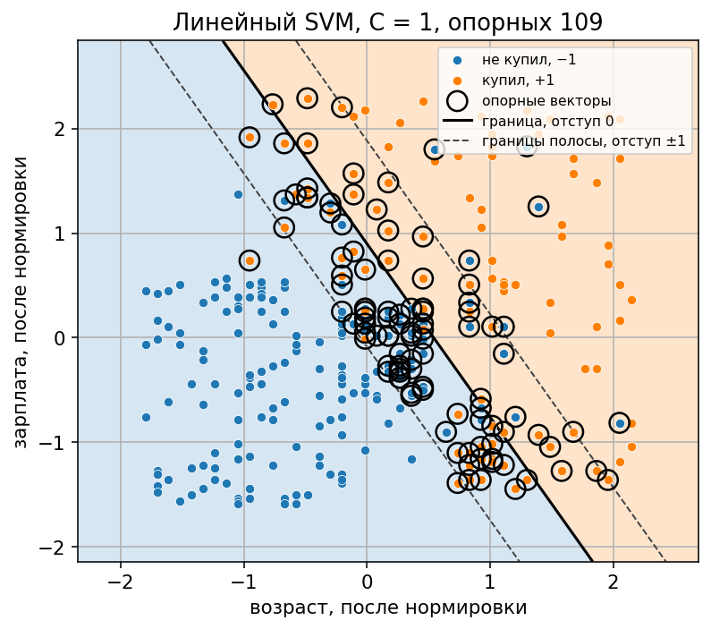
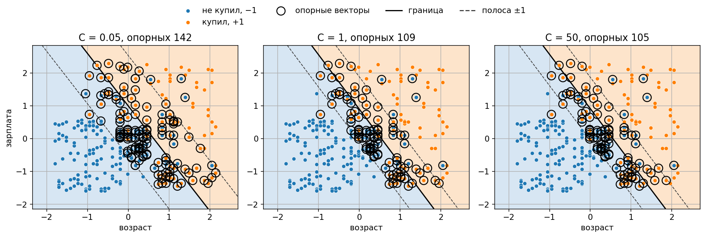
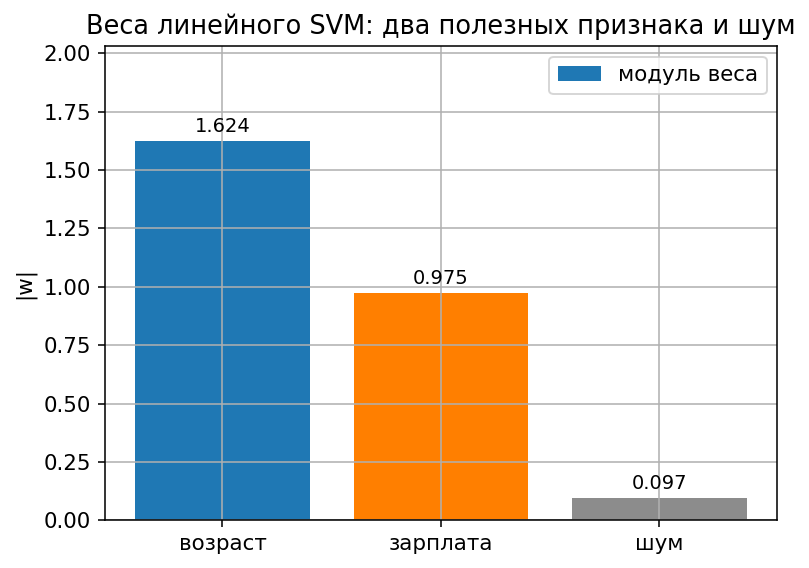
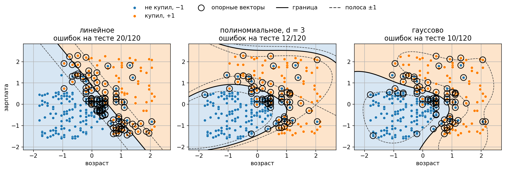
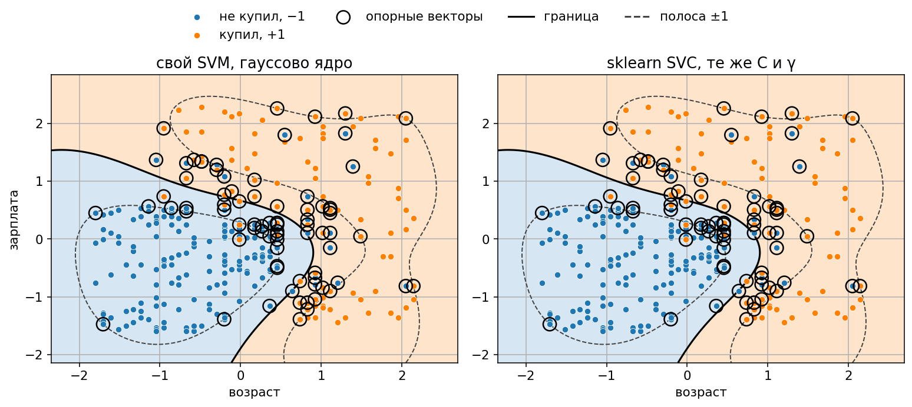
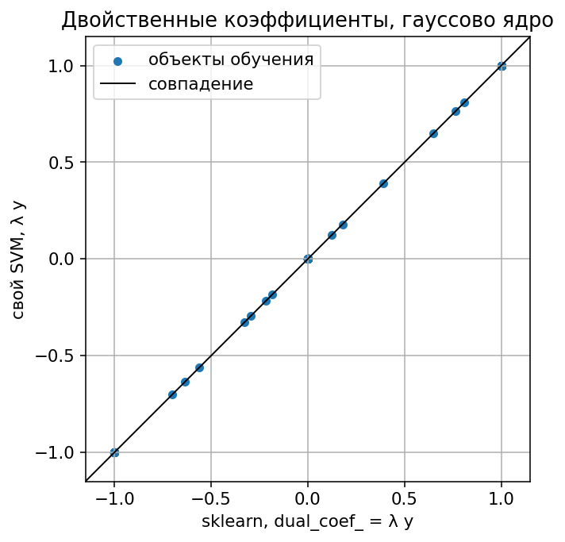

# Лабораторная работа №3. SVM

Реализован метод опорных векторов через двойственную задачу по множителям Лагранжа. Используются три ядра: линейное, полиномиальное степени 3 и гауссово. Эталон — `sklearn.svm.SVC` с теми же C и тем же ядром.

Запуск:

```bash
python students/aleksandruk-bs/lab3/source/train.py
```

Таблица скачивается при запуске и в репозиторий не кладётся.

## Датасет

[Social Network Ads](https://www.kaggle.com/datasets/akram24/social-network-ads): 400 человек, купил человек товар по рекламе в соцсети или нет. Признаки модели — возраст и оценка зарплаты. Это те же два столбца, по которым рисуется граница, без проекции в меньшую размерность. Пол и идентификатор пользователя в файле есть, в модель не входят.

Официальная выгрузка Kaggle просит ключ `kaggle.json`. Скрипт берёт тот же CSV по открытой ссылке, сначала с Hugging Face, если она недоступна — с зеркала на GitHub.

Метки Purchased переведены из {0, 1} в {−1, +1}: −1 — не купил, +1 — купил. Не купили 257 человек, купили 143. Разбиение стратифицированное, 280 на обучение и 120 на тест, `random_state = 42`. Масштаб считается только по обучению.



## Двойственная задача

Минимизируется

$$
f(\lambda) = -\sum_{i=1}^{\ell} \lambda_i + \frac{1}{2} \sum_{i=1}^{\ell} \sum_{j=1}^{\ell} \lambda_i \lambda_j y_i y_j K(x_i, x_j).
$$

при ограничениях

$$
\sum_{i=1}^{\ell} \lambda_i y_i = 0, \qquad 0 \le \lambda_i \le C.
$$

В матричном виде $Q_{ij} = y_i y_j K(x_i, x_j)$ и

$$
f(\lambda) = -\mathbf{1}^{\top}\lambda + \frac{1}{2}\lambda^{\top} Q \lambda.
$$

Матрица ядра считается один раз до оптимизации. Минимум ищет `scipy.optimize.minimize`, метод SLSQP, с градиентом $-\mathbf{1} + Q\lambda$. Равенство $\sum_i \lambda_i y_i = 0$ на этой выборке выполняется с остатком порядка $10^{-13}$.

$C$ задаёт верхнюю границу множителя. Малый $C$ держит много $\lambda_i$ на этой границе и расширяет полосу. Большой $C$ границу отодвигает.

Объект опорный, если $\lambda_i > 10^{-5}$. Опорный на границе полосы — если ещё и $\lambda_i < C - 10^{-5}$. Свободный член усредняется по таким объектам:

$$
w_0 = \sum_{j=1}^{\ell} \lambda_j y_j K(x_j, x_i) - y_i.
$$

Решающее правило:

$$
a(x) = \operatorname{sign}\left( \sum_{i=1}^{\ell} \lambda_i y_i K(x, x_i) - w_0 \right).
$$

Для линейного ядра $w = \sum_{i=1}^{\ell} \lambda_i y_i x_i$, и сумма совпадает с $\langle w, x \rangle$.

## Ядра

В скалярное произведение подставляется K. Новые координаты φ(x) не строятся: в Q и в решающем правиле стоит только значение ядра.

| ядро | формула | параметры |
|---|---|---|
| линейное | ⟨x, x'⟩ | — |
| полиномиальное | (⟨x, x'⟩ + 1)³ | степень 3 |
| гауссово | exp(−γ ‖x − x'‖²) | γ = 0,5 |

γ = 0,5 — это 1 / (число признаков) после стандартизации, тот же масштаб, что `gamma="scale"` у sklearn. Полиномиальное ядро в sklearn вызывается с `gamma=1` и `coef0=1`, иначе библиотечная формула не совпадёт с (⟨x, x'⟩ + 1)³.

На тесте при C = 1 меньше всего ошибок у гауссова ядра. Линейное и полиномиальное оставлены рядом: по ним видно, что даёт замена произведения на K.

## Линейный классификатор

При C = 1 получается w = (1,682; 1,015), w₀ = 0,912. Опорных векторов 109 из 280, на границе полосы 3. На обучении 43 ошибки из 280, на тесте 20 из 120. Доля верных на тесте 0,833, F1 macro 0,807.

‖w‖ = 1,965, ширина полосы 2 / ‖w‖ = 1,018. Сплошная линия — уровень 0, пунктир — уровни ±1.



Покупка растёт вместе с возрастом и зарплатой, но облака заходят друг в друга. Прямая полоса режет этот заход, поэтому опорных много: это точки внутри полосы и у границы.

## Регуляризация

| C | опорных | ‖w‖ | ширина 2/‖w‖ | ошибок на тесте |
|---:|---:|---:|---:|---:|
| 0,05 | 142 | 1,229 | 1,627 | 23/120 |
| 0,2 | 119 | 1,599 | 1,251 | 22/120 |
| 1 | 109 | 1,965 | 1,018 | 20/120 |
| 5 | 105 | 2,025 | 0,988 | 21/120 |
| 50 | 105 | 2,025 | 0,988 | 21/120 |

От C = 1 до C = 50 линейная полоса почти не двигается: классы перекрываются, и дальнейшее ослабление регуляризации новых опорных не снимает. Заметна левая часть сетки. При C = 0,05 полоса шире, опорных 142, на тесте 23 ошибки вместо 20.



К возрасту и зарплате добавлен столбец нормального шума. При C = 1 модули весов 1,624, 0,975 и 0,097. Вес шума примерно в 17 раз меньше веса возраста.



## Три ядра

При C = 1 линейное ядро оставляет прямую и 20 ошибок из 120. Полиномиальное загибает границу и ошибается 12 раз. Гауссово отделяет молодых с высокой зарплатой от пожилых с низкой и ошибается 10 раз.

| ядро | опорных | ошибок на обучении | ошибок на тесте | доля верных | F1 macro |
|---|---:|---:|---:|---:|---:|
| линейное | 109 | 43/280 | 20/120 | 0,833 | 0,807 |
| полиномиальное, d = 3 | 68 | 26/280 | 12/120 | 0,900 | 0,891 |
| гауссово, γ = 0,5 | 79 | 26/280 | 10/120 | 0,917 | 0,910 |



У гауссова ядра C меняет и число опорных, и ошибки.

| C | опорных | ошибок на обучении | ошибок на тесте |
|---:|---:|---:|---:|
| 0,05 | 191 | 30/280 | 11/120 |
| 0,2 | 117 | 26/280 | 10/120 |
| 1 | 79 | 26/280 | 10/120 |
| 5 | 71 | 23/280 | 9/120 |
| 50 | 59 | 20/280 | 11/120 |

Меньше всего ошибок на этом тесте при C = 5. При C = 50 обучение становится точнее, тест — чуть хуже. Рисунки трёх ядер построены при C = 1, чтобы ядра сравнивались в одной точке.

## Сравнение со sklearn

`SVC` обучается на той же нормированной выборке. У библиотеки `intercept_` — это −w₀, а `dual_coef_` — произведения λ_i y_i на опорных векторах.

При C = 1 множества опорных совпали: 109, 68 и 79. Предсказания на 120 тестовых объектах не разошлись ни разу. У линейного и полиномиального ядер зазор |λ_i y_i − dual_coef_| не больше 10⁻⁵. У гауссова он доходит до 1,9·10⁻³, этого хватает, чтобы метки на тесте совпали. Зазор w₀ + intercept_ не больше 4·10⁻⁶. У линейного ядра компоненты w и `coef_` расходятся не больше чем на 5,5·10⁻⁶.





Нулевые множители на последнем рисунке сидят в начале координат. Ненулевые лежат вдоль прямой совпадения.

## Реализация

| Пункт | Где |
|---|---|
| загрузка CSV, метки −1/+1, нормировка | `dataset.py` |
| три ядра, матрица Q | `kernel_matrix` |
| минимум $f(\lambda)$ при $\sum_i \lambda_i y_i = 0$ и $0 \le \lambda_i \le C$ | `fit_svm` |
| опорные, w₀, веса w, решающее правило | `SVMModel` |
| графики и сравнение с `SVC` | `train.py` |

Свой алгоритм — в `svm.py`. sklearn используется для разбиения, стандартизации, метрик и эталонного `SVC`.

## Выводы

1. Метки приведены к −1 и +1. Иначе знак в решающем правиле и ограничение Σ λ_i y_i = 0 не соответствуют постановке.
2. Двойственная задача решается через `scipy.optimize.minimize`. На 280 объектах обучения SLSQP держит равенство с остатком около 10⁻¹³.
3. Трюк с ядром — подстановка K вместо скалярного произведения, без явного φ(x). Линейное ядро даёт 20 ошибок из 120, полиномиальное 12, гауссово 10.
4. Для линейного ядра w = (1,682; 1,015), ширина полосы 1,018. Возраст входит в границу сильнее зарплаты.
5. Малый C расширяет полосу: при C = 0,05 опорных 142 и ширина 1,627, при C = 50 опорных 105 и ширина 0,988. Дальше C = 5 линейная модель уже не меняется.
6. Шуму достаётся вес 0,097 против 1,624 у возраста и 0,975 у зарплаты.
7. С `SVC` совпали индексы опорных и связь w₀ = −intercept_. На тесте расхождений предсказаний нет.
