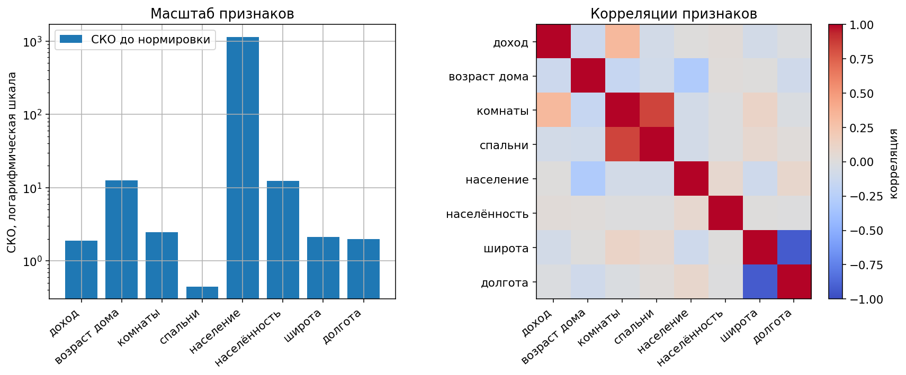
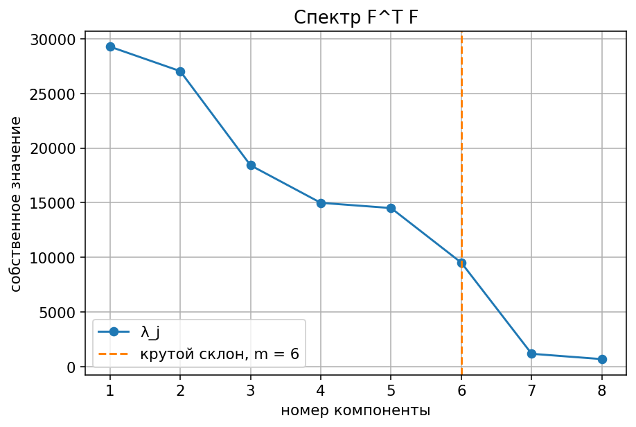
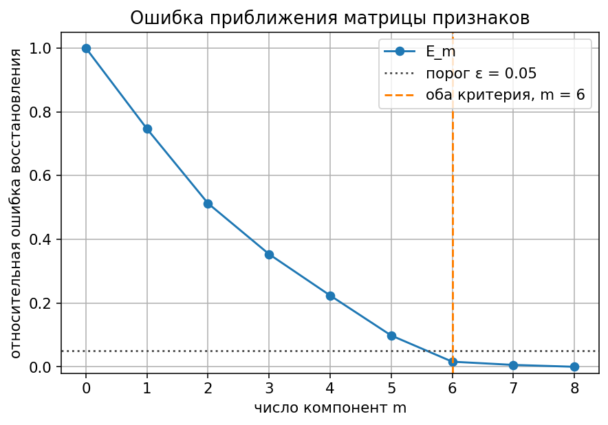
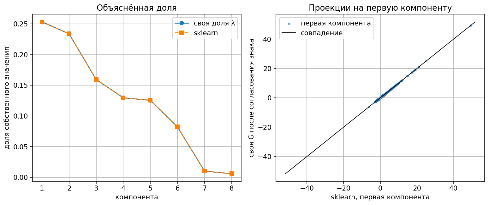
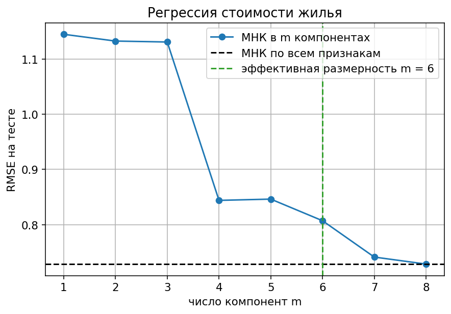
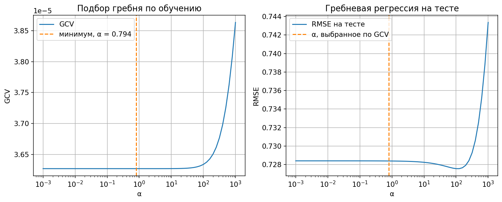

# Лабораторная работа №4. PCA

PCA через сингулярное разложение. Эффективная размерность — по ошибке восстановления и по крутому склону. МНК и гребень считаются из того же разложения. Эталон — `sklearn.decomposition.PCA` и `sklearn.linear_model`.

Запуск:

```bash
python students/aleksandruk-bs/lab4/source/train.py
```

Датасет берётся из `sklearn.datasets.fetch_california_housing` при запуске.

## Датасет

[California housing](https://scikit-learn.org/stable/datasets/real_world.html#california-housing-dataset): 20 640 кварталов. Ответ — медианная стоимость дома, в сотнях тысяч долларов. Восемь признаков: доход, возраст дома, комнаты, спальни, население, населённость, широта, долгота.

Обучение 14 448, тест 6 192, `random_state = 42`. Среднее и СКО считаются только по обучению.

Широта и долгота коррелируют на −0,923, комнаты и спальни на +0,846. VIF: широта 9,1, долгота 8,8, комнаты 8,2, спальни 6,9. Число обусловленности корреляционной матрицы 43.

Признаки центрируются и делятся на СКО. Без деления на СКО первая компонента почти целиком была бы населением: его СКО 1140, у спален 0,45.



## Разложение

Матрица признаков после нормировки раскладывается как F = V D Uᵀ.

U — собственные векторы FᵀF, по столбцам. V — левые сингулярные векторы. На диагонали D стоят корни собственных значений λ₁ ≥ … ≥ λ₈ ≥ 0.

Новые признаки G = F U. Восстановление: F с крышкой = G Uᵀ. Столбцы G некоррелированы. На всех восьми компонентах восстановление совпадает с F до 10⁻⁸.

| компонента | собственное значение | доля |
|---:|---:|---:|
| 1 | 29 280 | 0,253 |
| 2 | 27 039 | 0,234 |
| 3 | 18 419 | 0,159 |
| 4 | 14 985 | 0,130 |
| 5 | 14 506 | 0,126 |
| 6 | 9 504 | 0,082 |
| 7 | 1 169 | 0,010 |
| 8 | 681 | 0,006 |

Первые компоненты собирают общую часть связанных признаков: географию и размер дома. Доход сидит в четвёртой компоненте, вес 0,88. Седьмая и восьмая — мелкий остаток тех же пар, поэтому у них маленькие собственные значения.



## Эффективная размерность

Ошибка восстановления Eₘ — это доля суммы собственных значений в хвосте, начиная с компоненты m+1. Та же величина получается прямой нормой разности F с крышкой и F.

| компонент m | ошибка Eₘ |
|---:|---:|
| 1 | 0,747 |
| 2 | 0,513 |
| 3 | 0,353 |
| 4 | 0,224 |
| 5 | 0,098 |
| 6 | 0,016 |
| 7 | 0,006 |
| 8 | 0 |

Порог 0,05: при m = 5 ошибка ещё 0,098, при m = 6 уже 0,016. Берётся m = 6.

Крутой склон — максимальный скачок соседних собственных значений. Между 6-й и 7-й он равен 8,1, остальные скачки не больше 1,7. Оба правила дают m = 6. Хвост из двух компонент — 1,6% суммы собственных значений.



## Сравнение со sklearn

`PCA(svd_solver="full")` учится на той же матрице. Знак собственного вектора не фиксирован, поэтому перед сравнением столбец домножается на +1 или −1.

После этого расхождение матрицы U не больше 4·10⁻¹⁵, расхождение проекций не больше 5·10⁻¹³. Доли собственных значений совпали с `explained_variance_ratio_`.



## Регрессия

Цена тоже центрируется: у новых признаков среднее ноль, у цены нет, и без свободного члена прогноз уехал бы к нулю. Коэффициент компоненты — проекция центрированной цены на левый сингулярный вектор, делённая на соответствующий корень собственного значения. К прогнозу прибавляется среднее цены.

При всех восьми компонентах это обычный МНК. Веса отличаются от `LinearRegression.coef_` не больше чем на 4·10⁻¹⁵. RMSE на тесте совпадает.

| компонент | RMSE на тесте | R² на тесте |
|---:|---:|---:|
| 1 | 1,145 | 0,001 |
| 2 | 1,133 | 0,022 |
| 3 | 1,131 | 0,025 |
| 4 | 0,844 | 0,457 |
| 5 | 0,846 | 0,454 |
| 6 | 0,807 | 0,504 |
| 7 | 0,741 | 0,582 |
| 8 | 0,728 | 0,596 |

Первые три компоненты почти не предсказывают цену: в них география и размер дома. Скачок на четвёртой — компонента дохода. При m = 6 матрица признаков восстановлена с ошибкой 0,016, а RMSE цены ещё 0,807 против 0,728 у полного МНК. Седьмая и восьмая малы по дисперсии признаков, но несут цену: PCA оставляет разброс признаков, а не связь с ответом.



## Гребень

Гребень на том же разложении не отбрасывает хвост, а умножает каждую компоненту на σ / (σ² + α). Параметр α выбран по GCV на обучении. Минимум на сетке от 0,001 до 1000 равен 0,794.

На тесте RMSE 0,7284, как у МНК. Обусловленность 43 для гребня слабая, большой α уже портит прогноз. Коэффициенты совпали с `Ridge(alpha=0.794)` до 10⁻¹⁴.



## Реализация

| Пункт | Где |
|---|---|
| загрузка California housing, корреляции, VIF | `dataset.py` |
| SVD, проекции, ошибка восстановления, МНК и гребень | `pca.py` |
| графики и сравнение со sklearn | `train.py` |

Своё разложение — в `pca.py`. sklearn даёт данные, разбиение, эталонные PCA, МНК, гребень, RMSE и R².

## Выводы

1. Связаны широта с долготой и комнаты со спальнями. Признаки делятся на СКО, иначе спектр занимает население.
2. Полное разложение восстанавливает матрицу признаков. Новые столбцы некоррелированы.
3. Порог ошибки 0,05 и скачок собственных значений 8,1 оба дают 6 компонент. В хвосте 1,6% дисперсии признаков.
4. После согласования знака проекции и доли дисперсии совпали со sklearn до 10⁻¹³.
5. Восемь компонент повторяют обычный МНК. Шести компонент матрице признаков хватает, цене нет: доход приходит четвёртой, часть сигнала остаётся в хвосте.
6. Гребень с α = 0,794 тест не улучшает: обусловленность умеренная.
