# Лабораторная работа №1. Линейная классификация

## 1. Датасет

**Breast Cancer Wisconsin** (`sklearn.datasets.load_breast_cancer`).

| Параметр | Значение |
|---|---|
| Объектов | 569 |
| Признаков (исходно) | 30 |
| Признаков после отбора | 19 |
| Классы | 2 (malignant / benign) |
| Train / Test | 455 / 114 (80/20, `stratify`, `random_state=42`) |
| Метки | `{-1, +1}` |

- Удалены 11 сильно коррелирующих признаков (`|r| > 0.9`): `mean texture`, `mean radius`, `mean perimeter`, `mean area`, `worst radius`, `worst perimeter`, `perimeter error`, `radius error`, `mean concavity`, `mean concave points`, `worst compactness`.
- Нормализация: `MinMaxScaler`, обучается на train, применяется к test.
- Удаление коррелирующих признаков выполняется в `_remove_corr_columns`, нормализация — в `normalize` (`source/lin_clf/data/utils.py:19`, `source/lin_clf/data/utils.py:48`).

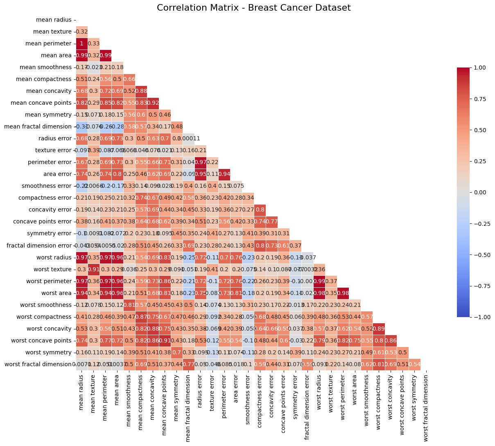

*Исходная корреляционная матрица (до удаления признаков).*

## 2. Отступ объекта

Отступ: $M_i = y_i \langle w, x_i \rangle$, где $x_i$ дополнен константным признаком (bias).

Реализация: `predict_margin` — `source/lin_clf/model/LinearClassifier.py:21`.

**Random init**

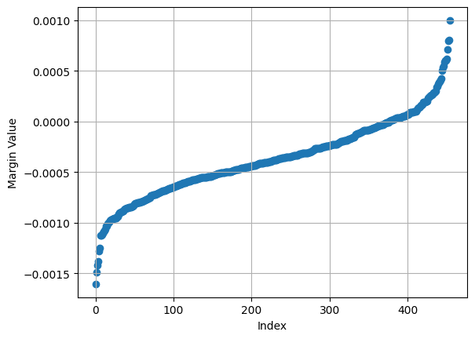

**Correlation init**

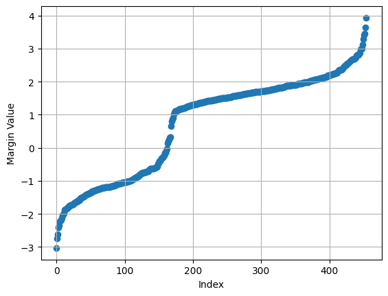

**Pretrained**

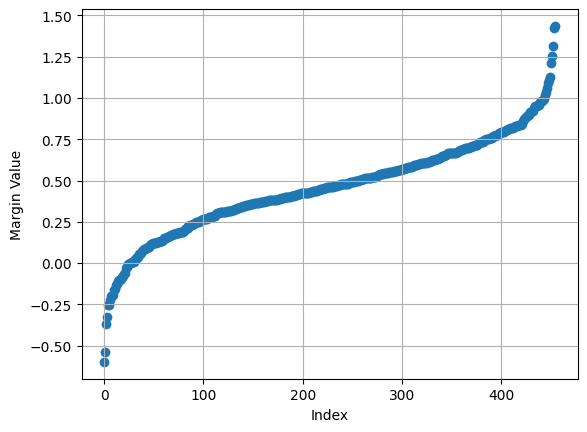

*Отступы: случайная инициализация, инициализация через корреляцию, обученная модель.*

## 3. Градиент функции потерь

Функция потерь ($\lambda$ — коэффициент L2):

$$Q(w) = \frac{1}{n}\sum_{i=1}^{n}\bigl(1 - M_i\bigr)^2 + \frac{\lambda}{2}\lVert w \rVert^2$$

Градиент:

$$\nabla Q(w) =  \left[ 
    \underbrace{-\frac{2}{n} X^T \cdot Y}_{c_1} + \left( \underbrace{\frac{2}{n} X^T \cdot (Y^{2} \odot X) + \lambda I }_{c_2}\right) \cdot w \right]_{(m, 1)} = c_1 + c_2 w$$

Вывод формулы в `students/am-zaytsev/lab1/source/lin_clf/model/README.md`

Реализация: `diff` — `source/lin_clf/model/LinearClassifier.py:37`. Возвращает `dL`, `c1`, `c2`.

## 4. Рекуррентная оценка функционала качества

Экспоненциальное сглаживание потерь:

$$Q_t = (1-\alpha)\,Q_{t-1} + \alpha\,Q, \qquad \alpha = 0.01$$

Реализация — `source/lin_clf/experiments/runner.py:53`.

## 5. Стохастический градиентный спуск с инерцией

$$v_t = (1-k)\,v_{t-1} + k\,\nabla Q(w_t), \qquad w_{t+1} = w_t - h\,v_t$$

Реализация: `source/lin_clf/optimizer/sgd.py` (`SGD.step`, `source/lin_clf/optimizer/sgd.py:23`). Параметры: `momentum_k = 0.01`, `h = 0.001`.

## 6. L2 регуляризация

Модель: `source/lin_clf/model/LinearClassifier.py`.

- В функции потерь: слагаемое `self.tao / 2 * self.w.T.dot(self.w)` — `source/lin_clf/model/LinearClassifier.py:31`.
- В градиенте: слагаемое `self.tao * np.eye(...)` в матрице `c2` — `source/lin_clf/model/LinearClassifier.py:42`.

## 7. Наискорейший градиентный спуск

Оптимальный шаг по направлению градиента:

$$h^{*} = \frac{\nabla Q^{T} c_1 + \nabla Q^{T} c_2 w}{\nabla Q^{T} c_2 \nabla Q}$$

Вывод формулы в `students/am-zaytsev/lab1/source/lin_clf/model/README.md`

Реализация: `count_h_star` — `source/lin_clf/optimizer/sgd.py:20`; включается при `h=None`. Для `speed_sgd` задано `momentum_k = 1.0`, `h = None` (`source/lin_clf/experiments/suite.py:60`).

## 8. Предъявление объектов по модулю отступа

Вероятность выбора объекта:

$$p_i = \frac{(1 - M_i)^2}{\sum_j (1 - M_j)^2}$$

Реализация: `if config.fetch_prob` — `source/lin_clf/experiments/runner.py:40`; сэмплирование — `fetch_batch(..., prob)` (`source/lin_clf/data/utils.py:67`).

## 9. Обучение

Пайплайн (`source/lin_clf/experiments/runner.py`):

1. Фиксируется seed, создаётся `SGD(model, momentum_k, h)`.
2. Эпоха: при `fetch_prob` считается распределение $p_i$ по модулю отступа.
3. Формируется мини-батч (`batch_size = 64`).
4. Шаг оптимизатора `optimizer.step(...)`.
5. Считаются `loss`, сглаженная оценка $Q$, accuracy на train/test.
6. Критерий остановки: после 300 эпох по последним 300 значениям $Q$ строится линейная регрессия; обучение останавливается при $|a| < 10^{-5}$ (`linear_ab`, `source/lin_clf/utils.py:4`).

Варианты запуска (`source/lin_clf/experiments/suite.py`): `rand` — мультистарт (10 запусков со случайными весами); `corr` — инициализация через корреляцию; `speed_sgd` — наискорейший градиентный спуск.

Конфигурация (`source/lin_clf/experiments/config.py`): `batch_size = 64`, `momentum_k = 0.01`, `h = 0.001`, `tao = 0.01`, `visual_smooth = 0.01`, `seed = 42`.

### Результаты

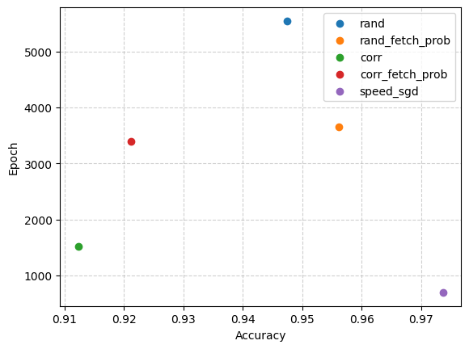

*Accuracy vs число эпох. Легенда: `rand` — мультистарт 10 раз со случайными весами; `corr` — инициализация через корреляцию; `speed_sgd` — наискорейший градиентный спуск.*

| Эксперимент | Test accuracy | Эпох |
|---|---|---|
| rand (mean 0.9439, std 0.0043) | 0.9474 | 5546 |
| rand_fetch_prob (mean 0.9535, std 0.0040) | 0.9561 | 3660 |
| corr | 0.9123 | 1515 |
| corr_fetch_prob | 0.9211 | 3398 |
| **speed_sgd** | **0.9737** | **696** |

- Мини-батч = 64. При меньшем числе батчей `speed_sgd` даёт больше шума.
- Инерция не работает с `speed_sgd` (для него используется `momentum_k = 1.0`).

Кривые потерь и accuracy по экспериментам:

| Эксперимент | Loss | Accuracy |
|---|---|---|
| rand | 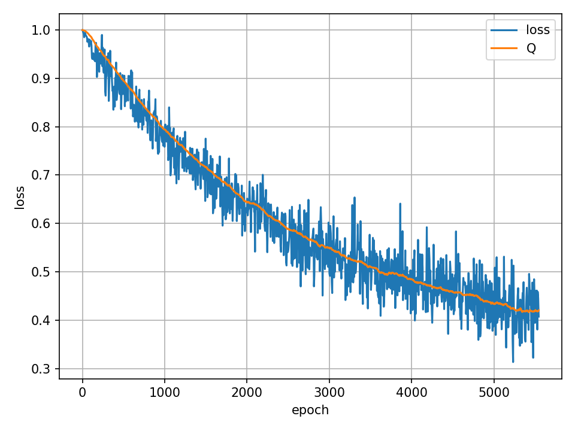 | 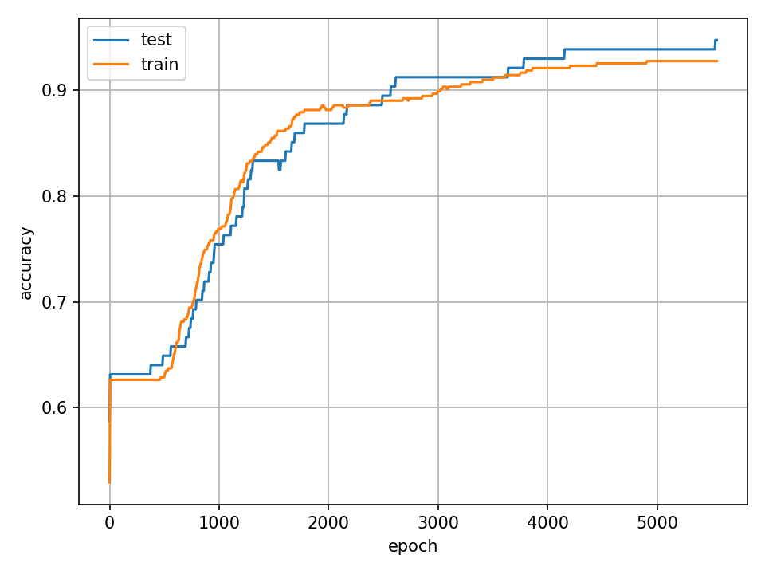 |
| rand_fetch_prob | 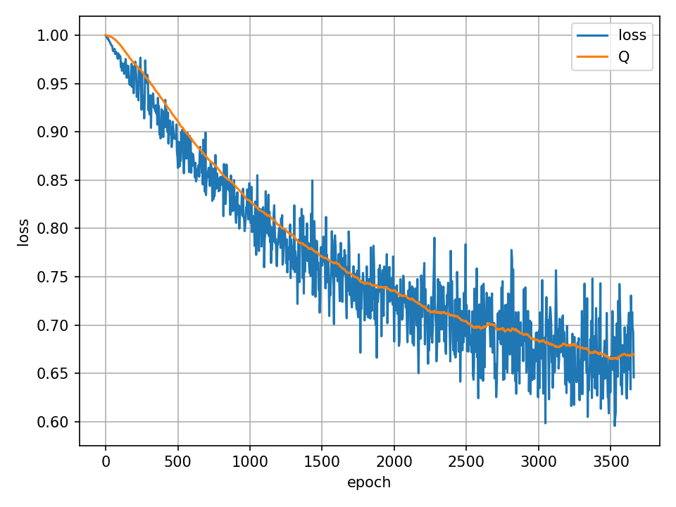 | 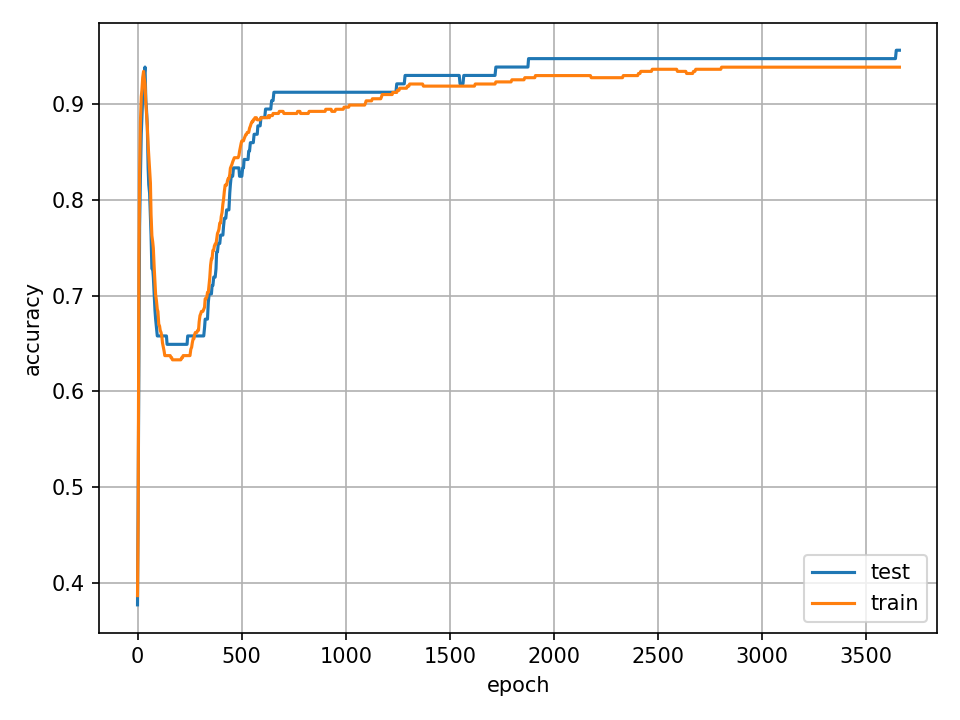 |
| corr | 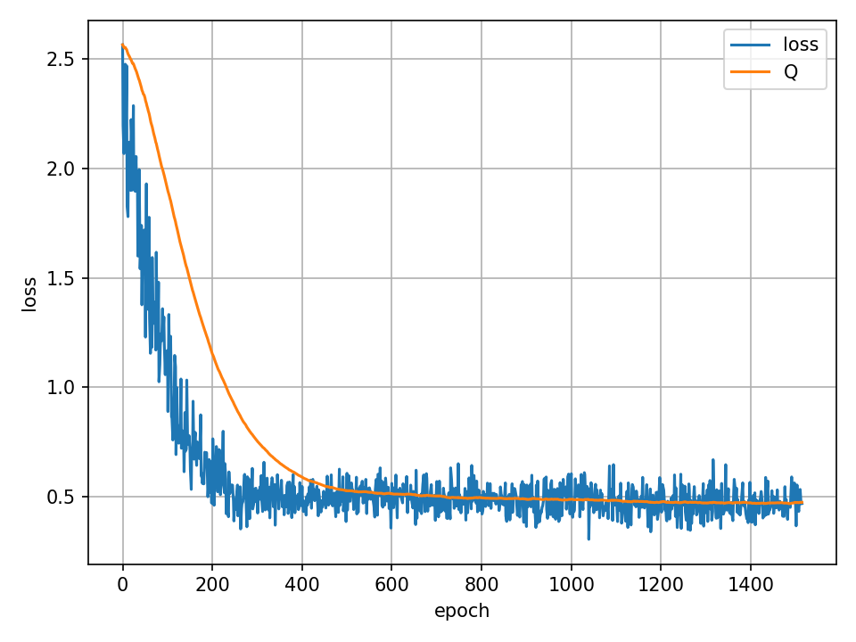 | 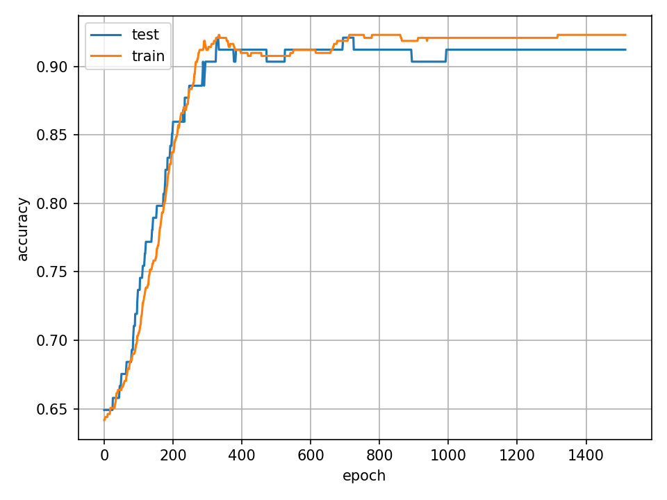 |
| corr_fetch_prob | 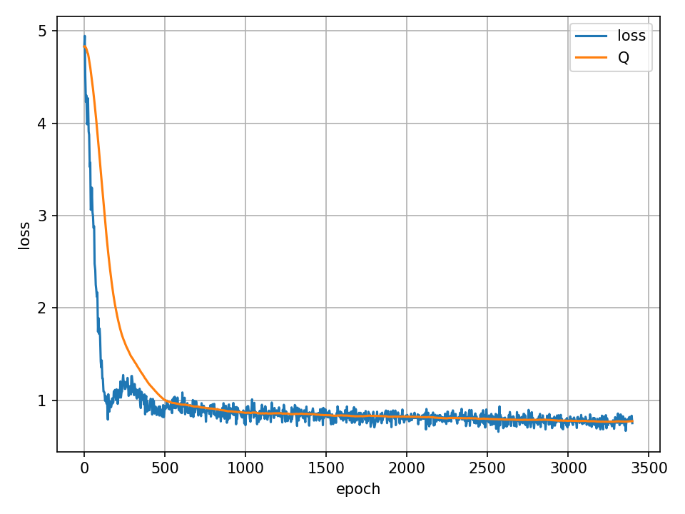 | 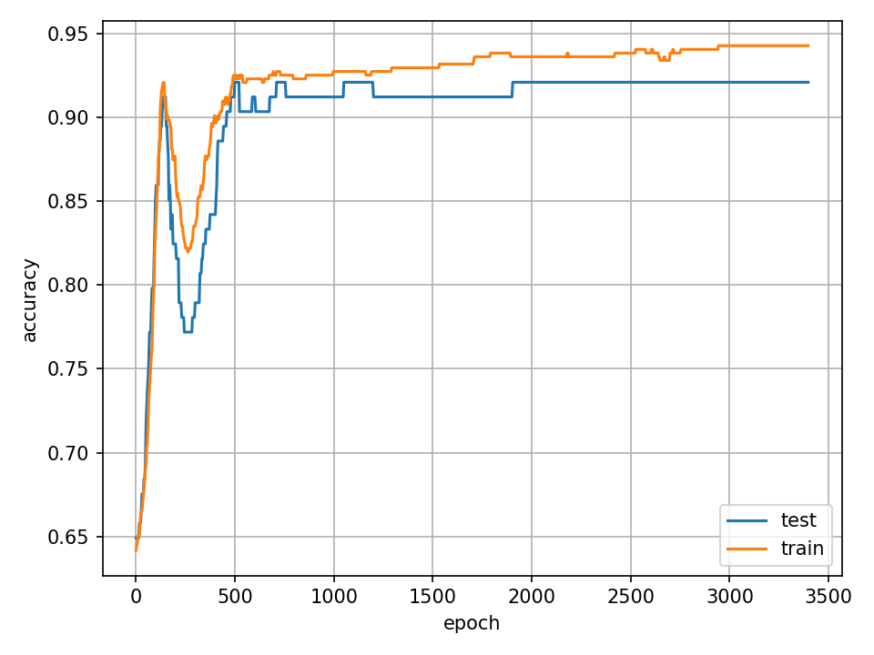 |
| speed_sgd | 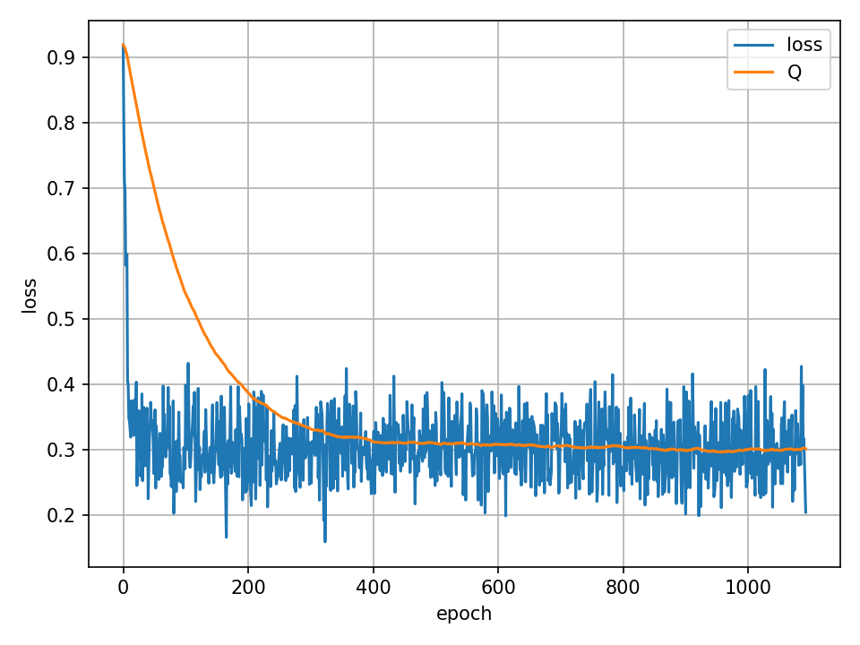 | 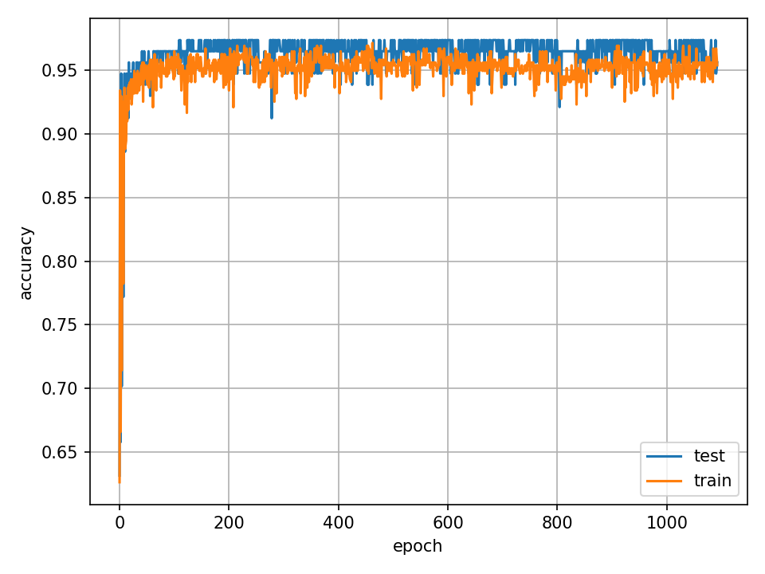 |

## 10. Оценка качества классификации (лучшая модель, speed_sgd)
`source/lin_clf/visualization/MetricCounter.py`
```
=== Model Evaluation ===
Accuracy: 0.9737

=== Confusion Matrix ===
    n   p
f  39   3
t   0  72

=== Classification Report ===
  class    recall    precision    f1-score
-------  --------  -----------  ----------
      1      1.00         0.96        0.98
     -1      0.93         1.00        0.96
```

## 11. Сравнение с эталонной реализацией

Эталон — `LinearSVC` (scikit-learn) с нормализацией:

```python
# Option B: Linear Support Vector Classifier (Uncomment to use)
clf = make_pipeline(MinMaxScaler(), LinearSVC(C=1.0))

# 4. Train the model
clf.fit(X_train, y_train)

# 5. Make predictions on the test set
y_pred = clf.predict(X_test)
```

```
=== Model Evaluation ===
Accuracy: 0.9825

=== Confusion Matrix ===
    n   p
f  40   2
t   0  72

=== Classification Report ===
  class    recall    precision    f1-score
-------  --------  -----------  ----------
      1      1.00         0.97        0.99
     -1      0.95         1.00        0.98
```

Итог: собственная реализация `speed_sgd` — 0.9737, эталон `LinearSVC` — 0.9825 (разница ~0.9 п.п.).

## 12. Отчёт

Реализованы: отступ, градиент с L2, рекуррентная оценка $Q$, SGD с инерцией, наискорейший градиентный спуск, предъявление по модулю отступа. Лучший результат — `speed_sgd`, 0.9737 (696 эпох), близко к эталону `LinearSVC` (0.9825).
