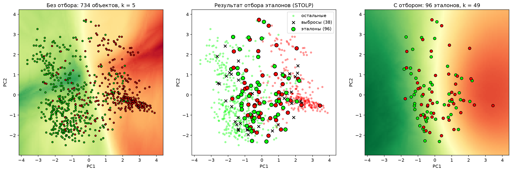

# Лабораторная работа №2. Метрическая классификация

В рамках лабораторной работы предстоит реализовать алгоритм классификации KNN и подобрать параметр k методом скользящего контроля.

В качетсве датасета я взяла набор данных с сайта kaggle: данные по заболеванию сердца. Задача реализовать алгоритм KNN с методом окна Парзена переменной ширины и обосновать выбор параметров алгоритма, построить графики эмпирического риска для различных k.

**Важно:**
- Гипотеза компактности (для классификации):
- Близкие объекты, как правило, лежат в одном классе.

Сначала рассмотрим из чего состоит алгоритм knn с метдом окна переменной ширины.
1) в качестве расстояния я взяла Минковского, потому что это универсальная формула, где метод p подбирается вручную. 

$$
\rho(x, x_i) = \left( \sum_{j=1}^{n} w_j |x^j - x_i^j|^p \right)^{1/p}
$$

Существует понятие *метрического классификатора* - он относит объект x к тому классу, которому принадлежат его ближайшие соседи.

$$
a(x; X^\ell) = \arg\max_{y \in Y} \underbrace{\sum_{i=1}^{\ell} [y^{(i)} = y] \, w(i, x)}_{\Gamma_y(x)}
$$

2) Далее рассчитаем `Ядро` - я взяла Гауссово, потому что плавное убывание.
Ядро K отвечает за форму окна: оно задаёт правило, по которому расстояние до соседа превращается в вес его голоса. Выбор ядра влияет на то, насколько сильно ближайшие соседи доминируют над более далёкими.
В качетсве аппроксимации можно взять гауссово ядро **G (r ) = exp(−2r 2) — гауссовское**. Гауссово ядро - гладкая аппроксимация

$$
K(r) = e^{-2r^2}
$$

3) По заданию надо рассчитать алгоритм парзеновского окна перенной ширины:

$$
a(x; X^\ell, k) = \arg\max_{y \in Y} \; \Gamma_y(x),
\qquad
\Gamma_y(x) = \sum_{i=1}^{\ell} [y_i = y] \; K\!\left( \frac{\rho(x, x_i)}{h(x)} \right)
$$

**Как выбрать K:**
$$
\mathrm{LOO}(k) = \frac{1}{\ell} \sum_{i=1}^{\ell}
\Bigl[ a\bigl(x_i;\, X^\ell \setminus \{x_i\},\, k\bigr) \ne y_i \Bigr],
\qquad
k^* = \arg\min_k \mathrm{LOO}(k)
$$

Объект x_i здесь исключается из обучающей выборки, а потом классифицируется по оставшимся

4)  Оценим качество при одном заданном k: возвратим долю ошибок скользящего контроля

На практике оптимальное значение параметра k определяют по критерию скользящего контроля с исключением
объектов по одному (leave-one-out, LOO):

$$
\mathrm{LOO}(k, X^\ell) = \sum_{i=1}^{\ell} \Bigl[ a\bigl(x_i;\, X^\ell \setminus \{x_i\},\, k\bigr) \ne y_i \Bigr] \to \min_k .
$$

и далее выберем лучшее **k** - Оптимальное k подбирается полным перебором: для каждого k из диапазона считается LOO-ошибка, и выбирается k с наименьшей ошибкой.

Таким образом, лучшее k по LOO это 5, LOO-ошибка: 0.1362. Один объект убирается из выборки, классифицирует по оставшимся и считает долю ошибокостальных. 

5) В качестве отбора эталонов я взяла алгоритм STOLP. Название происходит от русского слова «столп» (опора): эталоны («столпы») — это объекты обучающей выборки, на которых держится классификация остальных. Алгоритм выбирает небольшое подмножество $\Omega \subseteq X^\ell$ так, чтобы классификатор по нему работал почти так же хорошо, как по всей выборке, и при этом отбрасывает выбросы.
 
**Идея.** Для каждого объекта вычисляется отступ — мера того, насколько уверенно классификатор относит его к собственному классу. Для окна Парзена переменной ширины

$$
\Gamma_c(x) = \sum_{i} [y_i = c]\, K\!\left(\frac{\rho(x, x_i)}{h(x)}\right), \qquad h(x) = \rho\bigl(x, x^{(k+1)}\bigr),
$$

а нормированный отступ объекта $(x, y)$ равен

$$
M(x) = \frac{\Gamma_{y}(x) - \max_{c \ne y} \Gamma_c(x)}{\sum_{c} \Gamma_c(x)} \in [-1, 1].
$$

Если $M(x) > 0$, объект классифицируется правильно, и чем больше значение, тем он типичнее для своего класса. Если $M(x) < 0$, классификатор ошибается. Значения около $-1$ означают, что объект окружён объектами чужого класса.

**Шаги алгоритма.**

1. Для каждого объекта вычисляется отступ относительно всех остальных объектов выборки (сам объект исключается, как при скользящем контроле).
2. Удаляются выбросы — объекты с $M(x_i) < -\delta$. Они не могут стать эталонами.
3. В $\Omega$ включается по одному самому надёжному объекту каждого класса — с наибольшим отступом.
4. Пока число ошибок на объектах вне $\Omega$ больше порога $\ell_0$, считаются отступы $M_\Omega(x)$ относительно текущего набора эталонов, и в $\Omega$ добавляется объект с наименьшим отступом, то есть тот, который классифицируется хуже всех.

**Параметры.** $\delta$ задаёт, насколько уверенно ошибочный объект считается выбросом, а $\ell_0$ — допустимое число ошибок, то есть степень сжатия: чем больше $\ell_0$, тем меньше эталонов. Значения подбираются на данных. После отбора $k$ для набора эталонов подбирается заново скользящим контролем уже на $\Omega$, а качество сравнивается с классификатором по полной выборке.

На левом графике показана работа метода k ближайших соседей (k = 5) на всей обучающей выборке из 734 объектов в проекции на первые две главные компоненты. Зелёные и красные точки это два класса, а цвет фона показывает, какой класс модель предсказывает в каждой области плоскости. Зелёные объекты сосредоточены в левой части, красные в правой, а в центре классы заметно перемешаны. Из-за этого граница между классами получается изрезанной и подстраивается под отдельные точки, то есть модель чувствительна к шуму и выбросам.

На среднем графике показан результат отбора эталонов алгоритмом STOLP. Крестиками отмечены 38 выбросов, то есть объекты, которые окружены представителями другого класса и признаны шумом. Крупными кружками выделены 96 эталонов, которые оставлены в выборке. Они расположены главным образом в зоне пересечения классов, рядом с границей, поскольку именно эти объекты несут больше всего информации о ней. Бледные мелкие точки это остальные объекты, которые не нужны, так как их хорошо «представляют» ближайшие эталоны.

На правом графике показан классификатор kNN, обученный только на 96 эталонах, при этом оптимальное k выросло до 49. Граница стала гораздо более гладкой и почти вертикальной: слева область зелёного класса, справа красного, посередине узкая переходная зона. Таким образом, выборка сжата примерно до 13% от исходного размера, а разделение классов сохранилось и стало устойчивее к шуму. Платой за это служит потеря локальных деталей границы и необходимость брать большее k из-за малого числа эталонов.