## 1. Датасет

```python
KAGGLE_DATASET = "uciml/pima-indians-diabetes-database"
KAGGLE_FILE = "diabetes.csv"
DATA_DIR = os.path.normpath(os.path.join(os.path.dirname(os.path.abspath(__file__)), ".."))
DATA_PATH = os.path.join(DATA_DIR, KAGGLE_FILE)


def _kaggle_auth():
    user = os.environ.get("KAGGLE_USERNAME")
    key = os.environ.get("KAGGLE_KEY")
    if user and key:
        return user, key
    with open(os.path.expanduser("~/.kaggle/kaggle.json")) as f:
        creds = json.load(f)
    return creds["username"], creds["key"]


def download_dataset():
    url = f"https://www.kaggle.com/api/v1/datasets/download/{KAGGLE_DATASET}"
    resp = requests.get(url, auth=_kaggle_auth())
    resp.raise_for_status()
    with zipfile.ZipFile(io.BytesIO(resp.content)) as zf:
        zf.extract(KAGGLE_FILE, DATA_DIR)


def load_data() -> pd.DataFrame:
    if not os.path.exists(DATA_PATH):
        download_dataset()

    df = pd.read_csv(DATA_PATH)
    df.columns = [c.strip().lower() for c in df.columns]
    return df
```

## 2. Отступ объекта

```python
def margin(w: np.ndarray, X: np.ndarray, y: np.ndarray) -> np.ndarray:
    return y * (X @ w)
```

```python
MARGIN_COLORS = {
    "errors": "#d62728",
    "borderline": "#ff9800",
    "confident": "#2ca02c",
}


def plot_margins(M: np.ndarray, title: str, path: str):
    plt.figure(figsize=(7, 4))
    order = np.argsort(M)
    Ms = M[order]
    colors = np.where(
        Ms < 0, MARGIN_COLORS["errors"],
        np.where(Ms >= 1, MARGIN_COLORS["confident"], MARGIN_COLORS["borderline"])
    )
    plt.bar(range(len(Ms)), Ms, color=colors, width=1.0)
    plt.axhline(0, color="black", linewidth=0.8)
    plt.axhline(1, color="black", linewidth=0.8, linestyle="--")
    plt.xlabel("объекты, отсортированные по отступу")
    plt.ylabel("отступ M_i")
    plt.title(title)
    n = len(Ms)
    n_err = int(np.sum(Ms < 0))
    n_border = int(np.sum((Ms >= 0) & (Ms < 1)))
    n_conf = int(np.sum(Ms >= 1))
    legend_elements = [
        Patch(facecolor=MARGIN_COLORS["errors"], label=f"ошибки, M<0 ({n_err}, {n_err/n:.0%})"),
        Patch(facecolor=MARGIN_COLORS["borderline"], label=f"пограничные, 0<=M<1 ({n_border}, {n_border/n:.0%})"),
        Patch(facecolor=MARGIN_COLORS["confident"], label=f"уверенные, M>=1 ({n_conf}, {n_conf/n:.0%})"),
    ]
    plt.legend(handles=legend_elements, loc="upper left", fontsize=8)
    plt.tight_layout()
    plt.savefig(path, dpi=130)
    plt.close()
```

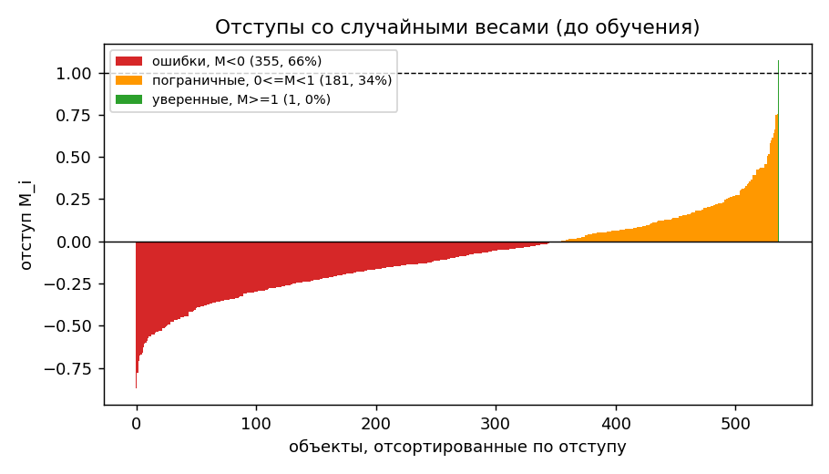

## 3. Градиент функции потерь

```python
def _stable_sigmoid(z: np.ndarray) -> np.ndarray:
    out = np.empty_like(z)
    pos = z >= 0
    out[pos] = 1.0 / (1.0 + np.exp(-z[pos]))
    ez = np.exp(z[~pos])
    out[~pos] = ez / (1.0 + ez)
    return out


def loss(M: np.ndarray) -> np.ndarray:
    return np.log1p(np.exp(-np.abs(M))) + np.maximum(-M, 0)


def loss_derivative(M: np.ndarray) -> np.ndarray:
    return -_stable_sigmoid(-M)


def gradient(w: np.ndarray, X: np.ndarray, y: np.ndarray, l2: float = 0.0) -> np.ndarray:
    M = margin(w, X, y)
    dL_dM = loss_derivative(M)
    grad_per_obj = X * (dL_dM * y)[:, None]
    grad = grad_per_obj.mean(axis=0)
    grad[1:] += l2 * w[1:]
    return grad
```

## 4. Рекуррентная оценка функционала качества

```python
def init_Q(w: np.ndarray, X: np.ndarray, y: np.ndarray) -> float:
    M = margin(w, X, y)
    return float(loss(M).mean())


def update_Q(Q_prev: float, loss_i: float, lam: float) -> float:
    return lam * loss_i + (1 - lam) * Q_prev


def full_Q(w, X, y, l2):
    M = margin(w, X, y)
    return loss(M).mean() + 0.5 * l2 * np.sum(w[1:] ** 2)
```

## 5. Стохастический градиентный спуск с инерцией

```python
def sgd_momentum(X, y, w0, n_iter=4000, eta=0.05, gamma=0.9, l2=0.01,
                  lam_Q=0.01, sampling="uniform"):
    w = w0.copy()
    v = np.zeros_like(w)
    Q = init_Q(w, X, y)
    Q_history = [Q]
    n = X.shape[0]

    for t in range(n_iter):
        if sampling == "uniform":
            i = rng.integers(0, n)
        elif sampling == "margin_based":
            if t % 50 == 0:
                probs = margin_based_sampling_probs(w, X, y)
            i = rng.choice(n, p=probs)
        else:
            raise ValueError("unknown sampling mode")

        xi, yi = X[i:i + 1], y[i:i + 1]
        grad_i = gradient(w, xi, yi, l2=l2)

        v = gamma * v + (1 - gamma) * grad_i
        w = w - eta * v

        loss_i = float(loss(margin(w, xi, yi))[0])
        Q = update_Q(Q, loss_i, lam_Q)
        Q_history.append(Q)

    return w, np.array(Q_history)
```

## 6. L2-регуляризация

```python
grad[1:] += l2 * w[1:]
```

```python
loss(M).mean() + 0.5 * l2 * np.sum(w[1:] ** 2)
```

## 7. Скорейший градиентный спуск

```python
def backtracking_line_search(f, f0, g, eta0=5.0, shrink=0.5, c1=1e-4, max_steps=50):
    eta = eta0
    grad_norm_sq = g @ g
    for _ in range(max_steps):
        if f(eta) <= f0 - c1 * eta * grad_norm_sq:
            return eta
        eta *= shrink
    return eta


def steepest_descent(X, y, w0, n_iter=200, l2=0.01, eta_max=5.0):
    w = w0.copy()
    Q_history = [full_Q(w, X, y, l2)]
    for t in range(n_iter):
        g = gradient(w, X, y, l2=l2)
        if np.linalg.norm(g) < 1e-8:
            break
        Q_w = Q_history[-1]
        eta_star = backtracking_line_search(
            lambda eta: full_Q(w - eta * g, X, y, l2), Q_w, g, eta0=eta_max
        )
        w = w - eta_star * g
        Q_history.append(full_Q(w, X, y, l2))
    return w, np.array(Q_history)
```

## 8. Предъявление объектов по модулю отступа

```python
def margin_based_sampling_probs(w: np.ndarray, X: np.ndarray, y: np.ndarray,
                                 eps: float = 1e-3) -> np.ndarray:
    M = margin(w, X, y)
    weights = loss(M) + eps
    return weights / weights.sum()
```

## 9. Обучение линейного классификатора

### 9.1. Инициализация весов через корреляцию

```python
def correlation_init(X, y):
    w = np.zeros(X.shape[1])
    for j in range(1, X.shape[1]):
        xj = X[:, j]
        denom = xj @ xj
        w[j] = (xj @ y) / denom if denom > 0 else 0.0
    return w
```

```python
w0_corr = correlation_init(X_train, y_train)
w_corr, hist_corr = sgd_momentum(X_train, y_train, w0_corr, l2=l2, sampling="uniform")
```

| train | test |
|---|---|
| 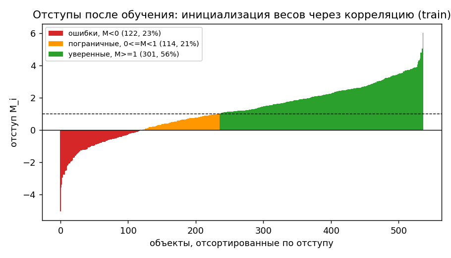 | 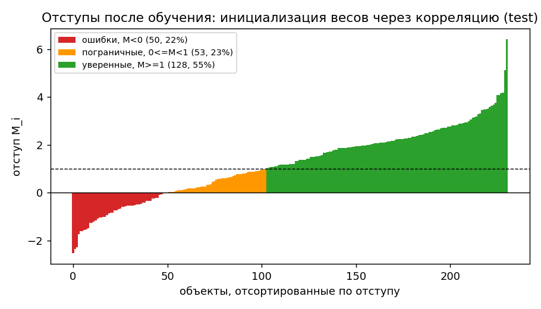 |

### 9.2. Случайная инициализация весов через мультистарт

```python
def multistart(X, y, n_starts, train_fn, **train_kwargs):
    best_w, best_Q, best_hist = None, np.inf, None
    d = X.shape[1]
    for s in range(n_starts):
        w0 = rng.normal(0, 1.0 / np.sqrt(d), size=d)
        w, hist = train_fn(X, y, w0, **train_kwargs)
        Q_final = full_Q(w, X, y, train_kwargs.get("l2", 0.0))
        if Q_final < best_Q:
            best_w, best_Q, best_hist = w, Q_final, hist
    return best_w, best_hist
```

```python
w_multi, hist_multi = multistart(X_train, y_train, n_starts=8, train_fn=sgd_momentum, l2=l2, sampling="uniform")
```

| train | test |
|---|---|
| 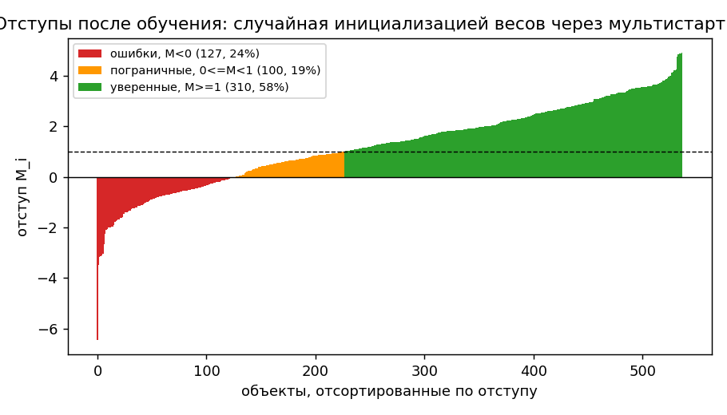 | 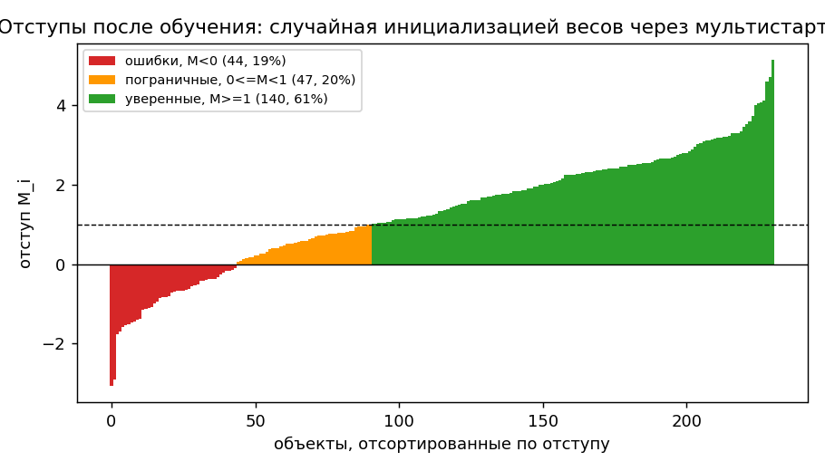 |

### 9.3. Случайное предъявление и п. 8

```python
w0_rand = rng.normal(0, 1.0 / np.sqrt(d), size=d)
w_margin_based, hist_mb = sgd_momentum(X_train, y_train, w0_rand, l2=l2, sampling="margin_based")
```

| train | test |
|---|---|
| 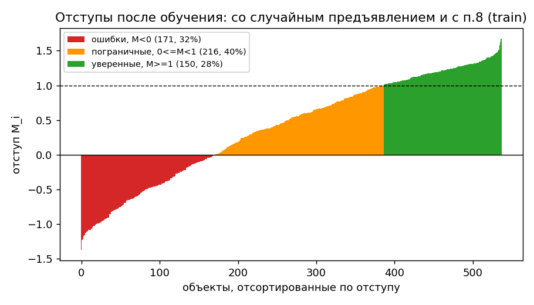 | 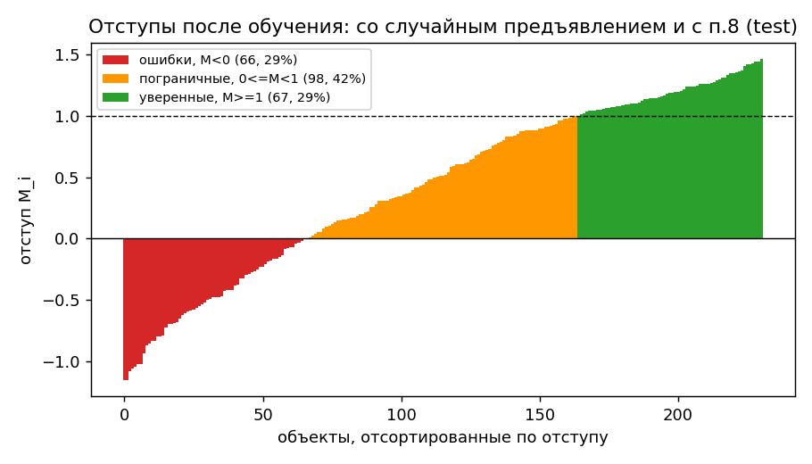 |

### Кривые обучения

```python
plt.plot(hist_corr, label="инициализация весов через корреляцию")
plt.plot(hist_mb, label="со случайным предъявлением и с п.8")
plt.plot(hist_steep, label="метод наискорейшего спуска")
plt.title("Кривые обучения")
```

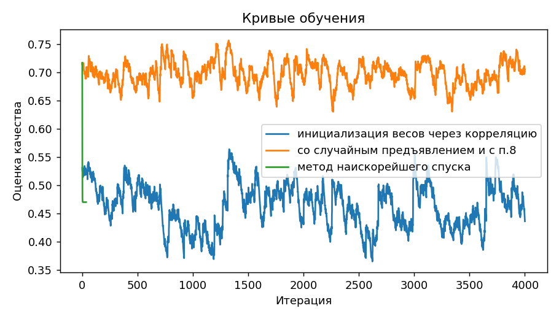

## 10. Оценка качества классификации

```python
def evaluate(w, X, y):
    y_pred = np.sign(X @ w)
    y_pred[y_pred == 0] = 1
    tp = np.sum((y_pred == 1) & (y == 1))
    tn = np.sum((y_pred == -1) & (y == -1))
    fp = np.sum((y_pred == 1) & (y == -1))
    fn = np.sum((y_pred == -1) & (y == 1))
    acc = (tp + tn) / len(y)
    precision = tp / (tp + fp) if (tp + fp) else 0.0
    recall = tp / (tp + fn) if (tp + fn) else 0.0
    f1 = 2 * precision * recall / (precision + recall) if (precision + recall) else 0.0
    return {
        "accuracy": acc, "precision": precision, "recall": recall, "f1": f1,
        "confusion_matrix": np.array([[tn, fp], [fn, tp]]),
    }
```

```python
def plot_roc_curves(models: dict, X: np.ndarray, y: np.ndarray, title: str, path: str):
    plt.figure(figsize=(6.5, 6))
    for name, w in models.items():
        scores = X @ w
        fpr, tpr, _ = roc_curve(y, scores)
        roc_auc = auc(fpr, tpr)
        plt.plot(fpr, tpr, linewidth=1.8, label=f"{name} (AUC={roc_auc:.3f})")
    plt.plot([0, 1], [0, 1], linestyle="--", color="gray", linewidth=1.0, label="случайный классификатор")
    plt.xlabel("FPR (доля ложноположительных)")
    plt.ylabel("TPR (доля истинноположительных)")
    plt.title(title)
    plt.legend(loc="lower right", fontsize=8)
    plt.tight_layout()
    plt.savefig(path, dpi=130)
    plt.close()
```

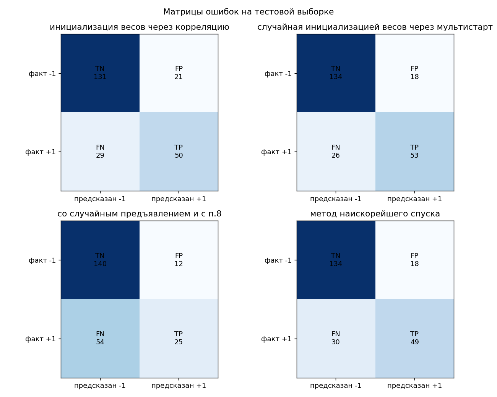

| train | test |
|---|---|
| 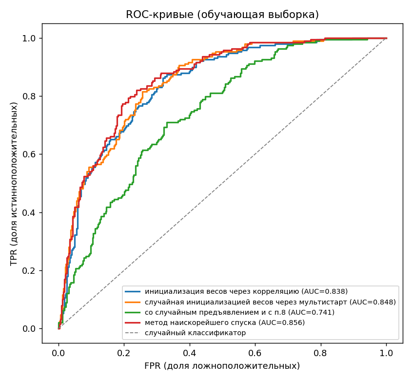 | 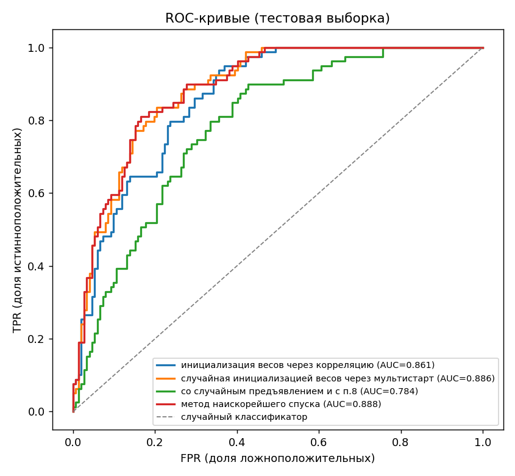 |

| method | accuracy | precision | recall | f1 |
|---|---|---|---|---|
| инициализация весов через корреляцию | 0.7835 | 0.7042 | 0.6329 | 0.6667 |
| случайная инициализацией весов через мультистарт | 0.8095 | 0.7465 | 0.6709 | 0.7067 |
| со случайным предъявлением и с п.8 | 0.7143 | 0.6757 | 0.3165 | 0.4310 |
| метод наискорейшего спуска | 0.7922 | 0.7313 | 0.6203 | 0.6712 |

## 11. Сравнение с эталонной реализацией

```python
def reference_model(X_train, y_train, X_test, y_test, l2):
    from sklearn.linear_model import SGDClassifier
    clf = SGDClassifier(loss="log_loss", penalty="l2", alpha=l2,
                         max_iter=2000, random_state=RANDOM_STATE)
    clf.fit(X_train[:, 1:], y_train)
    y_pred = clf.predict(X_test[:, 1:])

    tp = np.sum((y_pred == 1) & (y_test == 1))
    tn = np.sum((y_pred == -1) & (y_test == -1))
    fp = np.sum((y_pred == 1) & (y_test == -1))
    fn = np.sum((y_pred == -1) & (y_test == 1))
    acc = (tp + tn) / len(y_test)
    precision = tp / (tp + fp) if (tp + fp) else 0.0
    recall = tp / (tp + fn) if (tp + fn) else 0.0
    f1 = 2 * precision * recall / (precision + recall) if (precision + recall) else 0.0
    return acc, precision, recall, f1
```

| method | accuracy | precision | recall | f1 |
|---|---|---|---|---|
| sklearn SGDClassifier | 0.8009 | 0.7391 | 0.6456 | 0.6892 |

## 12. Отчёт

`README.md`.
