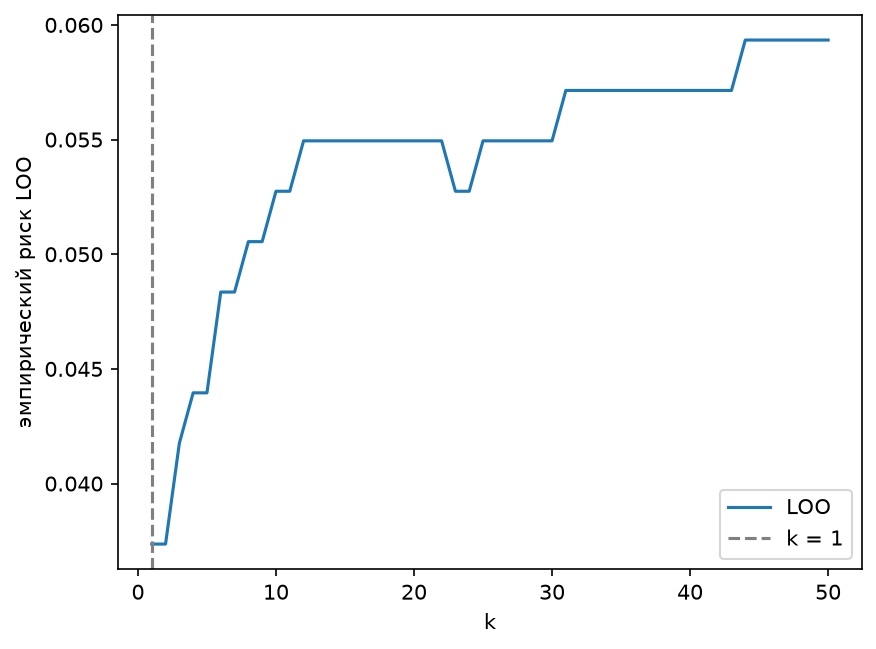
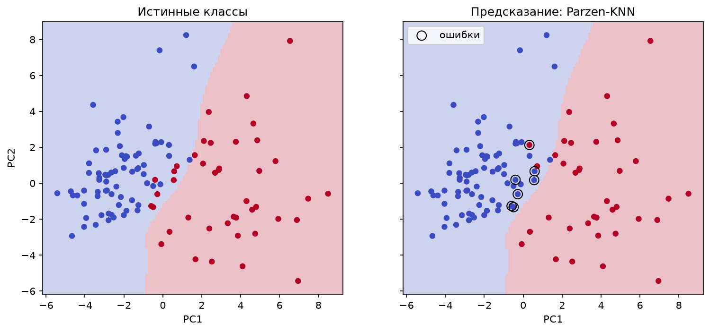
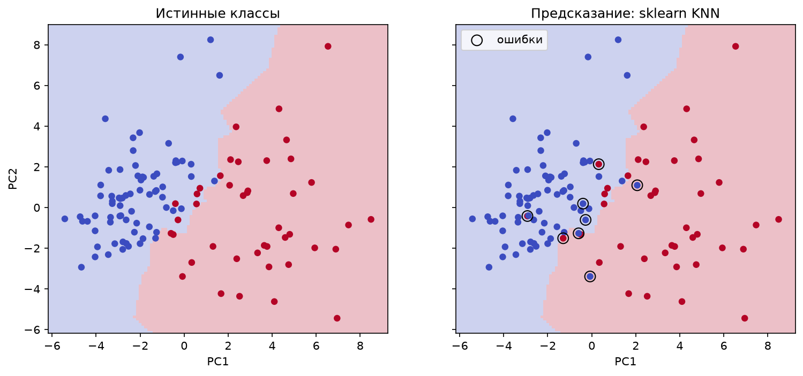
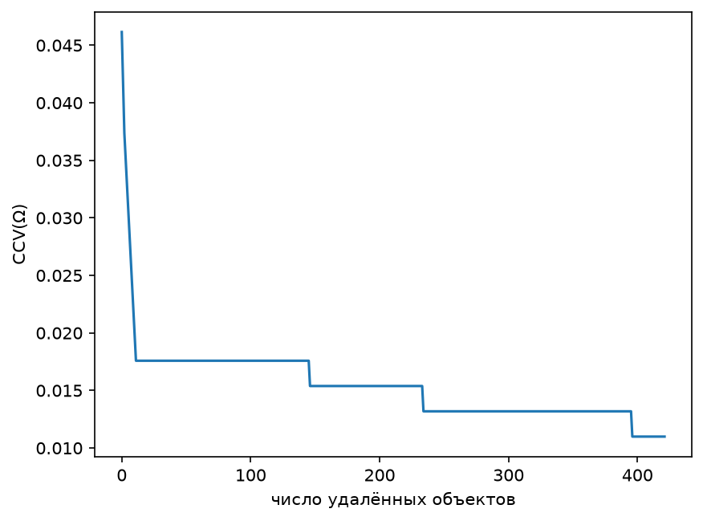
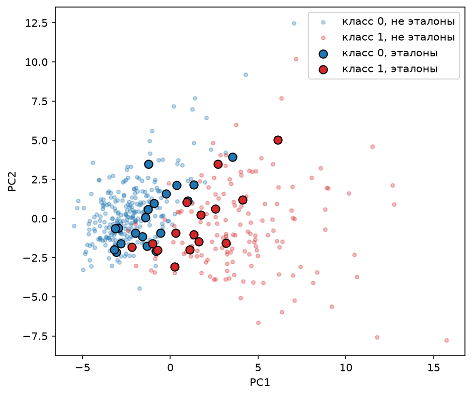
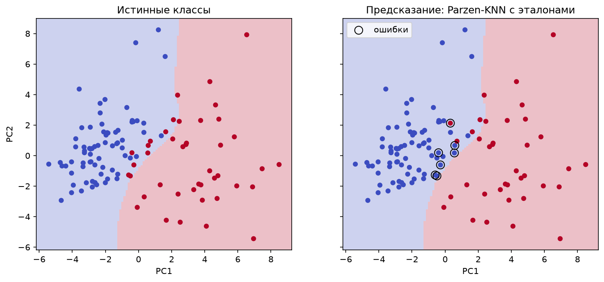

## 1. Датасет

Breast Cancer Wisconsin (Diagnostic): 569 объектов, 30 числовых признаков, 2 класса — злокачественная (`M`, 37%) и доброкачественная (`B`, 63%) опухоль. Загружается с Kaggle (`uciml/breast-cancer-wisconsin-data`) через `kagglehub`. Колонки `id`, `diagnosis` и пустая `Unnamed: 32` в признаки не входят, метка `M` переводится в 1, `B` — в 0. Пропусков и дубликатов в данных нет.

Признаки стандартизуются по обучающей выборке, выборка делится на обучающую и тестовую стратифицированно (80/20, `random_state=42`): 455 объектов в train, 114 в test.

```python
def load_data():
    df = pd.read_csv(os.path.join(kagglehub.dataset_download("uciml/breast-cancer-wisconsin-data"), "data.csv"))
    y = (df["diagnosis"] == "M").astype(int).values              # 1 - злокачественная опухоль
    X = df.drop(columns=["id", "diagnosis", "Unnamed: 32"]).values.astype(float)
    X_train, X_test, y_train, y_test = train_test_split(
        X, y, test_size=0.2, random_state=RANDOM_STATE, stratify=y
    )
    scaler = StandardScaler().fit(X_train)
    return scaler.transform(X_train), scaler.transform(X_test), y_train, y_test
```

## 2. KNN с окном Парзена переменной ширины

Алгоритм классификации (слайд 11 лекции):

a(x; Xˡ, k, K) = arg max_{y∈Y} Σᵢ₌₁ˡ [yᵢ = y] · K( ρ(x, xᵢ) / ρ(x, x⁽ᵏ⁺¹⁾) )

Ширина окна h(x) = ρ(x, x⁽ᵏ⁺¹⁾) — расстояние до (k+1)-го соседа объекта x, поэтому она своя для каждого x. Ядро — гауссово, K(r) = exp(−2r²). Расстояние — метрика Минковского при p = 2 (евклидова) с единичными весами признаков; признаки уже стандартизованы.

Расстояния между объектами считаются один раз и хранятся в матрице: `D[i, j] = ρ(xᵢ, xⱼ)`. Для обучающей выборки это матрица train × train, для тестовой — test × train.

```python
def rho(x, xi, p=2, w=None):
    x, xi = np.asarray(x), np.asarray(xi)
    if w is None:
        w = np.ones_like(x, dtype=float)
    return np.sum(w * np.abs(x - xi) ** p) ** (1 / p)


def gaussian_kernel(r):
    return np.exp(-2 * r ** 2)

def distance_matrix(X, rho, Z=None):
    if Z is None:
        l = len(X)
        D = np.zeros((l, l))
        for i in range(l):
            for j in range(i + 1, l):
                D[i, j] = D[j, i] = rho(X[i], X[j])
        return D

    D = np.zeros((len(X), len(Z)))
    for i in range(len(X)):
        for j in range(len(Z)):
            D[i, j] = rho(X[i], Z[j])
    return D
```

Функция `a` принимает вектор расстояний от x до всех объектов обучения. Защита `h = max(h, 1e-12)` нужна на случай, когда у x есть k+1 точных копий и ширина окна равна нулю.

```python
def a(dist, y_train, Y, k, K):
    """
    a(x; X^l, k, K) = argmax_{y in Y} sum_i [y_i = y] * K( rho(x, x_i) / rho(x, x^(k+1)) )
    rho -> rho() (значения собраны в distance_matrix()),  K -> gaussian_kernel()

    dist     - расстояния rho(x, x_i) от x до всех объектов обучения (строка distance_matrix()), shape (l,)
    y_train  - ответы y_i, shape (l,)
    Y        - множество классов
    k        - число соседей (определяет ширину окна)
    K        - ядро K(r)
    """
    # h(x) = rho(x, x^(k+1)): расстояние до (k+1)-го соседа; rho -> rho(), dist -> distance_matrix()
    h = np.sort(dist)[k]
    h = max(h, 1e-12)

    # Gamma_y(x) = sum_i [y_i = y] * K(rho(x, x_i) / h); K -> gaussian_kernel()
    scores = {y: np.sum((y_train == y) * K(dist / h)) for y in Y}
    return max(scores, key=scores.get)      # argmax по y in Y


def predict(D, y_train, Y, k, K):
    return np.array([a(D[i], y_train, Y, k, K) for i in range(len(D))])
```

## 3. Подбор k методом скользящего контроля (LOO)

LOO(k, Xˡ) = Σᵢ₌₁ˡ [a(xᵢ; Xˡ ∖ {xᵢ}, k) ≠ yᵢ]

Для каждого объекта xᵢ он удаляется из выборки (из строки расстояний `D[i]` и из ответов), классифицируется оставшимися и сравнивается с настоящей меткой. Удалять нужно именно xᵢ: иначе он станет своим ближайшим соседом с ρ = 0 и оценка окажется смещённой.

```python
def loo(D, y, Y, k, K):
    r"""
    LOO(k, X^l) = sum_i [ a(x_i; X^l \ {x_i}, k) != y_i ]
    a -> a(),  rho(x_i, x_j) -> D = distance_matrix(X, rho)

    D  - матрица расстояний, D[i, j] = rho(x_i, x_j), shape (l, l)
    y  - ответы y_i, shape (l,)
    Y  - множество классов
    k  - число соседей
    K  - ядро K(r)
    """
    l = len(D)
    errors = 0
    for i in range(l):
        dist = np.delete(D[i], i)           # rho(x_i, x_j) для x_j из X \ {x_i}: строка D[i] из distance_matrix() без i-го элемента
        y_rest = np.delete(y, i)            # ответы на X \ {x_i}
        if a(dist, y_rest, Y, k, K) != y[i]:
            errors += 1                      # [a(...) != y_i]; a(...) -> a()
    return errors

def loo_curve(D, y, Y, ks, K):
    l = len(y)
    return [loo(D, y, Y, k, K) / l for k in ks]
```

```python
D_train = knn.distance_matrix(X_train, knn.rho)             # train × train, для LOO
D_test = knn.distance_matrix(X_test, knn.rho, Z=X_train)    # test × train, для предсказаний

Y = np.unique(y_train)

ks = range(1, 51)
risks = knn.loo_curve(D_train, y_train, Y, ks, knn.gaussian_kernel)

best_k = ks[int(np.argmin(risks))]
```

Минимум достигается при k = 1 (17 ошибок из 455, доля 0.0374); при k = 2 значение такое же.

## 4. Обоснование параметров и график эмпирического риска

```python
def plot_loo_risk(ks, risks, best_k, path):
    plt.figure()
    plt.plot(ks, risks, label="LOO")
    plt.axvline(best_k, linestyle="--", color="gray", label=f"k = {best_k}")
    plt.xlabel("k")
    plt.ylabel("эмпирический риск LOO")
    plt.legend()
    plt.savefig(path, dpi=150, bbox_inches="tight")
    plt.close()
```



| k | 1 | 2 | 3 | 5 | 10 | 20 | 30 | 50 |
|---|---|---|---|---|---|---|---|---|
| LOO / ℓ | 0.0374 | 0.0374 | 0.0418 | 0.0440 | 0.0527 | 0.0549 | 0.0549 | 0.0593 |

Для сравнения, ошибка тривиального классификатора «всегда доброкачественная» — 0.3736.

Из параметров алгоритма по LOO подбирался только k. Ядро (гауссово) задано заданием, а метрика (евклидова, p = 2, единичные веса признаков) не подбиралась: признаки приведены к общему масштабу стандартизацией. Риск растёт с k, и минимальные значения при k = 1 и k = 2 совпадают, поэтому выбран k = 1 как наименьший из равных по качеству.

## 5. Сравнение с эталонной реализацией

Эталон — `sklearn.neighbors.KNeighborsClassifier` с тем же k, что подобран для нашего алгоритма (`best_k`). Он использует то же евклидово расстояние, но голосование иное: решает большинство из k ближайших соседей с равными голосами, тогда как у окна Парзена голосуют все объекты с весами K(ρ / h). При k = 1 эталон превращается в метод одного ближайшего соседа.

```python
def sklearn_predict(X_train, y_train, X_test, k):
    model = KNeighborsClassifier(n_neighbors=k)
    model.fit(X_train, y_train)
    return model.predict(X_test)
```

```python
y_pred = knn.predict(D_test, y_train, Y, best_k, knn.gaussian_kernel)
y_sk = sklearn_predict(X_train, y_train, X_test, best_k)

print("self KNN : accuracy =", accuracy_score(y_test, y_pred), " F1 =", f1_score(y_test, y_pred))
print("sklearn KNN: accuracy =", accuracy_score(y_test, y_sk), " F1 =", f1_score(y_test, y_sk))
```

Метрики на тестовой выборке (114 объектов, k = 1):

| method | accuracy | f1 |
|---|---|---|
| Parzen-KNN | 0.9386 | 0.9114 |
| sklearn KNN | 0.9298 | 0.9024 |

Разница в одном тестовом объекте — это 0.9 п.п. accuracy, поэтому качество алгоритмов можно считать сопоставимым.

Чтобы посмотреть, как алгоритм предсказывает, тестовые объекты проецируются на плоскость двух главных компонент (PCA обучается на train). Слева показаны истинные классы, справа — предсказания, ошибки обведены. Область предсказания на фоне строится так: сетка на плоскости PC1–PC2 переводится обратно в исходные признаки (`inverse_transform`, остальные компоненты равны нулю) и классифицируется тем же алгоритмом. Это срез настоящей 30-мерной модели, поэтому цвет области не обязан совпадать с цветом точки, лежащей над ней: у реальных объектов остальные компоненты не нулевые.

```python
def plot_pca_predictions(Z, y_true, y_pred, path, name, pca=None, predict_fn=None, n=120):
    fig, axes = plt.subplots(1, 2, figsize=(12, 5), sharex=True, sharey=True)

    if predict_fn is not None:
        mx, my = 0.05 * np.ptp(Z[:, 0]), 0.05 * np.ptp(Z[:, 1])
        xx, yy = np.meshgrid(np.linspace(Z[:, 0].min() - mx, Z[:, 0].max() + mx, n),
                             np.linspace(Z[:, 1].min() - my, Z[:, 1].max() + my, n))
        regions = predict_fn(pca.inverse_transform(np.c_[xx.ravel(), yy.ravel()])).reshape(xx.shape)
        for ax in axes:
            ax.pcolormesh(xx, yy, regions, cmap="coolwarm", vmin=0, vmax=1, alpha=0.25, shading="auto")

    for ax, labels, title in zip(axes, (y_true, y_pred),
                                 ("Истинные классы", f"Предсказание: {name}")):
        ax.scatter(Z[:, 0], Z[:, 1], c=labels, cmap="coolwarm", vmin=0, vmax=1, s=25)
        ax.set_title(title)
        ax.set_xlabel("PC1")
    axes[0].set_ylabel("PC2")

    wrong = y_true != y_pred
    axes[1].scatter(Z[wrong, 0], Z[wrong, 1], facecolors="none",
                    edgecolors="black", s=90, label="ошибки")
    axes[1].legend()

    fig.savefig(path, dpi=150, bbox_inches="tight")
    plt.close(fig)
```

```python
def parzen_classifier(X_fit, y_fit, Y, k):
    # cdist при евклидовой метрике = rho(), но быстрее: для сетки нужны десятки тысяч точек
    return lambda X: knn.predict(cdist(X, X_fit), y_fit, Y, k, knn.gaussian_kernel)
```

```python
pca = PCA(n_components=2).fit(X_train)
Z_test = pca.transform(X_test)

plots.plot_pca_predictions(Z_test, y_test, y_pred, path("pca_parzen.png"), "Parzen-KNN",
                           pca, parzen_classifier(X_train, y_train, Y, best_k))
plots.plot_pca_predictions(Z_test, y_test, y_sk, path("pca_sklearn.png"), "sklearn KNN",
                           pca, lambda X: sklearn_predict(X_train, y_train, X, best_k))
```

| Parzen-KNN | sklearn KNN |
|---|---|
|  |  |

## 6. Алгоритм отбора эталонов

Эталоны Ω ⊆ Xᴸ выбираются жадным удалением не-эталонов по критерию полного скользящего контроля CCV(Ω) (слайды 25–26). Классификатор — 1NN, использующий в качестве соседей только объекты из Ω:

CCV(Ω) = (1/L) Σᵢ₌₁ᴸ Σₘ₌₁ᵏ [yᵢ ≠ yᵢ^(m|Ω)] · R(m),  R(m) = C(L−1−m, ℓ−1) / C(L−1, ℓ)

Здесь L — размер выборки, k — длина контроля, ℓ = L − k, yᵢ^(m|Ω) — ответ на m-м ближайшем к xᵢ эталоне из Ω (сам xᵢ в соседи себе не входит). Выражение под суммой по i — вклад T(xᵢ, Ω) объекта xᵢ. При k = 1 получаем R(1) = 1, и CCV(Ω) — это доля объектов, у которых ближайший эталон принадлежит другому классу (скользящий контроль для 1NN). В работе взято k = 1.

Алгоритм:

```
Ω := Xᴸ
повторять
    найти x ∈ Ω: CCV(Ω \ {x}) → min
    Ω := Ω \ {x}; обновить T(xᵢ, Ω) для всех xᵢ: x ∈ kNN(xᵢ)
пока CCV уменьшается или почти не увеличивается
```

Пересчитывать CCV для каждого кандидата целиком слишком долго, поэтому, как предлагает лекция, обновляются только вклады затронутых объектов. Для каждого xᵢ хранится список из k+1 ближайших эталонов: последний — запасной, он встаёт на место удалённого соседа, и новое значение T(xᵢ, Ω) известно без пересортировки. Критерий остановки «почти не увеличивается» задаётся допуском `tol`: цикл прекращается, когда лучшее из удалений увеличивает CCV больше чем на `tol`.

```python
def r_m(L, k):
    l = L - k
    return np.array([comb(L - 1 - m, l - 1) / comb(L - 1, l) for m in range(1, k + 1)])

def nearest_in(D, i, omega, k):
    """
    Индексы k+1 ближайших к x_i эталонов из Ω (без самого x_i), по возрастанию расстояния.
    Если эталонов не хватает, остаток заполняется -1.
    """
    idx = omega[omega != i]                              # Ω без самого x_i
    order = idx[np.argsort(D[i, idx])][:k + 1]           # x_i^(1|Ω), ..., x_i^(k+1|Ω); rho(x_i, x_j) -> D[i] из distance_matrix()
    return np.pad(order, (0, k + 1 - len(order)), constant_values=-1)
```

Прямое вычисление CCV(Ω) (эталонное определение, с ним сверялась быстрая версия):

```python
def ccv(D, y, omega, k):
    L = len(y)
    R = r_m(L, k)
    total = 0.0
    for i in range(L):
        idx = omega[omega != i]                      # Ω без самого x_i (как в nearest_in())
        order = idx[np.argsort(D[i, idx])][:k]       # k ближайших эталонов к x_i (как nearest_in(); rho -> D из distance_matrix())
        wrong = (y[order] != y[i])                   # [y_i != y_i^(m|Ω)], m = 1..k
        total += np.sum(wrong * R[:len(order)])      # sum_m [...] * R(m); R(m) -> r_m()
    return total / L                                 # (1/L) sum_i
```

Быстрая версия: вклады T(xᵢ, Ω) для всех объектов сразу, изменение суммы вкладов при удалении каждого кандидата и сам жадный цикл.

```python
def contributions(nn, y, R):
    first = nn[:, :len(R)]                           # k ближайших эталонов каждого x_i: списки nn из nearest_in()
    wrong = (y[first] != y[:, None]) & (first >= 0)  # [y_i != y_i^(m|Ω)]
    return wrong @ R                                 # T(x_i, Ω) = sum_m [...] * R(m); R(m) -> r_m(); mean(T) = CCV(Ω), как ccv()


def deletion_deltas(nn, y, R, T):
    k = len(R)
    delta = np.zeros(len(y))
    for p in range(k):
        removed = np.delete(nn, p, axis=1)           # список x_i без p-го соседа, запасной встаёт в строй
        T_new = contributions(removed, y, R)
        valid = nn[:, p] >= 0
        np.add.at(delta, nn[valid, p], (T_new - T)[valid])
    return delta


def select_prototypes(D, y, k_ctrl, tol=1e-9):
    L = len(y)
    R = r_m(L, k_ctrl)
    omega = np.arange(L)
    nn = np.array([nearest_in(D, i, omega, k_ctrl) for i in range(L)])
    T = contributions(nn, y, R)
    history = [T.mean()]

    while len(omega) > k_ctrl + 1:
        delta = deletion_deltas(nn, y, R, T)
        x = omega[np.argmin(delta[omega])]
        if (T.sum() + delta[x]) / L > history[-1] + tol:
            break
        omega = omega[omega != x]
        for i in np.where((nn == x).any(axis=1))[0]:
            nn[i] = nearest_in(D, i, omega, k_ctrl)
        T = contributions(nn, y, R)
        history.append(T.mean())
    return omega, np.array(history)
```

Итог: из 455 обучающих объектов осталось 34 эталона (7.5%): 19 доброкачественных и 15 злокачественных. CCV(Ω) уменьшился с 0.0462 до 0.0110 за 421 удаление.

## 7. Визуализация результатов отбора эталонов

График CCV(Ω) в зависимости от числа удалённых объектов и обучающая выборка на плоскости главных компонент, на которой эталоны выделены крупными маркерами.

```python
def plot_ccv_history(history, path):
    plt.figure()
    plt.plot(np.arange(len(history)), history)
    plt.xlabel("число удалённых объектов")
    plt.ylabel("CCV(Ω)")
    plt.savefig(path, dpi=150, bbox_inches="tight")
    plt.close()


def plot_prototypes(Z, y, omega, path):
    is_proto = np.zeros(len(y), dtype=bool)
    is_proto[omega] = True
    colors = {0: "tab:blue", 1: "tab:red"}

    plt.figure(figsize=(7, 6))
    for c in np.unique(y):
        rest = (y == c) & ~is_proto
        plt.scatter(Z[rest, 0], Z[rest, 1], s=12, alpha=0.3, color=colors[c],
                    label=f"класс {c}, не эталоны")
    for c in np.unique(y):
        proto = (y == c) & is_proto
        plt.scatter(Z[proto, 0], Z[proto, 1], s=60, color=colors[c],
                    edgecolors="black", label=f"класс {c}, эталоны")
    plt.xlabel("PC1")
    plt.ylabel("PC2")
    plt.legend()
    plt.savefig(path, dpi=150, bbox_inches="tight")
    plt.close()
```

```python
plots.plot_ccv_history(res["history"], path("ccv_history.png"))
plots.plot_prototypes(pca.transform(X_train), y_train, res["omega"], path("prototypes.png"))
```

| CCV(Ω) по шагам удаления | эталоны на плоскости PC1–PC2 |
|---|---|
|  |  |

CCV резко падает на первых десяти удалениях (с 0.046 до 0.018) — удаляются шумовые и пограничные объекты, мешающие 1NN. Затем кривая идёт плато с несколькими небольшими ступенями (около 145, 233 и 395 удалений): удаляются объекты, не влияющие на ближайших эталонных соседей остальных, и CCV не растёт. Цикл останавливается, когда любое следующее удаление увеличило бы CCV. Эталоны располагаются полосой вдоль границы между классами; «глубокие» объекты каждого класса удалены.

## 8. Сравнение KNN с отбором эталонов и без

Без отбора алгоритм использует все 455 обучающих объектов, с отбором — только 34 эталона. Число соседей k для множества эталонов подбирается заново по LOO (получилось k = 1, ошибка LOO на эталонах 0.0882). Качество оценивается на тестовой выборке. Строка `1NN` в выводе программы совпадает со строкой `sklearn KNN`: и без отбора, и с отбором для них подобрано k = 1.

```python
def _sklearn_predict(D_fit, y_fit, D_pred, k):
    """KNN из sklearn на готовых расстояниях (те же, что у нашего алгоритма)"""
    model = KNeighborsClassifier(n_neighbors=k, metric="precomputed")
    return model.fit(D_fit, y_fit).predict(D_pred)


def compare_with_prototypes(D_train, D_test, y_train, y_test, ks, best_k, k_ctrl):
    Y = np.unique(y_train)
    K = knn.gaussian_kernel

    # 6. отбор эталонов
    omega, history = selecting.select_prototypes(D_train, y_train, k_ctrl)
    print(f"Отбор эталонов: |Ω| = {len(omega)} из {len(y_train)} "
          f"({100 * len(omega) / len(y_train):.1f}%), "
          f"CCV {history[0]:.4f} -> {history[-1]:.4f}")

    # k заново подбираем по LOO уже на множестве эталонов
    D_omega = D_train[np.ix_(omega, omega)]
    y_omega = y_train[omega]
    ks_omega = [k for k in ks if k <= len(omega) - 2]
    risks_omega = knn.loo_curve(D_omega, y_omega, Y, ks_omega, K)
    best_k_omega = ks_omega[int(np.argmin(risks_omega))]
    print(f"k по LOO: без отбора {best_k}, с отбором {best_k_omega}")

    # 8. качество на тесте: без отбора (вся выборка) и с отбором (только эталоны)
    D_test_omega = D_test[:, omega]
    predictions = {
        "Parzen-KNN": (
            knn.predict(D_test, y_train, Y, best_k, K),
            knn.predict(D_test_omega, y_omega, Y, best_k_omega, K),
        ),
        "sklearn KNN": (
            _sklearn_predict(D_train, y_train, D_test, best_k),
            _sklearn_predict(D_omega, y_omega, D_test_omega, best_k_omega),
        ),
        "1NN": (
            _sklearn_predict(D_train, y_train, D_test, 1),
            _sklearn_predict(D_omega, y_omega, D_test_omega, 1),
        )
    }

    print(f"{'метод':18s} | {'без отбора':^20s} | {'с отбором':^20s}")
    print(f"{'':18s} | {'accuracy':>9s} {'F1':>9s}  | {'accuracy':>9s} {'F1':>9s}")
    for name, (y_full, y_proto) in predictions.items():
        print(f"{name:18s} | {accuracy_score(y_test, y_full):9.4f} {f1_score(y_test, y_full):9.4f}  | "
              f"{accuracy_score(y_test, y_proto):9.4f} {f1_score(y_test, y_proto):9.4f}")

    return {"omega": omega, "history": history, "best_k_omega": best_k_omega}
```

```python
res = comparings.compare_with_prototypes(D_train, D_test, y_train, y_test, ks, best_k, k_ctrl=1)

omega, k_omega = res["omega"], res["best_k_omega"]
y_pred_omega = knn.predict(D_test[:, omega], y_train[omega], Y, k_omega, knn.gaussian_kernel)
plots.plot_pca_predictions(Z_test, y_test, y_pred_omega, path("pca_parzen_prototypes.png"), "Parzen-KNN с эталонами",
                           pca, parzen_classifier(X_train[omega], y_train[omega], Y, k_omega))
```

Метрики на тестовой выборке (114 объектов):

| method | accuracy без отбора | f1 без отбора | accuracy с отбором | f1 с отбором |
|---|---|---|---|---|
| Parzen-KNN | 0.9386 | 0.9114 | 0.9386 | 0.9114 |
| sklearn KNN | 0.9298 | 0.9024 | 0.9035 | 0.8571 |



Parzen-KNN на 34 эталонах даёт на тесте те же метрики, что на всей выборке из 455 объектов, то есть выборка сжата в 13 раз без потери качества. У sklearn KNN с эталонами качество снижается: accuracy 0.9298 → 0.9035, F1 0.9024 → 0.8571, то есть на три тестовых объекта больше ошибок. Тест небольшой (один объект — 0.9 п.п.), поэтому различия в один-два объекта между вариантами значимыми считать нельзя. Значение CCV на обучающей выборке (0.0110) получено оптимизацией по тем же меткам и оптимистично: оно заметно ниже ошибки 1NN на тесте.