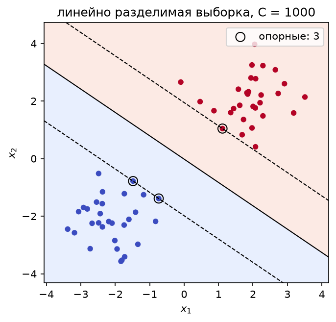
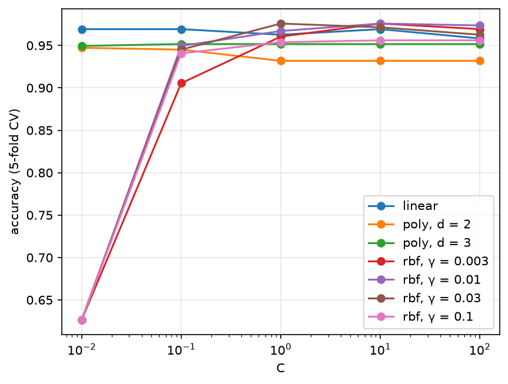
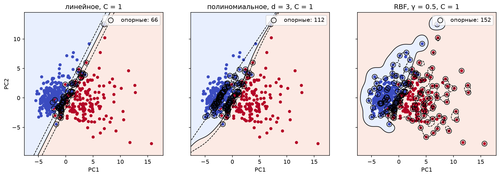
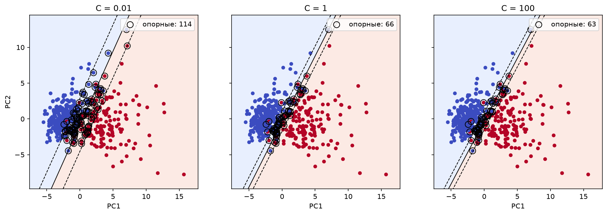
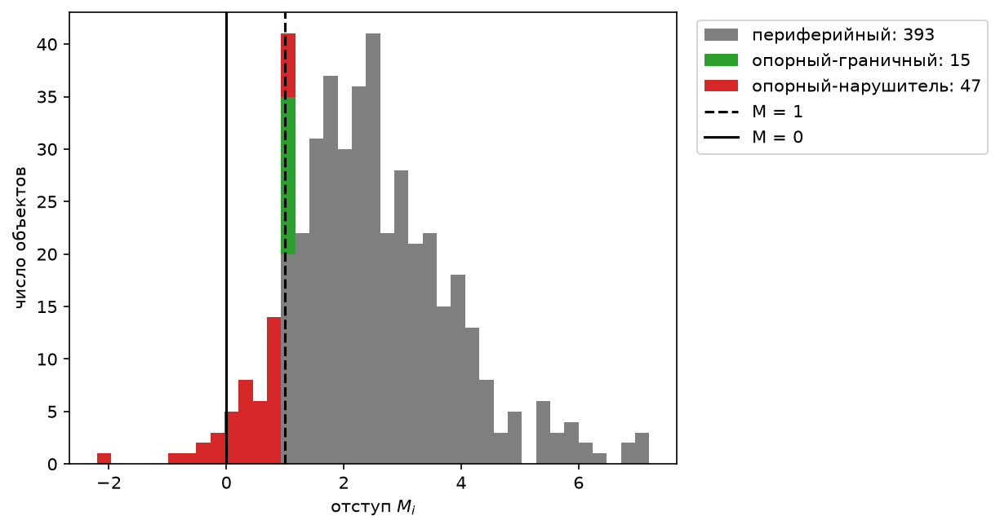
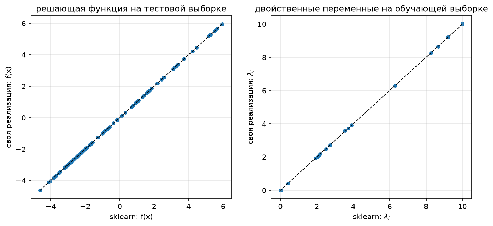

## 1. Датасет

Breast Cancer Wisconsin (Diagnostic), тот же, что в lab2: 569 объектов, 30 числовых признаков, 2 класса — злокачественная (`M`, 37%) и доброкачественная (`B`, 63%) опухоль. Загружается с Kaggle (`uciml/breast-cancer-wisconsin-data`) через `kagglehub`. Колонки `id`, `diagnosis` и пустая `Unnamed: 32` в признаки не входят.

В отличие от lab2, метки берутся из {−1, +1}, как в постановке SVM на лекции: `M` → +1, `B` → −1. Признаки стандартизуются по обучающей выборке, выборка делится на обучающую и тестовую стратифицированно (80/20, `random_state=42`): 455 объектов в train, 114 в test.

```python
def load_data():
    df = pd.read_csv(os.path.join(kagglehub.dataset_download("uciml/breast-cancer-wisconsin-data"), "data.csv"))
    y = np.where(df["diagnosis"] == "M", 1, -1)                  # +1 - злокачественная опухоль, -1 - доброкачественная
    X = df.drop(columns=["id", "diagnosis", "Unnamed: 32"]).values.astype(float)
    X_train, X_test, y_train, y_test = train_test_split(
        X, y, test_size=0.2, random_state=RANDOM_STATE, stratify=y
    )
    scaler = StandardScaler().fit(X_train)
    return scaler.transform(X_train), scaler.transform(X_test), y_train, y_test
```

## 2. Решение двойственной задачи по λ

Модель — линейный классификатор a(x) = sign(⟨w, x⟩ − w₀). Ищется разделяющая полоса максимальной ширины 2/‖w‖ с мягкими ограничениями (слайды 5–6):

½‖w‖² + C Σᵢ ξᵢ → min,  Mᵢ ≥ 1 − ξᵢ,  ξᵢ ≥ 0

Условия ККТ (слайды 8–10) позволяют исключить w, w₀ и ξ и перейти к двойственной задаче только по λ (слайд 11):

−L(λ) = −Σᵢ λᵢ + ½ Σᵢ Σⱼ λᵢ λⱼ yᵢ yⱼ ⟨xᵢ, xⱼ⟩ → min_λ,  Σᵢ λᵢ yᵢ = 0,  0 ≤ λᵢ ≤ C

Это выпуклая квадратичная задача, её решение единственно. Она решается `scipy.optimize.minimize` методом SLSQP. Целевая функция записывается через матрицу Q с элементами Qᵢⱼ = yᵢ yⱼ K(xᵢ, xⱼ): −L(λ) = ½ λᵀQλ − Σλᵢ, градиент Qλ − 1 передаётся явно (иначе SLSQP считал бы его численно по 455 переменным). Ограничение Σλᵢyᵢ = 0 задаётся как `eq`-ограничение, 0 ≤ λᵢ ≤ C — как `bounds`.

```python
def solve_dual(Kmat, y, C):
    l = len(y)
    Q = (y[:, None] * y[None, :]) * Kmat                       # Q_ij = y_i y_j K(x_i, x_j)

    res = minimize(
        fun=lambda lam: 0.5 * lam @ Q @ lam - lam.sum(),       # -L(lambda)
        x0=np.zeros(l),
        jac=lambda lam: Q @ lam - 1,                           # градиент: Q lambda - 1
        bounds=[(0, C)] * l,                                   # 0 <= lambda_i <= C
        constraints=[{"type": "eq",                            # sum_i lambda_i y_i = 0
                      "fun": lambda lam: lam @ y,
                      "jac": lambda lam: y}],
        method="SLSQP",
        options={"maxiter": 500, "ftol": 1e-10},
    )
    return res.x
```

По найденным λ восстанавливается решение прямой задачи (слайды 10–11). Объект опорный, если λᵢ ≠ 0 (численно — λᵢ > 10⁻⁶). Сдвиг w₀ = ⟨w, xᵢ⟩ − yᵢ вычисляется по опорным-граничным объектам (0 < λᵢ < C, Mᵢ = 1); для устойчивости берётся среднее по всем таким объектам. Классификатор на слайде 11 использует только скалярные произведения с опорными объектами:

a(x) = sign( Σᵢ λᵢ yᵢ K(x, xᵢ) − w₀ )

```python
class SVM:
    def fit(self, X, y):
        lam = solve_dual(self.kernel(X, X), y, self.C)
        lam[lam < self.eps] = 0                                # опорные объекты: lambda_i != 0 (слайд 10)
        lam[lam > self.C - self.eps] = self.C

        self.X, self.y, self.lam = X, y, lam
        self.sv = lam > 0                                      # опорные объекты
        self.boundary = self.sv & (lam < self.C)               # опорные-граничные: 0 < lambda_i < C, M_i = 1

        # w_0 = sum_j lambda_j y_j K(x_j, x_i) - y_i для любого граничного i (слайд 12); усредняем для устойчивости
        f = self.kernel(X, X) @ (lam * y)
        idx = self.boundary if self.boundary.any() else self.sv
        self.w0 = float(np.mean(f[idx] - y[idx]))
        return self

    def decision_function(self, X):
        # sum_i lambda_i y_i K(x, x_i) - w_0; суммирование только по опорным объектам
        s = self.sv
        return self.kernel(X, self.X[s]) @ (self.lam[s] * self.y[s]) - self.w0

    def predict(self, X):
        return np.where(self.decision_function(X) >= 0, 1, -1)  # a(x) = sign(...)
```

## 3. Трюк с ядром

В двойственной задаче и в классификаторе объекты входят только через скалярные произведения ⟨xᵢ, xⱼ⟩. Если заменить их ядром K(xᵢ, xⱼ) = ⟨ψ(xᵢ), ψ(xⱼ)⟩, то задача решается в спрямляющем пространстве H, в которое переход ψ никогда не вычисляется явно (слайды 12–13). Линейной поверхности в H соответствует нелинейная поверхность в исходном пространстве. Менять придётся только матрицу Грама Kmat; `solve_dual` и `SVM` остаются прежними.

Реализованы три ядра (слайд 16), каждое возвращает матрицу K[i, j] = K(xᵢ, zⱼ) сразу для двух выборок:

| ядро | K(x, x′) | параметры |
|---|---|---|
| линейное | ⟨x, x′⟩ | — |
| полиномиальное | (⟨x, x′⟩ + 1)ᵈ | d |
| гауссовское (RBF) | exp(−γ‖x − x′‖²) | γ |

```python
def linear_kernel():
    return lambda X, Z: X @ Z.T                                 # K(x, x') = <x, x'>


def poly_kernel(d):
    return lambda X, Z: (X @ Z.T + 1) ** d                      # K(x, x') = (<x, x'> + 1)^d


def rbf_kernel(gamma):
    def K(X, Z):
        sq = (X ** 2).sum(1)[:, None] + (Z ** 2).sum(1)[None, :] - 2 * X @ Z.T
        return np.exp(-gamma * np.maximum(sq, 0))               # K(x, x') = exp(-gamma ||x - x'||^2)
    return K
```

Квадрат расстояния ‖x − z‖² считается как ‖x‖² + ‖z‖² − 2⟨x, z⟩ без цикла по парам; `np.maximum(..., 0)` убирает отрицательные значения порядка 10⁻¹⁶ из-за округления.

## 4. Линейный классификатор: проверка на разделимой выборке

Для линейного ядра вес w = Σᵢ λᵢ yᵢ xᵢ восстанавливается явно, поэтому на нём удобно проверить, что решение совпадает с геометрической постановкой (слайд 5). Для этого взята линейно разделимая выборка из двух гауссовских облаков (60 точек) и большое C = 1000: тогда мягкие ограничения практически не работают и получается жёсткий зазор.

```python
X_toy, y_toy = make_blobs(n_samples=60, centers=[[-2, -2], [2, 2]], cluster_std=0.8, random_state=RANDOM_STATE)
y_toy = 2 * y_toy - 1
toy = svm.SVM(svm.linear_kernel(), C=1e3).fit(X_toy, y_toy)
toy_ref = SVC(kernel="linear", C=1e3).fit(X_toy, y_toy)
```

| | своя реализация | sklearn SVC |
|---|---|---|
| w | (0.4127, 0.5088) | (0.4129, 0.5085) |
| w₀ | −0.00920 | −0.00917 |
| число опорных объектов | 3 | 3 |

Максимальное расхождение λ — 3·10⁻⁴. Ширина полосы 2/‖w‖ = 3.053; минимальный отступ min Mᵢ = 1.0000, то есть ближайшие к границе объекты лежат ровно на краю полосы, как и должно быть при нормировке min Mᵢ = 1. Опорных объектов три: два из одного класса и один из другого, все на пунктирных линиях Mᵢ = ±1.



## 5. Подбор параметров

Подбирались C ∈ {0.01, 0.1, 1, 10, 100} и параметр ядра (d ∈ {2, 3} для полиномиального, γ ∈ {0.003, 0.01, 0.03, 0.1} для RBF) по accuracy при 5-кратной кросс-валидации на обучающей выборке. Перебор выполняется эталоном `GridSearchCV(SVC)`, а не своим решателем: SLSQP обучается за единицы–десятки секунд, а для сетки нужно сотни обучений. Выбранные параметры затем используются и в своей реализации, и в эталоне.

```python
def select_params(X, y):
    best, curves = {}, {}
    for name, (_, sk_params, grid) in KERNELS.items():
        for p in grid:
            gs = GridSearchCV(SVC(**sk_params(p)), {"C": CS}, cv=5, scoring="accuracy").fit(X, y)
            ...
```



| ядро | параметр ядра | C | CV accuracy |
|---|---|---|---|
| линейное | — | 0.01 | 0.9692 |
| полиномиальное | d = 3 | 0.1 | 0.9516 |
| RBF | γ = 0.003 | 10 | 0.9758 |

Замечания по графику:
- При C = 0.01 у RBF accuracy 0.626: регуляризация настолько сильная, что модель сводится к тривиальной «всегда доброкачественная» (доля доброкачественных в train — 0.626).
- У линейного и RBF-ядер оптимум плоский: разница между соседними C и γ — доли процента, что на 455 объектах составляет 1–3 объекта. Поэтому выбор γ = 0.003 (нижняя граница сетки) ненадёжен; ядро с γ = 0.01 или 0.03 даёт практически то же качество.
- Полиномиальное ядро хуже остальных при любом C.

## 6. Визуализация решения

Исходное пространство 30-мерное, поэтому для картинок признаки проецируются на две главные компоненты (PCA обучается на train), и модели обучаются заново уже в этой плоскости (слайды 17–18). Сплошная линия — разделяющая поверхность f(x) = 0, пунктир — границы полосы f(x) = ±1, обведены опорные объекты.

### Ядра



- Линейное ядро даёт прямую с узкой полосой; 66 опорных объектов.
- Полиномиальное (d = 3) слегка искривляет границу; 112 опорных объектов.
- RBF (γ = 0.5, взят для наглядности, а не по CV) строит замкнутую область вокруг доброкачественного класса и локальные «острова» вокруг отдельных точек: 152 опорных объекта из 455, это признак переобучения при слишком большом γ.

### Влияние константы C



| C | 0.01 | 1 | 100 |
|---|---|---|---|
| опорных объектов | 114 | 66 | 63 |

При малом C регуляризация сильная: полоса широкая, много объектов оказывается внутри неё и становится опорными. С ростом C штраф за нарушения Mᵢ < 1 растёт, полоса сужается, число опорных объектов падает. Это согласуется с картинкой на слайде 18. Между C = 1 и C = 100 разница уже мала: выборка не разделима, и λᵢ насыщаются на C.

### Типы объектов и отступы

Для RBF-модели с выбранными по CV параметрами (в исходном 30-мерном пространстве) на гистограмме показаны отступы Mᵢ = yᵢ f(xᵢ) обучающих объектов и типизация со слайда 10:



| тип | условие | число объектов |
|---|---|---|
| периферийный | λᵢ = 0, Mᵢ ≥ 1 | 393 |
| опорный-граничный | 0 < λᵢ < C, Mᵢ = 1 | 15 |
| опорный-нарушитель | λᵢ = C, Mᵢ < 1 | 47 |

Нарушители с Mᵢ < 0 — это ошибки на обучающей выборке; граничные сидят ровно на Mᵢ = 1, периферийные дальше. Решение определяют только 62 из 455 объектов (14%).

## 7. Сравнение с эталонной реализацией

Эталон — `sklearn.svm.SVC` (libsvm, решатель SMO) с теми же ядром, C и параметрами. Параметризация ядер подобрана так, чтобы формулы совпадали: полиномиальное ядро SVC = (γ⟨x, x′⟩ + coef0)ᵈ при γ = 1, coef0 = 1 даёт (⟨x, x′⟩ + 1)ᵈ; RBF — `gamma=γ`.

```python
KERNELS = {
    "linear": (lambda p: svm.linear_kernel(), lambda p: dict(kernel="linear"), [None]),
    "poly":   (lambda p: svm.poly_kernel(p), lambda p: dict(kernel="poly", degree=p, gamma=1, coef0=1), [2, 3]),
    "rbf":    (lambda p: svm.rbf_kernel(p), lambda p: dict(kernel="rbf", gamma=p), [0.003, 0.01, 0.03, 0.1]),
}
```

Метрики на тестовой выборке (114 объектов, положительный класс — злокачественная опухоль):

| ядро | реализация | accuracy | F1 | опорных | время обучения |
|---|---|---|---|---|---|
| линейное | своя | 0.9561 | 0.9367 | 103 | ≈ 7 с |
| линейное | sklearn | 0.9561 | 0.9367 | 103 | < 0.01 с |
| полиномиальное | своя | 0.9123 | 0.8750 | 65 | ≈ 55 с |
| полиномиальное | sklearn | 0.9123 | 0.8750 | 65 | < 0.01 с |
| RBF | своя | 0.9825 | 0.9756 | 62 | ≈ 25 с |
| RBF | sklearn | 0.9825 | 0.9756 | 62 | < 0.01 с |

Близость самих решений:

| ядро | совпадение предсказаний | max abs Δf(x) на test | max abs Δλ | w₀ своя / sklearn |
|---|---|---|---|---|
| линейное | 1.0000 | 0.0010 | 0.0001 | 0.3379 / 0.3379 |
| полиномиальное | 1.0000 | 0.0108 | 0.0000 | 0.5349 / 0.5355 |
| RBF | 1.0000 | 0.0008 | 0.0265 | −1.2811 / −1.2810 |



Точки решающей функции и двойственных переменных лежат на диагонали. Это подтверждает, что реализация решает ту же задачу, а не просто даёт похожие ответы. Наибольшее расхождение λ (0.027 при C = 10, то есть 0.3% масштаба) связано с точностью численной оптимизации: SLSQP останавливается по `ftol`, а SMO — по собственному критерию KKT; на решающую функцию это почти не влияет (Δf < 0.011).

## 8. Выводы

- Решение двойственной задачи через `scipy.optimize.minimize` (SLSQP) даёт то же решение, что libsvm: на всех трёх ядрах предсказания на тесте совпали на 100%, а решающая функция — с точностью до 10⁻² (для линейного и RBF — до 10⁻³).
- Нелинейность достигается заменой скалярного произведения на ядро в матрице Грама; `solve_dual` и классификатор при этом не меняются.
- Лучшее качество на тесте у RBF-ядра: accuracy 0.9825, F1 0.9756. Это на 2.6 п.п. (3 объекта из 114) лучше линейного; на тесте такого размера разница 1 объекта — 0.9 п.п., поэтому преимущество RBF над линейным ядром не стоит считать статистически значимым. Полиномиальное ядро степени 3 заметно хуже (0.9123) и по CV, и на тесте.
- Классификатор определяется малой частью выборки: 62 опорных объекта из 455 у RBF, 3 из 60 на разделимой выборке. С ростом C число опорных объектов падает, полоса сужается.
- Главное ограничение — скорость. SLSQP решает плотную задачу с l = 455 переменными: ≈ 7 с для линейного ядра, ≈ 25 с для RBF и ≈ 55 с для полиномиального против сотых долей секунды у SMO. Сложность растёт быстрее, чем линейно, по l, поэтому на больших выборках нужны специализированные решатели (SMO, декомпозиция), а подбор параметров по сетке своим решателем непрактичен — он выполнялся эталоном.
