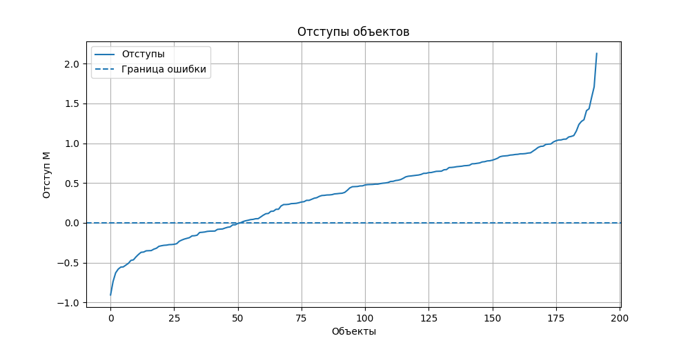
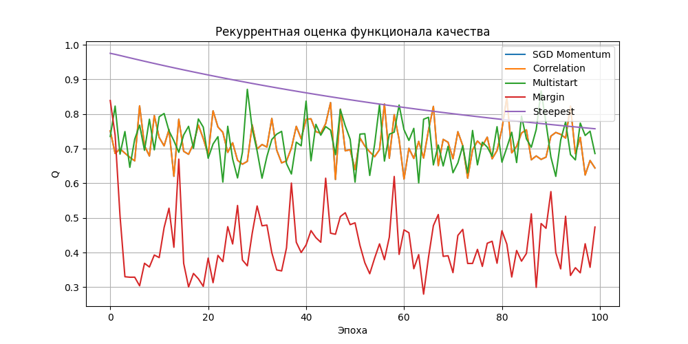

# Лабораторная работа №1. Линейная классификация

## Цель работы

Цель лабораторной работы - реализовать линейный бинарный классификатор и обучить его на реальном датасете методами градиентной оптимизации. В работе реализованы:

- вычисление отступа объекта;
- квадратичная функция потерь по отступу;
- автоматическое вычисление градиента функции потерь;
- рекуррентная оценка функционала качества;
- стохастический градиентный спуск с инерцией;
- L2-регуляризация;
- скорейший градиентный спуск;
- разные способы инициализации весов;
- случайное предъявление объектов;
- предъявление объектов по модулю отступа;
- сравнение собственной реализации с эталонной реализацией из `sklearn`.

## Структура проекта

```text
lab1/
├── README.md
├── margins.png
├── quality.png
└── source/
    ├── autograd.py
    ├── main.py
    ├── optimizers.py
    └── weights.py
```

Назначение файлов:

- `source/main.py` - основной исполняемый файл: загрузка данных, подготовка выборки, обучение моделей, оценка качества, построение графиков;
- `source/autograd.py` - минимальная реализация автоматического дифференцирования для операций, используемых в линейной модели;
- `source/optimizers.py` - реализации оптимизаторов `SGD` и `SGDMomentum`;
- `source/weights.py` - функции инициализации весов;

## Запуск

Запуск выполняется из директории `source`:

```bash
python main.py
```

Датасет скачивается автоматически из внешнего источника, поэтому хранить его в репозитории не требуется.

## Датасет

Использован датасет **Pima Indians Diabetes**:

```text
https://raw.githubusercontent.com/jbrownlee/Datasets/master/pima-indians-diabetes.data.csv
```

Задача - классификация наличия диабета по медицинским признакам.

## Линейная модель

Реализована линейная решающая функция:

```text
g(x) = <w, x>
```

Классификатор:

```text
a(x) = sign(g(x))
```

В коде:

```python
def g(X: Tensor, w: Tensor) -> Tensor:
    return X @ w

def a(X: Tensor, w: Tensor) -> np.ndarray:
    return np.where(g(X, w).data >= 0, 1.0, -1.0)
```

Если значение `g(x)` неотрицательное, объект относится к классу `1`; иначе - к классу `-1`.

## Отступ объекта

Отступ объекта определен как:

```text
M_i = y_i * <w, x_i>
```

Интерпретация:

- `M_i > 0` - объект классифицирован правильно;
- `M_i < 0` - объект классифицирован ошибочно;
- чем больше `M_i`, тем увереннее классификация;
- значения около нуля соответствуют пограничным объектам.

В коде:

```python
def M(X: Tensor, y: Tensor, w: Tensor) -> Tensor:
    return g(X, w) * y
```

Для лучшей собственной модели отступы анализируются на тестовой выборке. В результате последнего запуска:

```text
Ошибочные объекты (M < 0): 52
Правильные объекты (M > 0): 140
Минимальный отступ: -0.9068963895187024
Средний отступ: 0.3803245858649011
Максимальный отступ: 2.127295085225762
```

График отступов сохраняется в `margins.png`.

## Функция потерь

В работе используется квадратичная функция потерь по отступу:

```text
L_i = (1 - M_i)^2
```

где:

```text
M_i = y_i * <w, x_i>
```

Итоговая функция потерь по выборке:

```text
L = mean((1 - y_i * <w, x_i>)^2)
```

В коде:

```python
def quadratic_loss(X: Tensor, y: Tensor, w: Tensor) -> Tensor:
    margin = M(X, y, w)
    residual = 1.0 + (-margin)
    return (residual * residual).mean()
```

Такая функция штрафует объекты с малым или отрицательным отступом. При этом даже правильно классифицированные объекты продолжают влиять на значение функции потерь, если их отступ меньше `1`.

## Градиент функции потерь

Для вычисления градиента реализован небольшой механизм автоматического дифференцирования в `autograd.py`.

Поддерживаемые операции:

- сложение;
- унарный минус;
- умножение;
- матрично-векторное умножение;
- экспонента;
- логарифм;
- среднее значение.

Для текущей квадратичной функции потерь используются сложение, унарный минус, умножение, матрично-векторное умножение и среднее значение.

Объект `Tensor` хранит:

- `data` - численное значение;
- `grad` - градиент;
- `_prev` - родительские вершины вычислительного графа;
- `_op` - локальную функцию обратного распространения.

Градиент считается вызовом:

```python
loss.backward()
```

После этого градиент по весам доступен как:

```python
w.grad
```

Функция-обертка:

```python
def grad(result: Tensor, w: Tensor) -> np.ndarray:
    result.backward()
    return w.grad.copy()
```

## Рекуррентная оценка функционала качества

Для сглаживания значения функционала используется рекуррентная оценка:

```text
Q_t = lambda * L_t + (1 - lambda) * Q_{t-1}
```

Если предыдущего значения нет, первое значение принимается равным текущей потере:

```python
def recursive_Q(previous_Q, current_loss, lambda_=0.01):
    if previous_Q is None:
        return current_loss

    return lambda_ * current_loss + (1.0 - lambda_) * previous_Q
```

В работе используется `lambda_ = 0.01`. Это делает оценку достаточно сглаженной и позволяет видеть общий тренд обучения.

График изменения рекуррентной оценки сохраняется в `quality.png`.

## L2-регуляризация

```text
R(w) = 0.5 * weight_decay * sum_{j=1}^{d} w_j^2
```

В коде:

```python
def l2_regularization(w: Tensor, weight_decay: float) -> float:
    return 0.5 * weight_decay * np.sum(w.data[1:] ** 2)
```


## Стохастический градиентный спуск с инерцией

Основной оптимизатор - стохастический градиентный спуск с инерцией.

Для каждого объекта вычисляется градиент функции потерь, после чего обновляются скорость и веса:

```text
v_t = momentum * v_{t-1} + (1 - momentum) * grad_t
w_t = w_{t-1} - lr * v_t
```

Инерция сглаживает направление обновлений и уменьшает влияние шума, возникающего при стохастическом предъявлении объектов.

## Скорейший градиентный спуск


```python
loss = quadratic_loss(Tensor(X), Tensor(y), w)
loss.backward()
```

После вычисления градиента выбирается шаг из сетки:

```python
steps = np.logspace(-5, 0, 20)
```

Для каждого кандидата временно проверяется значение функции:

```text
w_new = w - step * gradient
```

Выбирается шаг, при котором значение функции потерь с L2-регуляризацией минимально.

Использованные параметры:

```text
epochs = 100
weight_decay = 0.001
```

## Предъявление объектов

Реализованы два способа предъявления объектов при стохастическом обучении.

### Случайное предъявление

На каждой эпохе объекты перемешиваются:

```python
order = rng.permutation(len(X))
```

Этот режим используется в базовом `SGD Momentum`, корреляционной инициализации и мультистарте.

### Предъявление по модулю отступа

Для каждого объекта вычисляется отступ:

```text
M_i = y_i * <w, x_i>
```

Затем объекты сортируются по `abs(M_i)`:

```python
order = np.argsort(np.abs(margins))
```

Сначала предъявляются объекты, которые находятся ближе всего к разделяющей гиперплоскости. Это пограничные объекты, на которых классификатор менее уверен.

В коде этот режим используется при обучении модели `Margin presentation`.

## Инициализация весов

Реализованы два способа инициализации весов.

### Случайная инициализация

Весам задаются малые случайные значения:

```text
w_j ~ U(-1 / (2n), 1 / (2n))
```

где `n` - количество признаков с учетом bias.

В коде:

```python
bound = 1.0 / (2.0 * n_features)
```

### Корреляционная инициализация

Для каждого признака начальный вес вычисляется как:

```text
w_j = <y, f_j> / <f_j, f_j>
```

где `f_j` - j-й признак.

В коде:

```python
numerator = X.T @ y
denominator = np.sum(X ** 2, axis=0)
w = numerator / (denominator + eps)
```

Такая инициализация задает больший начальный вес признакам, которые сильнее связаны с целевой переменной.

## Мультистарт

Для случайной инициализации реализован мультистарт.

Выполняется 10 запусков обучения:

```python
for start in range(10):
    ...
```

Для каждого запуска:

- создается новая случайная инициализация весов;
- модель обучается методом `SGD Momentum`;
- качество оценивается на обучающей выборке;
- сохраняется модель с наименьшей долей ошибок на обучении.

Критерий выбора:

```python
current_Q = Q(X_train, y_train, current_w)
```

где `Q` - доля ошибочно классифицированных объектов.

## Оценка качества

Качество моделей оценивается на тестовой выборке по метрикам:

- `Accuracy` - доля правильных ответов;
- `Precision` - точность для положительного класса;
- `Recall` - полнота для положительного класса;
- `F1` - гармоническое среднее precision и recall.

Для вычисления метрик используются готовые функции из `sklearn.metrics`, так как это не является частью собственной реализации алгоритма обучения.

## Сравниваемые модели

В работе сравниваются:

- `SGD Momentum` - собственная реализация SGD с инерцией, случайное предъявление, случайная инициализация;
- `Correlation initialization` - SGD с инерцией, но начальные веса заданы через корреляционную инициализацию;
- `Random multistart` - лучший результат среди 10 случайных стартов;
- `Margin presentation` - SGD с инерцией и предъявлением объектов по модулю отступа;
- `Steepest gradient descent` - собственная реализация скорейшего градиентного спуска;
- `sklearn RidgeClassifier` - эталонная линейная модель из `sklearn`, использующая квадратичный критерий.

В качестве эталона выбран `RidgeClassifier`, а не `LogisticRegression`, потому что в данной лабораторной используется квадратичная функция потерь.

## Результаты

Результаты последнего запуска:

| Модель | Accuracy | Precision | Recall | F1 |
|---|---:|---:|---:|---:|
| SGD Momentum | 0.739583 | 0.649123 | 0.552239 | 0.596774 |
| Correlation initialization | 0.739583 | 0.649123 | 0.552239 | 0.596774 |
| Random multistart | 0.729167 | 0.636364 | 0.522388 | 0.573770 |
| Margin presentation | 0.734375 | 0.633333 | 0.567164 | 0.598425 |
| Steepest gradient descent | 0.729167 | 0.641509 | 0.507463 | 0.566667 |
| sklearn RidgeClassifier | 0.729167 | 0.641509 | 0.507463 | 0.566667 |

Лучшая собственная модель по accuracy на обучающей выборке:

```text
Steepest gradient descent
```

При этом по тестовым метрикам лучшие значения распределились так:

- максимальная `Accuracy`: `SGD Momentum` и `Correlation initialization`;
- максимальная `Precision`: `SGD Momentum` и `Correlation initialization`;
- максимальная `Recall`: `Margin presentation`;
- максимальная `F1`: `Margin presentation`.

## Анализ результатов

`SGD Momentum` и модель с корреляционной инициализацией дали одинаковые значения на тестовой выборке. Это означает, что при выбранных параметрах обучения влияние начальной точки оказалось небольшим: оптимизация пришла к похожему классификатору.

`Random multistart` не улучшил качество на тестовой выборке. Возможные причины:

- выбранная функция потерь достаточно гладкая;
- разные случайные старты приводят к похожим решениям;
- выбор лучшей модели выполнялся по обучающей выборке, а не по отдельной валидационной выборке.

`Margin presentation` показал лучшее значение `F1` и `Recall`. Это объяснимо: предъявление объектов с малым модулем отступа заставляет модель чаще обновляться на пограничных объектах. В результате модель лучше находит положительный класс, но немного теряет в precision.

`Steepest gradient descent` совпал с `sklearn RidgeClassifier` по тестовым метрикам. Это хороший знак: собственная реализация квадратичной линейной модели с L2-регуляризацией дает результат, сопоставимый с библиотечной эталонной реализацией.

## Графики

### График отступов

Файл:

```text
margins.png
```



На графике показаны отсортированные отступы объектов тестовой выборки для лучшей собственной модели.

Интерпретация:

- точки ниже нуля соответствуют ошибочно классифицированным объектам;
- точки выше нуля соответствуют правильно классифицированным объектам;
- чем выше точка, тем увереннее классификация;
- область около нуля содержит наиболее спорные объекты.

### График рекуррентной оценки качества

Файл:

```text
quality.png
```



На графике показана динамика рекуррентной оценки функционала качества для разных вариантов обучения.
