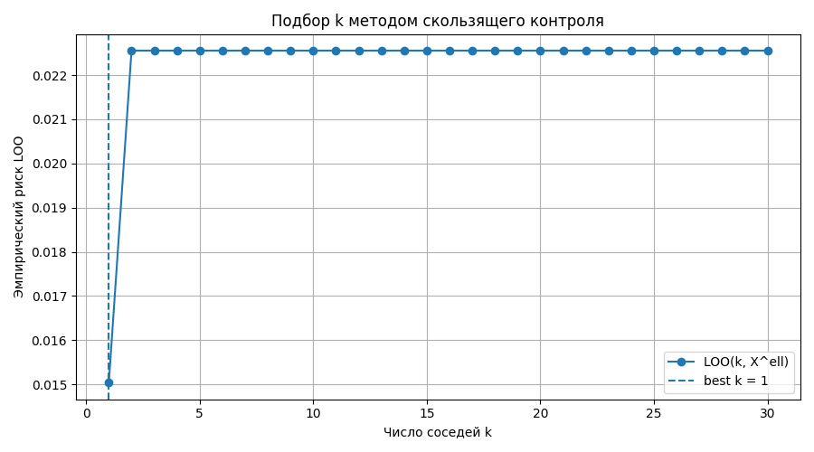
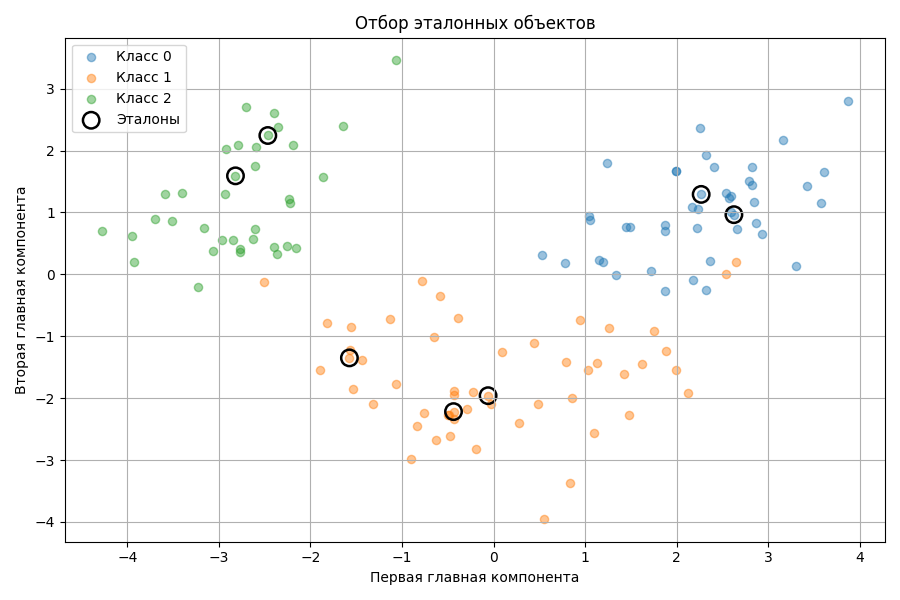
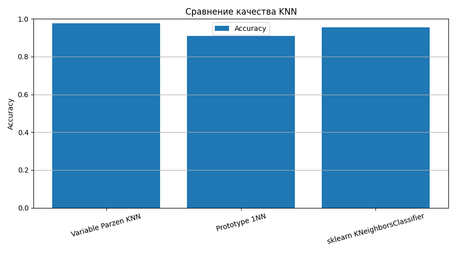

# Лабораторная работа №2. Метрическая классификация

## Цель работы

Цель работы - реализовать метрический алгоритм классификации KNN с методом окна Парзена переменной ширины, подобрать параметр `k` методом скользящего контроля `LOO`, сравнить собственную реализацию с эталонной реализацией из `sklearn`, а также реализовать отбор эталонных объектов.

Используются обозначения из лекции по метрическим методам:

```text
X - множество объектов;
Y - множество ответов;
X^ell = (x_i, y_i)_{i=1}^ell - обучающая выборка;
rho(x, x_i) - расстояние между объектами;
x^(i) - i-й сосед объекта x среди объектов обучающей выборки;
y^(i) - ответ на i-м соседе объекта x.
```

Основная гипотеза метрических методов классификации - **гипотеза компактности**:

```text
близкие объекты, как правило, лежат в одном классе.
```

## Структура проекта

```text
lab2/
├── README.md
├── loo_risk.png
├── prototypes.png
├── quality_comparison.png
└── source/
    ├── knn.py
    ├── main.py
    ├── plots.py
    └── prototype_selection.py
```

Назначение файлов:

- `source/main.py` - основной сценарий лабораторной работы;
- `source/knn.py` - собственная реализация метрического классификатора с переменным окном Парзена и LOO;
- `source/prototype_selection.py` - алгоритм отбора эталонных объектов;
- `source/plots.py` - построение графиков;
- `loo_risk.png` - график зависимости `LOO(k, X^ell)` от `k`;
- `prototypes.png` - визуализация выбранных эталонов;
- `quality_comparison.png` - сравнение качества классификаторов.

## Запуск

Запуск выполняется из директории `source`:

```bash
python main.py
```

Датасет загружается через `sklearn.datasets.load_wine`, поэтому данные не хранятся в репозитории.

## Датасет

Использован датасет **Wine recognition**.

Объекты `x_i in X` - результаты химического анализа вина.

Ответы:

```text
Y = {0, 1, 2}.
```

То есть решается задача многоклассовой классификации на 3 класса.

В датасете 13 количественных признаков. Перед применением метрического алгоритма признаки стандартизируются:

```text
x'_j = (x_j - mean_j) / std_j.
```

Это важно для метрических методов, потому что расстояние зависит от масштаба признаков. Если признаки имеют разные масштабы, признаки с большими численными значениями начинают доминировать в метрике.

Выборка делится на обучающую и тестовую:

```text
|X^ell| = 133;
|X^k| = 45.
```

Разбиение стратифицировано по классам.

## Метрика

Используется евклидова метрика:

```text
rho(x, x_i) = sqrt(sum_{j=1}^{n} (x_j - x_{ij})^2).
```

В коде:

```python
def euclidean_distances(X, Y):
    diff = X[:, None, :] - Y[None, :, :]
    return np.sqrt(np.sum(diff * diff, axis=2))
```

Для произвольного объекта `x` объекты обучающей выборки ранжируются по возрастанию расстояния:

```text
rho(x, x^(1)) <= rho(x, x^(2)) <= ... <= rho(x, x^(ell)).
```

## Обобщенный метрический классификатор

В лекции метрический алгоритм классификации записывается как:

```text
a(x; X^ell) = arg max_{y in Y} Gamma_y(x),
```

где:

```text
Gamma_y(x) = sum_{i=1}^{ell} [y^(i) = y] w(i, x).
```

Здесь:

- `Gamma_y(x)` - мера голосов соседей в пользу класса `y`;
- `w(i, x)` - вес, или степень близости к объекту `x` его `i`-го соседа.

Классом объекта считается класс с максимальной суммарной мерой голосов.

## Метод окна Парзена переменной ширины

В задании требуется реализовать KNN с методом окна Парзена переменной ширины.

В лекционной нотации вес соседа:

```text
w(i, x) = K(rho(x, x^(i)) / h(x)).
```

Для переменной ширины окна:

```text
h(x) = rho(x, x^(k+1)).
```

То есть ширина окна зависит от объекта `x` и равна расстоянию до следующего после `k` соседа.

В работе используется гауссовское ядро:

```text
K(r) = exp(-2 r^2).
```

Итоговая формула голосования:

```text
Gamma_y(x) = sum_{i=1}^{ell} [y^(i) = y] K(rho(x, x^(i)) / rho(x, x^(k+1))).
```

В коде это реализовано в классе:

```python
VariableParzenKNN
```

Если ширина окна оказывается равной нулю, используется голосование среди объектов с нулевым расстоянием, чтобы избежать деления на ноль.

## Подбор параметра k методом LOO

Параметр `k` подбирается методом скользящего контроля `LOO`.

В лекционной нотации:

```text
LOO(k, X^ell) =
(1 / ell) sum_{i=1}^{ell} [a(x_i; X^ell \ {x_i}) != y_i].
```

Для каждого значения `k` каждый объект по очереди исключается из обучающей выборки, классифицируется по оставшимся объектам, после чего считается доля ошибок.

В работе перебирались значения:

```text
k = 1, 2, ..., 30.
```

Лучшее значение:

```text
k = 1.
```

Значение LOO-риска:

```text
LOO(1, X^ell) = 0.015037593984962405.
```

### График LOO



Минимум графика достигается при `k = 1`, поэтому это значение используется в дальнейших экспериментах.

## Эталонная реализация

Для сравнения используется:

```python
sklearn.neighbors.KNeighborsClassifier
```

Эталонная модель обучается с тем же числом соседей:

```text
n_neighbors = 1.
```

Эталон используется только для сравнения качества. Собственный алгоритм KNN, окно Парзена и LOO реализованы вручную.

## Отбор эталонных объектов

В лекции задача отбора эталонов записывается так:

```text
Omega subset X^L.
```

Классификатор использует не всю обучающую выборку, а только множество эталонов:

```text
a(x; X^ell intersect Omega).
```

Требуется найти такое подмножество `Omega`, которое сохраняет качество классификации при меньшем числе объектов.

В работе реализована жадная стратегия добавления эталонов из лекции:

```text
Omega := {по одному объекту от каждого класса};
повторять
    найти x in X^L \ Omega : CCV(Omega union {x}) -> min;
    Omega := Omega union {x};
пока CCV уменьшается.
```

В реализации `CCV(Omega)` считается как LOO-ошибка `1NN`-классификатора, использующего только эталоны из `Omega`. Если классифицируемый объект сам входит в `Omega`, он исключается из множества соседей для этого объекта.

Количество обучающих объектов:

```text
133.
```

Количество выбранных эталонов:

```text
7.
```

Доля оставленных объектов:

```text
7 / 133 = 0.05263157894736842.
```

То есть после отбора используется около 5.3% обучающей выборки.

Значение критерия после отбора:

```text
CCV(Omega) = 0.0.
```

### Визуализация эталонов

Для визуализации обучающая выборка проецируется на две главные компоненты. Черными окружностями отмечены выбранные эталоны.



## Сравнение качества

Качество оценивается на тестовой выборке по метрикам:

- `Accuracy`;
- `Precision macro`;
- `Recall macro`;
- `F1 macro`.

Использование macro-усреднения связано с многоклассовой постановкой задачи.

Результаты последнего запуска:

| Модель | Accuracy | Precision macro | Recall macro | F1 macro |
|---|---:|---:|---:|---:|
| Variable Parzen KNN | 0.977778 | 0.974359 | 0.981481 | 0.977143 |
| Prototype 1NN | 0.911111 | 0.923747 | 0.907407 | 0.911827 |
| sklearn KNeighborsClassifier | 0.955556 | 0.953526 | 0.962963 | 0.956306 |

### График сравнения качества



## Анализ результатов

Собственная реализация KNN с переменным окном Парзена показала качество выше эталонного `KNeighborsClassifier`:

```text
0.977778 против 0.955556 по Accuracy.
```

Это объясняется тем, что собственная реализация использует не только номер соседа, но и веса через ядро:

```text
K(r) = exp(-2 r^2).
```

После отбора эталонов качество на тестовой выборке стало ниже, чем у полного KNN, но классификатор использует только 7 объектов из 133.

Это ожидаемый компромисс отбора эталонов: критерий `CCV(Omega)` минимизируется на обучающей выборке, размер хранимого множества резко уменьшается, но на контрольной выборке качество может снизиться.

## Соответствие пунктам задания

| Пункт задания | Реализация |
|---|---|
| Выбрать датасет для классификации | Wine recognition dataset |
| Реализовать KNN с окном Парзена переменной ширины | `VariableParzenKNN` |
| Использовать гауссово ядро | `gaussian_kernel(r) = exp(-2r^2)` |
| Подобрать `k` методом LOO | `select_k_by_loo`, `loo_risk` |
| Построить график эмпирического риска для разных `k` | `loo_risk.png` |
| Сравнить с эталонной реализацией KNN | `sklearn KNeighborsClassifier` |
| Реализовать алгоритм отбора эталонов | `select_prototypes`, жадное добавление по `CCV(Omega)` |
| Подготовить визуализацию отбора эталонов | `prototypes.png` |
| Сравнить KNN с отбором эталонов и без него | итоговая таблица и `quality_comparison.png` |
| Подготовить отчет | данный `README.md` |

## Вывод

В работе реализован метрический классификатор:

```text
a(x; X^ell) = arg max_{y in Y} Gamma_y(x),
Gamma_y(x) = sum_{i=1}^{ell} [y^(i) = y] w(i, x).
```

В качестве весов используется окно Парзена переменной ширины:

```text
w(i, x) = K(rho(x, x^(i)) / rho(x, x^(k+1))).
```

Параметр `k` подобран методом скользящего контроля:

```text
LOO(k, X^ell) -> min.
```

Оптимальным оказалось:

```text
k = 1.
```

Собственный KNN с переменным окном Парзена показал `Accuracy = 0.977778`. Классификатор `1NN` по выбранным эталонам показал `Accuracy = 0.911111`, используя только 7 объектов из 133.
