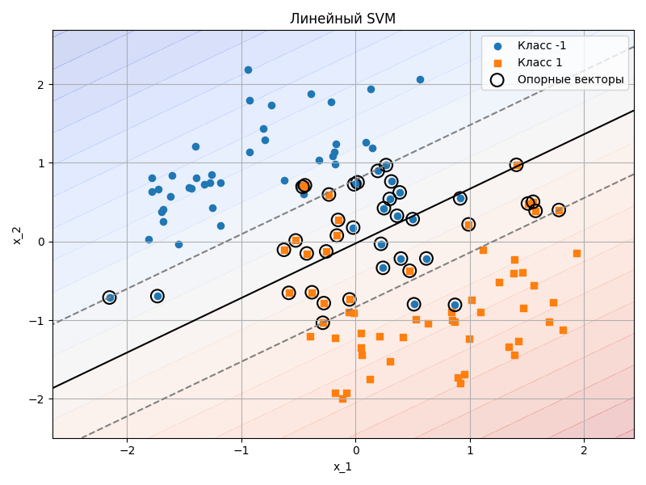
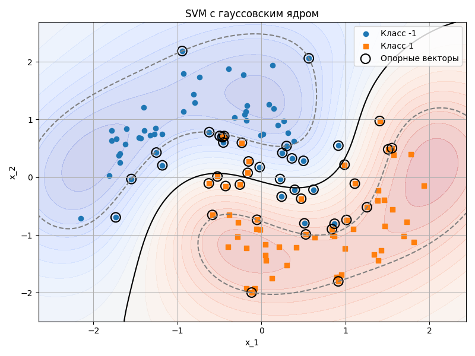
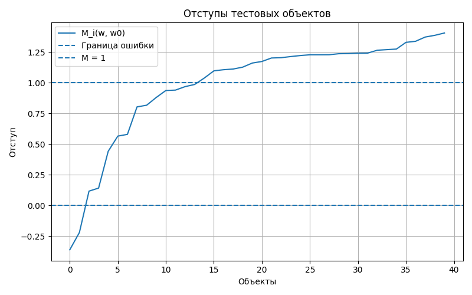
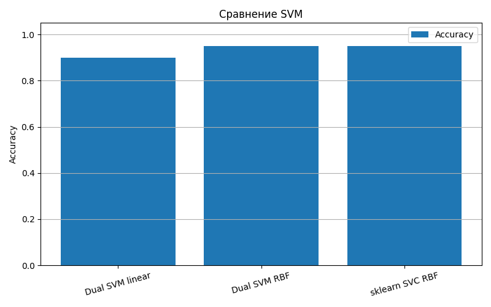

# Лабораторная работа №3. SVM

## Цель работы

Цель работы - реализовать метод опорных векторов через решение двойственной задачи по `lambda`, построить линейный SVM, применить трюк с ядром для нелинейной классификации, визуализировать решение и сравнить собственную реализацию с эталонной реализацией.

Используются обозначения из лекции:

```text
X^ell = {(x_i, y_i)}_{i=1}^ell - обучающая выборка;
x_i in X = R^n - объекты;
y_i in Y = {-1, +1} - метки классов;
w in R^n, w_0 in R - параметры линейной модели.
```

Линейный классификатор:

```text
a(x; w, w_0) = sign(<x, w> - w_0).
```

Отступ объекта:

```text
M_i(w, w_0) = (<x_i, w> - w_0)y_i.
```

## Структура проекта

```text
lab3/
├── README.md
├── linear_svm_boundary.png
├── rbf_margins.png
├── rbf_svm_boundary.png
├── svm_quality.png
└── source/
    ├── kernels.py
    ├── main.py
    ├── plots.py
    └── svm_dual.py
```

Назначение файлов:

- `source/svm_dual.py` - собственная реализация SVM через двойственную задачу;
- `source/kernels.py` - линейное и гауссовское ядра;
- `source/plots.py` - визуализации разделяющих поверхностей, отступов и качества;
- `source/main.py` - основной сценарий лабораторной работы;
- `linear_svm_boundary.png` - визуализация линейного SVM;
- `rbf_svm_boundary.png` - визуализация SVM с гауссовским ядром;
- `rbf_margins.png` - отступы тестовых объектов;
- `svm_quality.png` - сравнение качества моделей.

## Запуск

Запуск выполняется из директории `source`:

```bash
python main.py
```

Датасет генерируется при запуске через `sklearn.datasets.make_moons`, поэтому данные не хранятся в репозитории.

## Датасет

Для бинарной классификации выбран синтетический датасет `make_moons`.

Причина выбора: выборка нелинейно разделима в исходном двумерном пространстве, поэтому на ней хорошо видно различие между линейным SVM и SVM с ядром.

Параметры:

```text
n_samples = 160;
noise = 0.25;
random_state = 42.
```

Метки преобразованы к лекционной постановке:

```text
0 -> -1;
1 -> +1.
```

Размеры выборок:

```text
|X^ell| = 120;
|X^k| = 40.
```

Признаки стандартизируются перед обучением.

## Прямая постановка SVM

Для линейно разделимой выборки оптимальная разделяющая гиперплоскость получается из задачи:

```text
(1 / 2)||w||^2 -> min_{w,w_0};
M_i(w, w_0) >= 1, i = 1, ..., ell.
```

Для линейно неразделимой выборки вводятся штрафы `xi_i`:

```text
(1 / 2)||w||^2 + C sum_{i=1}^{ell} xi_i -> min;
xi_i >= 1 - M_i(w, w_0);
xi_i >= 0.
```

Эквивалентная безусловная форма использует hinge loss:

```text
C sum_{i=1}^{ell} (1 - M_i(w, w_0))_+ + (1 / 2)||w||^2 -> min.
```

В работе используется параметр:

```text
C = 1.0.
```

## Двойственная задача

В лекции после применения условий KKT получается:

```text
w = sum_{i=1}^{ell} lambda_i y_i x_i;
sum_{i=1}^{ell} lambda_i y_i = 0;
0 <= lambda_i <= C.
```

Двойственная задача:

```text
-L(lambda) =
- sum_{i=1}^{ell} lambda_i
+ (1 / 2) sum_{i=1}^{ell} sum_{j=1}^{ell}
  lambda_i lambda_j y_i y_j <x_i, x_j>
-> min_lambda
```

при ограничениях:

```text
sum_{i=1}^{ell} lambda_i y_i = 0;
0 <= lambda_i <= C.
```

В коде задача решается через:

```python
scipy.optimize.minimize(..., method="SLSQP")
```

Для линейного ядра после решения восстанавливается:

```text
w = sum_{i=1}^{ell} lambda_i y_i x_i.
```

Смещение:

```text
w_0 = <w, x_i> - y_i
```

усредняется по объектам с:

```text
0 < lambda_i < C.
```

## Опорные векторы

Объект `x_i` называется опорным, если:

```text
lambda_i != 0.
```

Типы объектов из лекции:

```text
lambda_i = 0       - периферийный объект;
0 < lambda_i < C   - опорный-граничный объект;
lambda_i = C       - опорный-нарушитель.
```

В последнем запуске:

```text
Linear support vectors: 41
RBF support vectors: 44
```

## Трюк с ядром

Нелинейное обобщение SVM получается заменой скалярного произведения:

```text
<x, x'> -> K(x, x').
```

Функция `K : X x X -> R` является ядром, если:

```text
K(x, x') = <psi(x), psi(x')>
```

для некоторого спрямляющего отображения `psi`.

В работе реализованы два ядра:

### Линейное ядро

```text
K(x, x') = <x, x'>.
```

### Гауссовское RBF-ядро

```text
K(x, x') = exp(-gamma ||x - x'||^2).
```

Параметр:

```text
gamma = 0.5.
```

Двойственная задача с ядром:

```text
-L(lambda) =
- sum_{i=1}^{ell} lambda_i
+ (1 / 2) sum_{i=1}^{ell} sum_{j=1}^{ell}
  lambda_i lambda_j y_i y_j K(x_i, x_j)
-> min_lambda
```

Классификатор:

```text
a(x) = sign(
    sum_{i=1}^{ell} lambda_i y_i K(x, x_i) - w_0
).
```

## Визуализация решения

### Линейный SVM



На графике показана линейная разделяющая гиперплоскость и полосы `M = 1`, `M = -1`. Для нелинейного датасета `make_moons` линейный классификатор не может идеально разделить классы.

### SVM с гауссовским ядром



Гауссовское ядро строит нелинейную разделяющую поверхность в исходном пространстве и лучше соответствует форме данных.

### Отступы тестовых объектов



Для RBF SVM:

```text
min M_i = -0.3613923040021266;
mean M_i = 0.9889051096135862;
max M_i = 1.4063337168088856.
```

Минимальный отступ отрицателен, значит на тестовой выборке есть ошибочно классифицированные объекты. При этом средний отступ близок к `1`, а большинство объектов находятся с правильной стороны разделяющей поверхности.

## Сравнение с эталонным решением

В качестве эталона используется:

```python
sklearn.svm.SVC(C=1.0, kernel="rbf", gamma=0.5)
```

Эталон используется только для сравнения качества.

Результаты последнего запуска:

| Модель | Accuracy | Precision | Recall | F1 |
|---|---:|---:|---:|---:|
| Dual SVM linear | 0.900 | 0.900000 | 0.90 | 0.900000 |
| Dual SVM RBF | 0.950 | 0.950000 | 0.95 | 0.950000 |
| sklearn SVC RBF | 0.950 | 0.950000 | 0.95 | 0.950000 |



## Анализ результатов

Линейный SVM показал качество:

```text
Accuracy = 0.900.
```

Это ожидаемо: датасет `make_moons` нелинейно разделим, поэтому линейная гиперплоскость не совпадает с истинной формой границы классов.

SVM с гауссовским ядром показал:

```text
Accuracy = 0.950.
```

Эталонный `sklearn SVC` с тем же ядром и теми же параметрами также показал:

```text
Accuracy = 0.950.
```

Совпадение качества с эталонной реализацией подтверждает корректность решения двойственной задачи и применения kernel trick. Метрика не равна `1.0`, что соответствует более реалистичному зашумленному датасету.

## Соответствие пунктам задания

| Пункт задания | Реализация |
|---|---|
| Выбрать датасет для бинарной классификации | `make_moons` |
| Реализовать решение двойственной задачи по lambda | `DualSVM`, `scipy.optimize.minimize` |
| Провернуть трюк с ядром | `rbf_kernel`, `DualSVM(kernel="rbf")` |
| Построить линейный классификатор | `DualSVM(kernel="linear")` |
| Визуализировать решение | `linear_svm_boundary.png`, `rbf_svm_boundary.png`, `rbf_margins.png` |
| Сравнить с эталонным решением | `sklearn.svm.SVC` |

## Вывод

В работе реализован SVM через двойственную задачу по множителям `lambda_i`.

Для линейного случая используется:

```text
K(x, x') = <x, x'>.
```

Для нелинейной классификации применен трюк с ядром:

```text
K(x, x') = exp(-gamma ||x - x'||^2).
```

На нелинейном датасете `make_moons` линейный SVM уступает SVM с RBF-ядром. Собственная реализация RBF SVM совпала с эталонной реализацией `sklearn.svm.SVC` по всем метрикам на тестовой выборке.
