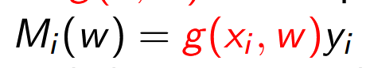
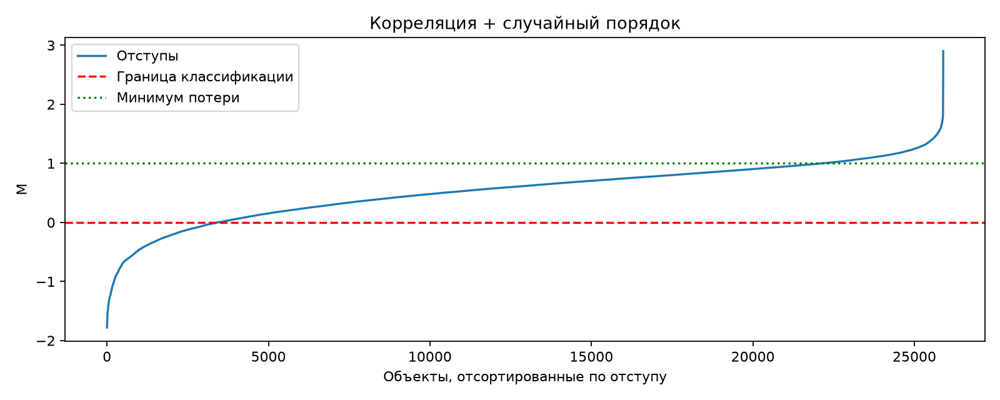
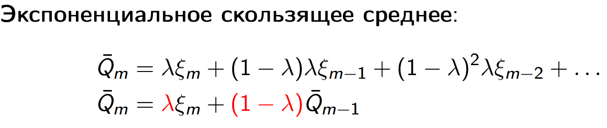
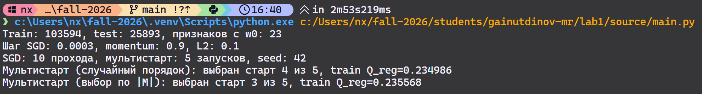
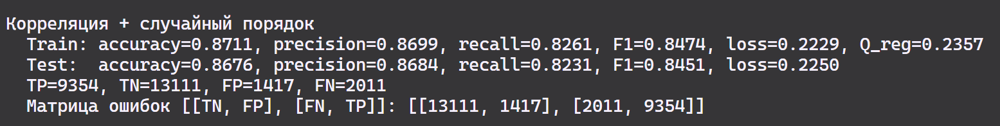
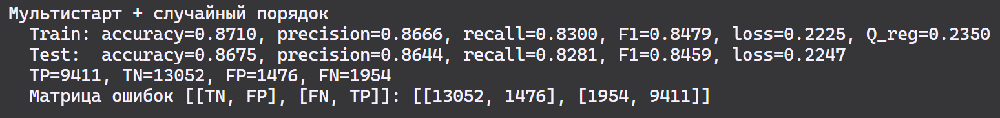
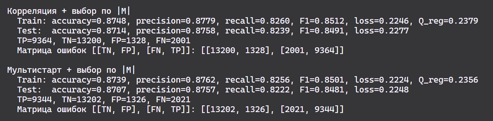
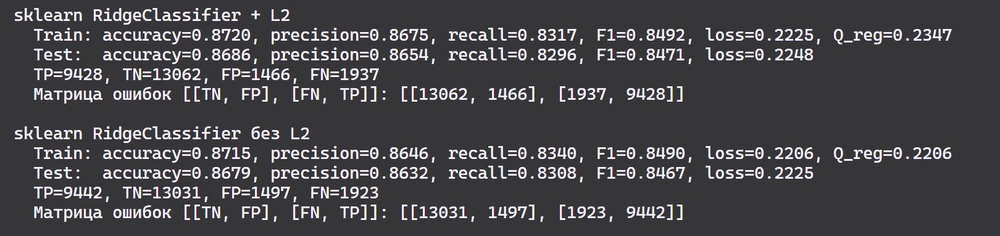

# Отчет по лабораторной работа №1. Линейная классификация

Задача:

В рамках лабораторной работы предстоит реализовать линейный классификатор. И обучить его методом стохастического градиентного спуска с инерцией с L2 регуляризацией и квадратичной функцией потерь.


## 1. Выбрать датасет для классификации, например на [kaggle](https://www.kaggle.com/datasets?&tags=13304-Clustering);
В рамках данного задания был выбран датасет:

https://www.kaggle.com/datasets/teejmahal20/airline-passenger-satisfaction


В рамках которого нам предстоит определить по разнообразным признакам, будет ли удовлетворен пассажир поездкой или нет:

Объект - пассажир
Классы - удовлетворен/ нейтрально или неудовлетворен полетом

Цель - предсказать класс удовлетворения полетом (satisfied/ neutral or dissatisfied) на основе признаков пассажира.

## 2. Реализовать вычисление отступа объекта (визуализировать, проанализировать);

Так как у нас бинарная классификация, то воспользуемся следующей формулой, 

И используя пакет numpy мы можем посчитать их сразу для всех объектов в определенной выборке.

```py
def calculate_margin(X, w, y):
    return (X @ w) * y
```

Для визуализации была написана функция plot_margin(), которая сначала упорядочивает объекты в порядке увеличения margin, а потом выводит график. По которому мы в дальнейшем можем анализировать хвосты и оценивать качество нашей модели.


## 3. Реализовать вычисление градиента функции потерь;
Для квадратичной функции потерь:


```py
def loss_function(margin, func_name="FLD"):
    # По заданию - квадратичная функция потерь - FLD
    return 0.5 * (1 - margin) ** 2
```
Градиент выражается аналитически через margin по цепному правилу:

```py
def loss_gradient(sample, weights, target):
    margin = calculate_margin(sample, weights, target)
    return ((margin - 1) * target) * sample
```
## 4. Реализовать рекуррентную оценку функционала качества;
Зачем оно нужно? - Вычисление функционала по всей выборке гораздо дольше, чем градиента по одному объекту x
Выведем математически:


В коде это реализовано, как:
```py
def update_quality(old_quality, current_loss):
    return FORGETTING_RATE * current_loss + (1 - FORGETTING_RATE) * old_quality
```

## 5. Реализовать метод стохастического градиентного спуска с инерцией;
Метод реализован функцией SGD_with_momentum()
Разберем основной его цикл, считая, что веса и остальные необходимые переменные уже как-то инициализированны:
```py
for index in presentation_order:
            sample = X[index] # НА ВХОД ПОДАЕТСЯ ОБЪЕКТ x
            target = y[index] # Получем соотвественно правильный таргет y

            margin = calculate_margin(sample, weights, target) # Для текущей конфигурации весов вычисляем отступ для текущего объекта x
            current_loss = loss_function(margin) # Вычисляем фунцию потерь, которая еще понадобится нам для оценки функционала
            gradient = loss_gradient(sample, weights, target) # Вычисляем градиент

            # L2 регуляризация - 6 пункт (будет дальше разобрано)
            l2_penalty, l2_gradient = l2_penalty_and_gradient(
                weights,
                regularization,
            )
            current_loss += l2_penalty # Если есть регуляризация, то уже добавляется и лосс и градиент.
            gradient += l2_gradient  # 

            velocity = momentum * velocity + (1 - momentum) * gradient # Вектор скорости, показывающий скользящее среднее по 1/(1-momentum) объектам
            weights = weights - LEARNING_RATE * velocity # Обновление весов
            quality = update_quality(quality, current_loss) # Обновление средней Q
            quality_history.append(quality)
```

## 6. Реализовать L2 регуляризацию;

```py
def l2_penalty_and_gradient(weights, regularization):
    # regularization - коэфф регуляризации
    weights_regularized = weights.copy()
    weights_regularized[0] = (0)# Так как для w0 мы регуляризацию не делаем.

    penalty = regularization / 2 * np.sum(weights_regularized**2)
    gradient = regularization * weights_regularized
    return penalty, gradient
```

## 7. Реализовать скорейший градиентный спуск;
Скорейший градиентный спуск отличается от обычного тем, что на каждой итерации вычисляется оптимальный шаг h, который приводит к лучшей минимизации функции потерь.

Для квадратичной функции размер шага был выведен аналитически и равен он ||x|| ^ -2
```py
def optimal_step(sample):
    # Это работает только когда у нас квадратичная потеря - MSE
    squared_norm = sample @ sample
    if squared_norm == 0:
        return 0.0
    return 1.0 / squared_norm
```
## 8. Реализовать предъявление объектов мо модулю отступа;
```py
def get_presentation_indices(X, y, weights, presentation, rng=None):
    rng = np.random.default_rng(rng)
    if presentation == "random":
        return rng.permutation(len(X))

    if presentation == "margin":
        margins = calculate_margin(X, weights, y) # Вычисляем отсут объектов
        probabilities = 1 / (1 + np.abs(margins)) # Чем больше модуль, тем меньше вероятность выбора этого объекта
        probabilities /= probabilities.sum()
        # Выбор с возвращением
        return rng.choice(len(X), size=len(X), replace=True, p=probabilities)

    raise ValueError("presentation это или 'random' или 'margin'")
```

## 9. Обучить линейный классификатор на выбранном датасете;

### 9.1. Обучить с инициализацией весов через корреляцию;

### 9.2. Обучить со случайной инициализацией весов через мультистарт;

### 9.3. Обучить со случайным предъявлением и с п.8;

## 10. Оценить качество классификации;

| Метод | Accuracy | Precision | Recall | F1 | Loss |
|---|---:|---:|---:|---:|---:|
| Корреляция + случайный порядок | 0.8676 | 0.8684 | 0.8231 | 0.8451 | 0.2250 |
| Мультистарт + случайный порядок | 0.8675 | 0.8644 | 0.8281 | 0.8459 | 0.2247 |
| Корреляция + выбор по \|M\| | **0.8714** | **0.8758** | 0.8239 | **0.8491** | 0.2277 |
| Мультистарт + выбор по \|M\| | 0.8707 | 0.8757 | 0.8222 | 0.8481 | 0.2248 |


## 11. Сравнить лучшую реализацию с эталонной;
В качестве эталона использован `sklearn.linear_model.RidgeClassifier`. Все модели обучались на одной обучающей выборке и оценивались на одной тестовой. Под выбором по `|M|` здесь понимается вероятностное предъявление объектов, а не их сортировка.



| Метод | Accuracy | Precision | Recall | F1 | Квадратичная потеря |
|---|---:|---:|---:|---:|---:|
| Корреляция + случайный порядок | 0.8676 | 0.8684 | 0.8231 | 0.8451 | 0.2250 |
| Мультистарт + случайный порядок | 0.8675 | 0.8644 | 0.8281 | 0.8459 | 0.2247 |
| Корреляция + выбор по `|M|` | **0.8714** | **0.8758** | 0.8239 | **0.8491** | 0.2277 |
| Мультистарт + выбор по `|M|` | 0.8707 | 0.8757 | 0.8222 | 0.8481 | 0.2248 |
| `RidgeClassifier` с L2 | 0.8686 | 0.8654 | 0.8296 | 0.8471 | 0.2248 |
| `RidgeClassifier` без L2 | 0.8679 | 0.8632 | **0.8308** | 0.8467 | **0.2225** |

Наши варианты SGD показали качество, близкое к эталону. Лучший результат по accuracy и F1 дала корреляционная инициализация с вероятностным выбором по модулю отстступа: 0.8714 и 0.8491 против 0.8686 и 0.8471 у `RidgeClassifier` с L2. При этом её квадратичная потеря выше - 0.2277 против 0.2248. 

Мультистарт не дал заметного преимущества перед корреляционной инициализацией. Различия между моделями невелики, поэтому по одному разбиению и одному значению генератора случайных чисел нельзя утверждать, что какой-либо из наших вариантов устойчиво превосходит эталон.

## Вывод:
В рамках текущей работы мы реализовали линейный классификатор, который по метрикам не сильно уступает эталонной реализации sklearn 


