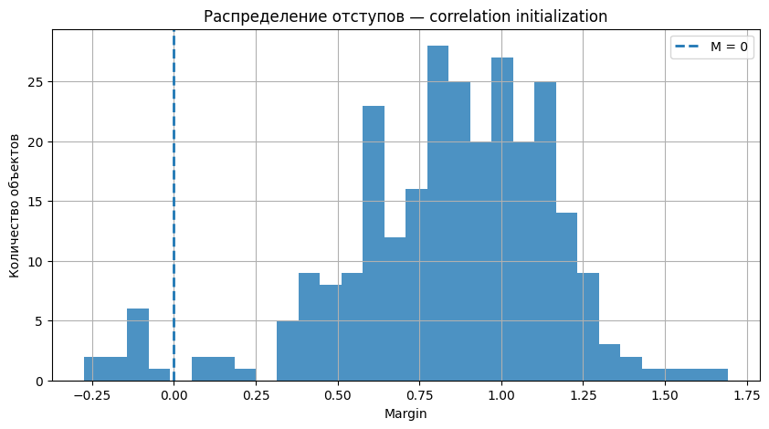
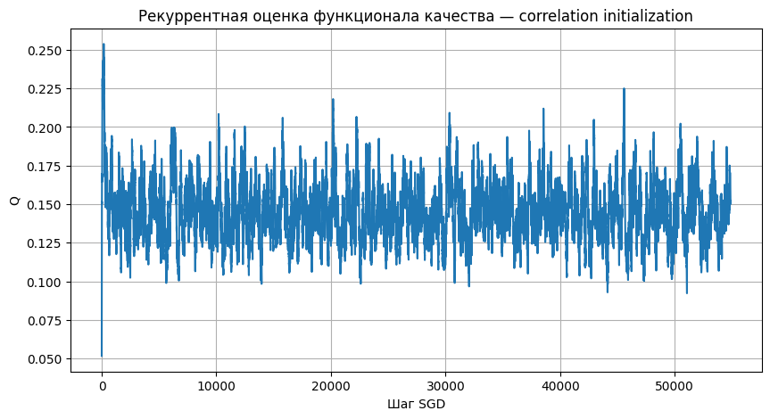
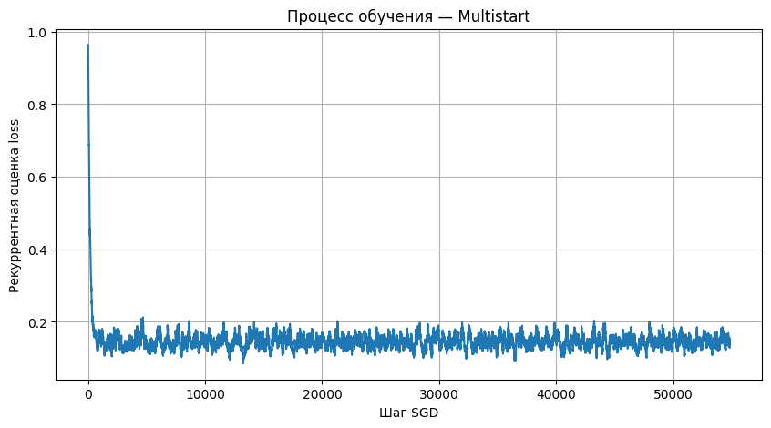
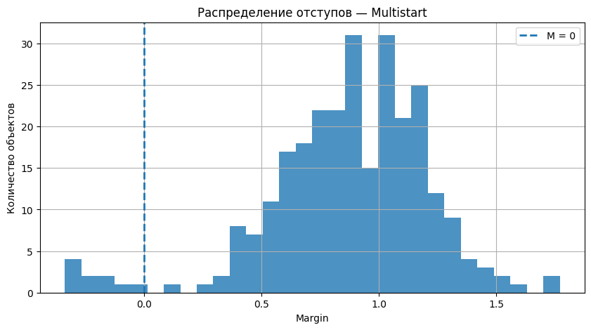
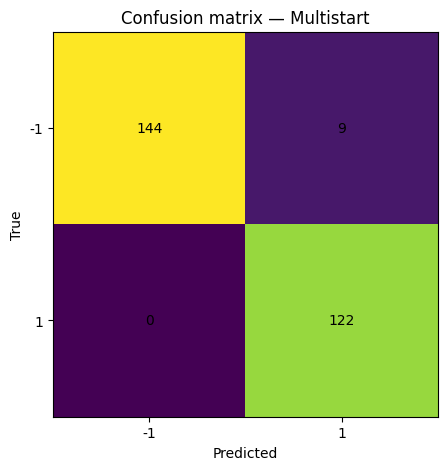
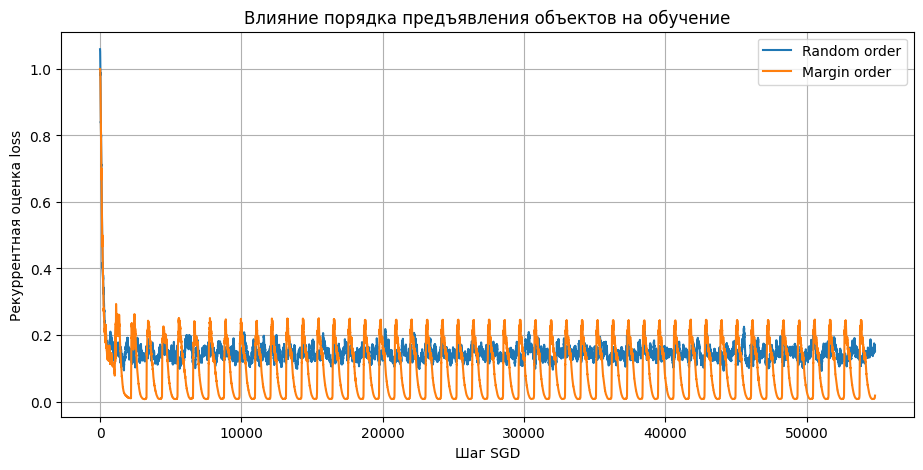
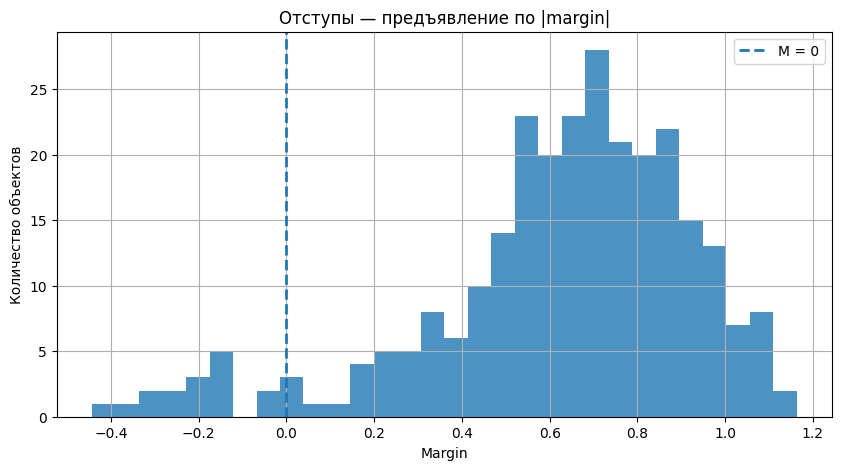
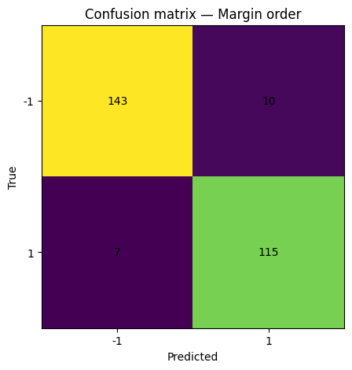
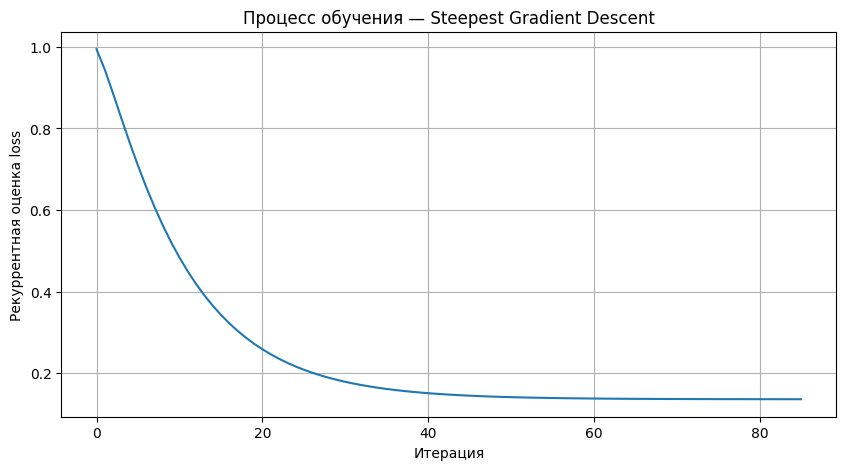
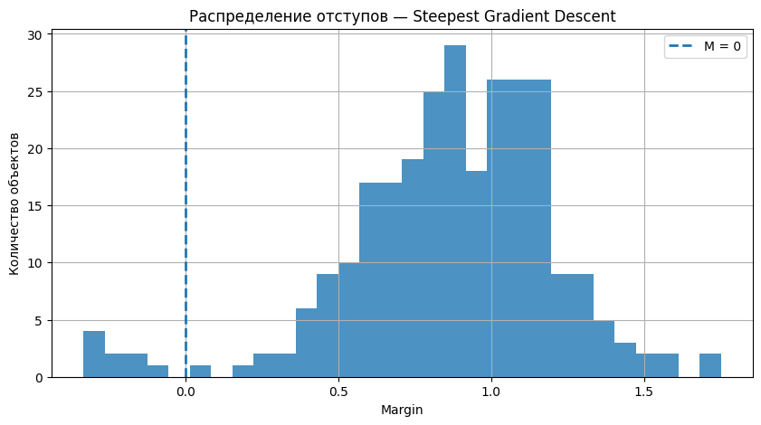

# Лабораторная работа №1. Линейная классификация

**Цель работы:** реализовать линейный классификатор с квадратичной функцией потерь, стохастическим градиентным спуском с инерцией и L2-регуляризацией; исследовать инициализацию весов, порядок предъявления объектов и скорейший градиентный спуск; сравнить результат с эталонной реализацией.

Исходный код и результаты экспериментов находятся в [ноутбуке linearclassifier.ipynb](source/linearclassifier.ipynb). Численные результаты и графики в отчете взяты из сохраненных выводов ноутбука. 

## 1. Выбранный датасет и подготовка данных

### 1.1. Описание датасета

Для работы выбран **Banknote Authentication** из UCI Machine Learning Repository. Задача состоит в классификации образцов банкнот по числовым характеристикам их изображений. Данные получены из изображений подлинных и поддельных образцов. Описание происхождения данных и признаков приведено на [странице датасета UCI](https://archive.ics.uci.edu/dataset/267/banknote%2Bauthentication).

| Столбец | Назначение | Содержание |
| --- | --- | --- |
| `variance` | Признак | Дисперсия вейвлет-преобразованного изображения |
| `skewness` | Признак | Асимметрия вейвлет-преобразованного изображения |
| `curtosis` | Признак | Эксцесс вейвлет-преобразованного изображения; название сохранено как в датасете |
| `entropy` | Признак | Энтропия изображения |
| `class` | Целевая переменная | Метка одного из двух классов: `0` или `1` |

Основные характеристики признаков, полученные в ноутбуке:

| Признак | Среднее | Стандартное отклонение | Минимум | Максимум |
| --- | ---: | ---: | ---: | ---: |
| `variance` | 0.433735 | 2.842763 | -7.042100 | 6.824800 |
| `skewness` | 1.922353 | 5.869047 | -13.773100 | 12.951600 |
| `curtosis` | 1.397627 | 4.310030 | -5.286100 | 17.927400 |
| `entropy` | -1.191657 | 2.101013 | -8.548200 | 2.449500 |

Распределение классов:

| Исходная метка | Метка для классификатора | Число объектов | Доля |
| --- | ---: | ---: | ---: |
| `0` | -1 | 762 | 55.54% |
| `1` | +1 | 610 | 44.46% |
| **Всего** | | **1372** | **100%** |

Оба класса представлены достаточно широко, хотя класс `0` встречается немного чаще. Для оценки использованы accuracy, precision, recall и F1, чтобы учитывать не только общую долю правильных ответов, но и ошибки положительного класса.

### 1.2. Разбиение и стандартизация

Метки преобразованы из `{0, 1}` в `{-1, +1}`. Данные разделены с помощью `train_test_split(test_size=0.2, random_state=42, stratify=y)`:

| Выборка | Число объектов | Класс -1 | Класс +1 |
| --- | ---: | ---: | ---: |
| Обучающая | 1097 | 609 | 488 |
| Тестовая | 275 | 153 | 122 |

Стратификация сохраняет соотношение классов. Числа объектов каждого класса в разбиении дополнительно проверены по локальному файлу с теми же параметрами, что в ноутбуке.

Признаки имеют разные диапазоны и стандартные отклонения, поэтому перед обучением применен `StandardScaler`:

$$
x'_{ij}=\frac{x_{ij}-\mu_j}{\sigma_j}.
$$

Средние и стандартные отклонения вычисляются только по обучающей выборке: `fit_transform(X_train)`. Тестовые данные преобразуются через `transform(X_test)` с уже найденными параметрами. Таким образом, при стандартизации информация из тестовой выборки не используется. После преобразования средние обучающих признаков близки к нулю, а стандартные отклонения равны единице.

## 2. Условия экспериментов и метрики

Все модели обучаются и проверяются на одном разбиении и одинаково стандартизированных данных.

| Вариант | Оптимизатор | Инициализация | Порядок объектов | `random_state` | Эпохи / максимум итераций |
| --- | --- | --- | --- | --- | ---: |
| Correlation init | SGD + Momentum | Корреляционная | Случайный | 42 | 50 |
| Multistart | SGD + Momentum | Случайная, 10 запусков | Случайный | 0–9 | 50 на запуск |
| Random order | SGD + Momentum | Случайная | Случайный | 42 | 50 |
| Margin order | SGD + Momentum | Случайная | По возрастанию модуля отступа | 42 | 50 |
| Steepest | Скорейший градиентный спуск | Случайная | Полная выборка на каждой итерации | 42 | 100 |

Для всех SGD-вариантов: `learning_rate=0.001`, `beta=0.9`, `l2=0.001`, `alpha=0.01`. Для скорейшего спуска: `l2=0.001`, `alpha=0.1`. В этом режиме `alpha` также управляет только графиком сглаженной оценки.

Метрики вычислены на **275 тестовых объектах**. Положительным считается класс `+1`:

| Метрика | Формула | Что оценивает |
| --- | --- | --- |
| Accuracy | $(TP+TN)/(TP+TN+FP+FN)$ | Долю правильных ответов |
| Precision | $TP/(TP+FP)$ | Долю правильных ответов среди предсказаний класса +1 |
| Recall | $TP/(TP+FN)$ | Долю найденных объектов класса +1 |
| F1 | $2\cdot Precision\cdot Recall/(Precision+Recall)$ | Гармоническое среднее precision и recall |

## 3. Результаты экспериментов и анализ

### 3.1. Корреляционная инициализация

Начальные корреляции признаков с целевой переменной:

| Признак | Корреляция с меткой |
| --- | ---: |
| `variance` | -0.719385 |
| `skewness` | -0.443174 |
| `curtosis` | 0.151473 |
| `entropy` | -0.015404 |

Наибольшая по модулю корреляция наблюдается у `variance`, затем у `skewness`. Корреляция `entropy` с меткой близка к нулю. Корреляционная инициализация задает начальное направление весов с учетом связи каждого признака с классом, но не учитывает совместное влияние признаков, которое определяется при обучении.

Получены веса `[-0.80136977, -0.84289847, -0.89550920, -0.00633106]` и смещение `-0.1566601084`. Точность составляет **0.960000**, F1 — **0.956522**.

**Рисунок 1 — Отступы на тестовой выборке при корреляционной инициализации.**

У 264 объектов отступ положителен, у 11 — отрицателен. Средний отступ равен **0.831517**, минимальный — **-0.274058**, максимальный — **1.691817**. Большинство объектов классифицируется правильно, однако наличие отрицательных отступов показывает, что найденная граница не разделяет тестовые классы полностью.

**Рисунок 2 — Изменение рекуррентной оценки качества при корреляционной инициализации.**

После начального участка оценка колеблется преимущественно около 0.14–0.15. Колебания согласуются со стохастическим характером обновлений и постоянным шагом обучения. Поскольку $Q_t$ строится по отдельным объектам, от такой кривой не требуется монотонное уменьшение на каждом шаге.

### 3.2. Случайная инициализация с мультистартом

Для каждого запуска вычислен регуляризованный обучающий риск:

| `seed` | `train_loss` |
| ---: | ---: |
| 0 | 0.140722 |
| 1 | 0.139607 |
| 2 | 0.152369 |
| 3 | 0.143345 |
| 4 | 0.142710 |
| 5 | 0.158609 |
| **6** | **0.136668** |
| 7 | 0.138360 |
| 8 | 0.138556 |
| 9 | 0.139020 |

Лучшим оказался запуск с **`seed=6`**: `train_loss=0.13666805035516125`. Его веса равны `[-0.82432497, -0.89895815, -0.85479912, -0.00213316]`, смещение — `-0.0984913726`.

Разброс итогового риска от 0.136668 до 0.158609 показывает зависимость конечного состояния SGD от случайного запуска. При изменении `seed` меняются и начальные веса, и перестановки обучающих объектов, поэтому этот эксперимент оценивает их совместное влияние. Функционал является выпуклым квадратичным: преимущество мультистарта здесь связано с конечным числом стохастических обновлений при постоянном шаге, а не с поиском среди разных локальных минимумов.

**Рисунок 3 — Рекуррентная оценка качества для лучшего запуска мультистарта.**

В начале оценка потерь близка к единице, затем быстро уменьшается и колеблется около 0.14. По сравнению с корреляционной инициализацией случайный старт начинается с более высокой оценки, но лучший из десяти запусков дает более высокое итоговое качество классификации.

**Рисунок 4 — Отступы на тестовой выборке для лучшего запуска мультистарта.**

Средний отступ равен **0.872986**, отрицательных отступов **9**. По сравнению с корреляционной инициализацией число ошибок уменьшилось с 11 до 9, а accuracy выросла с **96.00% до 96.73%**. Минимальный отступ стал более отрицательным, поэтому улучшение общей точности не означает улучшения отступа каждого отдельного объекта.

**Рисунок 5 — Матрица ошибок для лучшего запуска мультистарта. Строки — истинный класс, столбцы — предсказанный.**

| Истинный класс / предсказанный класс | -1 | +1 |
| --- | ---: | ---: |
| -1 | 144 | 9 |
| +1 | 0 | 122 |

Все 122 объекта положительного класса распознаны правильно, поэтому **recall=1.0**. Девять объектов класса `-1` ошибочно отнесены к `+1`, поэтому **precision=122/(122+9)=0.931298**. Всего верно классифицировано **266 из 275 объектов**.

### 3.3. Влияние порядка предъявления объектов

Сравниваются модели с одинаковой случайной инициализацией и гиперпараметрами; меняется порядок обработки объектов.

| Порядок | Accuracy | Precision | Recall | F1 | Ошибки |
| --- | ---: | ---: | ---: | ---: | ---: |
| Случайный | 0.960000 | 0.923664 | 0.991803 | 0.956522 | 11 |
| По возрастанию модуля отступа | 0.938182 | 0.920000 | 0.942623 | 0.931174 | 17 |

**Рисунок 6 — Сравнение процесса обучения при двух порядках предъявления.**

Для случайного порядка наблюдаются нерегулярные колебания, а для сортировки по модулю отступа — повторяющиеся волны в пределах эпох. Это согласуется с тем, что близкие по отступу объекты обрабатываются последовательно: в начале эпохи идут объекты около границы, затем объекты с большим модулем отступа. Состав последних наблюдений меняется систематически, что отражается в сглаженной оценке $Q_t$.

Низкие значения оранжевой кривой к концу эпохи не свидетельствуют о лучшем качестве всей модели: тестовая потеря при сортировке составляет **0.235412**, а при случайном порядке — **0.140219**. В данном эксперименте сортировка ухудшила accuracy и увеличила число ошибок на 6. Возможное объяснение — систематический порядок обновлений при постоянном шаге и инерции.

**Рисунок 7 — Отступы на тестовой выборке при сортировке по модулю отступа.**

Средний отступ уменьшился с **0.831517** до **0.624823**, а минимальный составил **-0.442917**. В сочетании с ростом числа отрицательных отступов до 17 это подтверждает ухудшение найденной разделяющей границы на тестовой выборке.

**Рисунок 8 — Матрица ошибок при сортировке по модулю отступа.**

Матрица равна `[[143, 10], [7, 115]]`: модель ошиблась на 10 объектах класса `-1` и пропустила 7 объектов класса `+1`. При случайном порядке матрица равна `[[143, 10], [1, 121]]`. Таким образом, в этом сравнении увеличение числа ошибок связано с ухудшением распознавания положительного класса.

### 3.4. Скорейший градиентный спуск

После обучения получены веса `[-0.81088562, -0.91905498, -0.88086440, 0.00221157]` и смещение `-0.1103008204`.

**Рисунок 9 — Рекуррентная оценка качества при скорейшем градиентном спуске.**

Оценка плавно уменьшается примерно с 1.0 до 0.14 и выходит на плато. В этом режиме на каждой итерации используется вся обучающая выборка, поэтому отсутствуют колебания, вызванные предъявлением отдельных объектов. 

**Рисунок 10 — Отступы на тестовой выборке при скорейшем градиентном спуске.**

Средний отступ равен **0.868621**, число ошибок — **9**. Accuracy и F1 совпали с лучшим запуском мультистарта, но тестовая квадратичная потеря оказалась немного ниже: **0.133200** против **0.134267**. Это показывает, что одинаковые метрики по меткам могут сопровождаться разными значениями линейных оценок.

### 3.5. Общая таблица результатов

| Модель | Accuracy | Precision | Recall | F1 | `test_loss` без L2 | Ошибки из 275 |
| --- | ---: | ---: | ---: | ---: | ---: | ---: |
| Correlation init | 0.960000 | 0.923664 | 0.991803 | 0.956522 | 0.140219 | 11 |
| **Multistart** | **0.967273** | **0.931298** | **1.000000** | **0.964427** | **0.134267** | **9** |
| Random order | 0.960000 | 0.923664 | 0.991803 | 0.956522 | 0.140219 | 11 |
| Margin order | 0.938182 | 0.920000 | 0.942623 | 0.931174 | 0.235412 | 17 |
| **Steepest** | **0.967273** | **0.931298** | **1.000000** | **0.964427** | **0.133200** | **9** |

Итоговые характеристики отступов:

| Модель | Средний отступ | Минимальный отступ | Максимальный отступ | Отрицательные отступы |
| --- | ---: | ---: | ---: | ---: |
| Correlation init | 0.831517 | -0.274058 | 1.691817 | 11 |
| Multistart | 0.872986 | -0.337189 | 1.770027 | 9 |
| Random order | 0.831517 | -0.274058 | 1.691817 | 11 |
| Margin order | 0.624823 | -0.442917 | 1.163154 | 17 |
| Steepest | 0.868621 | -0.333540 | 1.751515 | 9 |

По accuracy и F1 лучшие значения разделяют **Multistart** и **Steepest**. По тестовой квадратичной потере лучший результат у **Steepest**. В ноутбуке для сравнения с эталоном выбран **Multistart**, поскольку `idxmax()` по F1 возвращает первый из вариантов с одинаковым максимальным значением.

Корреляционная и случайная инициализации при `seed=42` дали одинаковые итоговые метрики и характеристики отступов в сохраненных выводах. Поэтому результаты не показывают преимущества корреляционной инициализации по конечной точности при этих настройках, хотя начальные участки обучения различаются.

## 4. Сравнение с эталонной реализацией

В качестве эталона использован **`sklearn.linear_model.RidgeClassifier(alpha=0.001)`**. Он также решает задачу классификации через квадратичную потерю с L2-регуляризацией и выбирает класс по знаку линейной оценки, что делает его подходящим для сравнения с реализованной моделью. 
Эталон обучен на той же стандартизированной обучающей выборке и проверен на той же тестовой выборке.

| Модель | Accuracy | Precision | Recall | F1 |
| --- | ---: | ---: | ---: | ---: |
| Собственная реализация: Multistart | 0.967273 | 0.931298 | 1.000000 | 0.964427 |
| RidgeClassifier | 0.967273 | 0.931298 | 1.000000 | 0.964427 |

В ноутбуке выполнена проверка `np.array_equal(our_predictions, reference_predictions)`, которая вернула **`True`**. Следовательно, совпали не только агрегированные метрики, но и предсказания класса для всех 275 тестовых объектов. Матрица ошибок обеих моделей равна `[[144, 9], [0, 122]]`.

## 5. Ограничения эксперимента

Результаты получены на одном разбиении данных. Выбор лучшего запуска внутри мультистарта выполнен по обучающему риску, однако выбор лучшего варианта среди пяти моделей в ноутбуке производится по тестовому F1. Для независимой оценки после такого выбора следовало бы использовать отдельную валидационную выборку или кросс-валидацию, оставив тест для финальной проверки.

Влияние L2-регуляризации отдельно не измерялось: все сравниваемые собственные модели обучены с `l2=0.001`. Поэтому по этим результатам нельзя количественно оценить, насколько регуляризация изменила переобучение. Время обучения также не измерялось; сравнение графиков по числу шагов не дает прямого сравнения скорости, поскольку шаг SGD использует один объект, а шаг скорейшего спуска — всю выборку.

## 6. Выводы

1. Реализован класс `LinearClassifier`, включающий вычисление отступа, квадратичной потери и ее градиента, рекуррентную оценку качества, SGD с инерцией, L2-регуляризацию, два способа инициализации, два порядка предъявления объектов и скорейший градиентный спуск.

2. На Banknote Authentication линейная модель достигла **96.73% accuracy** и **0.964427 F1**. Лучший SGD-вариант верно классифицировал **266 из 275 объектов** и распознал все объекты положительного класса. Это показывает, что выбранные признаки позволяют получить высокое качество с линейной границей, хотя 9 тестовых ошибок сохраняются.

3. Мультистарт дал лучший результат среди исследованных SGD-вариантов: выбран запуск с `seed=6` по минимальному обучающему риску. По сравнению с одиночным случайным запуском при `seed=42` число тестовых ошибок уменьшилось с 11 до 9. Корреляционная инициализация при выбранном числе эпох не повысила конечную точность относительно этого одиночного запуска.

4. Сортировка по возрастанию модуля отступа при данных настройках ухудшила результат: число ошибок выросло с 11 до 17, а F1 снизилась с 0.956522 до 0.931174. Волнообразная рекуррентная оценка при этом отражает порядок объектов; оценивать итоговое качество только по ее минимумам нельзя.

5. Скорейший спуск обеспечил плавное уменьшение сглаженного полного риска и получил те же accuracy и F1, что мультистарт, при меньшей тестовой квадратичной потере. Следовательно, по метрикам классификации эти два варианта равны на выбранном тесте, а по квадратичной потере преимущество имеет скорейший спуск.

6. Предсказания лучшего SGD-варианта полностью совпали с `RidgeClassifier` на тестовой выборке. Это подтверждает сопоставимое качество собственной реализации и библиотечного эталона в данном эксперименте. Для более строгого сравнения необходимо согласовать масштаб регуляризации и выбирать настройки на отдельной валидации.
