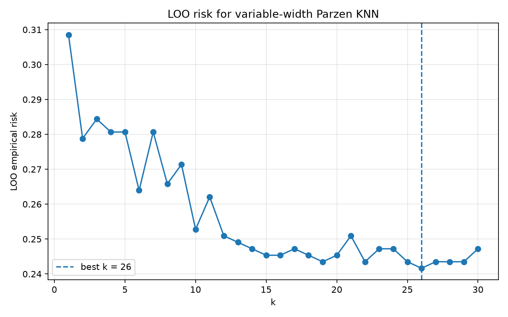
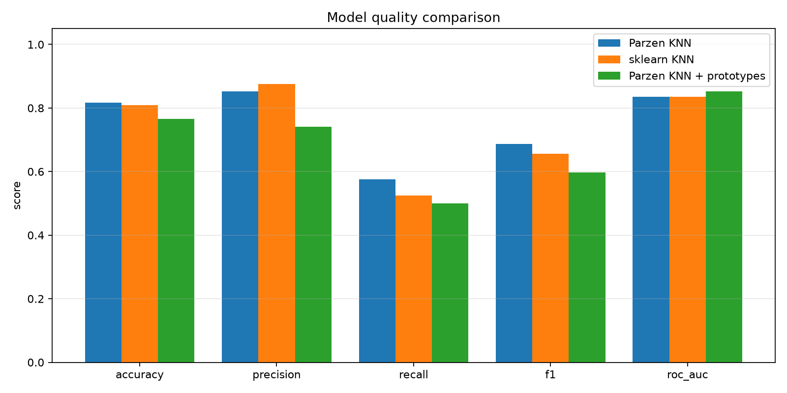
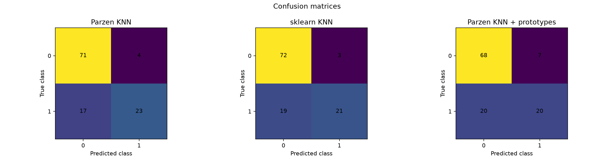
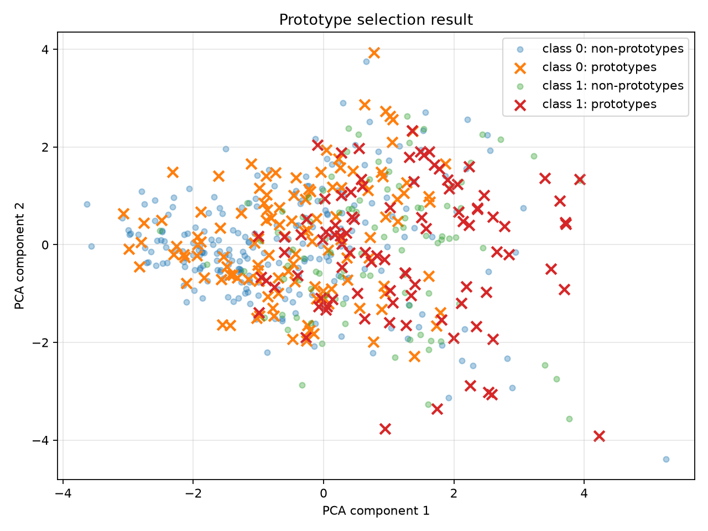

# Лабораторная работа №2. Метрическая классификация

## Цель работы

Реализовать алгоритм метрической классификации KNN с методом окна Парзена переменной ширины, подобрать параметр `k` методом скользящего контроля Leave-One-Out, сравнить собственную реализацию с `sklearn.neighbors.KNeighborsClassifier`, реализовать жадный алгоритм отбора эталонов и исследовать влияние сокращения обучающей выборки на качество классификации.

## Датасет

Для экспериментов используется датасет [Pima Indians Diabetes](https://www.kaggle.com/datasets/kumargh/pimaindiansdiabetescsv).

Датасет содержит 768 объектов и 8 числовых признаков:

| Признак | Описание |
|---|---|
| `preg` | количество беременностей |
| `plas` | концентрация глюкозы в плазме |
| `pres` | диастолическое артериальное давление |
| `skin` | толщина кожной складки трицепса |
| `test` | уровень инсулина |
| `mass` | индекс массы тела |
| `pedi` | диабетическая наследственная функция |
| `age` | возраст |
| `class` | целевой класс: `0` — отрицательный результат, `1` — положительный |

Распределение классов в исходном датасете:

- класс `0` — 500 объектов;
- класс `1` — 268 объектов.

В признаках `plas`, `pres`, `skin`, `test` и `mass` нулевые значения интерпретируются как пропуски. Они заменяются медианами, рассчитанными только по обучающей выборке.

После этого признаки стандартизируются с помощью z-score:

$$
z = \frac{x - \mu}{\sigma}
$$

где `μ` и `σ` вычисляются только на обучающей выборке.

Данные разбиваются на обучающую, валидационную и тестовую части:

- train — 538 объектов;
- validation — 115 объектов;
- test — 115 объектов.

## Евклидова метрика

Расстояние между объектами вычисляется с помощью евклидовой метрики:

$$
\rho(x, y) =
\sqrt{
\sum_{j=1}^{d}
(x_j-y_j)^2
}
$$

Для векторизованного вычисления попарных расстояний используется равенство:

$$
\|x-y\|^2 =
\|x\|^2 +
\|y\|^2 -
2x^Ty
$$

Это позволяет вычислять матрицу расстояний между объектами без явных вложенных циклов.

## KNN с окном Парзена переменной ширины

В собственной реализации KNN параметр `k` используется для определения локальной ширины окна Парзена.

Для классифицируемого объекта ширина окна определяется расстоянием до `(k + 1)`-го ближайшего соседа:

$$
h(x) =
\rho
\left(
x,
x^{(k+1)}
\right)
$$

После этого расстояния до обучающих объектов нормируются:

$$
r_i =
\frac{
\rho(x,x_i)
}{
h(x)
}
$$

В качестве ядра используется гауссово ядро с ограничением по ширине окна:

$$
K(r) =
\begin{cases}
\exp\left(-\frac{r^2}{2}\right), & r \le 1, \\
0, & r > 1.
\end{cases}
$$

Таким образом, близкие объекты получают больший вес, а объекты за пределами окна не участвуют в голосовании.

Для каждого класса вычисляется суммарный вес его объектов:

$$
\Gamma_y(x)
=
\sum_i
[y_i=y]
K
\left(
\frac{
\rho(x,x_i)
}{
h(x)
}
\right)
$$

Предсказанием является класс с максимальным суммарным весом:

$$
a(x)
=
\arg\max_y
\Gamma_y(x)
$$

Для получения нормированных оценок классов используется:

$$
P(y \mid x)
=
\frac{
\Gamma_y(x)
}{
\sum_c \Gamma_c(x)
}
$$

## Подбор параметра k методом LOO

Параметр `k` подбирается методом Leave-One-Out.

Для каждого объекта обучающей выборки этот объект временно исключается из множества соседей, после чего его класс предсказывается по оставшимся объектам.

LOO-риск вычисляется как:

$$
LOO(k)
=
\frac{1}{L}
\sum_{i=1}^{L}
\left[
a
\left(
x_i;
X^L \setminus \{x_i\},
k
\right)
\ne y_i
\right]
$$

Оптимальное значение параметра выбирается по минимальному эмпирическому риску:

$$
k^*
=
\arg\min_k
LOO(k)
$$

Для значений `k` от 1 до 30 минимальный риск был получен при:

$$
k^* = 26
$$

$$
LOO(26) \approx 0.241636
$$

### График LOO-риска

По графику видно общее снижение эмпирического риска при увеличении `k`. Минимальное значение достигается при `k = 26`, поэтому это значение используется далее для собственной реализации KNN и для эталонной реализации `sklearn`.

## Сравнение с sklearn KNN

Для сравнения используется `sklearn.neighbors.KNeighborsClassifier` с:

- `n_neighbors = 26`;
- евклидовой метрикой;
- равномерным голосованием соседей.

Результаты на тестовой выборке:

| Модель | Accuracy | Precision | Recall | F1 | ROC-AUC |
|---|---:|---:|---:|---:|---:|
| Parzen KNN | 0.8174 | 0.8519 | 0.5750 | 0.6866 | 0.8357 |
| sklearn KNN | 0.8087 | 0.8750 | 0.5250 | 0.6563 | 0.8350 |
| Parzen KNN + prototypes | 0.7652 | 0.7407 | 0.5000 | 0.5970 | 0.8520 |

### Сравнение метрик

Собственная реализация Parzen KNN показала немного более высокие `Accuracy`, `Recall` и `F1`, чем эталонный KNN из sklearn. Значения ROC-AUC для двух моделей практически совпадают.

## Матрицы ошибок

Для моделей были получены следующие confusion matrix:

### Parzen KNN

$$
\begin{bmatrix}
71 & 4 \\
17 & 23
\end{bmatrix}
$$

### sklearn KNN

$$
\begin{bmatrix}
72 & 3 \\
19 & 21
\end{bmatrix}
$$

### Parzen KNN с эталонами

$$
\begin{bmatrix}
68 & 7 \\
20 & 20
\end{bmatrix}
$$

Визуализация матриц ошибок:

Собственный Parzen KNN правильно классифицировал 71 объект класса `0` и 23 объекта класса `1`. После отбора эталонов число истинно положительных предсказаний уменьшилось до 20, а количество ошибок класса `0` увеличилось.

## Отбор эталонов

Для уменьшения количества объектов, используемых KNN при классификации, реализован жадный алгоритм отбора эталонов.

Изначально множество эталонов совпадает со всей обучающей выборкой:

$$
\Omega = X^L
$$

На каждой итерации для каждого активного эталона проверяется, как изменится LOO-ошибка 1NN после его удаления.

Лучший кандидат выбирается как:

$$
x^*
=
\arg\min_{x \in \Omega}
LOO
\left(
\Omega \setminus \{x\}
\right)
$$

Если удаление не ухудшает текущую ошибку сильнее заданного допуска, эталон удаляется:

$$
\Omega
\leftarrow
\Omega \setminus \{x^*\}
$$

В реализации также ограничивается минимальное число эталонов каждого класса, чтобы один из классов не был полностью удалён.

После отбора количество объектов уменьшилось:

- до отбора — 538;
- после отбора — 216;
- сокращение — 59.85%.

Распределение оставшихся эталонов:

| Класс | Количество |
|---|---:|
| 0 | 122 |
| 1 | 94 |

## Визуализация отбора эталонов

Для отображения многомерной обучающей выборки используется PCA-проекция в двумерное пространство. PCA применяется только для визуализации и не участвует в классификации или отборе эталонов.

Крестами отмечены объекты, оставшиеся эталонами, а полупрозрачными точками — удалённые объекты.

## Сравнение KNN с эталонами и без эталонов

После отбора эталонов Parzen KNN обучается только на сокращённом множестве:

$$
\Omega \subset X^L
$$

При сокращении количества объектов на 59.85% качество по `Accuracy`, `Recall` и `F1` уменьшилось:

| Метрика | Без отбора | С эталонами |
|---|---:|---:|
| Accuracy | 0.8174 | 0.7652 |
| Precision | 0.8519 | 0.7407 |
| Recall | 0.5750 | 0.5000 |
| F1 | 0.6866 | 0.5970 |
| ROC-AUC | 0.8357 | 0.8520 |

Снижение качества связано с тем, что жадный алгоритм отбора эталонов оптимизирует LOO-риск для 1NN, тогда как итоговая модель использует Parzen KNN с `k = 26`. После удаления большого количества объектов также изменяется локальная структура выборки и увеличивается расстояние до `(k + 1)`-го соседа, которое определяет ширину окна Парзена.

При этом ROC-AUC после отбора эталонов увеличился с `0.8357` до `0.8520`. Это показывает, что ранжирование объектов по оценке положительного класса сохранилось хорошо, несмотря на снижение качества классификации при выборе класса через максимальный score.

## Итог

В ходе лабораторной работы:

1. реализован KNN с окном Парзена переменной ширины и гауссовым ядром;
2. реализован подбор параметра `k` методом Leave-One-Out;
3. оптимальным значением получено `k = 26`;
4. собственная реализация сравнена с `sklearn KNeighborsClassifier`;
5. реализован жадный алгоритм отбора эталонов;
6. число объектов обучающей выборки сокращено с 538 до 216;
7. построены графики LOO-риска, метрик качества, confusion matrix и PCA-визуализация эталонов;
8. исследовано изменение качества KNN после отбора эталонов.

Собственный Parzen KNN показал качество, сопоставимое с эталонной реализацией sklearn и немного превзошёл её по Accuracy и F1 на тестовой выборке. Отбор эталонов существенно уменьшил объём опорной выборки, однако при текущих параметрах привёл к снижению Accuracy и F1, что демонстрирует компромисс между компактностью множества эталонов и качеством классификации.
