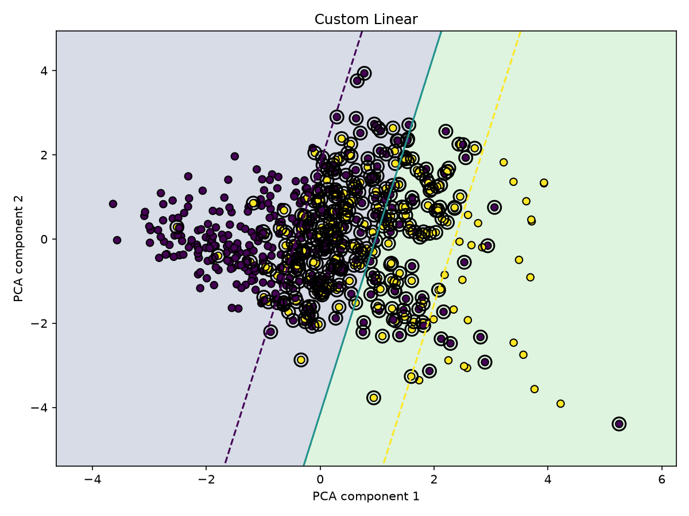
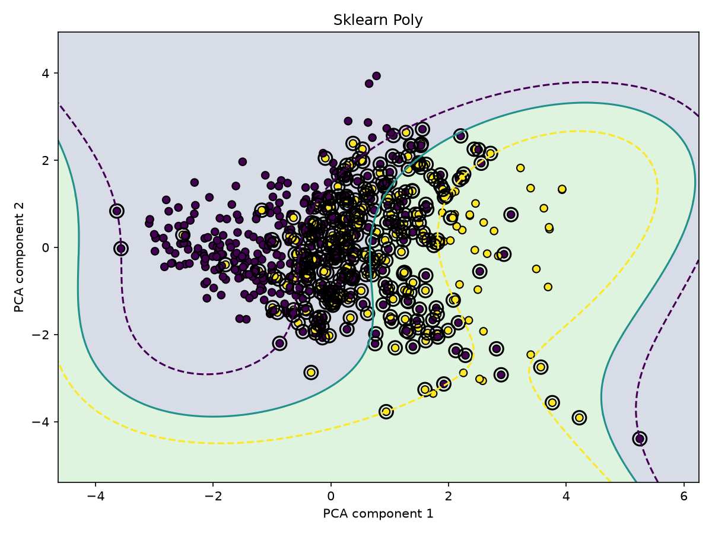
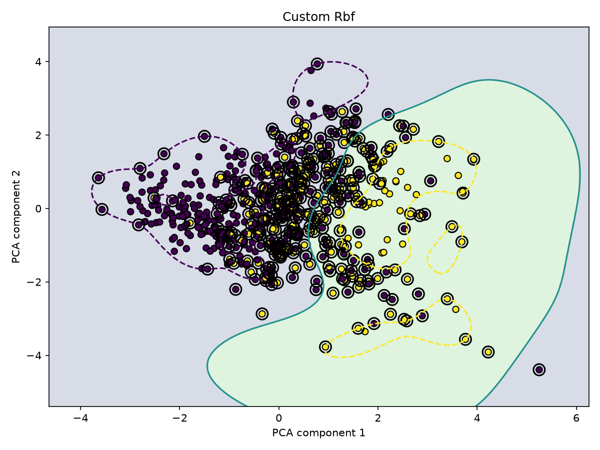
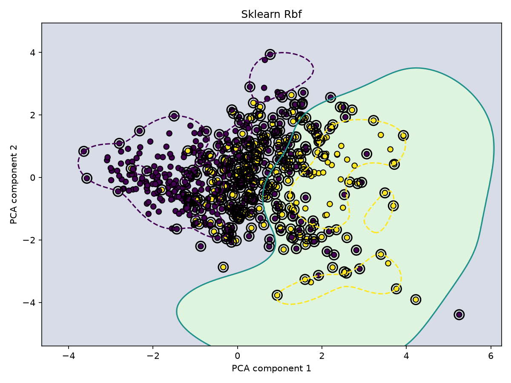

# Лабораторная работа №3. SVM

## Цель работы

Реализовать метод опорных векторов SVM для бинарной классификации через решение двойственной задачи, добавить поддержку линейного, полиномиального и RBF-ядер, визуализировать разделяющие поверхности и сравнить собственную реализацию с эталонной `sklearn.svm.SVC`.

## Датасет

Для экспериментов используется датасет [Pima Indians Diabetes](https://www.kaggle.com/datasets/kumargh/pimaindiansdiabetescsv).

Датасет содержит 768 объектов и 8 числовых признаков:

| Признак | Описание |
|---|---|
| `preg` | количество беременностей |
| `plas` | концентрация глюкозы в плазме |
| `pres` | диастолическое артериальное давление |
| `skin` | толщина кожной складки трицепса |
| `test` | уровень инсулина |
| `mass` | индекс массы тела |
| `pedi` | диабетическая наследственная функция |
| `age` | возраст |
| `class` | целевой класс: `0` — отрицательный результат, `1` — положительный |

Распределение классов:

- класс `0` — 500 объектов;
- класс `1` — 268 объектов.

В признаках `plas`, `pres`, `skin`, `test` и `mass` нулевые значения интерпретируются как пропуски:

| Признак | Количество нулей |
|---|---:|
| `plas` | 5 |
| `pres` | 35 |
| `skin` | 227 |
| `test` | 374 |
| `mass` | 11 |

Для устранения пропусков нулевые значения заменяются медианами, рассчитанными только по обучающей выборке.

После этого признаки стандартизируются с помощью z-score:

$$
z = \frac{x - \mu}{\sigma},
$$

где $\mu$ и $\sigma$ вычисляются только на обучающей выборке.

Данные разбиваются на обучающую, валидационную и тестовую части:

- train — 538 объектов;
- validation — 115 объектов;
- test — 115 объектов.

## Линейный SVM

Для бинарной классификации метки классов преобразуются в значения

$$
y_i \in \{-1, +1\}.
$$

Линейный классификатор задаётся решающей функцией

$$
f(x) = w^T x + b,
$$

а предсказание определяется знаком:

$$
a(x) = \operatorname{sign}(f(x)).
$$

SVM ищет разделяющую гиперплоскость с максимальным зазором между классами.

Для линейно неразделимой выборки используется soft-margin постановка:

$$
\frac{1}{2}\|w\|^2 + C\sum_{i=1}^{n}\xi_i \rightarrow \min,
$$

при ограничениях

$$
y_i(w^T x_i + b) \ge 1 - \xi_i,
$$

$$
\xi_i \ge 0.
$$

Параметр $C$ определяет компромисс между шириной разделяющей полосы и штрафом за ошибки классификации.

## Двойственная задача

В работе SVM обучается через решение двойственной задачи по коэффициентам $\alpha_i$.

Минимизируется функция

$$
\frac{1}{2}\sum_{i=1}^{n}\sum_{j=1}^{n}\alpha_i\alpha_j y_i y_j K(x_i, x_j) - \sum_{i=1}^{n}\alpha_i \rightarrow \min_{\alpha}
$$

В матричном виде:

$$
\frac{1}{2}\alpha^T Q\alpha - \mathbf{1}^T\alpha
\rightarrow \min,
$$

где

$$
Q_{ij} = y_i y_j K(x_i, x_j).
$$

Оптимизация выполняется при ограничениях

$$
0 \le \alpha_i \le C,
$$

$$
\sum_{i=1}^{n}\alpha_i y_i = 0.
$$

Для решения используется `scipy.optimize.minimize` с методом `SLSQP`.

Градиент целевой функции:

$$
\nabla_{\alpha} = Q\alpha - \mathbf{1}.
$$

После решения двойственной задачи объект считается опорным, если

$$
\alpha_i > 0.
$$

В реализации для устойчивости используется небольшой порог `support_tol`.

## Опорные векторы

Опорные векторы — объекты обучающей выборки, для которых коэффициенты $\alpha_i$ ненулевые.

Именно они участвуют в итоговой решающей функции:

$$
f(x) = \sum_{i \in SV}\alpha_i y_i K(x, x_i) + b
$$

Для линейного ядра также можно восстановить вектор весов:

$$
w
=
\sum_{i=1}^{n}
\alpha_i y_i x_i.
$$

Смещение $b$ оценивается по опорным векторам, лежащим на границе разделяющей полосы:

$$
0 < \alpha_i < C.
$$

Для таких объектов выполняется

$$
y_i f(x_i) = 1.
$$

Поэтому

$$
b = y_i - \sum_{j \in SV}\alpha_j y_j K(x_i, x_j)
$$

В реализации значение $b$ усредняется по всем подходящим опорным векторам.

## Kernel trick

Для построения нелинейных классификаторов скалярное произведение заменяется ядром

$$
K(x, z).
$$

Это позволяет не вычислять отображение в пространство более высокой размерности явно.

В работе реализованы три ядра.

### Линейное ядро

$$
K(x,z) = x^Tz.
$$

Линейное ядро строит линейную разделяющую гиперплоскость.

### Полиномиальное ядро

$$
K(x,z)
=
\left(
\gamma x^Tz + c_0
\right)^d,
$$

где:

- $\gamma$ — масштаб скалярного произведения;
- $c_0$ — свободный коэффициент;
- $d$ — степень полинома.

В экспериментах используется полином степени 3.

### RBF-ядро

$$
K(x,z)
=
\exp
\left(
-\gamma \|x-z\|^2
\right).
$$

Квадрат евклидова расстояния вычисляется векторизованно:

$$
\|x-z\|^2 = \|x\|^2 + \|z\|^2 - 2x^Tz
$$

RBF-ядро позволяет строить локальные нелинейные разделяющие поверхности.

## Решающая функция

После обучения решение для нового объекта вычисляется как

$$
f(x) = \sum_{i \in SV}\alpha_i y_i K(x, x_i) + b
$$

Класс выбирается по знаку:

$$
a(x)
=
\begin{cases}
1, & f(x) \ge 0, \\
0, & f(x) < 0.
\end{cases}
$$

Для вычисления ROC-AUC используется значение `decision_function`, то есть само значение $f(x)$.

## Сравнение с sklearn

Для сравнения используется `sklearn.svm.SVC` с теми же значениями гиперпараметров, что и у собственной реализации.

Результаты на тестовой выборке:

| Модель | Accuracy | Precision | Recall | F1 | ROC-AUC |
|---|---:|---:|---:|---:|---:|
| Custom Linear SVM | 0.7913 | 0.8077 | 0.5250 | 0.6364 | **0.8547** |
| sklearn Linear SVC | 0.7913 | 0.8077 | 0.5250 | 0.6364 | **0.8547** |
| Custom Poly SVM | **0.8087** | 0.8000 | **0.6000** | **0.6857** | 0.8427 |
| sklearn Poly SVC | **0.8087** | 0.8000 | **0.6000** | **0.6857** | 0.8427 |
| Custom RBF SVM | 0.7826 | 0.8000 | 0.5000 | 0.6154 | 0.8430 |
| sklearn RBF SVC | 0.7826 | 0.8000 | 0.5000 | 0.6154 | 0.8430 |

Собственная реализация полностью совпала с `sklearn.svm.SVC` по всем рассчитанным метрикам для линейного, полиномиального и RBF-ядер.

## Матрицы ошибок

### Linear SVM

Для собственной и эталонной реализаций получена одинаковая матрица ошибок:

$$
\begin{bmatrix}
70 & 5 \\
19 & 21
\end{bmatrix}
$$

То есть:

- `TN = 70`;
- `FP = 5`;
- `FN = 19`;
- `TP = 21`.

Линейная модель имеет высокую `Precision = 0.8077`, но сравнительно низкий `Recall = 0.5250`.

### Polynomial SVM

Для собственной и эталонной реализаций:

$$
\begin{bmatrix}
69 & 6 \\
16 & 24
\end{bmatrix}
$$

Полиномиальное ядро увеличило число правильно найденных объектов положительного класса:

$$
TP: 21 \rightarrow 24,
$$

а количество пропущенных положительных объектов уменьшилось:

$$
FN: 19 \rightarrow 16.
$$

В результате получены лучшие значения `Accuracy`, `Recall` и `F1`.

### RBF SVM

Для собственной и эталонной реализаций:

$$
\begin{bmatrix}
70 & 5 \\
20 & 20
\end{bmatrix}
$$

При выбранных параметрах RBF-ядро показало немного более низкое качество классификации по сравнению с линейным и полиномиальным ядрами.

## Количество опорных векторов

Количество опорных векторов также совпало между собственной и эталонной реализациями:

| Ядро | Класс 0 | Класс 1 | Всего |
|---|---:|---:|---:|
| Linear | 137 | 139 | 276 |
| Poly | 133 | 135 | 268 |
| RBF | 156 | 152 | 308 |

Большое количество опорных векторов связано с сильным перекрытием классов в пространстве признаков.

Для линейного ядра доля опорных объектов составляет примерно

$$
\frac{276}{538} \approx 0.513,
$$

то есть около 51% обучающей выборки.

Для RBF:

$$
\frac{308}{538} \approx 0.572,
$$

то есть около 57%.

## Визуализация решения

Исходный датасет содержит 8 признаков, поэтому непосредственно показать разделяющую поверхность невозможно.

Для визуализации обучающая выборка проецируется в двумерное пространство с помощью PCA:

$$
X \in \mathbb{R}^{8}
\rightarrow
X_{PCA} \in \mathbb{R}^{2}.
$$

PCA используется только для визуализации. Метрики качества вычисляются на исходных 8 стандартизированных признаках.

На графиках:

- точки показывают объекты двух классов;
- фон показывает область предсказания каждого класса;
- сплошная линия соответствует границе

$$
f(x)=0;
$$

- пунктирные линии соответствуют границам разделяющей полосы

$$
f(x)=-1
$$

и

$$
f(x)=1;
$$

- объекты с дополнительной чёрной окружностью являются опорными векторами.

## Линейное ядро

### Собственная реализация

Разделяющая поверхность является прямой, что соответствует линейному ядру.

### sklearn

Граница практически полностью совпадает с собственной реализацией.

## Полиномиальное ядро

### Собственная реализация

Полиномиальное ядро строит нелинейную разделяющую поверхность. При степени $d=3$ граница становится существенно более гибкой по сравнению с линейным SVM.

### sklearn

Форма разделяющей поверхности совпадает с собственной реализацией.

## RBF-ядро

### Собственная реализация

RBF-ядро формирует нелинейную локальную границу, учитывающую близость объектов в пространстве признаков.

### sklearn

Результат практически полностью совпадает с собственной реализацией.

## Сравнение ядер

Линейное ядро показало наибольший ROC-AUC:

$$
ROC\text{-}AUC_{linear} = 0.8547.
$$

Полиномиальное ядро показало лучшие значения Accuracy, Recall и F1:

$$
Accuracy_{poly} = 0.8087,
$$

$$
Recall_{poly} = 0.6000,
$$

$$
F1_{poly} = 0.6857.
$$

RBF-ядро при выбранных значениях $C$ и $\gamma$ показало несколько более низкое качество:

$$
Accuracy_{RBF} = 0.7826,
$$

$$
F1_{RBF} = 0.6154.
$$

Использование нелинейного ядра само по себе не гарантирует более высокое качество: результат зависит от структуры данных и выбранных гиперпараметров.

## Проверка корректности собственной реализации

Корректность собственной реализации подтверждается несколькими наблюдениями:

1. метрики собственной модели совпадают с `sklearn.svm.SVC`;
2. confusion matrix совпадают для всех трёх ядер;
3. количество опорных векторов совпадает;
4. разделяющие поверхности на PCA-визуализации практически идентичны;
5. линейное, полиномиальное и RBF-ядра демонстрируют ожидаемую форму разделяющих границ.

Таким образом, собственная реализация корректно решает двойственную задачу SVM и применяет kernel trick.

## Итог

В ходе лабораторной работы:

1. выбран бинарный датасет Pima Indians Diabetes;
2. выполнена обработка пропущенных значений и стандартизация признаков;
3. реализована двойственная задача SVM;
4. для оптимизации коэффициентов $\alpha$ используется `scipy.optimize.minimize` с методом `SLSQP`;
5. реализованы линейное, полиномиальное и RBF-ядра;
6. реализован kernel trick;
7. определяются опорные векторы и смещение $b$;
8. реализована решающая функция SVM;
9. построена PCA-визуализация разделяющих поверхностей и опорных векторов;
10. собственная реализация сравнена с `sklearn.svm.SVC`;
11. для всех трёх ядер получено практически полное совпадение с эталонной реализацией.

Лучшее значение `Accuracy` и `F1` в проведённых экспериментах показало полиномиальное ядро:

$$
Accuracy = 0.8087,
$$

$$
F1 = 0.6857.
$$

При этом линейное ядро показало максимальный ROC-AUC:

$$
ROC\text{-}AUC = 0.8547.
$$

Главный результат работы состоит в том, что собственная реализация SVM воспроизводит поведение `sklearn.svm.SVC`: совпадают метрики, матрицы ошибок, количество опорных векторов и форма разделяющих поверхностей.
