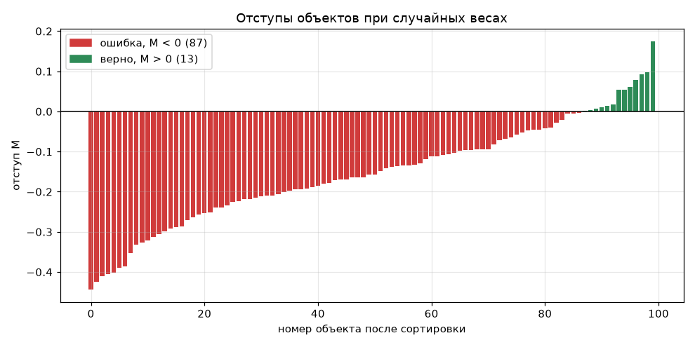
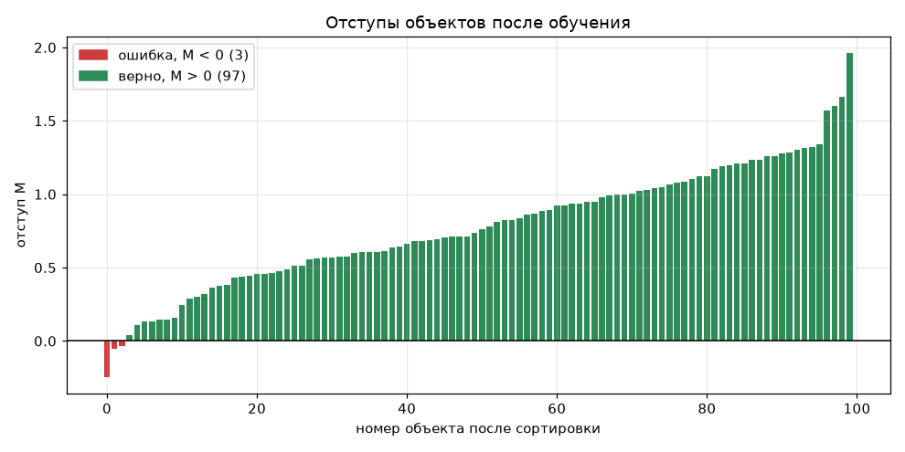
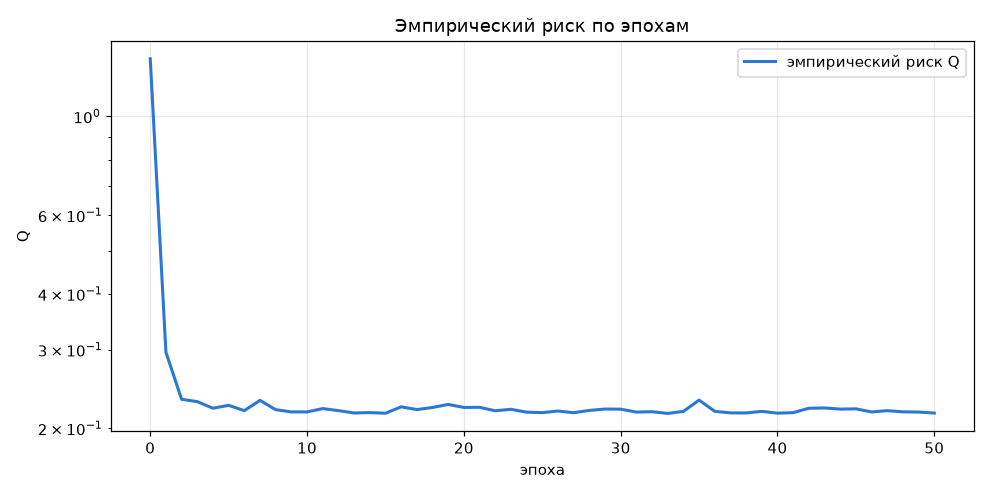
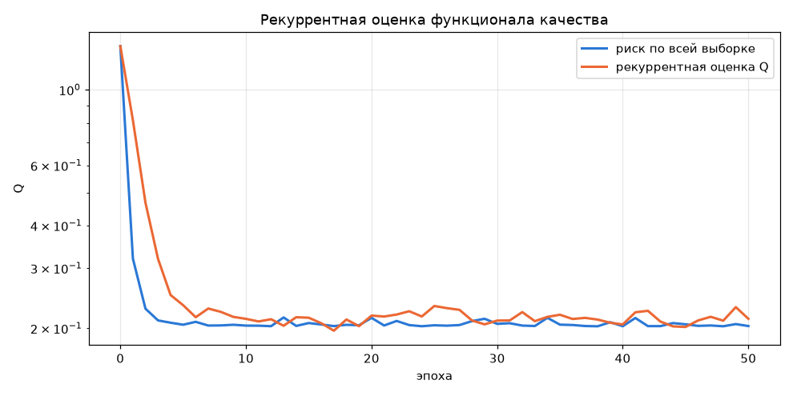
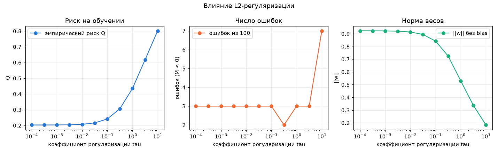
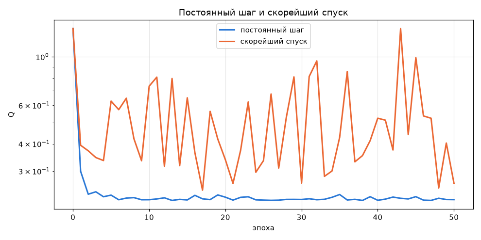
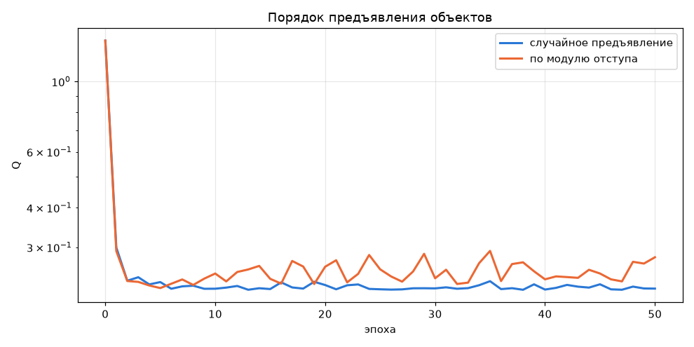
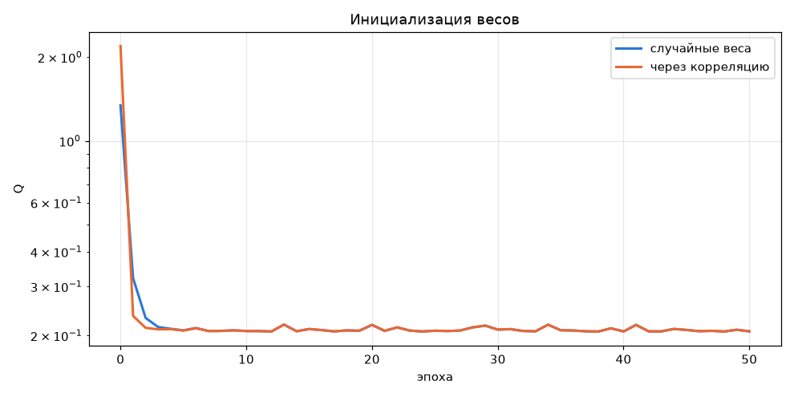
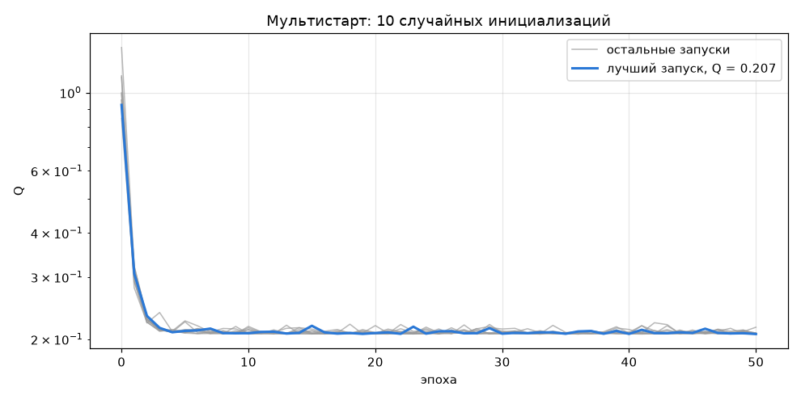
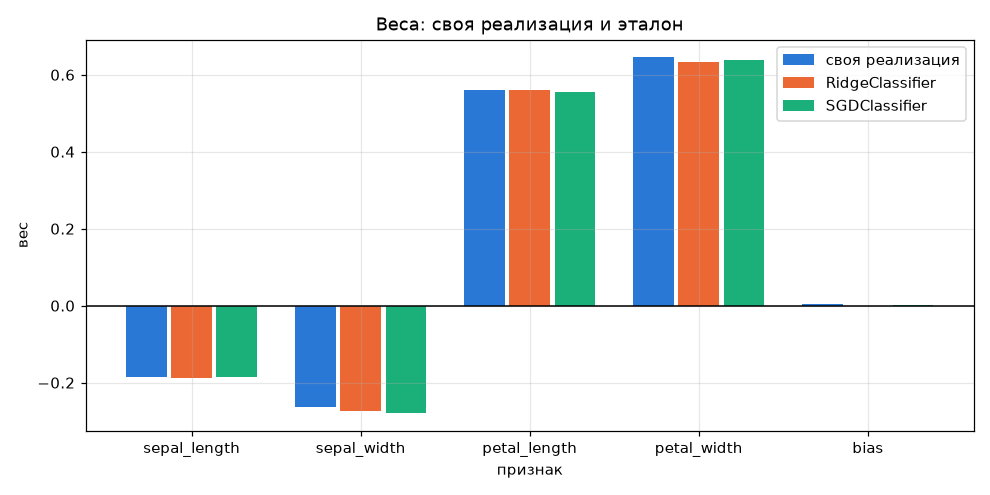

# Лабораторная работа №1. Линейная классификация

Линейный классификатор `a(x) = sign<w, x>` с квадратичной функцией потерь, обученный стохастическим градиентным спуском с инерцией и L2-регуляризацией.

## Датасет

Iris из `sklearn.datasets`: 150 цветков, 4 признака (`sepal_length`, `sepal_width`, `petal_length`, `petal_width`), 3 класса по 50 объектов.

Классификатор бинарный, поэтому я оставил два класса — versicolor ($y = -1$) и virginica ($y = +1$). Setosa отделяется от двух других классов плоскостью без единой ошибки (проверял решением задачи линейного программирования), и анализировать на ней было бы нечего. Versicolor и virginica, наоборот, частично перекрываются, поэтому часть объектов неизбежно классифицируется неверно — на таких данных отступы интереснее.

Подготовка данных: стратифицированное разбиение 70/30 (70 объектов на обучение, 30 на тест), стандартизация признаков по среднему и отклонению обучающей выборки, добавление константного признака $x_0 = 1$ под свободный член.

## Запуск

```sh
python -m venv .venv
source .venv/bin/activate
pip install -r requirements.txt
cd source
python main.py
```

Скрипт печатает все таблицы, приведённые ниже, и перерисовывает графики в `images/`.

## Структура кода

- `data.py` — загрузка датасета, разбиение на обучение и тест, стандартизация, свободный член;
- `classifier.py` — отступы, функция потерь, градиент, SGD с инерцией, L2, скорейший спуск, предъявление объектов, инициализация весов, мультистарт;
- `metrics.py` — accuracy, precision, recall, F1, матрица ошибок;
- `plots.py` — графики;
- `main.py` — эксперименты.

Из sklearn берутся только сам датасет и эталонные модели для пункта 11, всё остальное написано на numpy.

## Отступ объекта

$$M_i = y_i \langle w, x_i \rangle$$

Знак отступа показывает, верен ли ответ, а модуль — насколько далеко объект от разделяющей гиперплоскости. Отрицательный отступ означает ошибку.

Сначала я посчитал отступы для случайных весов $w_j \sim U(-\frac{1}{2n}, \frac{1}{2n})$, то есть ещё до всякого обучения.



Отступы лежат в пределах от −0.44 до 0.17: веса маленькие, поэтому все объекты жмутся к границе. Ошибок 62 из 70 — хуже, чем подбрасывание монеты. Так вышло случайно: у `petal_length` и `petal_width` веса оказались отрицательными, а у virginica эти признаки большие.

После обучения картина другая.



Ошибок осталось 3, отступы подтянулись к единице. К единице, а не к бесконечности, потому что квадратичная потеря штрафует и за слишком большой отступ. Три ошибки — это не недоработка: классы линейно неразделимы, и никакая гиперплоскость не разнесёт их без ошибок.

## Функция потерь и градиент

$$\mathcal{L}(M) = (1 - M)^2$$

Минимум при $M = 1$. Функция штрафует ошибки, неуверенные верные ответы ($0 < M < 1$) и слишком уверенные ($M > 1$).

Градиент по весам для одного объекта, $M = y \langle w, x \rangle$, $\nabla_w M = y x$:

$$\nabla_w \mathcal{L} = \mathcal{L}'(M) \cdot \nabla_w M = -2(1 - M)\, y x$$

Формулу я сверил с численной производной (центральные разности $\frac{\mathcal{L}(w + \varepsilon e_j) - \mathcal{L}(w - \varepsilon e_j)}{2\varepsilon}$, $\varepsilon = 10^{-6}$). Максимальное расхождение по всем обучающим объектам — $3.5 \cdot 10^{-10}$, то есть на уровне погрешности округления.

Один шаг против градиента ($h = 0.05$) на первом объекте уменьшает его потерю с 1.965 до 0.151.

## SGD с инерцией

Веса обновляются после каждого объекта, объекты в каждой эпохе перемешиваются:

$$v := \gamma v + (1 - \gamma) h \nabla \mathcal{L}, \qquad w := w - v$$

При $\gamma = 0$ получается обычный SGD. Во всех экспериментах $h = 0.01$, $\gamma = 0.9$, 50 эпох.

| | Q до обучения | Q после | ошибок |
|---|---|---|---|
| SGD без инерции | 1.342 | 0.205 | 62 → 3 |
| SGD с инерцией | 1.342 | 0.203 | 62 → 3 |



Инерция здесь почти ничего не даёт, кривые лежат друг на друге. Объяснение такое: градиент входит в скорость с множителем $(1 - \gamma)$, поэтому средняя длина шага не меняется, инерция только сглаживает шум. А сглаживать особо нечего — выборка маленькая, после стандартизации хорошо обусловленная, никаких узких оврагов, где инерция обычно выручает.

Обучение сходится за 2–3 эпохи, дальше риск колеблется около 0.2.

## Рекуррентная оценка функционала

Пересчитывать средний риск по всей выборке после каждого шага дорого, поэтому оценка обновляется по одному объекту:

$$Q := \lambda \varepsilon_i + (1 - \lambda) Q, \qquad \varepsilon_i = \mathcal{L}(M_i), \qquad \lambda = 1/\ell$$



Синяя кривая — честный риск по всем 70 объектам, оранжевая — рекуррентная оценка. После обучения 0.203 против 0.213, расхождение около 5%. Оценка идёт с запаздыванием (помнит потери на старых весах) и заметно шумит, но форму кривой передаёт верно: и падение, и выход на плато видны. Значит, на неё можно опираться как на критерий остановки, а полный риск считать не нужно.

## L2-регуляризация

$$Q(w) = \frac{1}{\ell}\sum_i (1 - M_i)^2 + \frac{\tau}{2}\|w\|^2, \qquad \nabla Q_i = -2(1 - M_i) y_i x_i + \tau w$$

Свободный член не штрафуется: он только сдвигает границу и к сложности модели отношения не имеет. В коде это вектор-маска, у которой последняя компонента равна нулю.

| τ | Q | ошибок | ‖w‖ |
|---|---|---|---|
| 0.0001 | 0.203 | 3 | 0.923 |
| 0.001 | 0.203 | 3 | 0.922 |
| 0.01 | 0.207 | 3 | 0.914 |
| 0.1 | 0.241 | 3 | 0.842 |
| 0.3162 | 0.306 | 2 | 0.725 |
| 1 | 0.435 | 3 | 0.530 |
| 3.162 | 0.618 | 3 | 0.338 |
| 10 | 0.802 | 7 | 0.183 |



До $\tau \approx 0.1$ регуляризация почти не влияет: штраф слишком мал по сравнению с потерей. Дальше норма весов падает, риск растёт, и при $\tau = 10$ модель уже недообучается — 7 ошибок вместо 3. Дальше я использую $\tau = 0.01$: качество как без регуляризации, но веса чуть прижаты.

Оговорюсь, что выигрыша от регуляризации эта таблица не показывает, и не может: всё измерено на обучающей выборке, а помогает регуляризация на новых данных. На 4 признаках и 70 объектах переобучаться особо нечем.

## Скорейший градиентный спуск

Шаг подбирается под каждый объект так, чтобы его потеря упала максимально: $h^* = \arg\min_h Q_i(w - h g)$, где $g = \nabla Q_i(w)$. Для квадратичной потери это парабола по $h$, и минимум находится аналитически:

$$h^* = \frac{\|g\|^2}{2\langle g, x_i \rangle^2 + \tau \|g\|^2}$$

При $\tau = 0$ формула превращается в $h^* = \frac{1}{2\|x_i\|^2}$ — такой шаг за один раз делает отступ объекта равным единице.

| | Q в конце | минимум Q за обучение | ошибок |
|---|---|---|---|
| постоянный шаг | 0.207 | 0.207 | 3 |
| скорейший спуск | 0.340 | 0.216 | 6 |



На этой выборке скорейший спуск работает заметно хуже. У стандартизованных объектов $\|x\|^2 \approx 5$, поэтому $h^* \approx 0.1$ — в десять раз больше постоянного шага. Каждый шаг полностью подгоняет веса под текущий объект, следующий объект перетягивает границу обратно, и риск скачет от 0.25 до 1.3 все 50 эпох. Метод рассчитан на полный градиентный спуск, где шаг подбирается под градиент по всей выборке, а в стохастическом варианте он переобучается на отдельные объекты.

## Предъявление объектов по модулю отступа

Объекты предъявляются не равномерно, а с вероятностью

$$p_i \propto \exp(-|M_i| / T)$$

то есть чаще берутся те, что лежат у границы. Отступы пересчитываются в начале каждой эпохи, выбор идёт с возвращением. При $T = 1$ разброс вероятностей получается всего семикратным: самый пограничный объект выбирается с вероятностью 0.020, самый уверенный — 0.003.

| | Q | ошибок | пограничных, \|M\| < 0.3 |
|---|---|---|---|
| случайное предъявление | 0.207 | 3 | 6 |
| по модулю отступа | 0.294 | 2 | 7 |



Ошибок стало на одну меньше, но риск вырос с 0.207 до 0.294. Это не противоречие: минимизируется уже не средняя потеря по выборке, а величина с перекосом в сторону границы, поэтому объекты с большим отступом просели. Разница в один объект из 70 лежит в пределах случайности, так что сказать, что метод здесь помог, я не могу.

## Инициализация весов

Через корреляцию: $w_j = \frac{\langle y, f_j \rangle}{\langle f_j, f_j \rangle}$, где $f_j$ — столбец $j$-го признака. Для стандартизованных данных это ровно коэффициент корреляции признака с меткой:

```
[0.465  0.277  0.767  0.831  0.0]
 sepal_l sepal_w petal_l petal_w bias
```

Размеры лепестка связаны с классом сильнее всего, у свободного члена ноль, потому что классы сбалансированы.

| | Q до обучения | Q после | ошибок |
|---|---|---|---|
| случайные веса | 1.342 | 0.207 | 3 |
| через корреляцию | 2.192 | 0.207 | 3 |



Корреляционная инициализация стартует с большего риска, чем случайная. Причина в том, что каждый вес подбирается независимо, а `petal_length` и `petal_width` почти дублируют друг друга — их вклад учитывается дважды, и отступы на старте получаются завышенными. Обе инициализации приходят в одну точку за 2–3 эпохи, так что выигрыша в скорости тоже не видно; он был бы заметен при меньшем шаге или на большей выборке.



Мультистарт из 10 случайных инициализаций даёт итоговый риск от 0.2068 до 0.2162 — все запуски сходятся практически в одну точку. Так и должно быть: функционал с квадратичной потерей и L2 выпуклый, локальный минимум у него один. Мультистарт нужен там, где минимумов много, здесь он просто умножает время обучения на 10.

## Качество классификации

Модель обучена на 70 объектах, метрики посчитаны на отложенных 30. Положительный класс — virginica.

| выборка | accuracy | precision | recall | F1 |
|---|---|---|---|---|
| обучение | 0.957 | 0.944 | 0.971 | 0.958 |
| тест | 0.933 | 0.882 | 1.000 | 0.938 |

Матрица ошибок на тесте:

| | предсказано versicolor | предсказано virginica |
|---|---|---|
| **versicolor** | 13 | 2 |
| **virginica** | 0 | 15 |

Обе ошибки одного типа — два versicolor приняты за virginica. Ни одна virginica не пропущена, отсюда recall = 1.0 и precision = 15/17. На тесте качество ниже, чем на обучении, что ожидаемо. Тест маленький, одна ошибка меняет accuracy на 0.033, поэтому все выводы по нему грубые.

## Сравнение с эталоном

Так как $y = \pm 1$, то $(1 - y\langle w, x\rangle)^2 = (y - \langle w, x\rangle)^2$ — наша задача совпадает с гребневой регрессией. Поэтому в качестве эталона я взял:

- `RidgeClassifier` с $\alpha = \ell \tau / 2$ — минимизирует тот же функционал, но решает задачу аналитически;
- `SGDClassifier(loss="squared_error", penalty="l2")` с $\alpha = \tau / 2$ — тот же стохастический спуск, только из библиотеки.

| модель | accuracy | precision | recall | F1 |
|---|---|---|---|---|
| своя реализация | 0.933 | 0.882 | 1.000 | 0.938 |
| RidgeClassifier | 0.967 | 0.938 | 1.000 | 0.968 |
| SGDClassifier | 0.967 | 0.938 | 1.000 | 0.968 |

| признак | своя реализация | RidgeClassifier | SGDClassifier |
|---|---|---|---|
| sepal_length | −0.186 | −0.189 | −0.186 |
| sepal_width | −0.264 | −0.274 | −0.279 |
| petal_length | 0.561 | 0.561 | 0.555 |
| petal_width | 0.645 | 0.634 | 0.638 |
| bias | 0.005 | 0.000 | 0.001 |



Веса совпадают с точностью до третьего знака — это и есть главная проверка реализации: мой SGD приходит туда же, куда аналитическое решение Ridge.

Разница в accuracy при этом набралась ровно на одном тестовом объекте, который лежит на самой границе: у моей модели $\langle w, x \rangle = +0.0001$, у Ridge $-0.0158$. Истинный класс — versicolor, так что Ridge угадал, а я промахнулся на одну десятитысячную. Причина — постоянный шаг: SGD не садится точно в минимум, а колеблется рядом с ним. Это видно и по риску на обучении: 0.2072 против 0.2068 у Ridge.

## Выводы

1. Линейный классификатор с квадратичной функцией потерь, обучаемый SGD с инерцией и L2-регуляризацией, реализован и работает: 3 ошибки на обучении, accuracy 0.933 на тесте. Веса совпадают с аналитическим решением из sklearn, то есть градиент и цикл обучения написаны верно.
2. Три ошибки на обучении никакими настройками не убираются — versicolor и virginica линейно неразделимы.
3. Самые информативные признаки — размеры лепестка, они входят с большими положительными весами. Размеры чашелистика входят с отрицательными.
4. Инерция, скорейший спуск, предъявление по модулю отступа, корреляционная инициализация и мультистарт заметного выигрыша на этих данных не дали. Выборка маленькая, функционал выпуклый и хорошо обусловленный, поэтому обычный SGD с постоянным шагом справляется не хуже. Скорейший спуск даже мешает: он переобучается на каждый отдельный объект и не сходится.
5. Расхождение с эталоном в одну десятитысячную скора превратилось в разницу 0.033 по accuracy. На выборке из 30 объектов любые сравнения качества нужно делать с оглядкой на такую чувствительность.
