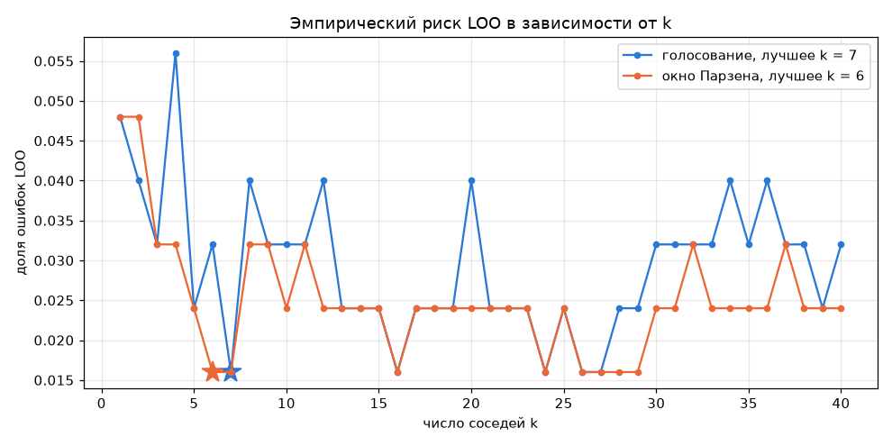
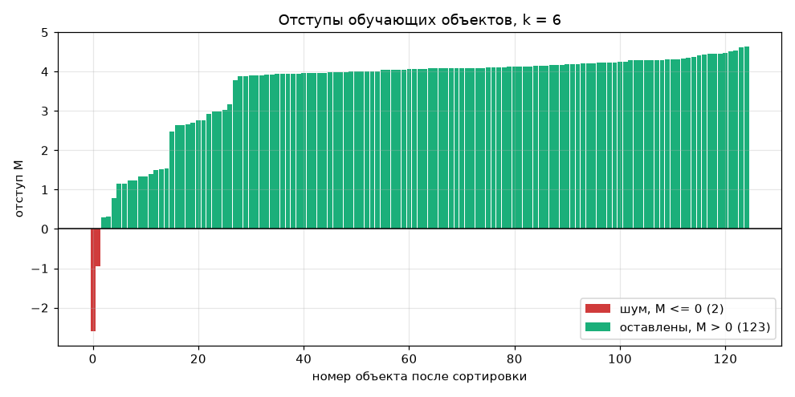
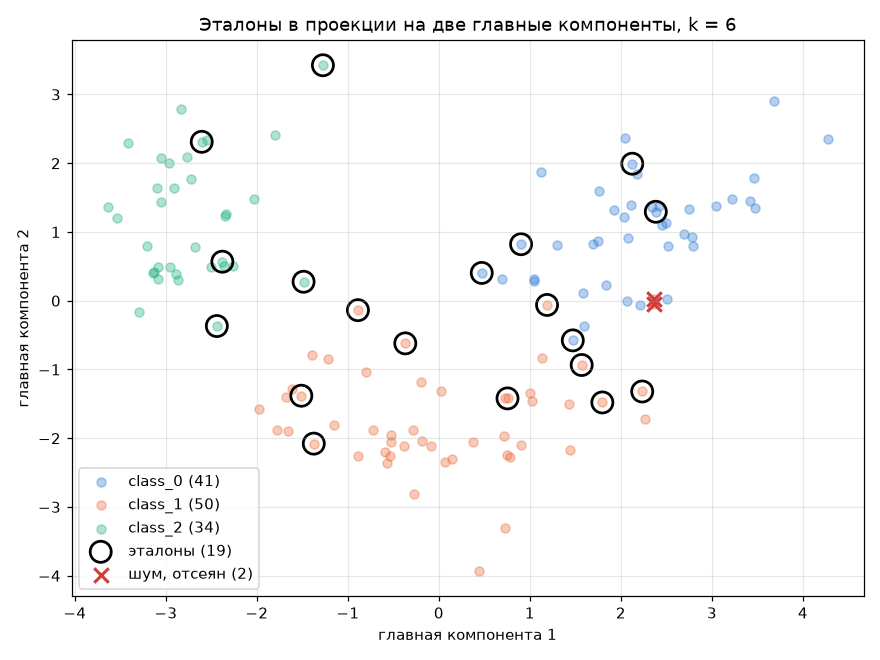
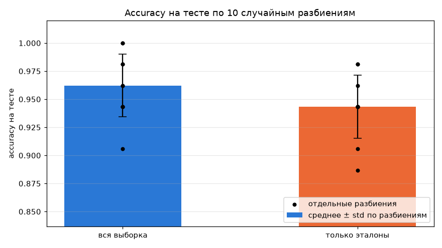
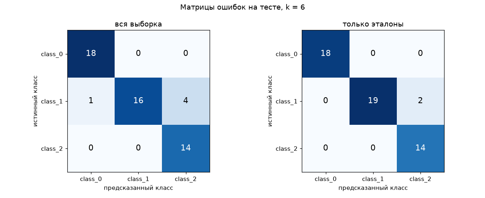

# Лабораторная работа №2. Метрическая классификация

KNN с окном Парзена переменной ширины, подбор числа соседей по LOO и отбор эталонов алгоритмом STOLP.

## Датасет

[Wine](https://archive.ics.uci.edu/dataset/109/wine) из `sklearn.datasets`: 178 вин одного региона Италии, 13 признаков химического анализа, 3 сорта винограда (59, 71 и 48 объектов).

Взял его вместо ириса из первой лабораторной ради признаков в разных единицах: разброс `proline` — 311, разброс `nonflavanoid_phenols` — 0.12. Для метрических методов это принципиально, и эффект стандартизации видно сразу.

Разбиение стратифицированное, 70/30: 125 объектов на обучение, 53 на тест. Стандартизация по среднему и отклонению обучающей выборки.

## Запуск

```sh
uv run python source/main.py
```

Скрипт печатает все таблицы из отчёта и перерисовывает графики в `images/`.

## Структура кода

- `data.py` — загрузка, разбиение, стандартизация;
- `knn.py` — расстояния, гауссово ядро, голосование, окно Парзена, отступы, LOO;
- `prototypes.py` — отбор эталонов;
- `metrics.py` — accuracy, матрица ошибок, precision/recall/F1 по классам;
- `plots.py` — графики;
- `main.py` — эксперименты.

Из sklearn берутся датасет, эталонный `KNeighborsClassifier` и PCA для картинки. Сам алгоритм написан на numpy.

## Стандартизация

Расстояние евклидово: $\rho(x, x') = \sqrt{\sum_j (x_j - x'_j)^2}$. Признак с большим разбросом перекрывает остальные. Разложил квадрат расстояния между двумя обучающими объектами по признакам: на сырых данных 99.9% суммы даёт `proline`, остальные 12 признаков не влияют ни на что. После стандартизации самый весомый признак даёт 37%.

| k | сырые признаки | стандартизованные |
|---|---|---|
| 1 | 0.774 | 0.925 |
| 3 | 0.679 | 0.906 |
| 5 | 0.679 | 0.906 |
| 10 | 0.604 | 0.925 |
| 20 | 0.642 | 0.925 |

Разрыв 25–30 процентных пунктов, поэтому дальше везде стандартизованные данные. Заодно видно, что на сырых данных качество падает с ростом k: если метрика плохая, лишние соседи только добавляют мусора.

## Окно Парзена переменной ширины

При простом голосовании сосед на расстоянии 2.63 и сосед на 3.12 дают одинаковый голос. Окно Парзена делает вес голоса убывающим с расстоянием:

$$a(x) = \arg\max_c \sum_{i=1}^{k} [y_i = c] \cdot K\!\left(\frac{\rho(x, x_i)}{h(x)}\right), \qquad K(r) = e^{-r^2/2}$$

Ширина окна переменная: за $h(x)$ берётся расстояние до $(k+1)$-го соседа. Это лучше фиксированного $h$, потому что окно само подстраивается под локальную плотность — в разреженной области оно шире, в плотной уже, и в него всегда попадает ровно k объектов. Нормировочный множитель ядра не нужен, он одинаков для всех классов и на argmax не влияет.

Веса для одного тестового объекта при k = 5:

| сосед | ρ | r = ρ/h | K(r) |
|---|---|---|---|
| 1 | 2.63 | 0.841 | 0.702 |
| 2 | 2.66 | 0.850 | 0.697 |
| 3 | 2.93 | 0.937 | 0.645 |
| 4 | 3.06 | 0.977 | 0.620 |
| 5 | 3.12 | 0.998 | 0.607 |
| h (6-й сосед) | 3.13 | 1.000 | — |

## Подбор k по LOO

$$LOO(k) = \frac{1}{\ell}\sum_{i=1}^{\ell}\left[a\big(x_i;\, X^\ell \setminus \{x_i\}\big) \ne y_i\right]$$

Обучения у KNN нет, вся модель — это матрица расстояний, поэтому LOO считается без повторных обучений: матрица 125×125 строится один раз, на диагональ ставится бесконечность, и объект перестаёт быть своим же соседом.



| k | голосование | окно Парзена |
|---|---|---|
| 1 | 0.048 | 0.048 |
| 3 | 0.032 | 0.032 |
| 5 | 0.024 | 0.024 |
| 6 | 0.032 | **0.016** |
| 7 | **0.016** | 0.016 |
| 10 | 0.032 | 0.024 |
| 20 | 0.040 | 0.024 |
| 30 | 0.032 | 0.024 |
| 40 | 0.032 | 0.024 |

Минимум 0.016 (2 ошибки из 125) у обоих методов: k = 7 для голосования, k = 6 для Парзена. При k = 1 риск втрое выше — классификатор копирует ближайшего соседа вместе с шумом.

Правее k ≈ 30 кривые расходятся: у голосования риск растёт до 0.032–0.040, у Парзена держится на 0.024. Это главный аргумент в пользу ядра: при большом k в окно затягиваются далёкие объекты чужого класса, и при равных голосах они портят ответ, а с весами почти ничего не весят.

Кривая ступенчатая, одна ошибка это 0.008, поэтому выбирать k строго по минимуму не стоит — минимум может оказаться случайным провалом. Лучше смотреть на широкую зону низкого риска: у Парзена это k от 5 до 30, у голосования узкие k = 5..7. Дальше использую k = 6.

### Насколько этому минимуму можно верить

Повторил подбор на 10 случайных разбиениях. Аргминимум скачет:

| | лучшее k по разбиениям |
|---|---|
| голосование | 3, 5, 17, 28, 37, 28, 26, 23, 17, 13 |
| окно Парзена | 3, 5, 34, 29, 37, 29, 25, 22, 7, 4 |

При 125 объектах разброс LOO больше, чем разница между соседними k, поэтому argmin на одном разбиении почти случаен. Но сам критерий не смещён: если усреднить кривые LOO по разбиениям, минимум приходится на k = 24–25, а максимум accuracy на тесте — на k = 27. То есть LOO указывает на ту же область, что и тест, просто на одной выборке он шумит.

Практический вывод: на таких данных k нужно брать не по точечному минимуму, а по зоне — в диапазоне k от 5 до 30 средняя accuracy на тесте меняется в пределах 0.96–0.97, то есть на один объект из 53.

## Сравнение с эталоном

`KNeighborsClassifier` на тех же данных и с тем же k:

| модель | accuracy |
|---|---|
| своя реализация, голосование | 0.925 |
| своя реализация, окно Парзена | 0.925 |
| KNeighborsClassifier, `uniform` | 0.925 |
| KNeighborsClassifier, `distance` | 0.925 |

Совпадает не только accuracy, но и сами предсказания: расхождений с `uniform` ноль из 53, причём на всех k от 1 до 40. Матрица расстояний совпадает с `pairwise_distances` до $2 \cdot 10^{-15}$, то есть до ошибок округления. Реализация верная.

По времени на 53 запросах моя реализация даже быстрее (0.19 мс против 0.55 мс, среднее по 20 повторам), но это только из-за накладных расходов sklearn на такой мелочи. Увеличил обучающую выборку до 5000 объектов — 6.4 мс против 1.7 мс, эталон выигрывает вчетверо. Я считаю все попарные расстояния, это $O(\ell n d)$, а sklearn строит KD-дерево и не считает расстояния до заведомо далёких областей.

## Отбор эталонов

Отступ в метрической классификации — разность между весом своего класса и лучшего из чужих:

$$M(x_i) = W_{y_i}(x_i) - \max_{c \ne y_i} W_c(x_i)$$



123 объекта из 125 имеют положительный отступ, большинство сидит на плато около 4 — у них все соседи своего класса, вес чужих нулевой. Два объекта с отрицательным отступом — шум.

STOLP из лекции:

1. объекты с $M \le 0$ выбрасываются как шум;
2. в каждом классе объект с максимальным отступом становится первым эталоном;
3. пока остаются ошибки, к эталонам добавляется объект с минимальным отступом среди ошибочных, то есть тот, на котором классификатор ошибается сильнее всего.

Получилось 19 эталонов из 125 (по классам 5, 9, 5) и 2 отсеянных шумовых объекта.



Картинка в проекции на две главные компоненты (PCA нужен только чтобы нарисовать 13 признаков, сам KNN работает в исходном пространстве). Эталоны стоят не в центрах облаков, а в зонах, где классы перемешиваются. Плотные ядра классов почти пустые — оттуда взято по одному-два объекта. Это и есть идея метода: объект в глубине класса ничего не говорит о границе. Эталонов класса 1 почти вдвое больше, потому что он граничит с обоими остальными.

Число ошибок по ходу работы алгоритма не убывает монотонно: 5 → 5 → 77 → 41 → 12 → 30 → 36 → 16 → 6 → 7 → 5 → 4 → 6 → 5 → 4 → 4 → 0. Пока эталонов мало, в окно попадают почти все они сразу, и один добавленный объект чужого класса перекашивает голосование. Гарантии монотонности у STOLP нет, но сходимость есть — в худшем случае эталонами станут все объекты.

## KNN с отбором эталонов и без

Тест из 53 объектов слишком мал: одна ошибка меняет accuracy на 0.019. Поэтому прогнал эксперимент на 10 случайных разбиениях, отбор эталонов внутри каждого делается заново по обучающей части.



| | accuracy | объектов в памяти | время предсказания |
|---|---|---|---|
| вся выборка | 0.962 ± 0.028 | 125 | 0.29 мс |
| только эталоны | 0.943 ± 0.028 | 18 | 0.06 мс |

Выборка сократилась на 86%, предсказание ускорилось в 5 раз, accuracy просела на 1.9 процентного пункта. Разброс между разбиениями (±0.028) больше этой разницы, так что различить методы по качеству на таких данных нельзя.

Вывод не держится на одном k: при k = 5, 10 и 25 эталонов остаётся 20, 22 и 31, а разрыв в accuracy составляет 2.0, 1.5 и 2.1 процентного пункта — картина та же.

Проседание объяснимо: 18 эталонов это мало для окна с k = 6, в голосовании участвует треть всей памяти алгоритма и теряется локальность. На выборке в сотни тысяч объектов такого эффекта не будет, а выигрыш по времени останется — у KNN нет фазы обучения, и вся стоимость приходится на предсказание, линейное по размеру выборки.

## Качество по классам

Accuracy даёт одно число и прячет, где именно модель ошибается. Матрицы ошибок на тесте при k = 6:



| класс | precision | recall | f1 | объектов |
|---|---|---|---|---|
| class_0 | 0.947 | 1.000 | 0.973 | 18 |
| class_1 | 1.000 | 0.762 | 0.865 | 21 |
| class_2 | 0.778 | 1.000 | 0.875 | 14 |

Все 5 ошибок приходятся на class_1: четыре его объекта ушли в class_2 и один в class_0, при этом обратных ошибок нет ни одной. Отсюда перекос метрик — у class_1 идеальная precision при recall 0.762, а у class_2 наоборот.

Это согласуется с картинкой PCA: class_1 лежит между двумя другими классами и граничит с обоими, поэтому у его пограничных объектов в окно попадают чужие соседи. По той же причине STOLP отобрал в эталоны класса 1 почти вдвое больше объектов, чем в остальные.

На эталонах на этом же разбиении:

| класс | precision | recall | f1 |
|---|---|---|---|
| class_0 | 1.000 | 1.000 | 1.000 |
| class_1 | 1.000 | 0.905 | 0.950 |
| class_2 | 0.875 | 1.000 | 0.933 |

Здесь эталоны оказались лучше полной выборки (0.962 против 0.906), хотя в среднем по 10 разбиениям было наоборот. Это ровно та чувствительность, о которой речь выше: разница в 3 объекта из 53. Тип ошибок при этом не изменился — снова только class_1, принятый за class_2.

## Выводы

1. KNN с окном Парзена переменной ширины и гауссовым ядром реализован, предсказания совпадают с `KNeighborsClassifier` объект в объект на всех проверенных k.
2. Стандартизация признаков даёт +25–30 процентных пунктов accuracy. Без неё расстояние определяется одним признаком `proline` из тринадцати.
3. По LOO на обучающей выборке лучшее k = 6 (риск 0.016), но доверять точечному минимуму нельзя: на 10 разбиениях argmin скачет от 3 до 37. Усреднённая кривая LOO и accuracy на тесте согласованно указывают на k ≈ 25, так что критерий рабочий, шумит только на одной выборке из 125 объектов.
4. Ядро выигрывает у простого голосования не в минимуме, а в устойчивости: при k > 30 голосование деградирует до риска 0.032–0.040, а Парзен держит 0.024.
5. Отбор эталонов оставляет 15% выборки и ускоряет предсказание в 5 раз при падении accuracy на 1.9 п.п., что меньше разброса между разбиениями. На Wine это чистая демонстрация: 178 объектов и так работают мгновенно, метод нужен на больших выборках.
6. Эталоны ложатся вдоль границ классов, а не в их центрах — то же поведение, что у опорных векторов в SVM.
7. Все ошибки приходятся на class_1, который лежит между двумя другими классами. Матрица ошибок это показывает, а accuracy — нет.
