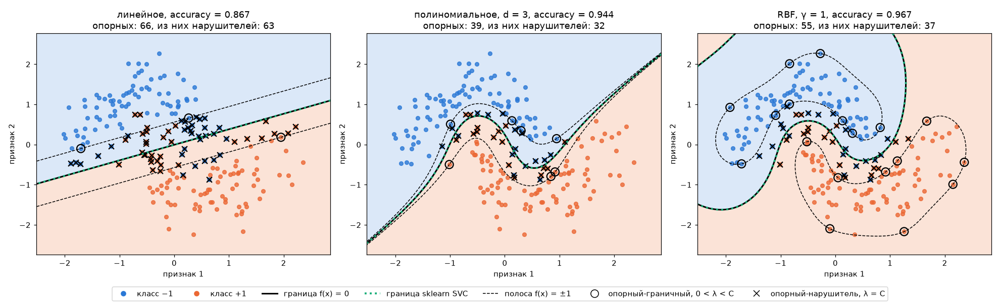

# Лабораторная работа №3. SVM

SVM через решение двойственной задачи по λ, линейное, полиномиальное и RBF-ядра, сравнение с `sklearn.svm.SVC`.

## Датасеты

- `make_moons` из sklearn: 300 точек, 2 признака, классы линейно не разделимы. На нём рисуются границы и видна польза ядра.
- [Breast Cancer Wisconsin](https://archive.ics.uci.edu/dataset/17/breast+cancer+wisconsin+diagnostic): 569 объектов, 30 признаков, злокачественная / доброкачественная опухоль.

Метки переведены в {−1, +1}, разбиение стратифицированное 70/30, признаки стандартизованы по обучающей выборке.

## Запуск

```sh
uv run python source/main.py
```

## Структура кода

- `data.py` — загрузка, разбиение, стандартизация;
- `svm.py` — ядра и SVM;
- `plots.py` — график решающих границ;
- `main.py` — сравнение со sklearn.

## Метод

Двойственная задача:

$$-\sum_i \lambda_i + \frac12 \sum_{i,j} \lambda_i\lambda_j y_i y_j K(x_i, x_j) \to \min_\lambda, \qquad 0 \le \lambda_i \le C, \quad \sum_i \lambda_i y_i = 0$$

Решается через `scipy.optimize.minimize(method="SLSQP")` с аналитическим градиентом. Объекты с λ > 0 — опорные. Порог w₀ считается как медиана ⟨w, xᵢ⟩ − yᵢ по объектам с 0 < λ < C, они лежат ровно на краю полосы.

Классификатор:

$$a(x) = \mathrm{sign}\Big(\sum_i \lambda_i y_i K(x_i, x) - w_0\Big)$$

В общем виде вектор w не строится, поэтому ядро подставляется вместо скалярного произведения без изменений в остальном коде.

Для линейного ядра классификатор строится явно: $w = \sum_i \lambda_i y_i x_i$, $a(x) = \mathrm{sign}(\langle w, x \rangle - w_0)$.

Ядра:

- линейное $K(x, x') = \langle x, x' \rangle$;
- полиномиальное $K(x, x') = (\langle x, x' \rangle + 1)^3$;
- RBF $K(x, x') = \exp(-\gamma \|x - x'\|^2)$, γ = 1 для moons и γ = 1/30 для Breast Cancer.

## Результаты

C = 1, в парах: наша реализация / `SVC`.

| датасет | ядро | accuracy | опорных | время, с |
|---|---|---|---|---|
| moons | линейное | 0.867 / 0.867 | 66 / 66 | 0.29 / 0.001 |
| moons | полиномиальное | 0.944 / 0.944 | 39 / 39 | 0.32 / 0.001 |
| moons | RBF | 0.967 / 0.967 | 55 / 55 | 0.49 / 0.001 |
| Breast Cancer | линейное | 0.982 / 0.982 | 29 / 29 | 2.77 / 0.001 |
| Breast Cancer | полиномиальное | 0.965 / 0.965 | 50 / 51 | 9.67 / 0.001 |
| Breast Cancer | RBF | 0.977 / 0.977 | 95 / 95 | 2.17 / 0.001 |

Предсказания на тесте совпадают со `SVC` во всех случаях.

Линейный классификатор: w совпадает с `SVC.coef_` с точностью 0.0006, w₀ — до третьего знака. Для moons w = (0.683, −1.768), w₀ = 0.011, ширина полосы 2/‖w‖ = 1.055.



Сплошная линия — граница f(x) = 0, пунктир — края полосы f(x) = ±1, зелёный пунктир — граница `SVC`. Кружки — опорные-граничные (0 < λ < C), крестики — опорные-нарушители (λ = C).

## Выводы

- Реализация находит то же решение, что и `SVC`: совпадают точность, опорные векторы и решающая функция.
- На moons прямая даёт 86.7%, ядра изгибают границу и поднимают точность до 94.4% и 96.7%. На Breast Cancer классы почти линейно разделимы, и лучшим остаётся линейное ядро.
- Полиномиальное ядро на 30 признаках даёт значения до 10⁷, задача плохо обусловлена: обучение самое долгое, а одно λ ≈ 5·10⁻⁷ оказалось ниже порога и не попало в опорные.
- `SVC` быстрее в сотни и тысячи раз: libsvm решает задачу методом SMO, меняя по два λ за шаг, а SLSQP — общий метод, который на каждой итерации работает с плотной матрицей n×n.
