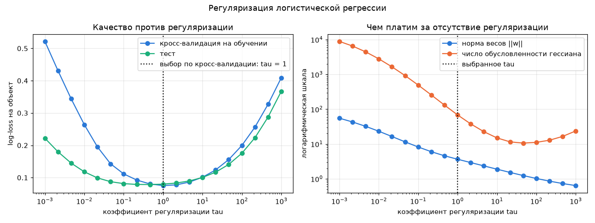
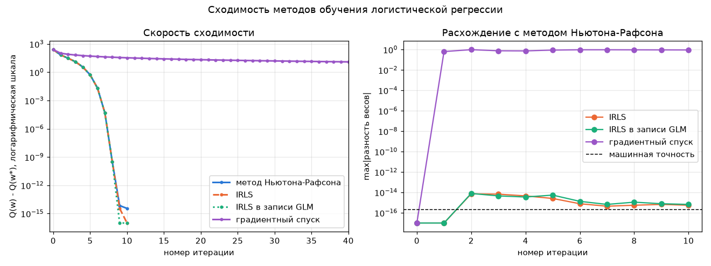
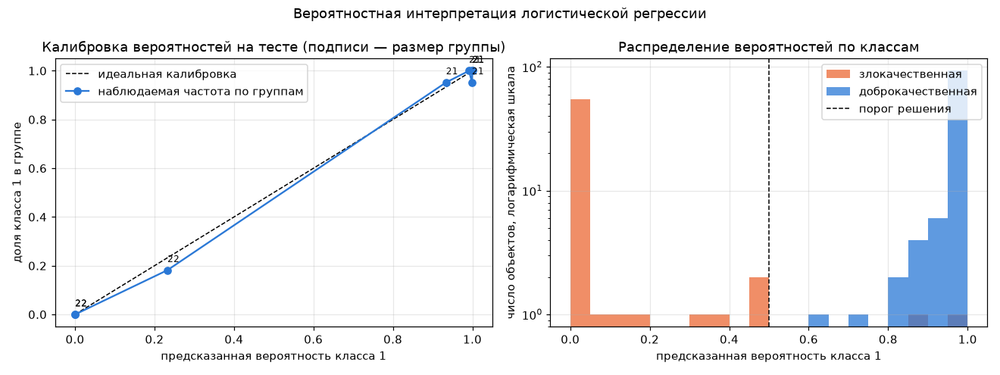

# Лабораторная работа №5. Логистическая регрессия

Логистическая регрессия методом Ньютона-Рафсона и IRLS, сравнение с `sklearn.linear_model.LogisticRegression`.

## Датасет

[Breast cancer wisconsin](https://archive.ics.uci.edu/dataset/17/breast+cancer+wisconsin+diagnostic) из `sklearn.datasets`: 569 опухолей, 30 признаков (радиус, текстура, периметр, площадь, гладкость и так далее — для каждого среднее, стандартная ошибка и худшее значение), два класса: злокачественная 212 и доброкачественная 357.

Взял его из-за двух свойств, на которые натыкается метод Ньютона:

- признаки в несопоставимых единицах (`mean radius` от 7 до 28, `worst area` от 185 до 4254), и число обусловленности матрицы даже после стандартизации равно 297;
- выборка линейно разделима, а это ломает саму постановку задачи — об этом ниже.

Разбиение стратифицированное 70/30 (398 на обучение, 171 на тест, доля класса 1 равна 0.628 и 0.626), признаки стандартизованы по обучающей выборке, к матрице добавлен столбец единиц, чтобы свободный член был просто ещё одним весом.

## Запуск

```sh
uv run python source/main.py
```

## Структура кода

- `data.py` — загрузка, стратифицированное разбиение, стандартизация, добавление свободного члена;
- `logistic.py` — функционал и его производные, метод Ньютона-Рафсона, IRLS в двух записях, кросс-валидация;
- `plots.py` — графики;
- `main.py` — эксперименты.

## Постановка

Классы кодируются как $y_i \in \{-1, +1\}$, модель — $a(x) = \mathrm{sign}(w^{\mathsf T}x)$. Доля ошибок $\sum [M_i < 0]$ кусочно-постоянна, поэтому минимизируется её гладкая верхняя оценка с логарифмической функцией потерь:

$$Q(w) = \sum_{i=1}^{\ell} \ln\bigl(1 + e^{-M_i}\bigr) + \frac{\tau}{2}\lVert w \rVert^2, \qquad M_i = y_i w^{\mathsf T} x_i .$$

Первое слагаемое — то же самое, что максимум правдоподобия для бернуллиевских $y_i$ с $P(y_i = 1 \mid x_i) = \sigma(w^{\mathsf T}x_i)$: логарифмические потери и сигмоида не выбраны произвольно, а следуют из двух предположений — отклик бернуллиевский и его среднее монотонно зависит от линейной комбинации признаков.

Второе слагаемое — L2-штраф, он нужен по существу, а не для красоты (раздел про разделимость). Свободный член не штрафуется, как и в `sklearn`.

## Метод Ньютона-Рафсона

Производные функционала:

$$\frac{\partial Q}{\partial w_j} = -\sum_i (1 - \sigma_i)\, y_i f_j(x_i), \qquad \frac{\partial^2 Q}{\partial w_j \partial w_k} = \sum_i (1 - \sigma_i)\sigma_i f_j(x_i) f_k(x_i),$$

где $\sigma_i = \sigma(M_i)$. Шаг: $w^{t+1} := w^t - h\,(Q'')^{-1} Q'$.

Три вещи в реализации, которые не видны из формул:

- $\ln(1 + e^{-M})$ считаю через `np.logaddexp(0, -M)`: при $M = -800$ прямая формула даёт `inf`;
- сигмоиду — через `0.5 * (1 + np.tanh(0.5 * z))`: тождественно $1/(1+e^{-z})$, но `tanh` насыщается без переполнения;
- шаг — через `np.linalg.solve(H, g)`, а не `inv(H) @ g`: решать систему точнее и дешевле, чем обращать матрицу.

Сходимость квадратичная:

| шаг | Q(w) | изменение | ‖w‖ | cond гессиана |
|---|---|---|---|---|
| 0 | 275.873 | — | 0.000 | 1262.8 |
| 5 | 25.693 | 3.1e+00 | 3.315 | 80.4 |
| 7 | 25.159 | 2.1e-02 | 3.652 | 68.8 |
| 8 | 25.159 | 4.9e-05 | 3.655 | 68.7 |
| 9 | 25.159 | 3.3e-10 | 3.655 | 68.7 |
| 10 | 25.159 | 3.6e-15 | 3.655 | 68.7 |

Десять итераций до ‖градиента‖ = 9.8e-15, число верных знаков в конце удваивается за шаг. Точность 0.9874 на обучении и 0.9883 на тесте.

## Зачем нужна регуляризация

Выборка линейно разделима: при $\tau = 0$ точность на обучении равна 1.0, минимальная маржа 26. Значит правдоподобие растёт при $\lVert w \rVert \to \infty$ и оптимума просто нет.

| τ | Q(w) без штрафа | ‖w‖ | cond гессиана | точность теста |
|---|---|---|---|---|
| 0 | 0.0000 | 1408.8 | 3.2e+06 | 0.9708 |
| 0.01 | 5.08 | 23.3 | 2.8e+03 | 0.9766 |
| 0.1 | 11.33 | 8.2 | 4.9e+02 | 0.9825 |
| 1 | 18.62 | 3.66 | 6.9e+01 | 0.9883 |
| 10 | 33.75 | 1.89 | 1.5e+01 | 0.9708 |
| 100 | 72.07 | 1.02 | 1.1e+01 | 0.9591 |

Без штрафа норма весов растёт примерно на 50 за итерацию и останавливается только потому, что $Q$ падает до 3e-11 и срабатывает критерий остановки. Гессиан при этом вырожден: веса $(1-\sigma_i)\sigma_i$ зануляются у всех уверенно классифицированных объектов, а при разделимости это все объекты.



Коэффициент подбираю по пятиблочной кросс-валидации на обучающей выборке, стандартизация пересчитывается внутри каждого блока; тест смотрю один раз. Выбор — $\tau = 1$, log-loss 0.0754 на кросс-валидации и 0.0798 на тесте.

## IRLS

Тот же шаг Ньютона переписывается как обычный МНК со взвешенными объектами. Веса $\gamma_i = \sqrt{(1-\sigma_i)\sigma_i}$, модифицированные ответы $\tilde y_i = y_i\sqrt{(1-\sigma_i)/\sigma_i}$, матрица $\tilde F = \mathrm{diag}(\gamma)F$, и тогда

$$\tilde F^{\mathsf T}\tilde F = F^{\mathsf T} \mathrm{diag}\bigl((1-\sigma_i)\sigma_i\bigr) F = Q'', \qquad \tilde F^{\mathsf T}\tilde y = F^{\mathsf T}\bigl(y_i(1-\sigma_i)\bigr) = -Q',$$

потому что в произведении $\gamma_i \tilde y_i$ корни взаимно сокращаются. Поэтому $w \mathrel{+}= h\,(\tilde F^{\mathsf T}\tilde F)^{-1}\tilde F^{\mathsf T}\tilde y$ — это буквально шаг Ньютона, просто через линейную регрессию. Со штрафом подзадача на каждой итерации становится не обычным МНК, а гребневой регрессией.

Та же процедура в общей записи GLM (метки 0/1): для распределения Бернулли $c'(\theta) = \sigma(\theta) = \mu$, $c''(\theta) = \mu(1-\mu)$, $\varphi = 1$, отсюда $\gamma_i = \sqrt{\mu_i(1-\mu_i)}$ и $\tilde y_i = (y_i - \mu_i)/\gamma_i$.

| шаг | ‖w‖ Ньютон | &#124;Ньютон − IRLS&#124; | &#124;Ньютон − GLM&#124; |
|---|---|---|---|
| 1 | 1.848344 | 0.0e+00 | 0.0e+00 |
| 2 | 2.516241 | 7.3e-15 | 7.9e-15 |
| 5 | 3.315158 | 2.6e-15 | 5.4e-15 |
| 10 | 3.654747 | 5.6e-16 | 6.7e-16 |

Нули на первых шагах не округление, а один и тот же результат `np.linalg.solve`; дальше расхождение в 1e-15 возникает из-за разного порядка арифметики и затухает. Все три варианта сходятся за 10 итераций, IRLS из МНК-приближения (как в лекции) — тоже за 10, ответ отличается на 1.8e-15.

Одно реальное различие между записями всё же есть. В GLM-форме при насыщении ($\mu = 1$ с точностью float64, то есть $\theta > 37$, а у нас маржи доходят до 50) получается $\gamma_i = 0$ и $\tilde y_i$ превращается в 0/0. В маржинальной записи этого нет, потому что там делят на $\sigma_i$, а не на $\gamma_i$. Поставил пол на дисперсию: у насыщенного объекта числитель $y_i - \mu_i$ тоже ноль, так что ответ не портится.

### Что IRLS делает содержательно

| объект | маржа M | σ | вес (1−σ)σ | 1/σ |
|---|---|---|---|---|
| 151 | 0.261 | 0.564781 | 2.5e-01 | 1.771 |
| 377 | −0.343 | 0.415197 | 2.4e-01 | 2.408 |
| 126 | 29.711 | 1.000000 | 1.3e-13 | 1.000 |
| 318 | 50.068 | 1.000000 | 0.0e+00 | 1.000 |

Чем ближе объект к границе, тем больше его вес; у объекта с маржой 50 вес ровно ноль. Суммарный вес всех 398 объектов равен 8.97 — настройка идёт фактически по горстке пограничных объектов. Отсюда же и вырожденность гессиана при разделимости.

## Скорость сходимости



Для сравнения добавил обычный градиентный спуск с шагом $1/L$, где $L$ — максимальное собственное число гессиана в начальной точке.

| метод | итераций до Q − Q* < 1e-6 | Q − Q* в конце |
|---|---|---|
| Ньютон-Рафсон | 8 | 3.6e-15 |
| IRLS | 8 | 0 |
| IRLS в записи GLM | 8 | 0 |
| градиентный спуск | не дошёл за 300 | 1.32 |

Разница не количественная, а качественная: Ньютон использует кривизну и попадает в оптимум за восемь шагов, градиентный спуск знает только направление и за триста шагов не подходит и близко. Платим обращением матрицы 31×31 на каждой итерации — при 30 признаках это ничто, но при 10⁵ признаков выбор был бы обратным.

## Эквивалентность с эталоном

`sklearn` минимизирует $C\sum_i \ln(1 + e^{-M_i}) + \frac12\lVert w\rVert^2$. Поделив на $C$, получаем наш функционал при $\tau = 1/C$ — без этого согласования сравнивать нечего, потому что L2-штраф у `sklearn` включён по умолчанию.

| solver | итераций | max&#124;Δ свободного члена&#124; | max&#124;Δ весов&#124; | max&#124;Δ вероятностей&#124; |
|---|---|---|---|---|
| `newton-cholesky` | 9 | 3.2e-11 | 2.4e-11 | 1.8e-11 |
| `lbfgs` | 42 | 5.2e-08 | 1.2e-06 | 3.6e-07 |
| `liblinear` | 11 | 1.0e-01 | 4.9e-02 | 2.2e-02 |

Значение $Q$ в нашей точке и в точке `sklearn` совпадает до десятого знака (25.1592788120), предсказания на тесте совпали у 171 объекта из 171.

Три разных числа объясняются тремя разными причинами:

- `newton-cholesky` — это тот же метод Ньютона, только систему решает разложением Холецкого. Расхождение 2.4e-11 — не точность арифметики, а порог остановки `sklearn`: он смотрит на норму градиента, а мы на изменение $Q$;
- `lbfgs` — квазиньютоновский метод, гессиан не считается, а приближается по истории градиентов. Отсюда 42 итерации вместо 9 и точность 1e-6. Это солвер по умолчанию, и он не реализует то, что написано в лекции;
- `liblinear` штрафует ещё и свободный член, то есть минимизирует другой функционал. Если в нашей реализации убрать исключение для $w_0$, совпадение с ним становится 4e-7.

## Вероятности и шансы



Линейная часть модели — это логарифм отношения шансов: $w^{\mathsf T}x = \ln\frac{P(y=1\mid x)}{P(y=0\mid x)}$. Признаки стандартизованы, поэтому $e^{w_j}$ читается как «во сколько раз меняются шансы при росте признака на одно стандартное отклонение».

| признак | вес | exp(вес) |
|---|---|---|
| worst texture | −1.168 | 0.311 |
| radius error | −1.087 | 0.337 |
| worst radius | −0.954 | 0.385 |
| mean concave points | −0.941 | 0.390 |
| mean smoothness | 0.004 | 1.004 |

Все влиятельные признаки входят с минусом: чем больше радиус, текстура и вогнутость, тем ниже шансы на доброкачественную опухоль. Свободный член 0.520 означает шансы 1.68 к одному для объекта со средними признаками — это и есть дисбаланс классов 357 к 212.

Проверка калибровки: разбил тест на 8 групп по возрастанию предсказанной вероятности и сравнил с наблюдаемой частотой.

| группа | размер | предсказано | наблюдается |
|---|---|---|---|
| 1 | 22 | 0.0000 | 0.0000 |
| 3 | 22 | 0.2327 | 0.1818 |
| 4 | 21 | 0.9337 | 0.9524 |
| 6 | 21 | 0.9989 | 0.9524 |
| 8 | 21 | 1.0000 | 1.0000 |

Средняя предсказанная вероятность 0.6347 против реальной доли класса 0.6257. Оговорюсь, что проверка тут слабая: модель настолько уверена, что шесть групп из восьми вырождены в 0 или 1, и содержательно работает только третья группа.

## Выводы

1. Логистическая регрессия реализована методом Ньютона-Рафсона с явным гессианом и сходится за 10 итераций до ‖градиента‖ = 1e-14, причём сходимость квадратичная: число верных знаков удваивается за шаг.
2. IRLS — не другой алгоритм, а тот же шаг Ньютона, переписанный как взвешенный МНК. Траектории совпадают с первого шага и расходятся не более чем на 7e-15 за всё обучение.
3. Общая запись GLM даёт то же самое на метках 0/1, но численно хуже: при насыщении сигмоиды модифицированный ответ превращается в 0/0, тогда как маржинальная запись этой особенности не имеет.
4. Решение совпадает с `sklearn.linear_model.LogisticRegression` с точностью 2.4e-11 при согласованной регуляризации ($C = 1/\tau$) и солвере `newton-cholesky`; значение функционала совпадает до десятого знака, предсказания — на всех 171 объекте теста.
5. Разные солверы одной и той же эталонной библиотеки дают разные ответы, и это не шум: `lbfgs` приближает гессиан и теряет пять знаков, `liblinear` решает другую задачу, потому что штрафует свободный член.
6. На линейно разделимой выборке задача без регуляризации не имеет решения: норма весов растёт неограниченно, гессиан вырождается, а точность на тесте падает с 0.9883 до 0.9708. Регуляризация здесь не улучшение, а условие корректности.
7. Метод Ньютона выигрывает у градиентного спуска качественно (8 итераций против больше чем 300), потому что использует кривизну функционала. Цена — обращение матрицы размера числа признаков на каждом шаге.
8. Модель выдаёт не абстрактную уверенность, а апостериорную вероятность: предсказанные частоты совпадают с наблюдаемыми, а веса читаются как логарифмы отношения шансов.
