# Лабораторная работа №1. Линейная классификация

Реализован линейный классификатор и обучен стохастическим градиентным спуском с инерцией, L2-регуляризацией и квадратичной функцией потерь.

**Датасет:** [Student Burnout Prediction](https://www.kaggle.com/datasets/danieljhuang/student-burnout-prediction-dataset) (`student_burnout.csv`, 2000 объектов).

**Запуск** (из каталога `lab1`):

```bash
python source/data.py     # п.1 данные и EDA
python source/model.py    # п.2–8 отступ, градиент, SGD, L2, скорейший спуск, выбор по |отступу|
python source/train.py    # п.9–11 протоколы, метрики, sklearn
```

| файл | содержание |
|---|---|
| `source/data.py` | загрузка, EDA, разбиение, заполнение пропусков, масштабирование |
| `source/model.py` | отступ, градиент, SGD, L2, скорейший спуск, предъявление, мультистарт |
| `source/train.py` | обучение по п.9, качество, эталон |

Финальные настройки: длина шага 0.001, инерция 0.9, сила L2 0.1, 8000 обновлений весов, скорейший спуск выключен.

---

## 1. Выбор датасета и подготовка данных

Бинарная классификация: есть у студента выгорание или нет (`high_burnout`). Ответы переведены в «минус один / плюс один», чтобы дальше работал отступ.

| | |
|---|---|
| объектов | 2000 |
| train / test | 1600 / 400, с сохранением доли классов, 80/20 |
| выгорание (плюс один) | 638 человек (31.9%) |
| пропуски | экранное время 44, дорога 30, поддержка преподавателя 48 |

**Утечка.** Выгорание равно единице ровно тогда, когда `burnout_score` не меньше 4:

| burnout_score | нет выгорания | есть выгорание |
|---|---|---|
| 1 | 76 | 0 |
| 2 | 461 | 0 |
| 3 | 825 | 0 |
| 4 | 0 | 517 |
| 5 | 0 | 121 |

Корреляция балла с таргетом 0.82. Колонки `burnout_score` и `student_id` выкинуты: иначе модель списывает ответ или запоминает номер строки.

Пол закодирован one-hot, базовый уровень — Female. Пропуски заполнены медианой обучающей выборки. Признаки приведены к нулевому среднему и единичному разбросу (шкала считается только на train). Добавлен свободный член (столбец единиц). Всего 16 весов.

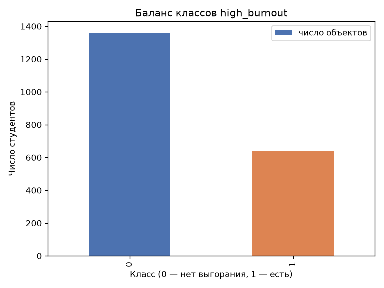

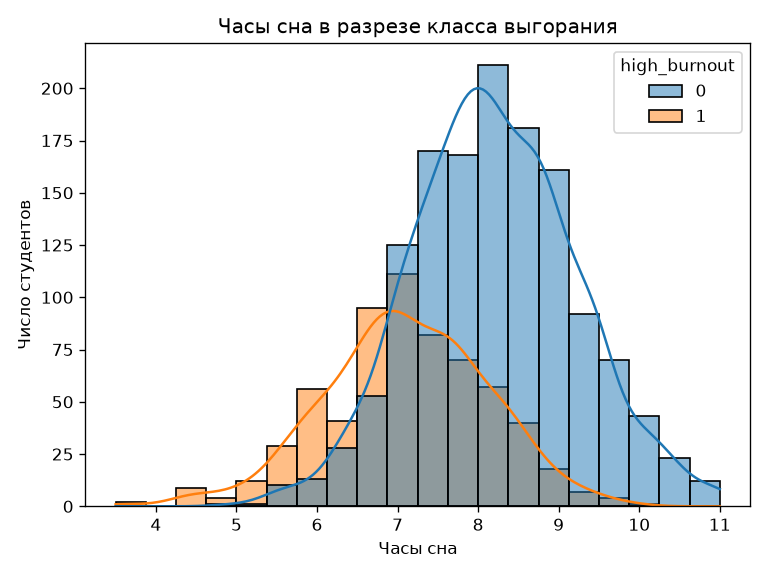

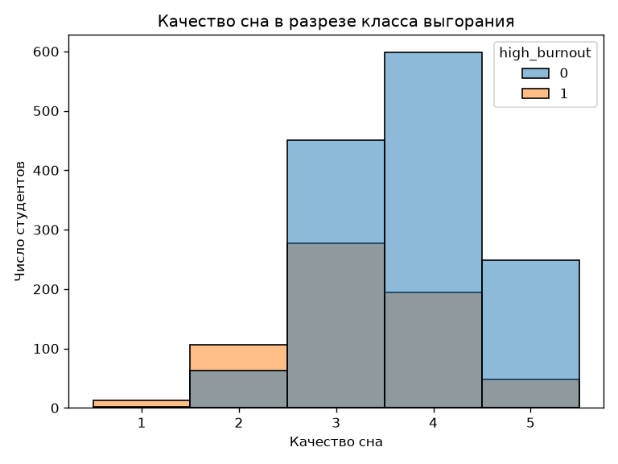

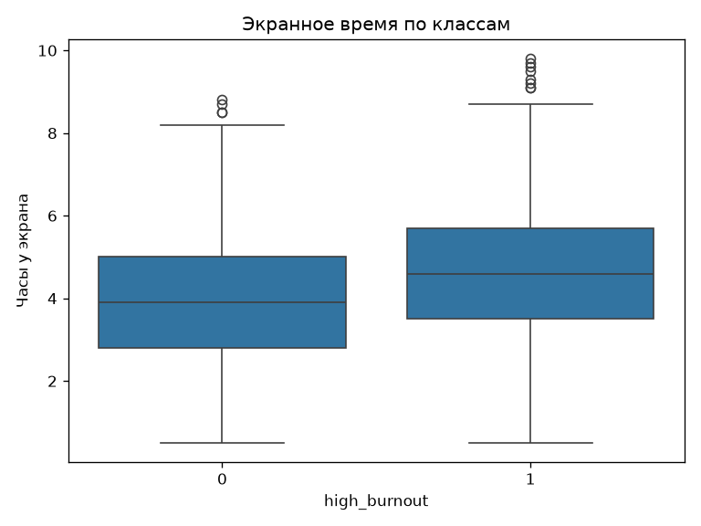

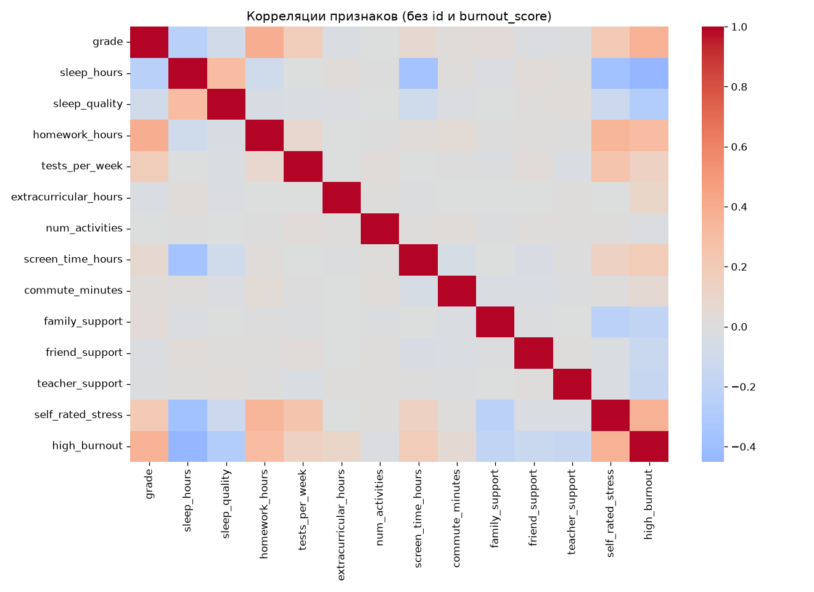

Сон связан с выгоранием отрицательно (около −0.45), стресс и курс — положительно.

---

## 2. Отступ объекта

Отступ — произведение верной метки и score модели, если отступ больше нуля, знак угадан. Меньше нуля — ошибк, если около нуля — объект у границы решения.

До обучения отступ посчитан на train при двух стартах весов:

| инициализация | ошибка train | средний отступ |
|---|---|---|
| случайная | 71.5% | −0.017 |
| корреляция признака с ответом | **24.56%** | 0.723 |

Правило «всегда нет выгорания» ошибается примерно в 32% случаев. Старт через корреляцию уже лучше. Случайные веса дают кашу вокруг нуля: модель ещё не училась.

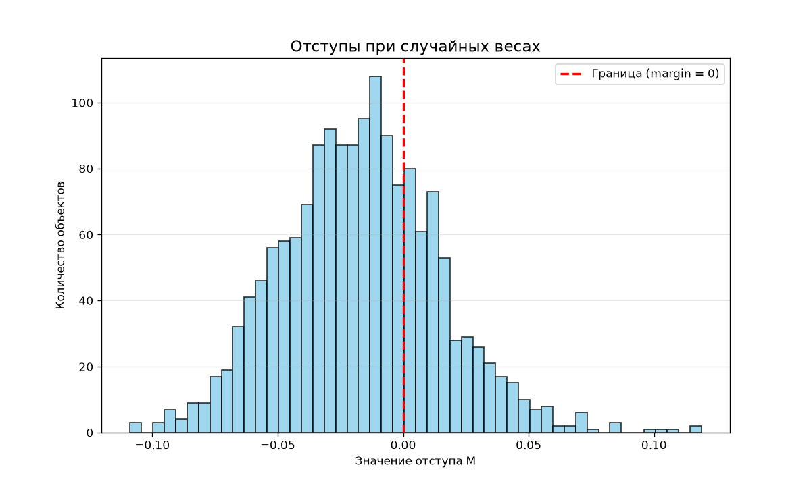

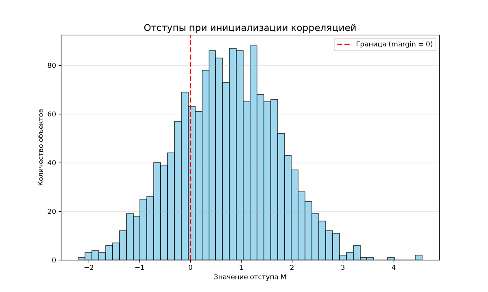

---

## 3. Градиент функции потерь

Штраф квадратичный: чем отступ дальше от единицы, тем больше штраф. Это как подогнать score к метке «плюс/минус один».

Градиент на одном студенте показывает, в какую сторону крутить веса, чтобы штраф на нём упал. По всей выборке берётся среднее таких векторов.

---

## 4. Рекуррентная оценка функционала качества

Полный средний штраф по 1600 студентам на каждом шаге считать тяжело. Вместо этого ведётся скользящее среднее: новый штраф одного объекта чуть подмешивается в старую оценку. Коэффициент подмешивания примерно один к размеру выборки (1/1600).

Это график «насколько сейчас плохо», а не правило выбора весов. Если подмешивать штраф целиком (коэффициент 1), на картинке будет шум одного студента.

---

## 5. SGD с инерцией

На каждом шаге берётся один случайный студент, считается градиент, веса сдвигаются против него. Длина шага задаёт, насколько далеко сдвинуть. Инерция добавляет кусок прошлого смещения, чтобы не дёргаться от одного шумного объекта.

Шаг 0.01 срывал обучение (штраф улетал в большие числа). Рабочие значения: шаг 0.001, инерция 0.9.

Старт из корреляции, train:

| | ошибка | скользящий штраф |
|---|---|---|
| до SGD | 24.56% | 1.085 |
| после 8000 шагов | **20.06%** | **0.626** |

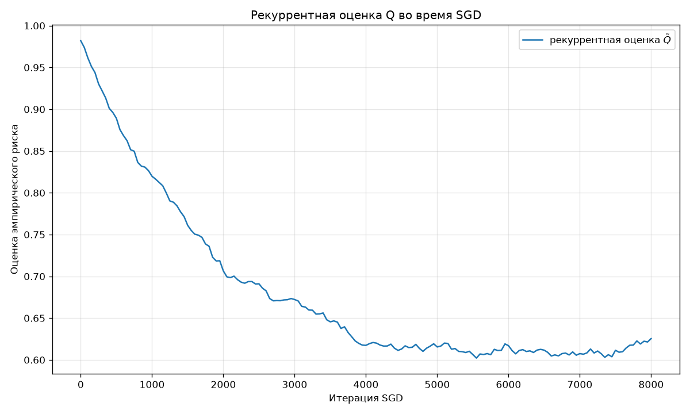

Кривая в среднем падает: модель учится.

---

## 6. L2-регуляризация

К среднему штрафу добавляется штраф за большие веса. В градиент к весам признаков добавляется пропорциональный им член. Так модель меньше подгоняется под шум обучающей выборки.

Один и тот же SGD, разная сила регуляризации:

| сила L2 | ошибка train | длина всех весов | длина весов без свободного члена |
|---|---|---|---|
| 0 | 20.06% | 0.624 | 0.506 |
| 0.1 | 20.00% | 0.606 | 0.485 |
| 1 | 20.31% | 0.501 | 0.360 |
| 10 | 29.88% | 0.406 | 0.168 |

Чем сильнее регуляризация, тем короче вектор весов. При силе 10 ошибка ползёт к 32% — модель почти ничего не использует (недообучение). В финале взята сила 0.1. Цель L2 — не рекорд на train, а умеренные веса.

---

## 7. Скорейший градиентный спуск

Длина шага не фиксированная: вдоль уже найденного направления перебирается сетка длин, берётся та, где штраф текущего студента меньше. 

| режим | ошибка train | длина весов |
|---|---|---|
| постоянный шаг 0.001 | **20.0%** | 0.606 |
| скорейший спуск | 35.56% | 0.916 |

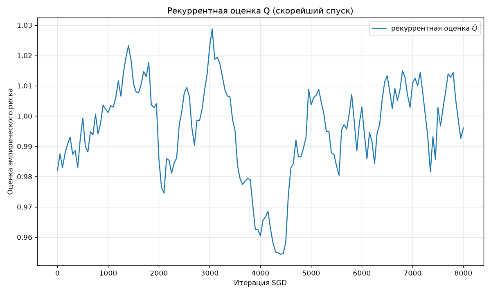

Подбор шага по одному человеку плохо работает на всей выборке. В пунктах 9–11 скорейший спуск не использовался.

---

## 8. Предъявление объектов по модулю отступа

Обычный SGD берёт студента равновероятно. Здесь чаще берут тех, у кого модуль отступа маленький (люди у границы решения). Вероятности пересчитываются каждый шаг, потому что веса едут.

Одинаковые шаг и L2 0.1, старт из корреляции:

| предъявление | ошибка train | средний отступ | средний модуль отступа |
|---|---|---|---|
| случайное | 20.00% | 0.453 | 0.568 |
| по модулю отступа | **17.56%** | 0.795 | 0.957 |

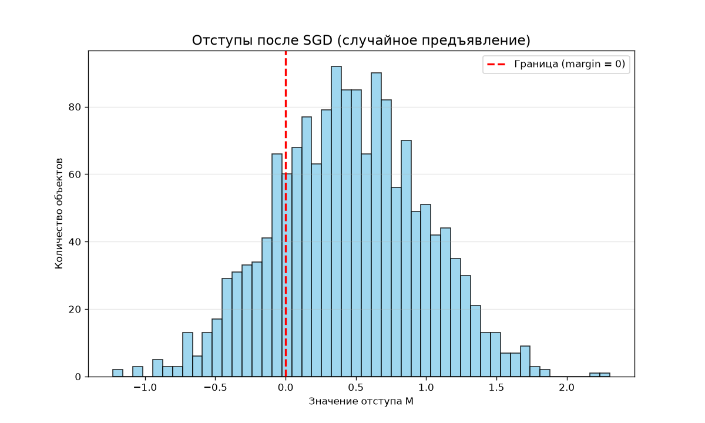

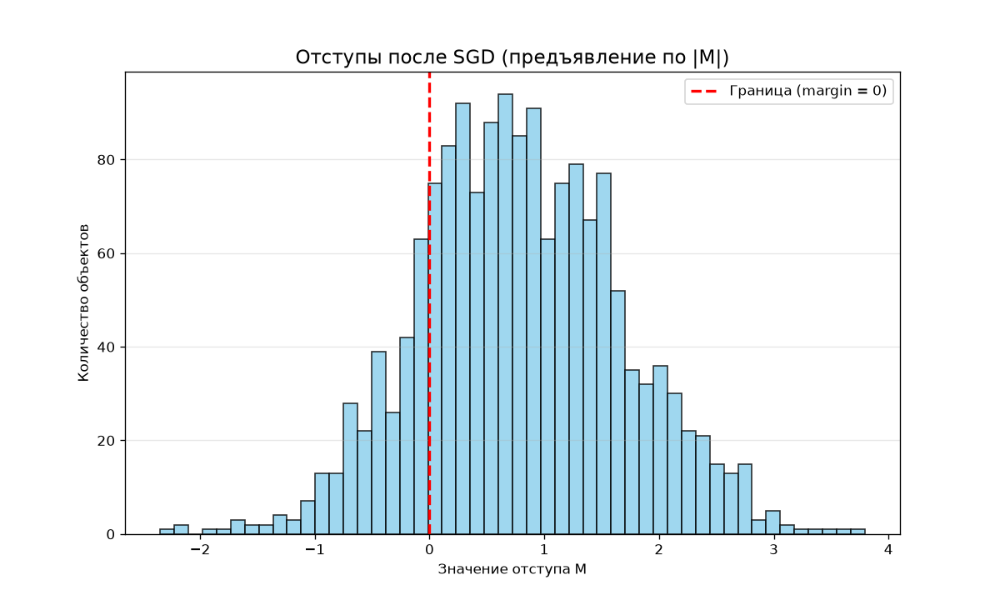

На train такой выбор снижает ошибку: больше массы гистограммы справа от нуля (верные знаки).

---

## 9. Обучение линейного классификатора

Три тестового запуска. Везде шаг 0.001, инерция 0.9, L2 0.1, 8000 шагов.

### 9.1. Инициализация корреляцией

Веса из корреляции признаков с ответом, студенты подаются случайно.

### 9.2. Случайная инициализация, мультистарт

Пять случайных стартов, оставляем прогон с меньшим средним штрафом на train (лучший штраф 0.545).

### 9.3. Случайное предъявление и предъявление по п.8

| прогон | доля верных, train | доля верных, test | точность test | полнота test | F1 test |
|---|---|---|---|---|---|
| 9.1 корреляция + случайный порядок | 80.00% | **84.00%** | 0.820 | 0.641 | 0.719 |
| 9.3 корреляция + выбор по отступу | 82.44% | 83.00% | 0.778 | 0.656 | 0.712 |
| **9.2 мультистарт, случайный порядок** | 82.25% | 83.25% | 0.740 | **0.734** | **0.737** |
| мультистарт + выбор по отступу | 80.12% | 80.75% | 0.748 | 0.602 | 0.667 |


Лучшая своя модель по F1 на test — мультистарт со случайным порядком. Выбор по отступу лучше на train, на test чуть слабее: граница подстроилась под спорных из обучения. У протокола 9.1 выше доля верных на test, но хуже полнота по выгоранию.

---

## 10. Оценка качества классификации

Выгорание — около 32% выборки. Если всегда отвечать «нет», доля верных уже около 68%. Поэтому кроме доли верных смотрели точность, полноту и F1 по классу «есть выгорание», плюс матрицу ошибок.

Матрица ошибок лучшей своей модели на test (мультистарт):

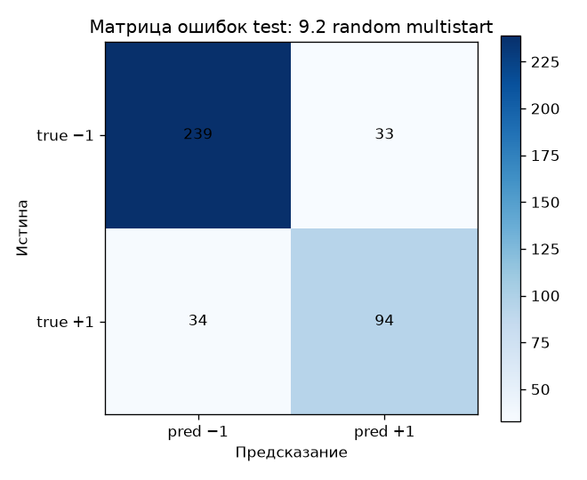

F1 на train и test по всем протоколам, включая эталон:

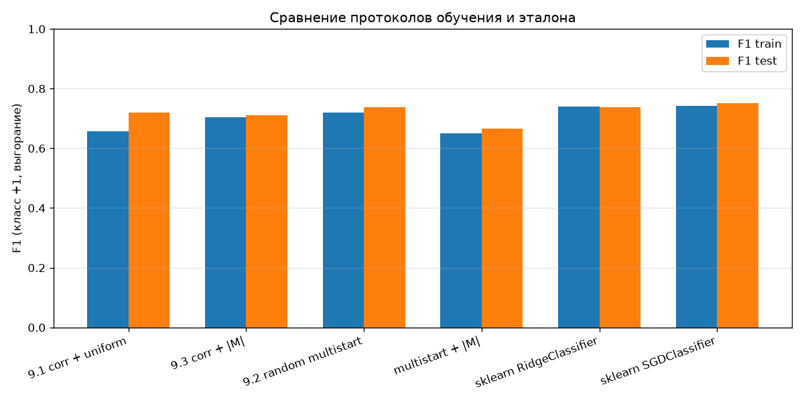

Решение принимается по знаку score (порог ноль). ROC в задании не нужна: она про все пороги сразу, в отчёте — одно фиксированное правило.

---

## 11. Сравнение с эталоном

Эталон — готовые линейные модели sklearn, не наш цикл:

- `RidgeClassifier` — та же идея квадратичного штрафа и L2, веса считаются сразу, затем берётся знак;
- `SGDClassifier` с квадратичной потерей — библиотечный стохастический спуск.

| модель | доля верных, train | доля верных, test | F1 test |
|---|---|---|---|
| своя лучшая (мультистарт) | 82.25% | 83.25% | 0.737 |
| RidgeClassifier | 84.31% | 84.75% | 0.738 |
| SGDClassifier | 84.44% | **85.50%** | **0.752** |

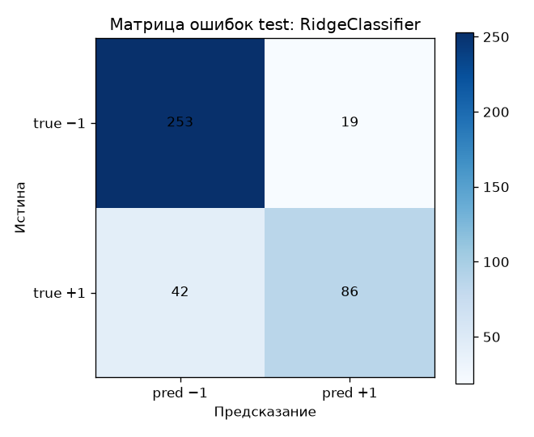

Свой спуск по F1 почти как Ridge. Библиотечный SGD чуть выше из‑за другой настройки регуляризации и цикла. Разница около полутора пунктов F1 для самописного метода нормальная.

---

## 12. Выводы

1. На очищенных признаках линейный классификатор даёт около 83–85% верных ответов на test и F1 примерно 0.72–0.74 по выгоранию.
2. Если оставить `burnout_score`, задача сводится к порогу по той же метке.
3. Старт через корреляцию (около 25% ошибок) уже лучше константы; SGD дожимает обучение до примерно 16–20% ошибок на train.
4. Шаг 0.001 устойчив, шаг 0.01 ломает обучение.
5. L2 укорачивает веса; слишком большая сила (10) даёт недообучение.
6. Скорейший подбор шага по одному объекту хуже постоянного шага.
7. Выбор по модулю отступа помогает на train; на test лучше мультистарт со случайным порядком.
8. Самописный SGD не отстаёт от RidgeClassifier.
