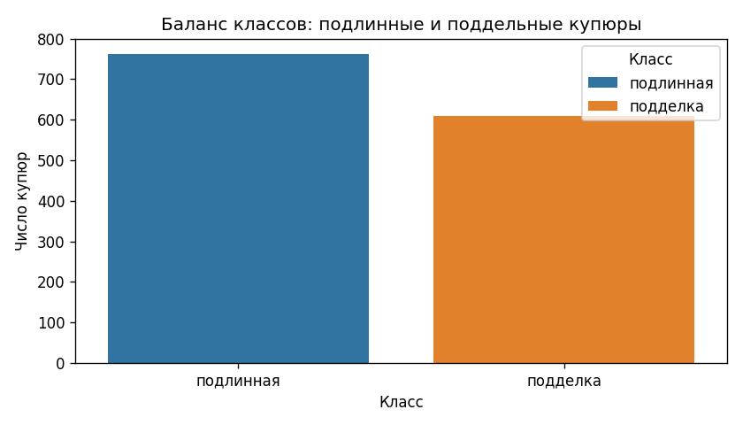
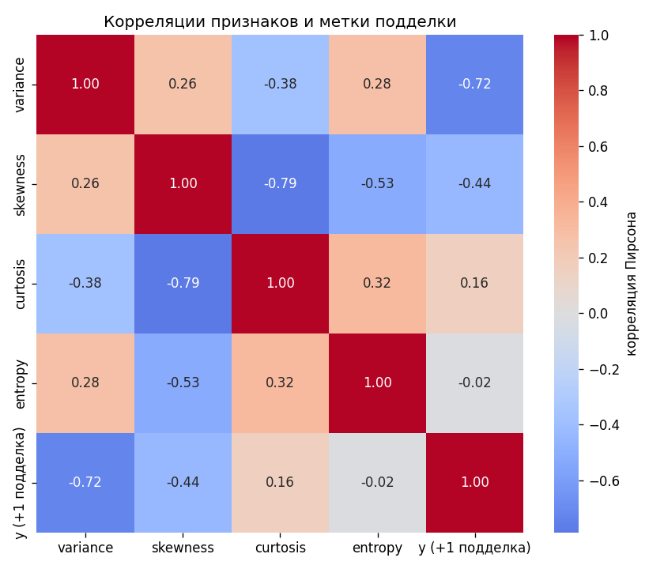
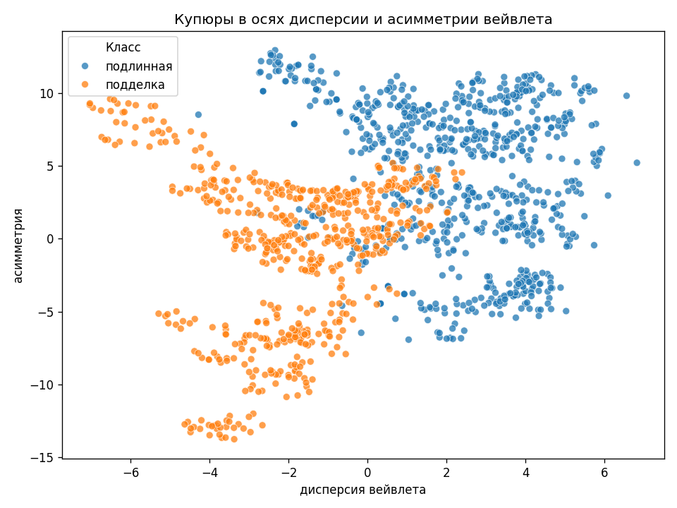
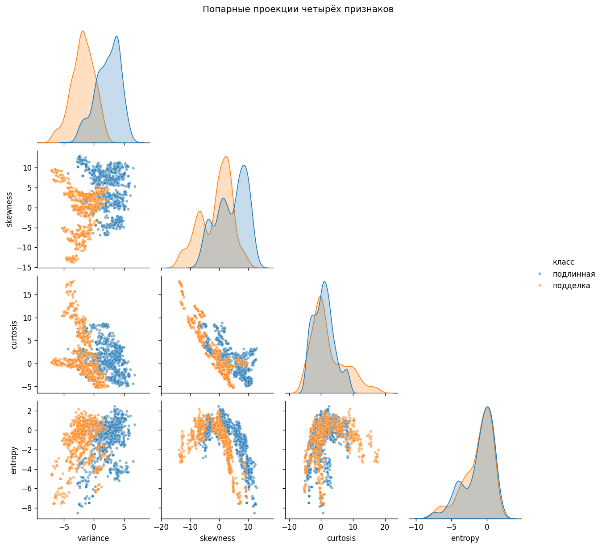
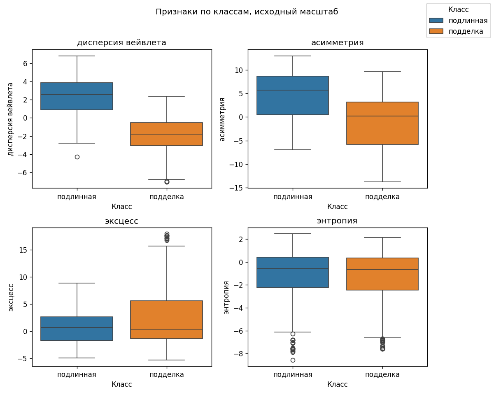
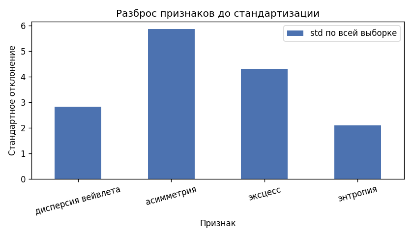
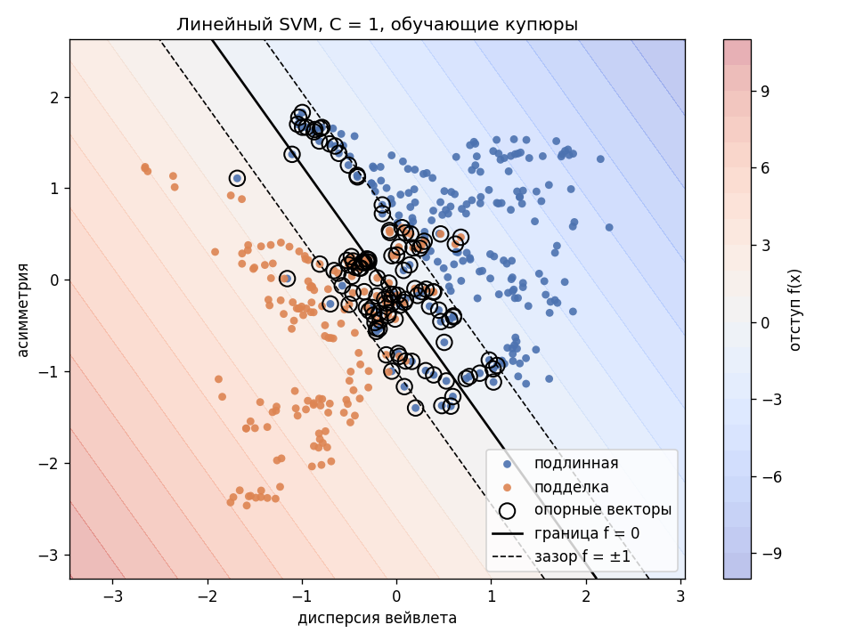
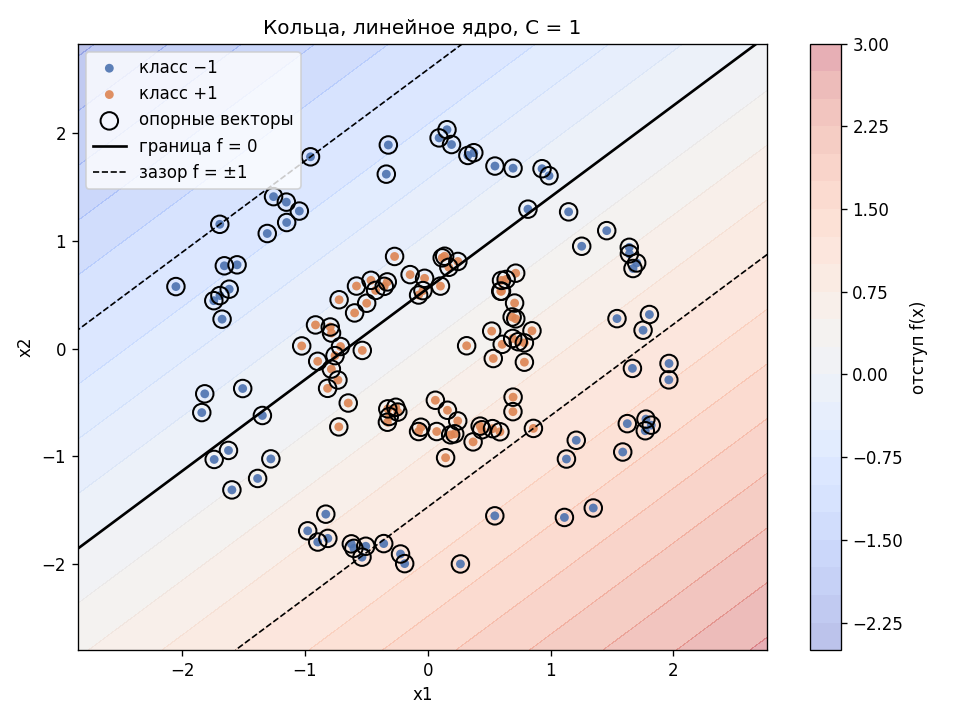
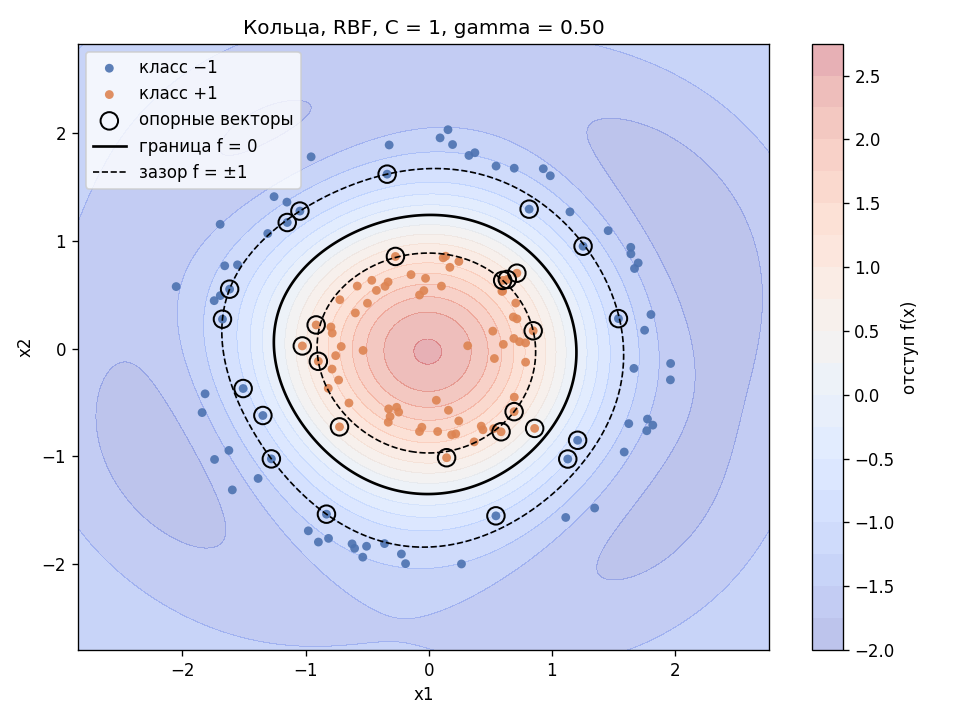

# Лабораторная 3. SVM

Датасет: Banknote Authentication (UCI, в коде качается с OpenML как `banknote-authentication`). 1372 изображения купюр, 4 признака вейвлет-преобразования. Класс: подлинная или подделка.

CSV в репозиторий не кладётся. Из каталога `lab3`:

```bash
python source/data.py    # EDA и картинки 01–06
python source/svm.py     # солвер, метрики, картинки 07–09
```

`svm.py` учит линейный SVM на купюрах, рисует двумерную границу и на кольцах показывает гауссово ядро. Рядом с каждой своей моделью считается `sklearn.svm.SVC` с тем же `C`, тем же ядром и тем же `gamma`.

## Признаки и метки

| Код OpenML | Имя | Смысл |
|---|---|---|
| V1 | variance | дисперсия вейвлет-образа |
| V2 | skewness | асимметрия |
| V3 | curtosis | эксцесс (написание из UCI) |
| V4 | entropy | энтропия |

Пропусков нет, колонки-идентификатора нет. В UCI 762 подлинных и 610 подделок. У класса OpenML `"1"` как раз 762 объекта, поэтому `"1"` — подлинная, `"2"` — подделка. В модель метки уже переведены: подлинная `-1`, подделка `+1`. Плюс — та купюра, которую надо поймать.

## EDA

Классы близки по размеру: подлинных 55.5%, подделок 44.5%.



Средние в исходном масштабе:

| Класс | variance | skewness | curtosis | entropy |
|---|---:|---:|---:|---:|
| подлинная | 2.277 | 4.257 | 0.797 | -1.148 |
| подделка | -1.868 | -0.994 | 2.148 | -1.247 |

Корреляция признака с меткой подделки (`+1`): variance −0.72, skewness −0.44, curtosis 0.16, entropy −0.02. Энтропия одна класс почти не разделяет. Её не выбрасываем до модели: маленький вес потом будет результатом обучения, а не решением на глаз.

Асимметрия и эксцесс коррелируют на −0.79. Это две стороны одной формы распределения, поэтому веса линейного SVM на них нельзя читать как независимую важность.



На плоскости variance–skewness облака стоят рядом и в середине перемешаны. Прямая в этих двух осях часть точек разрежет. Мягкий зазор здесь уместен. Остальные два признака в четырёхмерной модели могут развести то, что на рисунке слиплось.







Разброс до масштаба: skewness 5.87, curtosis 4.31, variance 2.84, entropy 2.10. У асимметрии разброс почти в три раза больше, чем у энтропии. Зазор SVM считается в евклидовой геометрии признаков, поэтому без стандартизации широкая ось перетянет границу на себя.



Выбросы по правилу 1.5 IQR: variance 0, skewness 0, curtosis 59 (4.3%), entropy 33 (2.4%). Точки не удаляем. Крайние купюры часто и есть опорные векторы.

## Результаты. Линейный SVM, четыре признака

`SLSQP` сошёлся за 23 итерации. Минимум двойственной цели `−21.72`. Ограничение `y·λ = 9·10⁻¹²`. Опорных векторов 32 из 400: 5 свободных, 27 упёрлись в потолок `λ = C`. На свободных `|y f(x) − 1|` в среднем `1.8·10⁻⁵`.

Прямая в стандартизованных признаках:

`f(x) = −1.97·variance − 2.66·skewness − 2.21·curtosis − 0.004·entropy − 0.69`

Энтропия в счёт почти не входит: вес `−0.004` при остальных весах около `−2`. Это совпадает с корреляцией `−0.02` и получено обучением. Асимметрия и эксцесс по-прежнему связаны, поэтому два больших веса не стоит читать по отдельности. Ширина зазора `1/‖w‖ = 0.25`. Запись `w·x + b` и ядерная форма на train отличаются максимум на `7·10⁻¹⁵`.

| | accuracy | precision +1 | recall +1 | F1 +1 | ROC-AUC |
|---|---:|---:|---:|---:|---:|
| база «всегда −1» | 0.556 | — | 0.000 | — | — |
| train, своя модель | 0.990 | 0.978 | 1.000 | 0.989 | 1.000 |
| test, своя модель | 0.981 | 0.958 | 1.000 | 0.979 | 1.000 |
| test, `SVC` linear, `C = 1` | 0.981 | 0.958 | 1.000 | 0.979 | 1.000 |

Матрица ошибок на test, строки — истина, столбцы — прогноз, порядок `[-1, +1]`:

|  | предсказана подлинная | предсказана подделка |
|---|---:|---:|
| подлинная | 221 | 8 |
| подделка | 0 | 183 |

Все 183 подделки на тесте пойманы. Восемь подлинных купюр названы подделкой, отсюда precision 0.958. На train та же картина: 218 верных подлинных, 4 ложные тревоги, 178 подделок без пропуска. Разрыв train 0.990 и test 0.981 маленький.

Метки своей модели и `SVC` совпали на всех 412 тестовых купюрах. Отступы разошлись максимум на 0.003, сдвиг `b` равен `−0.689` у своей модели и `−0.688` у `SVC`. Опорных векторов у эталона тоже 32.

## Результаты. Линейная граница на двух признаках

Отдельная модель только по дисперсии и асимметрии, те же 400 обучающих купюр, `C = 1`. На тесте accuracy 0.881, precision `+1` 0.864, recall `+1` 0.869, F1 0.866, ROC-AUC 0.959. Матрица `[[204, 25], [24, 159]]`. Опорных векторов 120: в двух осях коридор уже не вмещает облака, и многие λ садятся на потолок `C`. С `SVC` на этих же двух столбцах метки совпали полностью, отступы разошлись максимум на 0.0003.

Падение с 0.981 до 0.881 — плата за выброшенные эксцесс и энтропию. Четырёхмерная прямая на этот рисунок не наложена.



Сплошная линия — граница `f = 0`. Пунктир — бордюры зазора `f = ±1`. Чёрные кольца — опорные векторы. Подделки (оранжевые) лежат в стороне положительного отступа, подлинные — в стороне отрицательного. В середине коридора классы перемешаны, мягкий зазор это и разрешает.

## Результаты. Трюк с ядром

Кольца `make_circles`: 200 точек, шум 0.08, внутренний радиус 0.4 от внешнего. Split 70/30 и `StandardScaler`, как у купюр. `γ = 0.5`.

Линейное ядро на test: accuracy 0.567, precision `+1` 0.548, recall `+1` 0.767, F1 0.639, ROC-AUC 0.479. Матрица `[[11, 19], [7, 23]]`. Прямая режет оба кольца, ранжирование по отступу хуже постоянной модели.



RBF с тем же `C = 1` и `γ = 0.5`: accuracy 1.0 на train и на test, ROC-AUC 1.0. `SLSQP` сошёлся за 37 итераций, опорных векторов 28 (10 свободных, 18 на потолке `C`). На свободных `|y f(x) − 1|` в среднем `6·10⁻⁶`.

`SVC(kernel="rbf", C=1, gamma=0.5)` даёт те же метки на всех 60 тестовых точках. Отступы разошлись максимум на 0.001, сдвиг `b` равен `−1.168` у обеих моделей, опорных векторов у эталона тоже 28.



Граница `f = 0` замыкается вокруг внутреннего класса. Бордюры `f = ±1` повторяют её форму. Опорные векторы стоят на обоих кольцах, там, где классы ближе всего друг к другу.
