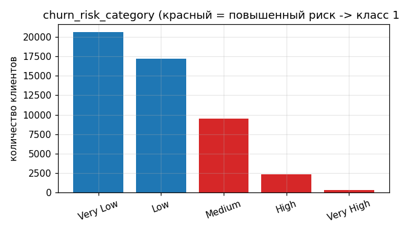
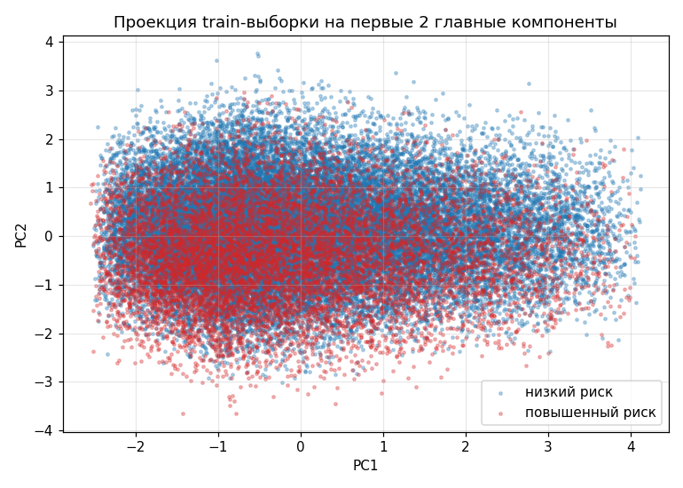
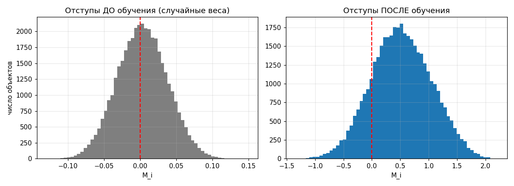
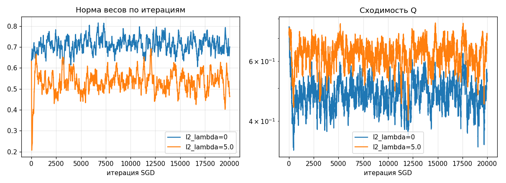
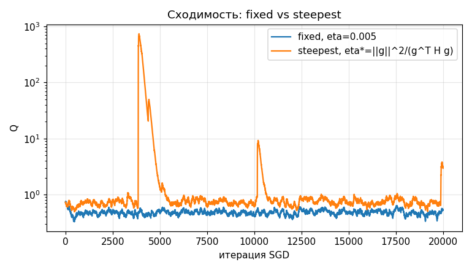
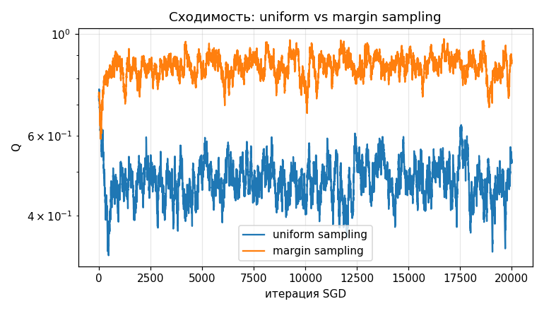
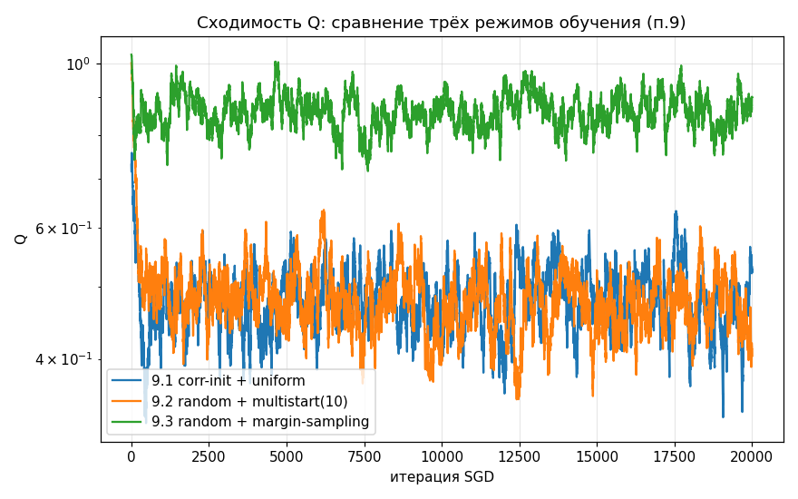
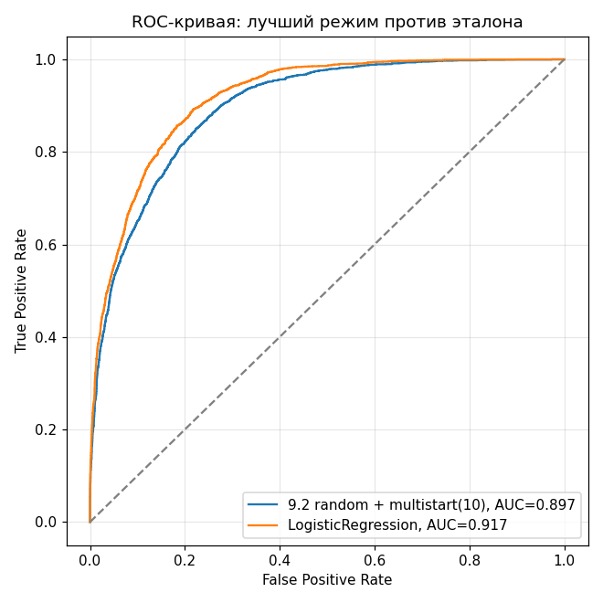
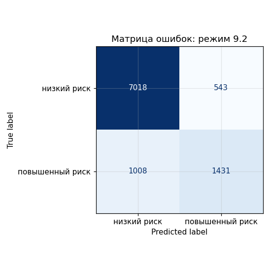

# Лабораторная работа №1. Линейная классификация

Код классификатора, загрузки данных и метрик — в source/. Весь код ниже воспроизводится запуском source/run_experiment.py, графики сохраняются в plots/ и встроены в этот файл по порядку.

## Датасет

E-commerce Customer Segmentation 2026 (Kaggle), 50000 строк. Датасет описывает клиентов интернет-магазина: демография, история покупок, вовлечённость (открытие писем, переходы по ссылкам), способ оплаты, канал покупок и итоговая оценка риска оттока.

Задача — бинарная классификация клиентов по риску оттока. Исходный таргет churn_risk_category размечен на 5 уровней (Very Low, Low, Medium, High, Very High), но для линейного классификатора и формулы отступа нужны ровно два класса, поэтому уровни объединены в грубую, но практически осмысленную группировку: низкий риск против повышенного — по сути вопрос сводится к тому, нужно ли уже сейчас обращать на клиента дополнительное внимание.

Таргет бинаризован: Very Low и Low — 0 (низкий риск), Medium/High/Very High — 1 (повышенный риск), это 24.4% объектов. Метки дальше перекодированы в -1/+1 под формулу отступа.

12 числовых признаков + 9 категориальных, StandardScaler + OneHotEncoder, итого 64 признака. Производные от таргета колонки (rfm_score, churn_risk_score, customer_health_score и подобные) исключены — утечки нет.

Split 80/20, стратификация по таргету, random_state=42, препроцессинг обучен только на train.

## Реализация

Один класс LinearClassifier с параметрами-переключателями: init (correlation/random/zeros), step_strategy (fixed/steepest), sampling_strategy (uniform/margin), l2_lambda, gamma, eta, n_starts.

Внутри реализованы: отступ объекта, квадратичная функция потерь и её градиент, рекуррентная оценка Q (скользящее среднее ошибки, ранняя остановка), SGD с инерцией, L2-регуляризация, закрытая формула для скорейшего шага, сэмплирование объектов по модулю отступа, корреляционная инициализация и мультистарт.

## PCA-проекция классов

Перед обучением — проверка, насколько классы разделимы визуально: проекция 64 признаков на первые 2 главные компоненты.

Классы визуально перемешаны, объяснённая дисперсия первых двух компонент — всего 15.6%. Это не противоречит дальнейшему качеству классификатора: PCA ищет направления максимальной дисперсии данных, а не максимальной разделимости классов, и разделяющая гиперплоскость вполне может проходить в направлениях, которые PCA здесь не выделяет.

## Отступ объекта

Отступ — метка класса, умноженная на значение решающей функции (сумма весов на признаки плюс bias). Гистограммы ниже — распределение отступов при случайных весах и после обучения (корреляционная инициализация, uniform-сэмплирование, fixed-шаг, momentum, L2).

Доля объектов с отрицательным отступом (ошибка классификации) падает с 0.468 до 0.162. Доля пограничных объектов (модуль отступа меньше 0.5) остаётся высокой — 0.466 — датасет не разделяется с чистым зазором, что согласуется с картиной на PCA-проекции выше.

## L2-регуляризация

Сравнение двух классификаторов с одинаковыми настройками, отличающихся только l2_lambda (0 и 5.0).

С ростом l2_lambda норма весов монотонно падает — регуляризация работает как задумано. При этом train и test loss почти совпадают в обоих случаях: переобучения на этом датасете нет (40000 объектов против 64 признаков), поэтому сильная регуляризация тут не помогает, а только недообучивает модель.

## Скорейший градиентный спуск

Сравнение фиксированного шага и шага, аналитически минимизирующего потерю текущего объекта за одну итерацию.

Формула eta=1/(2*norm(x)^2) выведена для чистой квадратичной потери одного объекта без регуляризации: она предполагает, что шаг идёт строго вдоль x. При добавлении L2 к градиенту (grad = loss_grad + 2*l2*w) направление шага перестаёт совпадать с x, и эта формула больше не минимизирует то, что реально оптимизируется. Поэтому steepest_eta переписан: шаг теперь выводится из полного градиента g (loss + L2) по общей формуле точного шага вдоль направления для квадратичной функции, eta = ||g||^2 / (g^T H g), где H — гессиан (1-M)^2 + l2*||w||^2 вдоль g. При l2=0 формула сводится к прежней 1/(2*||x||^2), так что старый случай остаётся её частным случаем.

fixed сходится к заметно лучшему качеству, чем steepest (ROC-AUC 0.881 против 0.633 на test). С учётом L2 в самой формуле шаг steepest стал самоограничивающимся: L2-слагаемое в знаменателе растёт вместе с нормой весов, поэтому шаг сам себя всё сильнее укорачивает по ходу обучения, и за фиксированное число итераций классификатор не успевает набрать качество. Умеренный фиксированный шаг в этой задаче остаётся практичнее аналитически точного, но чрезмерно осторожного steepest.

## Сэмплирование по модулю отступа

Вместо равномерного случайного выбора объекта — вероятность выбора обратно пропорциональна модулю его отступа (чаще предъявляются пограничные объекты).

При одинаковой (корреляционной) инициализации margin-сэмплирование даёт небольшой, но стабильный прирост метрик относительно uniform.

## Три режима обучения и оценка качества

Все три режима — SGD с инерцией и L2, общие гиперпараметры eta=0.005, gamma=0.9, l2_lambda=0.01, max_iter=20000:

9.1, корреляционная инициализация + uniform-сэмплирование: accuracy 0.835, precision 0.670, recall 0.640, F1 0.655, ROC-AUC 0.881.

9.2, случайная инициализация + мультистарт из 10 стартов: accuracy 0.845, precision 0.725, recall 0.587, F1 0.649, ROC-AUC 0.897 — лучший из трёх.

9.3, случайная инициализация + margin-сэмплирование: accuracy 0.831, precision 0.701, recall 0.532, F1 0.605, ROC-AUC 0.880.

Margin-сэмплирование само по себе работает — в изолированном сравнении выше оно стабильно выигрывает у uniform. Но именно режим 9.3 (случайная инициализация вместе с margin-сэмплированием) оказался хуже даже базового режима 9.1 — вероятно потому, что вероятности выбора объектов на первых шагах считаются по ещё не обученным случайным весам, что уводит обучение по менее удачной траектории. Мультистарт устойчивее по конструкции: он не может обучиться хуже одного случайного старта, так как выбирается лучший из 10 прогонов.

## Сравнение с эталоном

DummyClassifier (most_frequent): accuracy 0.756, ROC-AUC 0.5.

LogisticRegression из sklearn, эталон: accuracy 0.854, precision 0.741, recall 0.620, F1 0.675, ROC-AUC 0.917.

LinearClassifier, лучший режим 9.2: accuracy 0.845, precision 0.725, recall 0.587, F1 0.649, ROC-AUC 0.897.

Разрыв с эталоном по ROC-AUC — 0.019, некатастрофично: LogisticRegression решает задачу точным методом (L-BFGS) с логистической функцией потерь, а собственная реализация — SGD с упрощённой квадратичной потерей. Обе модели уверенно превосходят DummyClassifier.

Кривые идут близко друг к другу почти на всём диапазоне, что и отражает разрыв в 0.019 по AUC.

Из 2439 клиентов с реальным повышенным риском модель верно нашла 1431 и пропустила 1008 — это и есть recall 0.587. Ложных тревог (низкий риск, предсказанный как повышенный) меньше — 543 из 7561.

## Выводы

1. Реализован единый класс LinearClassifier: отступ, квадратичная потеря и градиент, рекуррентная оценка Q, SGD с инерцией, L2-регуляризация, скорейший градиентный спуск, сэмплирование по модулю отступа, корреляционная инициализация и мультистарт.
2. Доля ошибок классификации падает с 0.468 (случайные веса) до 0.162 после обучения.
3. Переобучения на этом датасете не наблюдается ни при одном l2_lambda — train и test loss почти совпадают.
4. fixed-шаг оказался стабильнее steepest: правильно учитывающий L2 точный шаг становится самоограничивающимся и слишком осторожным для SGD за ограниченное число итераций.
5. Margin-сэмплирование само по себе улучшает качество, но лучший из трёх режимов — 9.2 (случайная инициализация плюс мультистарт), ROC-AUC 0.897 на test.
6. Разрыв с LogisticRegression по ROC-AUC — 0.019, что подтверждает корректность собственной реализации.
