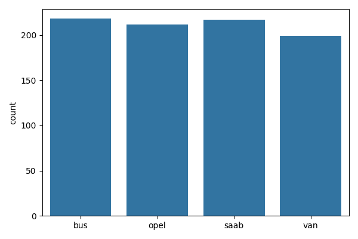
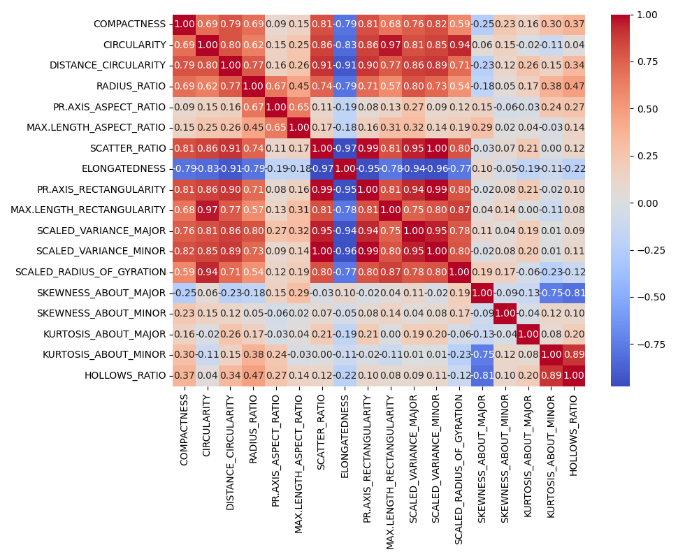
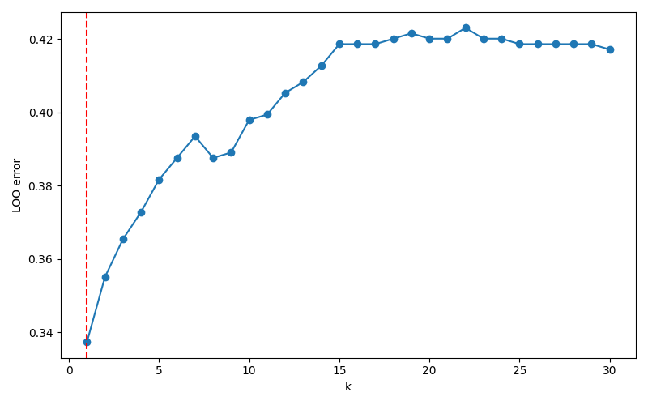
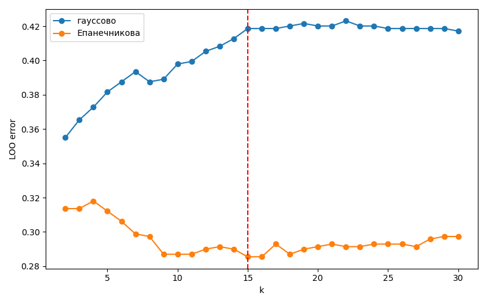
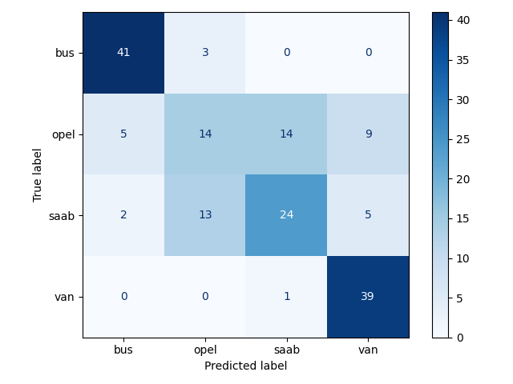
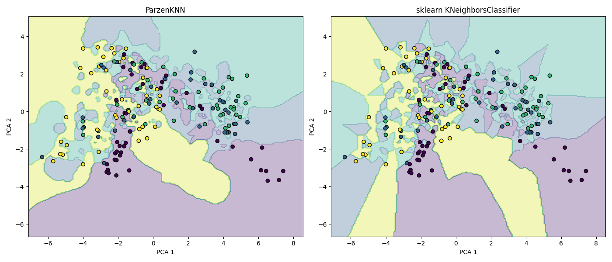
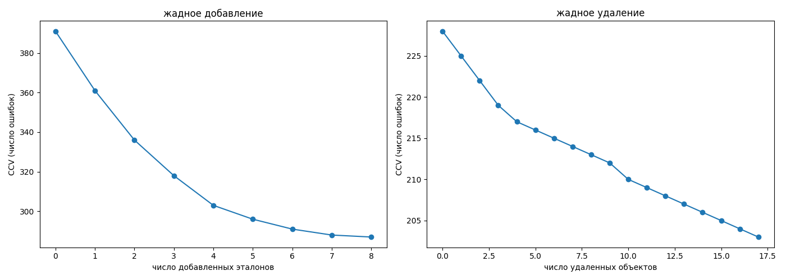
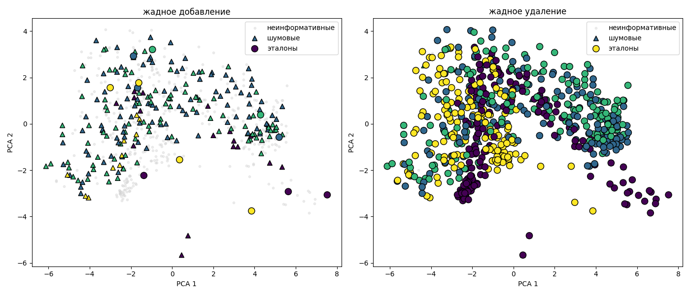

# Лабораторная работа №2. Метрическая классификация

В рамках лабораторной работы предстоит реализовать алгоритм классификации KNN и подобрать параметр k методом скользящего контроля.

На лекции были рассмотрены следующие алгоритмы:
* алгоритм метрической классификации KNN;
* метод окна Парзена;
* алгоритм отбора эталонов.

## Задание

1. выбрать датасет для классификации, например на [kaggle](https://www.kaggle.com/datasets?tags=13302-Classification);
2. реализовать алгоритм KNN с методом окна Парзена переменной ширины;
   1. в качестве ядра можно использовать гауссово ядро;
3. подобрать параметр k методом скользящего контроля (LOO);
4. обосновать выбор параметров алгоритма, построить графики эмпирического риска для различных k;
5. сравнить с [эталонной](https://scikit-learn.org/stable/) реализацией KNN;
   1. сравнить качество работы алгоритмов;
6. реализовать алгоритм отбора эталонов;
7. подготовить визуализацию результатов работы алгоритма отбора эталонов;
8. сравнить качество работы KNN с и без отбора эталонов; 
9. подготовить небольшой отчет о проделанной работе.

Код классификатора, загрузки данных и метрик - в knn.py, loo.py, stolp.py, data.py. Весь код ниже воспроизводится запуском model.py, графики сохраняются в plots/ и встроены в этот файл по порядку.

## Датасет

Statlog Vehicle Silhouettes (openml, data_id=54), 846 объектов, 18 числовых признаков формы силуэта автомобиля, 4 класса: bus, saab, opel, van, по 199-218 объектов на класс.

Есть сильно коррелированные пары признаков (до 0.996), но ничего не выкидывалось - для категориального таргета нет надежного критерия отбора.

Split 80/20 со стратификацией, random_state=42, StandardScaler по train.

## Реализация

ParzenKNN (knn.py) - окно Парзена переменной ширины: ширина объекта - расстояние до k-го соседа, вес соседей - ядро (гауссово по умолчанию, также есть Епанечникова) от отношения расстояния к ширине.

LOO (loo.py) - доля ошибок по leave-one-out для каждого k.

Отбор эталонов (stolp.py) - два жадных алгоритма, минимизируют CCV(Omega) (число ошибок при классификации train набором Omega):

жадное добавление - старт с одного объекта на класс, на каждом шаге добавляется объект, с которым CCV минимален, пока это уменьшает CCV;

жадное удаление - старт со всей выборки, на каждом шаге удаляется объект, без которого CCV минимален. Честный перебор на 676 объектах занял бы часы, поэтому для k=1 сделан векторизованный пересчет (идентичен честному перебору, но на порядки быстрее), для k>1 - обычный перебор.

## Подбор k

Минимум на k=1, дальше ошибка монотонно растет до 0.42 к k=20-22. Причина - бесконечный носитель гауссова ядра: вес считается по всей выборке, и с ростом k в сумму попадают все более далекие объекты чужих классов. У обычного sklearn KNN на этом же train минимум не на границе, а на k=8 (0.296).

У ядра Епанечникова носитель конечный (вес точно 0 за пределами окна), при k=1 оно вырождается, но дальше ведет себя как обычный KNN - минимум на k=15 (0.286). Подтверждает, что монотонный рост с гауссовым ядром - свойство ядра, а не датасета.

## Обучение и оценка качества

ParzenKNN, k=1, accuracy на test - 0.694.

## Область классификации

Оба классификатора - на 2 главных компонентах (только для визуализации), k=1. Границы похожи, но не идентичны: у ParzenKNN немного более гладкие.

## Сравнение с эталоном

KNeighborsClassifier из sklearn, k=1: accuracy 0.718 против 0.694 у ParzenKNN. Разница из-за конструкции: ParzenKNN даже при k=1 взвешивает всю выборку через гауссово ядро, а не берет единственного ближайшего соседа.

## Отбор эталонов

Оба алгоритма быстро застревают в локальном оптимуме: добавление останавливается на 12 объектах, удаление - после 17 удалений из 676.

Крупные кружки - эталоны, треугольники - шумовые объекты (отрицательный отступ), мелкие точки - неинформативные.

Accuracy: без отбора (676) - 0.694; жадное добавление (12) - 0.559; жадное удаление (659) - 0.706.

## Выводы

1. Реализован ParzenKNN - окно Парзена переменной ширины с гауссовым ядром, работает для любого числа классов.
2. Отбор признаков по корреляции с таргетом не применим (таргет категориальный), использованы все 18 признаков.
3. LOO дал оптимум на k=1 с гауссовым ядром (монотонный рост ошибки дальше) и на k=15 с ядром Епанечникова - разница из-за бесконечного носителя гауссианы.
4. Accuracy 0.694 против 0.718 у sklearn KNeighborsClassifier при одинаковом k.
5. Оба жадных алгоритма отбора эталонов быстро застревают в локальном оптимуме: добавление - 12 объектов (accuracy 0.559), удаление - 659 из 676 (accuracy 0.706).
