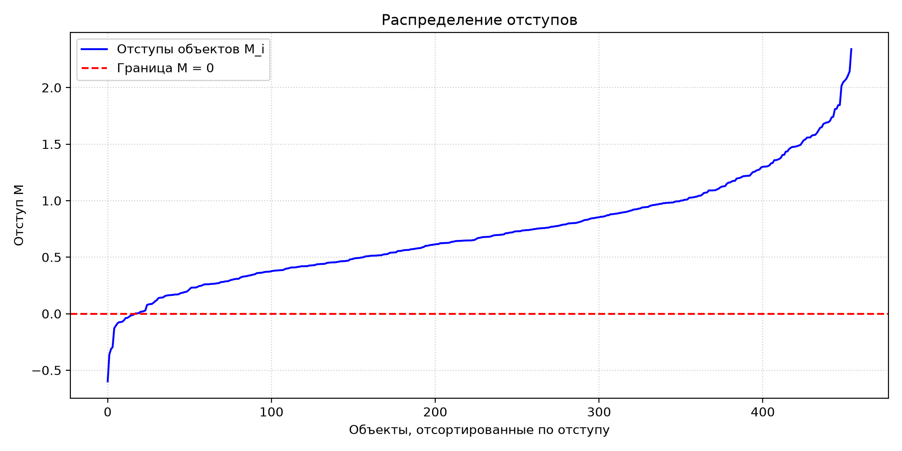
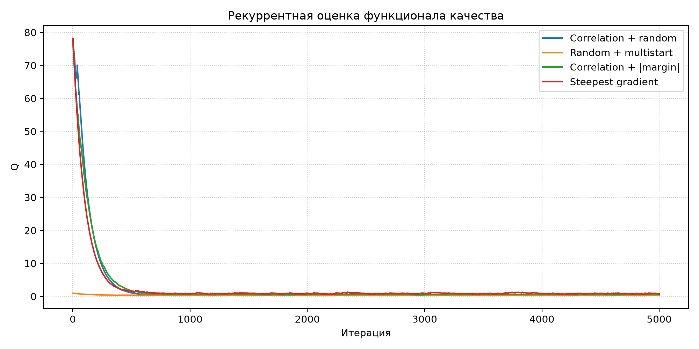
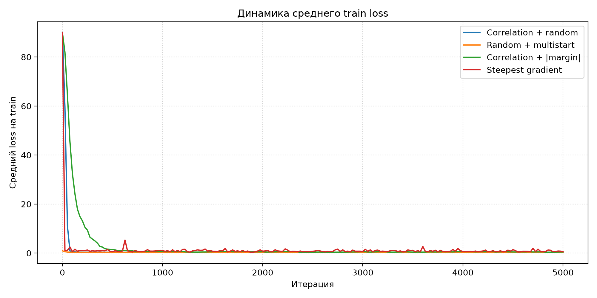
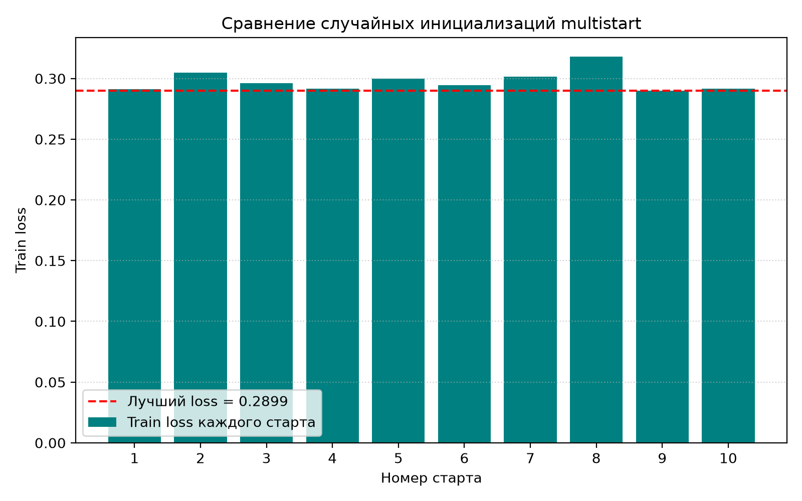
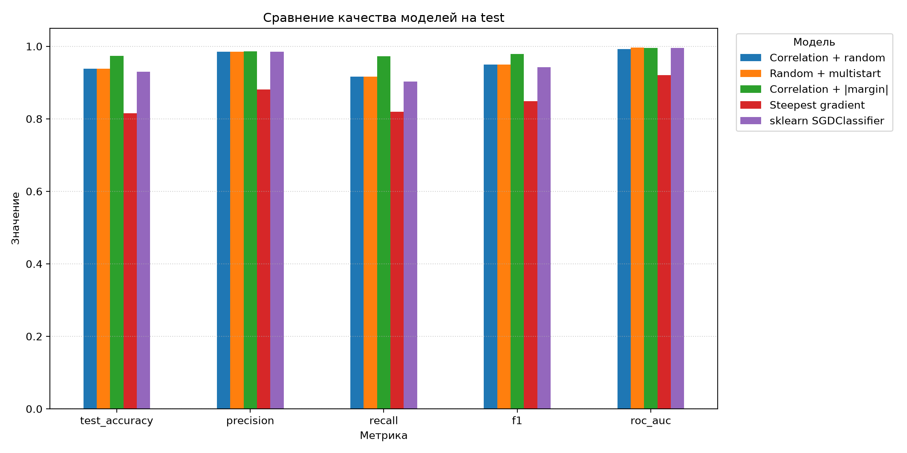
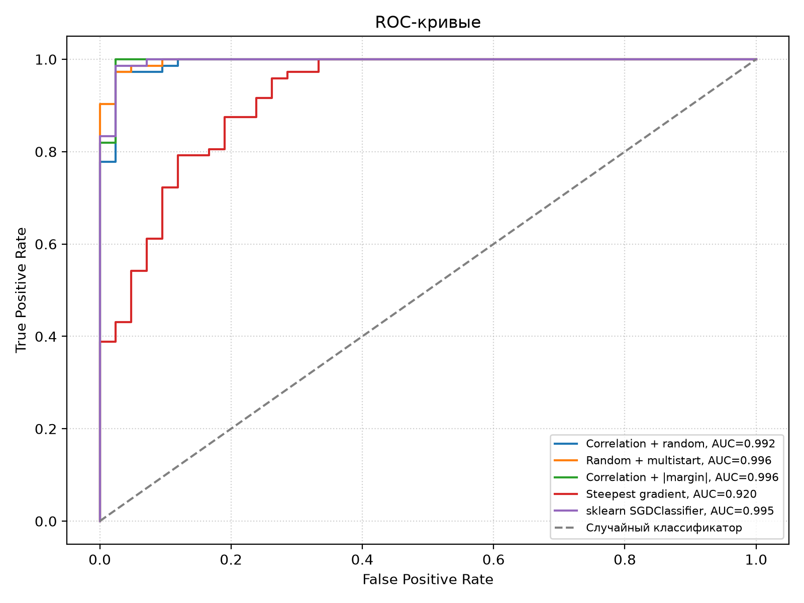

# Лабораторная работа №1. Линейная классификация

## Цель работы

Реализовать линейный бинарный классификатор и основные элементы метода
стохастического градиента: вычисление отступа, квадратичную функцию потерь
и её градиент, рекуррентную оценку функционала качества, momentum,
L2-регуляризацию, скорейший градиентный спуск, различные способы
инициализации весов и предъявления объектов. Оценить качество моделей
и сравнить собственные реализации с эталонным алгоритмом из `sklearn`.

## Датасет

Использован датасет **Breast Cancer Wisconsin Diagnostic**, доступный
через `sklearn.datasets.load_breast_cancer`. Он содержит 569 объектов,
30 вещественных признаков и бинарную целевую переменную.

Признаки описывают характеристики клеточных ядер. Названия колонок
в `sklearn.datasets.load_breast_cancer` соответствуют следующим характеристикам:

- `mean radius`, `radius error`, `worst radius` — радиус;
- `mean texture`, `texture error`, `worst texture` — текстура;
- `mean perimeter`, `perimeter error`, `worst perimeter` — периметр;
- `mean area`, `area error`, `worst area` — площадь;
- `mean smoothness`, `smoothness error`, `worst smoothness` — гладкость;
- `mean compactness`, `compactness error`, `worst compactness` — компактность;
- `mean concavity`, `concavity error`, `worst concavity` — вогнутость;
- `mean concave points`, `concave points error`, `worst concave points` — количество вогнутых точек;
- `mean symmetry`, `symmetry error`, `worst symmetry` — симметрия;
- `mean fractal dimension`, `fractal dimension error`, `worst fractal dimension` — фрактальная размерность.

Для каждой из 10 характеристик представлены три колонки: `mean` — среднее
значение, `error` — стандартная ошибка, `worst` — среднее трёх наибольших
измерений. Таким образом, в датасете содержится 30 признаков.

Два исходных класса преобразованы в метки:

- `-1` — malignant, злокачественное образование: 212 объектов, около 37.3%;
- `+1` — benign, доброкачественное образование: 357 объектов, около 62.7%.

Precision, recall и F1 рассчитываются для положительного класса **benign**.
ROC AUC также оценивает ранжирование относительно этого класса.

Данные разделяются на train и test в отношении 80/20 со стратификацией
и `random_state=42`. Обучающая выборка содержит 455 объектов,
тестовая — 114. Стандартизация выполняется без утечки данных:
`StandardScaler` обучается только на train, затем то же преобразование
применяется к test.

## Линейный классификатор и отступ

Для линейного классификатора используется разделяющая функция

$$
g(x,w)=\langle x,w\rangle.
$$

Предсказание определяется знаком значения разделяющей функции:

$$
a(x,w)=\operatorname{sign}\left(\langle x,w\rangle\right).
$$

Отступ объекта определяется как

$$
M_i=y_i\langle x_i,w\rangle.
$$

Если отступ отрицательный, объект классифицирован ошибочно.
Если отступ положительный, классификация верна. Малое абсолютное
значение отступа означает близость объекта к разделяющей границе.

Ниже показано распределение отступов **на обучающей выборке после обучения
модели `Correlation + random`**. Объекты отсортированы по величине
отступа; пунктирная линия соответствует нулевому отступу.

Большинство объектов имеет положительный отступ. Train accuracy этой модели
составляет 0.9626: правильно классифицированы 438 из 455 обучающих объектов.
Объекты около границы являются наиболее неуверенными для классификатора.

## Квадратичная функция потерь

Используется квадратичная функция потерь

$$
L(M)=(1-M)^2.
$$

Так как отступ равен произведению метки класса и значения разделяющей функции,
градиент функции потерь по весам имеет вид

$$
\nabla_w L
=
-2yx\left(1-y\langle x,w\rangle\right)
=
-2yx(1-M).
$$

Потеря минимальна при отступе, равном единице. Она штрафует как отрицательные,
так и слишком большие положительные отступы. Поэтому меньшая квадратичная
потеря не обязательно соответствует большей accuracy.

## Рекуррентная оценка функционала качества

Начальное значение функционала качества рассчитывается как среднее значение
функции потерь на случайных 10% train-объектов. После обработки очередного
объекта используется рекуррентное обновление

$$
Q_t=\lambda_q\xi_t+(1-\lambda_q)Q_{t-1},
$$

где потеря на выбранном объекте вычисляется до обновления весов.
В эксперименте используется темп забывания 0.01.

Поскольку разные способы предъявления объектов формируют разные
последовательности потерь, дополнительно через одинаковые интервалы
вычисляется средний loss на всей train-выборке.

## Стохастический градиентный спуск с momentum

Для сглаживания стохастических градиентов используется momentum:

$$
v_t=\gamma v_{t-1}+(1-\gamma)\nabla L_t,
$$

$$
w_t=w_{t-1}-hv_t.
$$

В эксперименте используются коэффициент инерции 0.9 и шаг обучения 0.001.
Каждый запуск собственного SGD включает 5000 предъявлений объектов.

## L2-регуляризация

Регуляризованная функция потерь имеет вид

$$
\widetilde{L}(w)=L(w)+\frac{\tau}{2}\|w\|^2.
$$

Её градиент:

$$
\nabla\widetilde{L}=\nabla L+\tau w.
$$

В сочетании с momentum используется обновление

$$
w_t=(1-h\tau)w_{t-1}-hv_t.
$$

Коэффициент регуляризации равен 0.001. Регуляризуются все 30 весов признаков.

## Инициализация весов

### Корреляционная инициализация

Для каждого признака начальный вес вычисляется по формуле

$$
w_j=\frac{\langle y,f_j\rangle}{\langle f_j,f_j\rangle}.
$$

### Случайная инициализация и multistart

Начальные веса генерируются из распределения

$$
w_j\sim U\left(-\frac{1}{2n},\frac{1}{2n}\right),
$$

где число признаков равно 30.

Выполнено 10 независимых запусков с одинаковыми параметрами SGD.
Лучшим оказался запуск №9 с train loss = **0.289909**.
Лучший запуск выбирался только по минимальной потере на train;
test-выборка при выборе не использовалась.

## Предъявление объектов по модулю отступа

Помимо равновероятного случайного предъявления реализован вариант,
в котором объекты с малым абсолютным отступом предъявляются чаще:

$$
p_i\propto\frac{1}{|M_i|+\varepsilon}.
$$

Полученные веса нормируются так, чтобы сумма вероятностей равнялась единице.
Для предотвращения деления на ноль используется добавка 0.00000001.

Чем меньше абсолютный отступ, тем ближе объект к разделяющей границе
и тем выше вероятность его выбора.

## Скорейший градиентный спуск

Для одного объекта квадратичная функция потерь имеет вид

$$
L(w)=\left(1-y\langle x,w\rangle\right)^2.
$$

При используемом в программе градиенте

$$
\nabla_w L=-2yx\left(1-y\langle x,w\rangle\right)
$$

аналитически оптимальный шаг равен

$$
h^*=\frac{1}{2\|x_i\|^2}.
$$

После этого веса обновляются по формуле

$$
w_{t+1}=w_t-h^*\nabla_w L.
$$

Множитель 2 в знаменателе согласован с множителем 2 в градиенте
квадратичной функции потерь.

Скорейший градиентный спуск исследуется отдельно от momentum
и L2-регуляризации. Шаг минимизирует потерю одного выбранного объекта,
поэтому не гарантирует снижения средней потери на всей выборке.

## Эталонное решение

Для сравнения используется готовая реализация
`sklearn.linear_model.SGDClassifier`. Все элементы собственного
линейного классификатора реализованы отдельно с использованием `numpy`.

Параметры эталона:

- `loss="squared_error"` — квадратичная потеря;
- `penalty="l2"`, `alpha=0.0005` — L2-регуляризация;
- `fit_intercept=False` — свободный член отключён;
- `learning_rate="invscaling"`, `eta0=0.002`, `power_t=0.5` — убывающий шаг;
- `max_iter=5000`, `tol=0.000001`, `random_state=42`.

В sklearn квадратичная потеря содержит множитель 0.5.
Поэтому коэффициент регуляризации эталона равен половине коэффициента
собственной модели: цели совпадают с точностью до общего множителя.

Для всех моделей в таблице рассчитывается одинаковый средний train loss,
без L2-штрафа:

$$
\mathrm{train\ loss}=\frac{1}{N}\sum_{i=1}^{N}(1-y_i s_i)^2
=\frac{1}{N}\sum_{i=1}^{N}(y_i-s_i)^2,
$$

где непрерывный результат эталона получается через
`decision_function(X_train)`. Равенство справедливо для меток −1 и +1.

У собственного SGD 5000 итераций означают предъявления отдельных объектов,
а `max_iter` sklearn задаёт максимальное число проходов по всей выборке.
Поэтому сравнивается итоговое качество моделей, а не скорость обучения
при одинаковом числе обновлений весов.

## Результаты

Итоговые значения метрик:

| Модель | Train loss | Train acc. | Test acc. | Precision | Recall | F1 | ROC AUC |
| --- | ---: | ---: | ---: | ---: | ---: | ---: | ---: |
| Corr. + random | 0.2913 | 0.9626 | 0.9386 | 0.9851 | 0.9167 | 0.9496 | 0.9924 |
| Multistart | 0.2899 | 0.9626 | 0.9386 | 0.9851 | 0.9167 | 0.9496 | 0.9964 |
| Corr. + margin | 0.4710 | 0.9934 | 0.9737 | 0.9859 | 0.9722 | 0.9790 | 0.9957 |
| Steepest | 0.5683 | 0.8681 | 0.8158 | 0.8806 | 0.8194 | 0.8489 | 0.9203 |
| sklearn SGD | 0.2954 | 0.9692 | 0.9298 | 0.9848 | 0.9028 | 0.9420 | 0.9954 |

ROC-кривая строится по непрерывному значению разделяющей функции

$$
s(x)=\langle x,w\rangle.
$$

Она показывает качество ранжирования объектов при изменении порога
классификации.

### Анализ результатов

Максимальная test accuracy среди собственных реализаций составляет **0.9737**
и получена для `Correlation + |margin|`. Максимальный ROC AUC составляет
**0.996362** и получен для `Random + multistart`.

Для сравнения способов предъявления объектов обучены две модели с одинаковой
корреляционной инициализацией. При случайном предъявлении test accuracy
составила **0.9386**, F1 — **0.9496**, ROC AUC — **0.992394**.
При предъявлении по модулю отступа получены **0.9737**, **0.9790**
и **0.995701** соответственно. В данном эксперименте предъявление
по модулю отступа улучшило все три метрики.

Несмотря на улучшение классификации, train loss модели с предъявлением
по модулю отступа выше: **0.4710** против **0.2913**.
Это связано с изменением распределения предъявляемых объектов и с тем,
что квадратичная потеря учитывает величину отступа, а accuracy — только его знак.

Скорейший градиентный спуск получил test accuracy **0.8158**, F1 **0.8489**
и ROC AUC **0.920304**. Его train loss равен **0.5683**, что выше,
чем у вариантов SGD с momentum и L2. Точный шаг по отдельному объекту
приводит к колебаниям весов и менее стабильному итоговому результату.

Собственная модель с минимальным train loss — `Random + multistart` —
получила test accuracy **0.9386**, F1 **0.9496** и ROC AUC **0.996362**.
У эталона значения составили **0.9298**, **0.9420** и **0.995370**.
Таким образом, выбранная по train loss собственная модель показывает качество,
близкое к библиотечной реализации.

Модель `Correlation + |margin|` правильно классифицировала 111 из 114
тестовых объектов, обычный SGD и multistart — 107, эталон — 106.
Разница на одном разбиении не доказывает общего превосходства метода.

## Вывод

Реализован линейный бинарный классификатор с квадратичной функцией потерь. Выполнены вычисление и анализ отступов,
расчёт градиента, рекуррентная оценка функционала качества, SGD с momentum,
L2-регуляризация, скорейший градиентный спуск, корреляционная и случайная
инициализации, multistart и два способа предъявления объектов.

Наибольшая test accuracy в эксперименте составила **0.9737**
для предъявления по модулю отступа. Наименьшая потеря на train
среди собственных моделей составила **0.289909** для multistart.

Собственная реализация SGD показала качество, сопоставимое с эталонным
`SGDClassifier`. При этом способ предъявления объектов и выбор шага
существенно повлияли на результат обучения.
