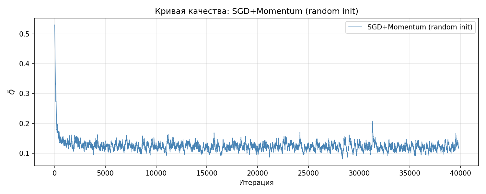
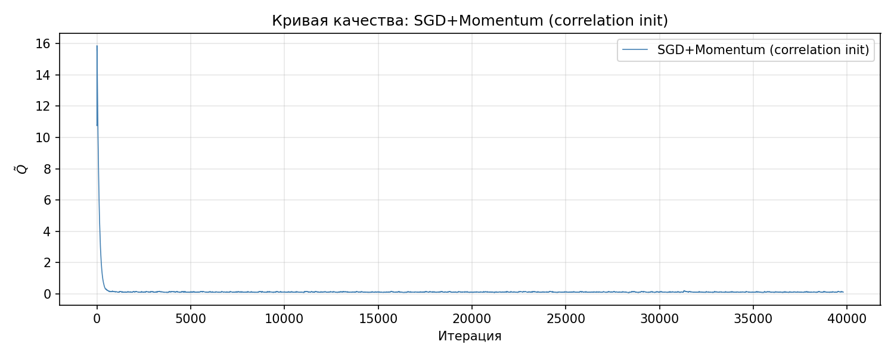
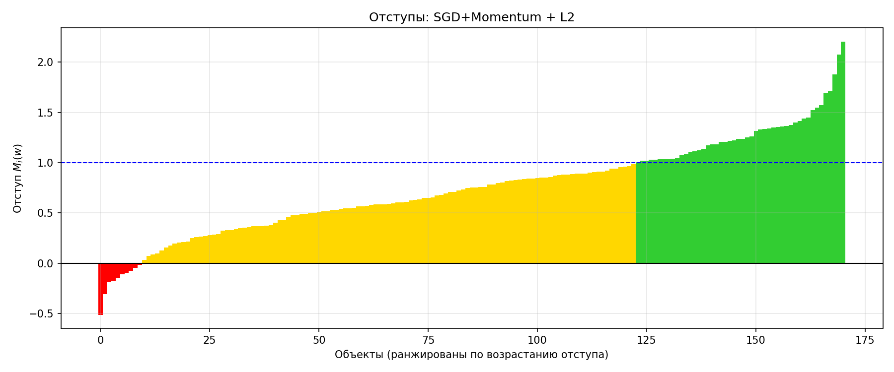
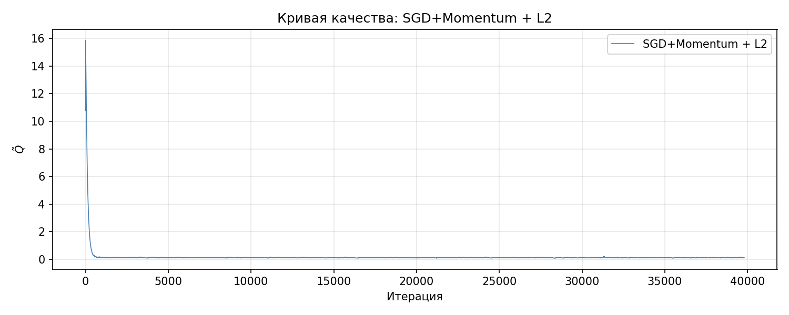
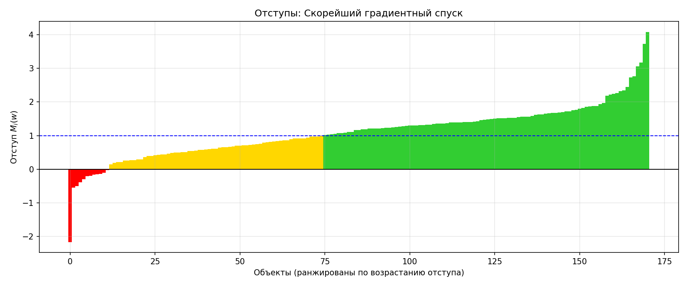
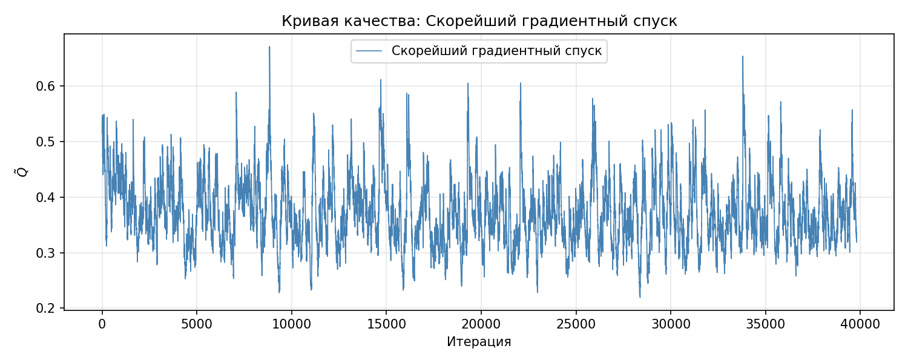
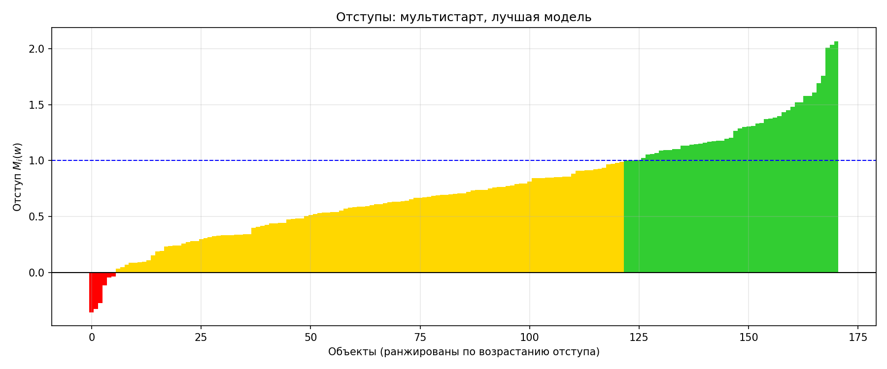
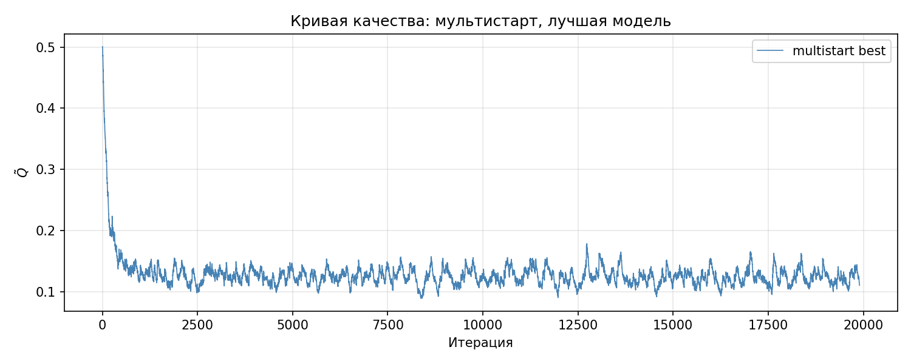
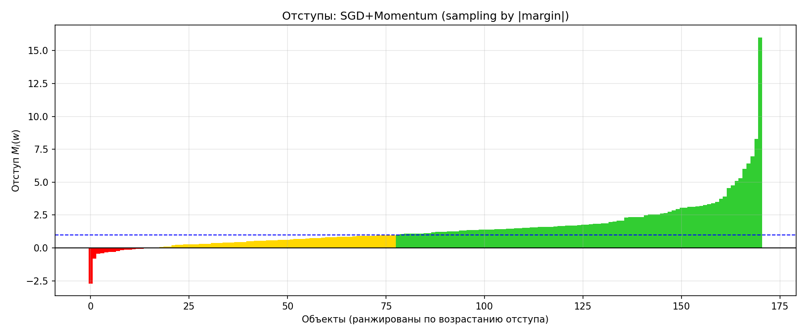
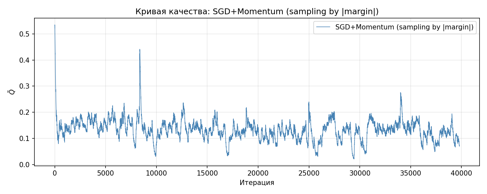

# Лабораторная работа №1. Линейная классификация

Линейный классификатор с квадратичной функцией потерь, обученный стохастическим градиентным спуском с инерцией и L2-регуляризацией.

## Датасет

**Breast Cancer Wisconsin (Diagnostic)** из `sklearn.datasets`: классификация опухолей на доброкачественные и злокачественные по 30 признакам ядра клетки.

| Характеристика | Значение |
|---|---|
| Объектов | 569 |
| Признаков | 30 |
| Пропусков | 0 |
| Злокачественных (y=-1) | 212 (37.3%) |
| Доброкачественных (y=+1) | 357 (62.7%) |
| Обучение / тест | 398 / 171 (стратификация) |

Классы несбалансированы: доброкачественных опухолей почти в 1.7 раза больше.

**Предобработка:**
- Стандартизация признаков (среднее=0, дисперсия=1) по обучающей выборке
- Преобразование меток: `{0, 1} → {-1, +1}` для margin-based постановки

## Модель

Линейный классификатор: `a(x) = sign(<w, x> + w0)`

**Отступ объекта:** `M_i = y_i(<w, x_i> + w0)`
- `M_i > 0` — верная классификация
- `M_i < 0` — ошибка
- `|M_i|` — уверенность модели

**Квадратичная функция потерь:** `L(M) = 0.5 * (1 - M)²`

Функция штрафует:
- Ошибки (`M < 0`)
- Неуверенные верные ответы (`0 < M < 1`)
- Слишком уверенные ответы (`M > 1`) — это отличает её от hinge loss

Минимум достигается при `M = 1`, то есть модель стремится сделать отступы близкими к единице, а не просто положительными.

## Эксперименты

### 1. SGD с инерцией: Random vs Correlation Init

Сравнение двух стратегий инициализации весов:
- **Random**: `w_j ~ U(-1/(2d), 1/(2d))`
- **Correlation**: `w_j = <y, f_j> / <f_j, f_j>` (корреляция признака с меткой)

Параметры: `lr=0.01`, `gamma=0.9`, `epochs=100`

| Инициализация | Accuracy | ROC-AUC | F1 | Precision | Recall | Ошибок |
|---|---|---|---|---|---|---|
| Random | 0.9415 | 0.9914 | 0.9550 | 0.9217 | 0.9907 | 10/171 |
| Correlation | 0.9415 | 0.9914 | 0.9550 | 0.9217 | 0.9907 | 10/171 |





**Вывод:** Обе инициализации сходятся к практически идентичному решению. Корреляционная инициализация начинает с более высокого риска, но быстро компенсирует это. На этом датасете выигрыша от умной инициализации нет.

### 2. L2-регуляризация

Добавляем штраф `Q(w) = L(w) + (τ/2)||w||²` с `τ = 1e-3`.

| Модель | Accuracy | ROC-AUC | F1 | w |
|---|---|---|---|---|
| Без регуляризации | 0.9415 | 0.9914 | 0.9550 | 1.5378 |
| С L2 (τ=1e-3) | 0.9415 | 0.9917 | 0.9550 | 1.4033 |




**Вывод:** Регуляризация уменьшила норму весов на 9% и слегка улучшила ROC-AUC.

### 3. Скорейший градиентный спуск

Оптимальный шаг для каждого объекта: `h* = 1 / (||x_i||²)`

| Метод | Accuracy | ROC-AUC | F1 | Ошибок |
|---|---|---|---|---|
| SGD с постоянным шагом | 0.9415 | 0.9914 | 0.9550 | 10 |
| Скорейший спуск | 0.9298 | 0.9782 | 0.9459 | 12 |




**Вывод:** Скорейший спуск работает **хуже** обычного SGD.

### 4. Мультистарт (7 запусков)

Запускаем SGD из 7 случайных точек, выбираем лучшую модель по accuracy на обучении.

| Запуск | Train Accuracy | Test Accuracy | ROC-AUC | F1 |
|---|---|---|---|---|
| Старт #0 | 0.9548 | 0.9415 | 0.9914 | 0.9550 |
| Старт #1 | 0.9598 | 0.9415 | 0.9914 | 0.9550 |
| Старт #2 | 0.9548 | 0.9415 | 0.9914 | 0.9550 |
| Старт #3 | 0.9598 | 0.9415 | 0.9914 | 0.9550 |
| **Старт #4 (лучший)** | **0.9698** | **0.9649** | **0.9924** | **0.9725** |
| Старт #5 | 0.9548 | 0.9415 | 0.9914 | 0.9550 |
| Старт #6 | 0.9598 | 0.9415 | 0.9914 | 0.9550 |




**Вывод:** Мультистарт дал **лучший результат**: accuracy 0.9649 против 0.9415 у обычного SGD. Разница — всего 4 объекта из 171, но это показывает, что случайная инициализация влияет на конечное качество, и выбор лучшего старта помогает.

### 5. Предъявление объектов по модулю отступа

Объекты с малым `|M|` (ближе к границе) предъявляются чаще:
```
p_i ∝ 1 / (|M_i| + 1e-8)
```

| Стратегия | Accuracy | ROC-AUC | F1 | Ошибок |
|---|---|---|---|---|
| Случайное предъявление | 0.9415 | 0.9914 | 0.9550 | 10 |
| По модулю отступа | 0.9064 | 0.9654 | 0.9238 | 16 |




**Вывод:** Предъявление по модулю отступа **ухудшило** качество: accuracy упала с 0.9415 до 0.9064.

### 6. Сравнение с эталонами (sklearn)

| Модель | Accuracy | ROC-AUC | F1 | Precision | Recall |
|---|---|---|---|---|---|
| **Наша лучшая (мультистарт)** | **0.9649** | 0.9924 | **0.9725** | 0.9550 | 0.9907 |
| Наш SGD (random init) | 0.9415 | 0.9914 | 0.9550 | 0.9217 | 0.9907 |
| RidgeClassifier (sklearn) | 0.9415 | **0.9936** | 0.9550 | 0.9217 | 0.9907 |

**Вывод:** 
- Наша реализация с мультистартом превосходит sklearn-модели по accuracy и F1 (на 4 объекта из 171).
- RidgeClassifier имеют чуть лучший ROC-AUC (0.9936 vs 0.9924), но худшую accuracy.
- Разница в одну-две ошибки на тесте из 171 объекта лежит в пределах случайности.

## Выводы

* После обучения отступы концентрируются в интервале `0 < M < 1`. Квадратичная потеря штрафует слишком большие отступы.
* Мультистарт дал лучший результат accuracy 0.9649, F1 0.9725. Случайная инициализация влияет на результат. 
* Корреляционная инициализация на этом датасете она сходится к тому же решению, что и случайная.
* Скорейший спуск дает худший результат.
* Предъявление по модулю отступа дает худший результат.
* L2-регуляризация помогает слабо, уменьшает норму весов и слегка улучшает ROC-AUC, но не меняет accuracy.
