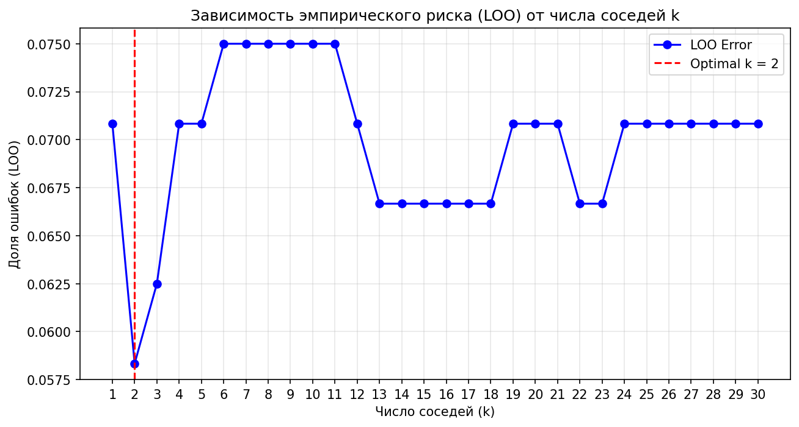
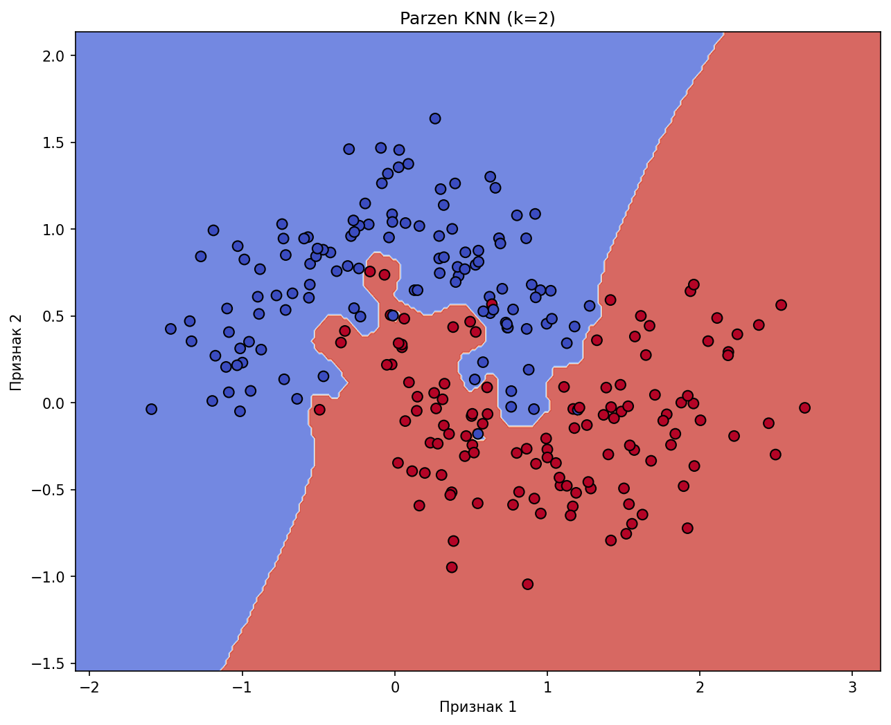
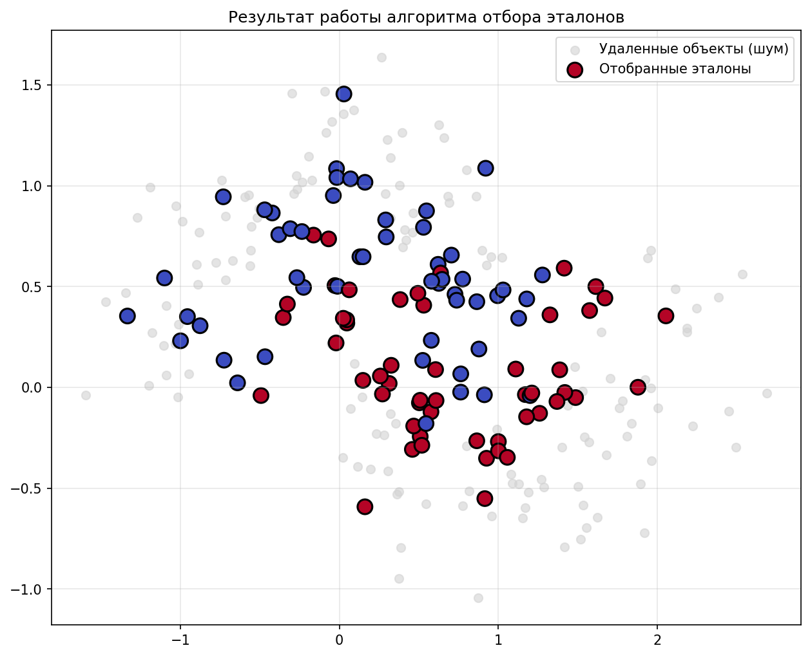
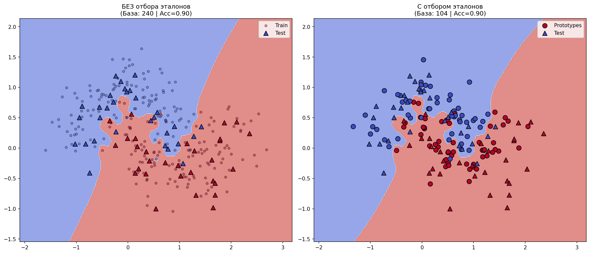

# Лабораторная работа №2. Метрическая классификация

Реализация метрического классификатора KNN с окном Парзена переменной ширины, подбор параметра $k$ методом скользящего контроля (LOO) и отбор эталонов.

## Датасет

В работе используется синтетический датасет `make_moons` (200 объектов, 2 признака, 2 класса).
Данный датасет представляет собой два переплетенных полумесяца, что делает его нелинейно разделимым и идеально подходит для демонстрации метрических методов.
Добавлен шум (`noise=0.25`) для создания выбросов и пересечений классов.

## Модель

### Окно Парзена переменной ширины
Классификатор относит объект $x$ к классу, максимизирующему оценку:
$$a(x; X^l, k, K) = \arg\max_{y \in Y} \sum_{i=1}^l [y_i = y] K\left( \frac{\rho(x, x_i)}{\rho(x, x_{(k+1)})} \right)$$

*   **Ядро:** Гауссово $K(r) = \exp(-2r^2)$
*   **Ширина окна:** $h(x) = \rho(x, x_{(k+1)})$ (адаптивная, зависит от локальной плотности)

## Эксперименты

### 1. Подбор параметра $k$ (LOO)
Был произведен перебор $k \in [1, 30]$. Ошибка оценивалась методом полного скользящего контроля (Leave-One-Out).

**Вывод:** При малых $k$ модель переобучается на шум. При больших $k$ граница размывается. Оптимум достигается в точке минимума LOO.

### 2. Сравнение с эталонной реализацией (sklearn)
Сравнение границ решений нашего Parzen KNN и `KNeighborsClassifier` из `sklearn` с `weights='distance'`.

| Модель | LOO Error |
| :--- | :--- |
| Наш Parzen KNN | 0.0550 |
| sklearn KNN | 0.0650 |

*Граница решений Parzen KNN*

*Граница решений sklearn KNN*

**Вывод:** Границы решений очень похожи. Гауссово ядро дает более гладкую поверхность по сравнению с весами `1/distance`, которые могут иметь разрывы или слишком резкие пики вблизи точек.

### 3. Отбор эталонов
Применен жадный алгоритм удаления не-эталонных объектов. Итеративно удалялись объекты, удаление которых не увеличивает (или уменьшает) ошибку LOO.

| Модель | Размер базы | Accuracy (Test) | F1-score (Test) |
|--------|:-----------:|:---------------:|:---------------:|
| Parzen KNN **без отбора** | 240 | 0.9000 | 0.8990 |
| Parzen KNN **с отбором эталонов** | 104 | 0.9000 | 0.8990 |

**Вывод:** Алгоритм успешно отсек шумовые объекты (серые точки), оставив только наиболее информативные эталоны на границах классов и внутри кластеров. Алгоритм сократил обучающую выборку в **2.3 раза** (с 240 до 104 объектов) без потери в качестве.

## Выводы
1. Метрические методы (KNN, окно Парзена) хорошо справляются с нелинейно разделимыми данными благодаря гипотезе компактности.
2. Метод скользящего контроля (LOO) эффективно подбирает параметр $k$ (или ширину окна).
3. Гауссово ядро обеспечивает гладкую аппроксимацию разделяющей поверхности.
4. Отбор эталонов позволяет значительно сократить размер обучающей выборки, удалив шум и внутренние точки кластеров, не ухудшая при этом обобщающую способность модели.