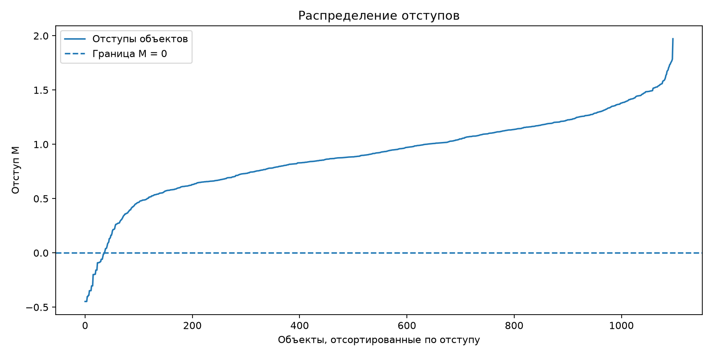
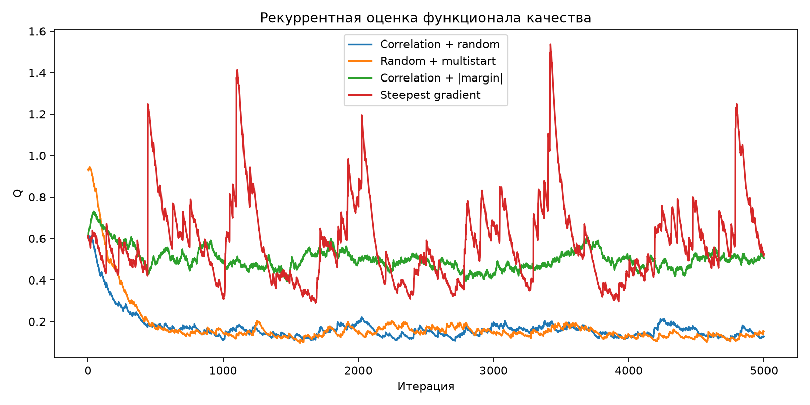
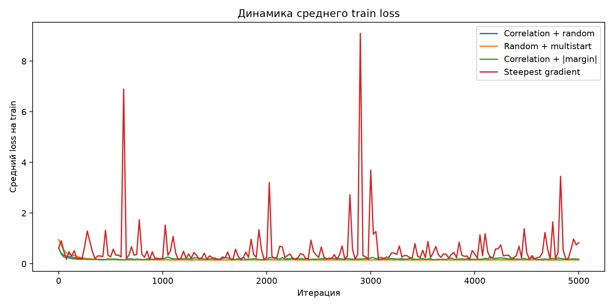
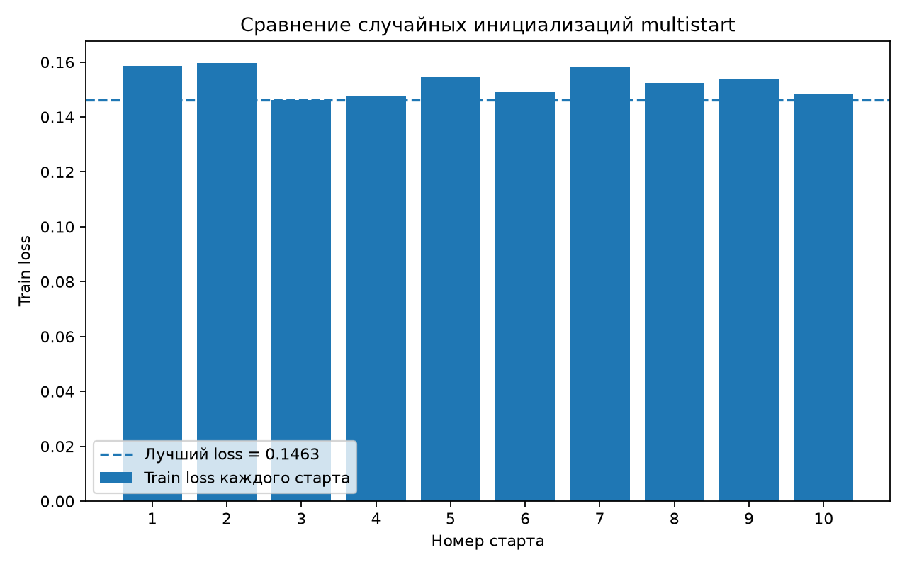
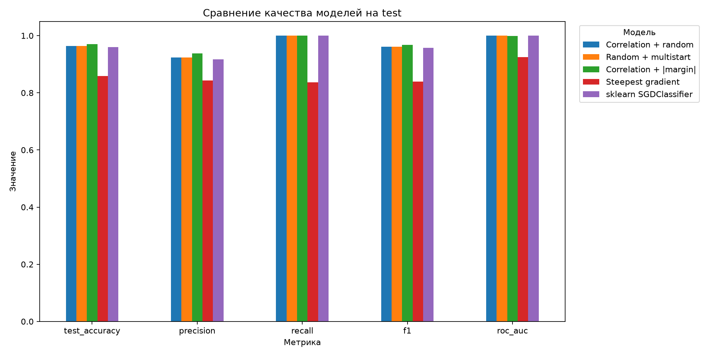
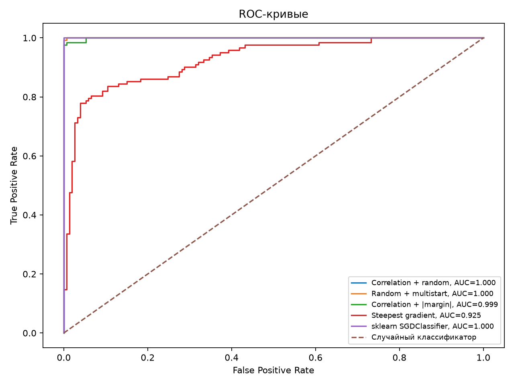

# Лабораторная работа №1. Линейная классификация

## Цель работы

Реализовать линейный бинарный классификатор и основные элементы метода
стохастического градиента: вычисление отступа, квадратичную функцию потерь
и её градиент, рекуррентную оценку функционала качества, momentum,
L2-регуляризацию, скорейший градиентный спуск, различные способы
инициализации весов и предъявления объектов. Сравнить собственные реализации
с эталонным алгоритмом из `sklearn`.

## Датасет

Использован датасет **Banknote Authentication**. Он содержит 1372 объекта,
четыре вещественных признака и бинарную целевую переменную:

- `variance` — дисперсия;
- `skewness` — асимметрия;
- `curtosis` — эксцесс;
- `entropy` — энтропия.

Датасет не хранится в репозитории и загружается во время выполнения программы
из внешнего источника через `sklearn.datasets.fetch_openml`.

Два исходных класса преобразуются в $-1$ и $+1$, поскольку используемая
формула отступа предполагает

$$
y \in \{-1,+1\}.
$$

В полном датасете 1372 объекта: 762 объекта одного класса и 610 объектов
другого класса, то есть примерно 55.5% и 44.5%. Таким образом, выраженного
дисбаланса классов нет.

Данные разделяются на train и test в отношении 80/20 со стратификацией,
поэтому соотношение классов сохраняется примерно одинаковым в обеих выборках.
Стандартизация выполняется без утечки данных: `StandardScaler` обучается
только на train-выборке, после чего это же преобразование применяется к test.

## Линейный классификатор и отступ

Для линейного классификатора используется дискриминантная функция

$$
g(x,w)=\langle x,w\rangle.
$$

Предсказание определяется знаком дискриминанта:

$$
a(x,w)=\operatorname{sign}\left(\langle x,w\rangle\right).
$$

Отступ объекта определяется как

$$
M_i=y_i\langle x_i,w\rangle.
$$

Если $M_i<0$, объект классифицирован ошибочно. Если $M_i>0$, классификация
верна. Малое значение $|M_i|$ означает, что объект находится близко
к разделяющей границе.

Ниже показано распределение отступов **на обучающей выборке после обучения
модели `Correlation + |margin|`**. Объекты отсортированы по величине отступа;
пунктирная линия соответствует границе $M=0$.

Большая часть объектов имеет положительный отступ, то есть классифицируется
верно. Небольшое число объектов имеет отрицательный отступ и классифицируется
ошибочно. Объекты с $|M_i|$, близким к нулю, находятся около разделяющей
границы и являются наиболее неуверенными для классификатора. Именно таким
объектам повышается вероятность предъявления при обучении по модулю отступа.

## Квадратичная функция потерь

Используется квадратичная функция потерь

$$
L(M)=(1-M)^2.
$$

Так как

$$
M=y\langle x,w\rangle,
$$

градиент функции потерь по весам равен

$$
\nabla_w L
=
-2yx\left(1-y\langle x,w\rangle\right)
=
-2yx(1-M).
$$

## Рекуррентная оценка функционала качества

Начальное значение $Q$ рассчитывается как среднее значение функции потерь
на случайном подмножестве train-объектов. После обработки очередного объекта
используется рекуррентное обновление

$$
Q_t
=
\lambda \xi_t
+
(1-\lambda)Q_{t-1},
$$

где $\xi_t$ — значение функции потерь на объекте текущей итерации.

Поскольку разные способы предъявления объектов формируют разные
последовательности $\xi_t$, дополнительно через одинаковые интервалы
вычисляется средний loss на всей train-выборке.

## Стохастический градиентный спуск с momentum

Для сглаживания стохастических градиентов используется momentum:

$$
v_t
=
\gamma v_{t-1}
+
(1-\gamma)\nabla L_t,
$$

$$
w_t
=
w_{t-1}-h v_t.
$$

В эксперименте используются $\gamma=0.9$ и $h=0.01$.

## L2-регуляризация

Регуляризованная функция потерь имеет вид

$$
\widetilde{L}(w)
=
L(w)
+
\frac{\tau}{2}\|w\|^2.
$$

Её градиент:

$$
\nabla \widetilde{L}
=
\nabla L
+
\tau w.
$$

В эксперименте используется $\tau=0.001$.

## Инициализация весов

### Корреляционная инициализация

Для каждого признака начальный вес вычисляется по формуле

$$
w_j
=
\frac{\langle y,f_j\rangle}
{\langle f_j,f_j\rangle}.
$$

### Случайная инициализация и multistart

Начальные веса генерируются из распределения

$$
w_j
\sim
U\left(
-\frac{1}{2n},
\frac{1}{2n}
\right).
$$

Было выполнено 10 независимых запусков. Лучшим оказался запуск №3 с train loss = 0.146294. Лучший запуск выбирался только по train-выборке; test-выборка при выборе не использовалась.

## Предъявление объектов по модулю отступа

Помимо равновероятного случайного предъявления реализован вариант,
в котором объекты с малым абсолютным отступом предъявляются чаще:

$$
p_i
\propto
\frac{1}{|M_i|+\varepsilon}.
$$

Чем меньше $|M_i|$, тем ближе объект к разделяющей границе и тем выше
вероятность его выбора.

## Скорейший градиентный спуск

Для одного объекта квадратичная функция потерь имеет вид

$$
L(w)
=
\left(
1-y\langle x,w\rangle
\right)^2.
$$

При используемом в программе градиенте

$$
\nabla_w L
=
-2yx\left(
1-y\langle x,w\rangle
\right)
$$

используется шаг

$$
h^*
=
\frac{1}{2\|x_i\|^2}.
$$

После этого веса обновляются по формуле

$$
w_{t+1}
=
w_t
-
h^*\nabla_w L.
$$

Скорейший градиентный спуск исследуется отдельно от momentum и
L2-регуляризации, чтобы сравнить сам способ выбора шага.

## Эталонное решение

Для сравнения используется готовая реализация
`sklearn.linear_model.SGDClassifier`. Она применяется только как
эталонный алгоритм. Все элементы собственного линейного классификатора
реализованы отдельно с использованием `numpy`.

## Результаты

Итоговые значения метрик:

| Модель | Train loss | Train acc. | Test acc. | Precision | Recall | F1 | ROC AUC |
| --- | ---: | ---: | ---: | ---: | ---: | ---: | ---: |
| Corr. + random | 0.1505 | 0.9663 | 0.9636 | 0.9242 | 1.0000 | 0.9606 | 0.9999 |
| Multistart | 0.1463 | 0.9654 | 0.9636 | 0.9242 | 1.0000 | 0.9606 | 0.9999 |
| Corr. + margin | 0.1737 | 0.9754 | 0.9709 | 0.9385 | 1.0000 | 0.9683 | 0.9991 |
| Steepest | 0.8314 | 0.8423 | 0.8582 | 0.8430 | 0.8361 | 0.8395 | 0.9254 |
| sklearn SGD | — | 0.9672 | 0.9600 | 0.9173 | 1.0000 | 0.9569 | 1.0000 |

ROC-кривая строится по непрерывному значению дискриминанта

$$
s(x)=\langle x,w\rangle.
$$

Она показывает качество ранжирования объектов при изменении порога
классификации.

### Анализ результатов

Максимальная test accuracy среди собственных реализаций составляет **0.9709** и получена для: `Correlation + |margin|`. Максимальный ROC AUC среди собственных реализаций составляет **0.999946** и получен для: `Correlation + random`, `Random + multistart`.

Для сравнения способов предъявления объектов были обучены две модели с одинаковой корреляционной инициализацией весов: со случайным предъявлением и с предъявлением по модулю отступа. Test accuracy составила **0.9636** и **0.9709** соответственно, F1 — **0.9606** и **0.9683**, ROC AUC — **0.999946** и **0.999089**. Таким образом, предъявление объектов по модулю отступа дало небольшое улучшение test accuracy и F1 по сравнению со случайным предъявлением. При этом ROC AUC незначительно снизился. Следовательно, способ предъявления объектов повлиял на метрики неоднозначно: качество классификации при фиксированном пороге несколько улучшилось, тогда как качество ранжирования практически не изменилось и немного снизилось.

Скорейший градиентный спуск показал test accuracy **0.8582**, F1 = **0.8395** и ROC AUC = **0.9254**. Его train loss (**0.8314**) выше, чем у основных вариантов SGD. В данном стохастическом эксперименте выбор шага по отдельному объекту приводит к менее стабильной траектории обучения и худшему итоговому качеству.

Для сравнения с эталонным алгоритмом выбрана собственная реализация `Correlation + |margin|`, поскольку она показала максимальную test accuracy среди собственных реализаций. Её test accuracy = **0.9709**, F1 = **0.9683**, ROC AUC = **0.999089**. У эталонного `SGDClassifier`: test accuracy = **0.9600**, F1 = **0.9569**, ROC AUC = **1.000000**. Полученные значения близки, поэтому собственная реализация SGD показывает качество, сопоставимое с библиотечным эталоном.

ROC AUC = **1.0** у эталонной модели не противоречит accuracy < 1. ROC AUC оценивает качество ранжирования объектов по непрерывному score, а accuracy — классификацию при конкретном пороге. Поэтому классы могут быть идеально упорядочены по score, но часть объектов может находиться по неправильную сторону фиксированного порога.

## Вывод

В лабораторной работе был реализован линейный бинарный классификатор с квадратичной функцией потерь. Реализованы вычисление и анализ отступов, градиент функции потерь, рекуррентная оценка функционала качества, SGD с momentum, L2-регуляризация, скорейший градиентный спуск, корреляционная и случайная инициализация весов, multistart, а также случайное предъявление объектов и предъявление по модулю отступа.

Максимальная test accuracy среди собственных реализаций равна **0.9709** и получена для: `Correlation + |margin|`. Максимальный ROC AUC среди собственных реализаций равен **0.999946** и получен для: `Correlation + random`, `Random + multistart`.

Случайное предъявление и предъявление по модулю отступа дали test accuracy **0.9636** и **0.9709**, F1 — **0.9606** и **0.9683**, ROC AUC — **0.999946** и **0.999089** соответственно. Предъявление по модулю отступа немного улучшило accuracy и F1, при этом ROC AUC незначительно снизился.

Для сравнения с эталоном выбрана `Correlation + |margin|`. Собственная реализация получила test accuracy **0.9709**, F1 = **0.9683**, ROC AUC = **0.999089**; эталонный `SGDClassifier` — test accuracy **0.9600**, F1 = **0.9569**, ROC AUC = **1.000000**. Следовательно, собственная реализация SGD достигает качества, сопоставимого с библиотечным эталоном.
