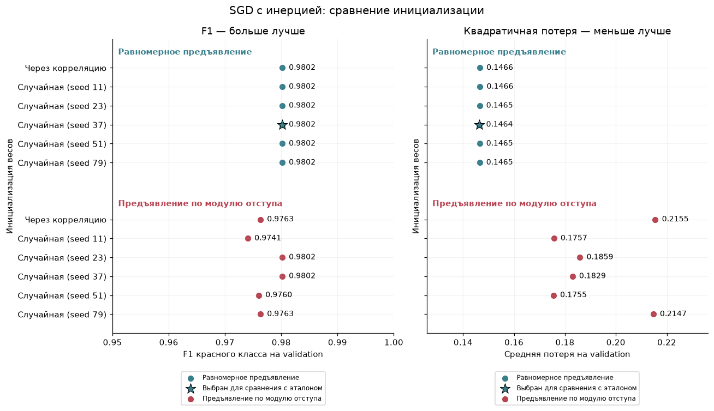
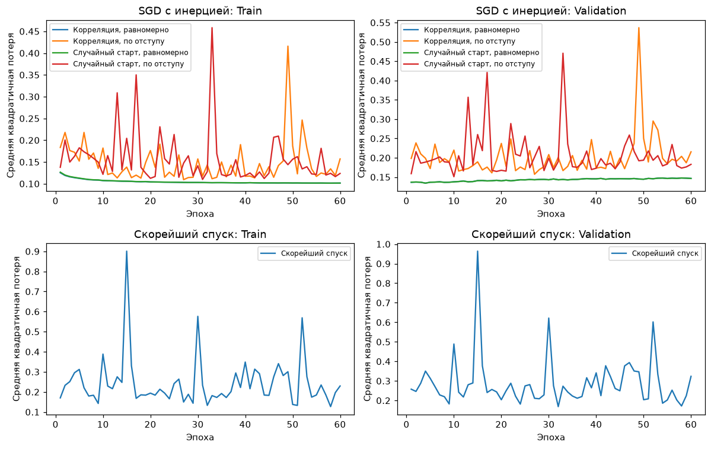
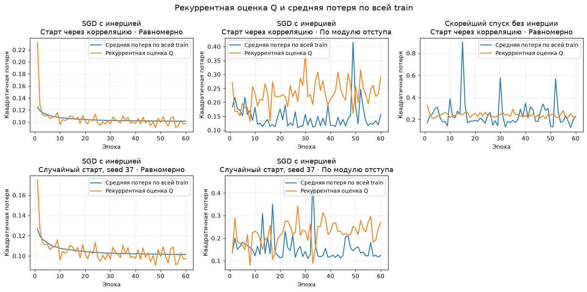
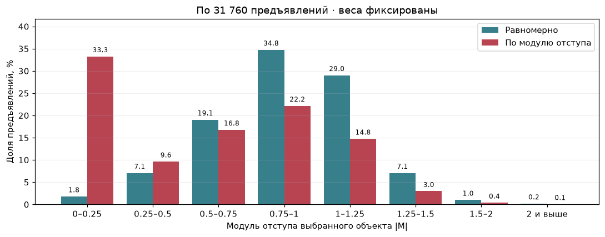
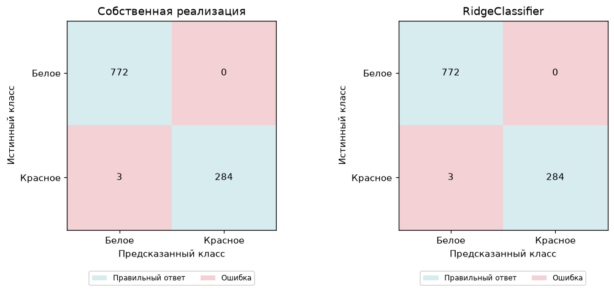
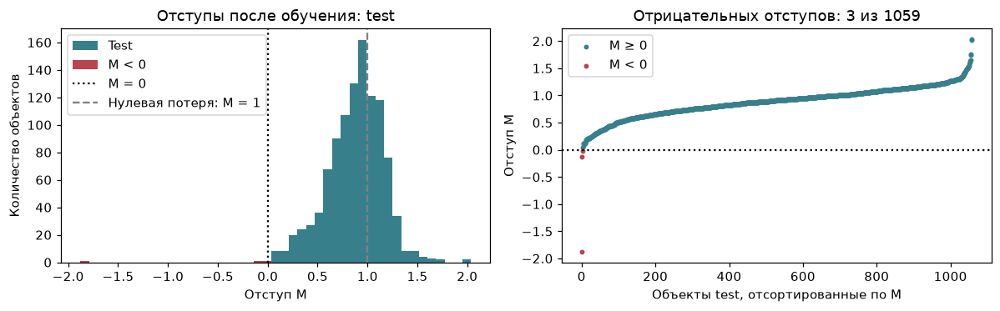

# Лабораторная №1. Линейная классификация

## Данные

[Wine Quality](https://www.kaggle.com/datasets/rajyellow46/wine-quality): тип вина по 11 химическим признакам. Красное — $y=+1$, белое — $y=-1$; `quality` исключён.

| Выборка | Объекты | Красное | Белое |
|---|---:|---:|---:|
| Train | 3176 | 815 | 2361 |
| Validation | 1060 | 251 | 809 |
| Test | 1059 | 287 | 772 |

Удалены 34 строки с пропусками и 1168 повторов. Признаки стандартизированы; разбиение выполнено по группам совпадающих векторов признаков.

## Постановка экспериментов

Обучали линейный классификатор по $J(w)=\frac1n\sum_i(w^\top z_i-y_i)^2+\frac\tau2\|w_{1:}\|^2$. Вектор $z_i$ включает стандартизованные признаки и свободный член; последний не регуляризуется.

Скорейший спуск запускали без инерции, с точным шагом для потери выбранного объекта с L2.

| Условие | Значение |
|---|---|
| Инициализация | Через корреляцию; случайная с пятью стартами: 11, 23, 37, 51, 79 |
| Предъявление | Равномерное; чаще объекты с малым модулем отступа, без компенсации градиента |
| L2 / инерция / рекуррентная оценка | $\tau=0.01$, $\gamma=0.9$, $\lambda=0.001$ |
| Остановка | Стабилизация весов с допуском $10^{-3}$ пять эпох подряд; максимум 60 эпох |
| Выбор запуска | Максимум validation F1 красного класса; при равенстве — минимум квадратичной потери |

При предъявлении по отступу $p_i\propto1/\max(|M_i|,\varepsilon)$, где $\varepsilon=\texttt{np.finfo(float).eps}$ защищает от деления на ноль.

## Сравнение вариантов после 60 эпох

| Метод | Старт | Предъявление | Validation F1 | Validation: квадратичная потеря |
|---|---|---|---:|---:|
| SGD с инерцией | Корреляция | Равномерно | **0.9802** | 0.1466 |
| SGD с инерцией | Корреляция | По отступу | 0.9763 | 0.2155 |
| SGD с инерцией | Случайный, seed 37 | Равномерно | **0.9802** | **0.1464** |
| SGD с инерцией | Случайный, seed 37 | По отступу | **0.9802** | 0.1829 |
| Скорейший спуск | Корреляция | Равномерно | 0.8979 | 0.3236 |



Мультистарт улучшил F1 при предъявлении по отступу с 0.9763 до 0.9802. Предъявление по отступу не превзошло равномерное по F1 и увеличило квадратичную потерю.

## Ход обучения



У равномерного SGD снижение train-потери сопровождалось ростом validation-потери. Предъявление по отступу и точный шаг по одному объекту дали сильные колебания средней потери.

Все 13 основных запусков остановились по лимиту 60 эпох: [условие остановки по изменению весов](images/09_weight_stability.png) не сработало.

У равномерного SGD (случайный старт, seed 37) дополнительно проверили лимит 1000 эпох: обучающий функционал снизился с 0.10649 до 0.10599 при минимуме Ridge 0.10598; validation F1 вырос с 0.9802 до 0.9821. Остановка — по лимиту эпох.

У скорейшего спуска validation F1 на 995-й эпохе равен 0.9841, на 1000-й — 0.8168. Выбор последних весов не учитывает лучшую промежуточную эпоху.



- Равномерный SGD: после начального запаздывания Q колеблется около средней train-потери при обоих способах инициализации.
- Предъявление по отступу: Q преимущественно выше полной средней из-за неравномерного выбора объектов; обе величины заметно колеблются.
- Скорейший спуск: Q усредняет потери при быстро меняющихся весах и не отражает все скачки полной train-потери. На 15-й эпохе Q равен 0.243, полная train-потеря — 0.901; спокойная линия Q не означает стабильность модели.

## Проверка предъявления по модулю отступа



Веса выбранной модели зафиксировали; выполнили по 31 760 выборов. При предъявлении по отступу доля выбранных объектов с $|M|<0.5$ увеличилась с 8.9% до 42.9%. Один объект получил 21.8% вероятности выбора: правило $1/|M|$ сильно концентрирует предъявления около границы.

## Test: сравнение с эталоном

С эталоном сравнивали SGD с инерцией: случайная инициализация (seed 37), равномерное предъявление. Эталон — `RidgeClassifier` с $\alpha=n_{train}\tau/2$ для совпадения коэффициента L2. Precision, recall и F1 — для красного вина.

| Модель | Accuracy | Balanced accuracy | Precision | Recall | F1 | ROC AUC |
|---|---:|---:|---:|---:|---:|---:|
| Своя реализация | 0.9972 | 0.9948 | 1.0000 | 0.9895 | 0.9947 | 0.9965 |
| RidgeClassifier | 0.9972 | 0.9948 | 1.0000 | 0.9895 | 0.9947 | 0.9965 |
| Всегда белое | 0.7290 | 0.5000 | 0.0000 | 0.0000 | 0.0000 | 0.5000 |



Предсказания своей модели и эталона совпали: три красных вина отнесены к белым. [ROC / PR](images/06_roc_pr.png).

## Анализ отступов

Отступы лучшей модели: $M_i=y_iw^\top z_i$.

| Выборка | Ошибки ($M_i<0$) | Доля |
|---|---:|---:|
| Train | 18 | 0.57% |
| Validation | 10 | 0.94% |
| Test | 3 | 0.28% |



Две ошибки близки к границе ($M=-0.122$ и $-0.022$); третья имеет отступ $-1.876$. [Отступы до обучения](images/02_initial_margins.png).

## Запуск

```sh
python3.12 -m venv .venv
.venv/bin/python -m pip install -r requirements.txt
.venv/bin/python source/main.py
```

Датасет скачивается с Kaggle при запуске.
