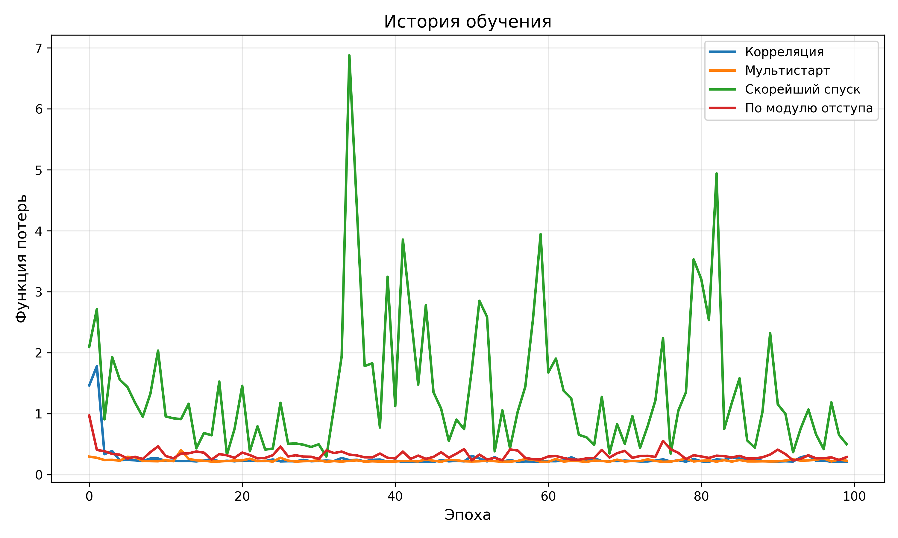
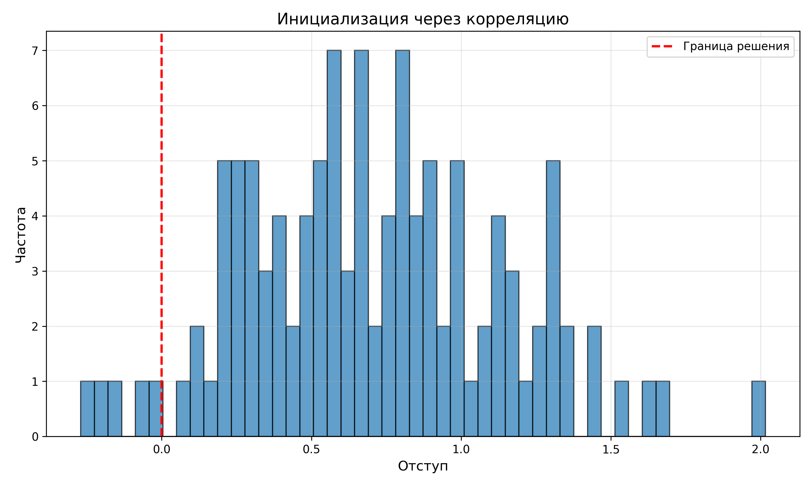
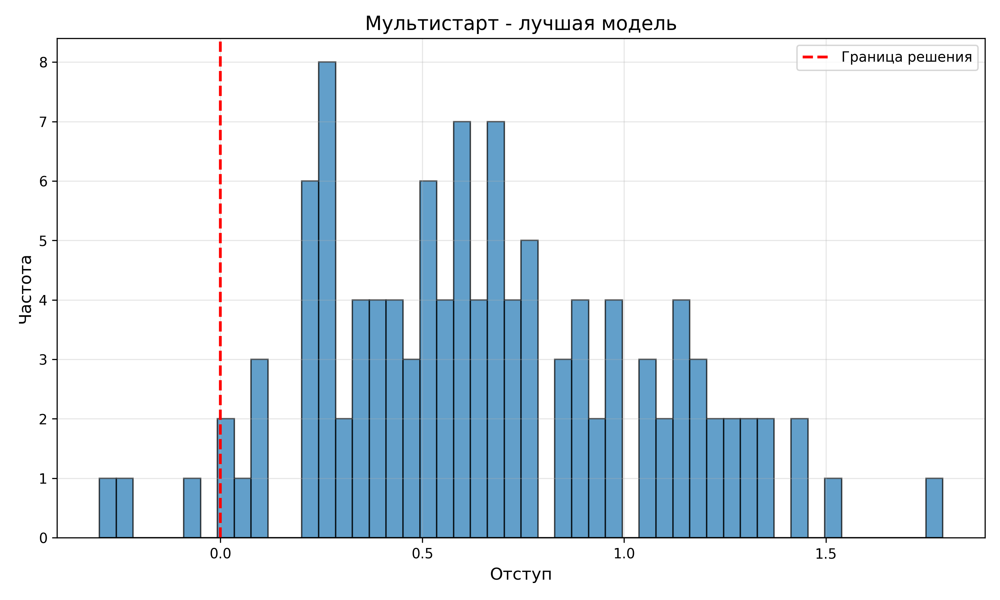
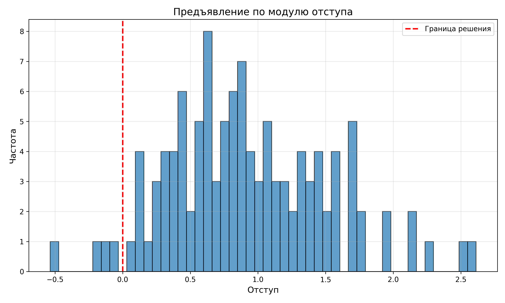
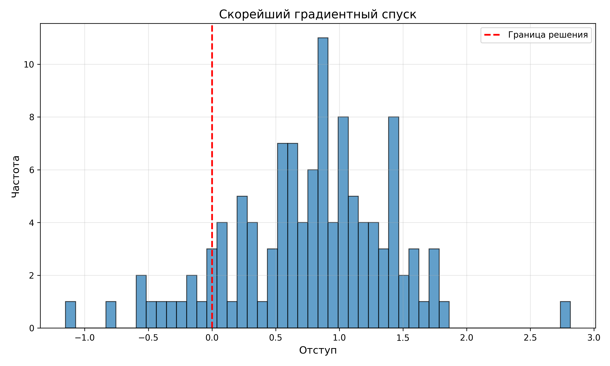

# Лабораторная работа №1: Линейная классификация

**Студент:** Шошников С.В.

## Цель работы

Реализовать линейный классификатор и обучить его методом стохастического градиентного спуска с инерцией, L2-регуляризацией и квадратичной функцией потерь.

## Датасет

**Breast Cancer Wisconsin** (sklearn):
- Объектов: 569 (455 train / 114 test)
- Признаков: 30
- Классы: 2 (злокачественная / доброкачественная опухоль)

## Реализация

### Математическая модель

Линейный классификатор: `f(x) = sign(w^T·x + b)`

Отступ: `M(x, y) = y·(w^T·x + b)`

Функция потерь: `L = (1/n)·Σ(1 - M)² + λ·||w||²`

SGD с momentum: `v_t = μ·v_{t-1} - η·∇L`, `w_t = w_{t-1} + v_t`

### Реализованные методы

1. **Инициализация через корреляцию** - веса на основе корреляции признаков с целевой переменной
2. **Мультистарт** - 5 запусков со случайной инициализацией, выбор лучшего
3. **Скорейший градиентный спуск** - адаптивная скорость обучения на каждом шаге
4. **Предъявление по модулю отступа** - приоритет объектам с малым отступом

## Результаты

### Точность классификации

| Метод | Test Accuracy |
|-------|---------------|
| Корреляция | 0.9386 |
| Мультистарт | 0.9737 |
| Скорейший спуск | 0.8860 |
| По модулю отступа | 0.9649 |
| Эталон (sklearn) | 0.9825 |

### Анализ результатов

**Лучший метод:** Мультистарт (97.37% точности)

**Инициализация через корреляцию** показала хорошую точность (93.86%) и стабильную сходимость.

**Мультистарт** дал лучший результат среди собственных реализаций, близкий к эталону.

**Предъявление по модулю отступа** показало высокую точность (96.49%), фокусируясь на сложных примерах.

**Скорейший спуск** показал худший результат из-за нестабильности адаптивной скорости обучения.

## Визуализация

### График 1: История обучения


Показывает сходимость функции потерь для разных методов. Корреляция, мультистарт и предъявление по отступу демонстрируют стабильное убывание. Скорейший спуск нестабилен.

### График 2: Распределение отступов (Корреляция)


Большинство объектов имеют положительный отступ (правильная классификация). Ошибок: 7/114.

### График 3: Распределение отступов (Мультистарт)


Лучшее распределение отступов. Ошибок: 3/114.

### График 4: Распределение отступов (По модулю отступа)


Хорошее распределение с небольшим количеством ошибок: 4/114.

### График 5: Распределение отступов (Скорейший спуск)


Большой разброс отступов, много ошибок: 13/114. Метод требует доработки.

## Выводы

1. Реализован полнофункциональный линейный классификатор с SGD, momentum и L2-регуляризацией
2. Инициализация через корреляцию эффективнее случайной инициализации
3. Мультистарт помогает найти лучшее решение при случайной инициализации
4. Предъявление по модулю отступа улучшает качество, фокусируясь на сложных примерах
5. Скорейший градиентный спуск требует тщательной настройки для стабильности
6. Собственная реализация показывает результаты, близкие к sklearn (97.37% vs 98.25%)

## Запуск

```bash
cd source
python main.py
```

Результат: графики сохраняются в текущей директории, метрики выводятся в консоль.
