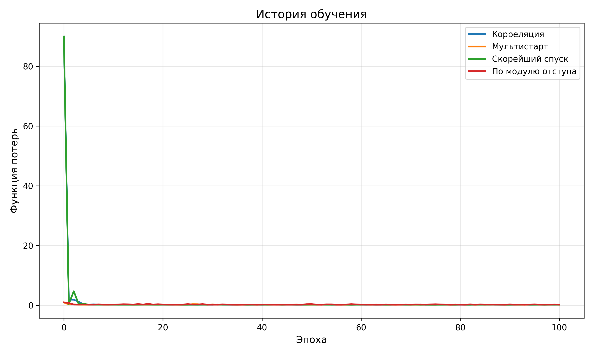
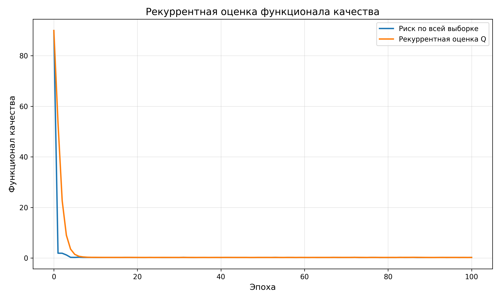
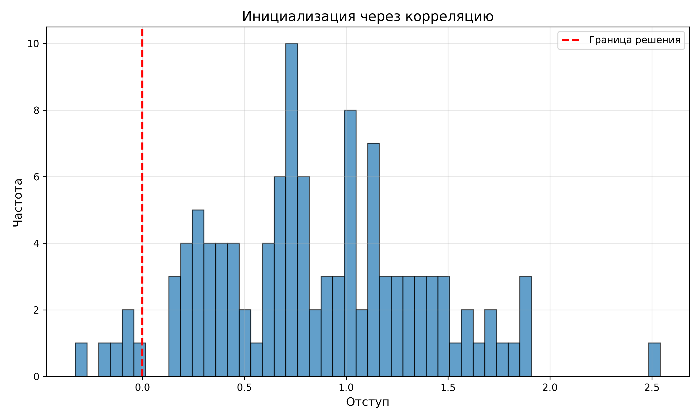
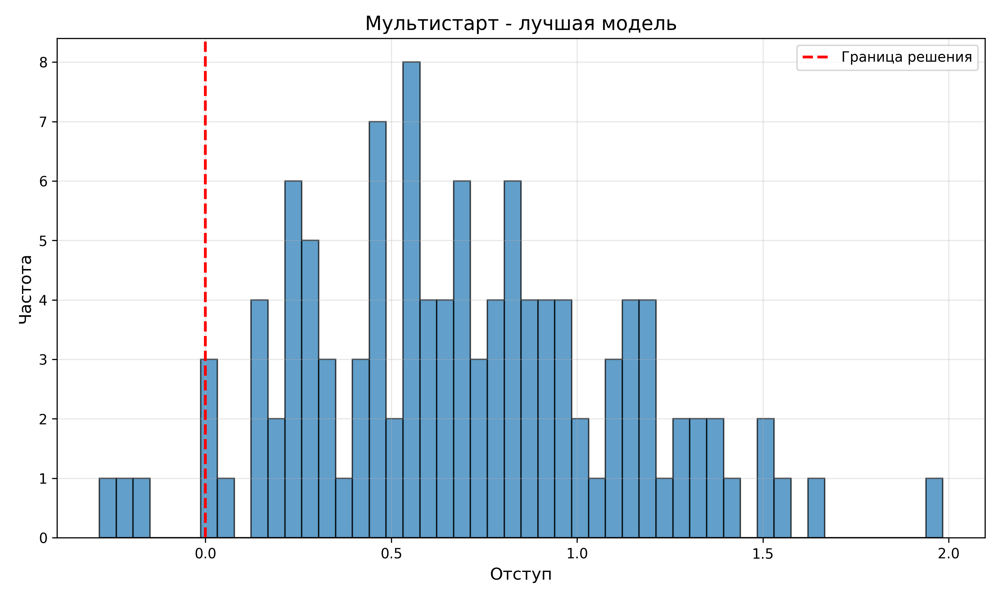
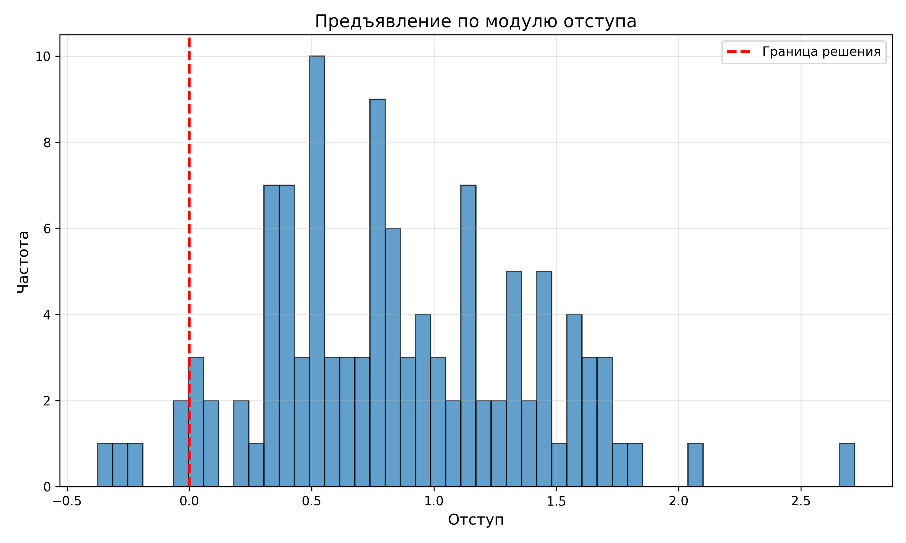
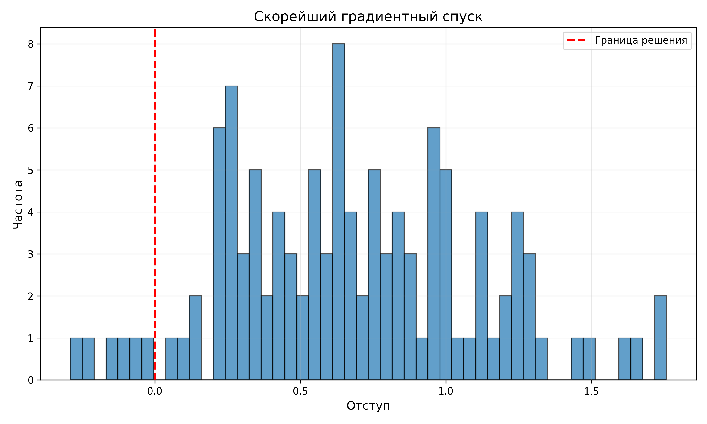

# Лабораторная работа №1: Линейная классификация

**Студент:** Шошников С.В.

## Цель работы

Реализовать линейный классификатор и обучить его методом стохастического градиентного спуска с инерцией, L2-регуляризацией и квадратичной функцией потерь.

## Датасет

**Breast Cancer Wisconsin** (sklearn):
- Объектов: 569 (455 train / 114 test)
- Признаков: 30
- Классы: 2 (злокачественная / доброкачественная опухоль)

## Реализация

### Математическая модель

Линейный классификатор: `f(x) = sign(w^T·x + b)`

Отступ: `M(x, y) = y·(w^T·x + b)`

Функция потерь: `L = (1/n)·Σ(1 - M)² + λ·||w||²`

SGD с сглаженной инерцией: `v = γ·v + (1 - γ)·h·∇L`, `w = w - v`

Рекуррентная оценка функционала качества: `Q = λ·L_batch + (1 - λ)·Q`, `λ = |batch| / n`

### Реализованные методы

1. **Инициализация через корреляцию** - `w_j = <y, f_j> / <f_j, f_j>`
2. **Мультистарт** - 5 запусков со случайной инициализацией, лучший выбирается по риску на обучающей выборке (тест не используется)
3. **Скорейший градиентный спуск** - шаг `h = (||g_w||² + g_b²) / (2·(mean(d²) + λ·||g_w||²))`, где `d = X·g_w + g_b`
4. **Предъявление по модулю отступа** - вероятность объекта `p ~ exp(-|M| / T)`
5. **Рекуррентная оценка Q** и **проверка градиента** против численного (расхождение ~4e-11)
6. **Метрики** - accuracy, precision, recall, F1, матрица ошибок

## Результаты

### Точность классификации

| Метод | Test Accuracy |
|-------|---------------|
| Корреляция | 0.9474 |
| Мультистарт | 0.9649 |
| Скорейший спуск | 0.9474 |
| По модулю отступа | 0.9561 |
| sklearn SGDClassifier | 0.9035 |
| sklearn RidgeClassifier | 0.9474 |

Размер теста 114 объектов: одна ошибка равна ~0.9%, поэтому разница между методами в несколько объектов не является статистически значимой.

### Метрики (тест)

| Модель | Accuracy | Precision | Recall | F1 |
|--------|----------|-----------|--------|----|
| Своя реализация (корреляция) | 0.9474 | 0.9342 | 0.9861 | 0.9595 |
| sklearn RidgeClassifier | 0.9474 | 0.9342 | 0.9861 | 0.9595 |
| sklearn SGDClassifier | 0.9035 | 0.9178 | 0.9306 | 0.9241 |

### Анализ результатов

**Эталон сравнивается на той же функции потерь** (`squared_error`), `alpha` пересчитан под формулу риска. Результат своей реализации совпадает с аналитическим решением `RidgeClassifier`.

**Мультистарт** дал наилучший результат (96.49%). Лучший запуск выбран по риску на обучении, поэтому точность на тесте — честная оценка.

**Скорейший спуск** сходится стабильно (94.74%), если инерция сглажена множителем `(1 - γ)`: без него накопленный шаг в `1/(1-γ)` раз превышал оптимальный и обучение расходилось.

**Предъявление по модулю отступа** дало 95.61% на тесте и самую высокую точность на обучении (97.36%); риск сходится шумнее, так как объекты, близкие к границе, попадают в батч чаще.

## Визуализация

### График 1: История обучения


Показывает сходимость риска для всех методов: все сходятся к значению около 0.2-0.3.

### График: Рекуррентная оценка Q


Рекуррентная оценка `Q`, посчитанная по ходу обучения по батчам, следует за риском, вычисленным по всей выборке (0.2271 и 0.2372 на последней эпохе), но не требует полного прохода.

### График 2: Распределение отступов (Корреляция)


Большинство объектов имеют положительный отступ (правильная классификация). Ошибок: 6/114.

### График 3: Распределение отступов (Мультистарт)


Ошибок: 4/114.

### График 4: Распределение отступов (По модулю отступа)


Ошибок: 5/114.

### График 5: Распределение отступов (Скорейший спуск)


Ошибок: 6/114.

## Выводы

1. Реализован полнофункциональный линейный классификатор с SGD, momentum и L2-регуляризацией
2. Инициализация по формуле `w_j = <y, f_j> / <f_j, f_j>` даёт разумный старт без случайности
3. Мультистарт с выбором по риску на обучении не зависит от тестовой выборки
4. Скорейший спуск требует согласования шага с инерцией (сглаживание множителем `1 - γ`)
5. Предъявление по модулю отступа по закону `exp(-|M|/T)` работает без расходимости
6. На одинаковой функции потерь собственная реализация даёт тот же результат, что и `RidgeClassifier` (94.74%)

## Запуск

```bash
cd source
python main.py
```

Результат: графики сохраняются в текущей директории, метрики выводятся в консоль.
