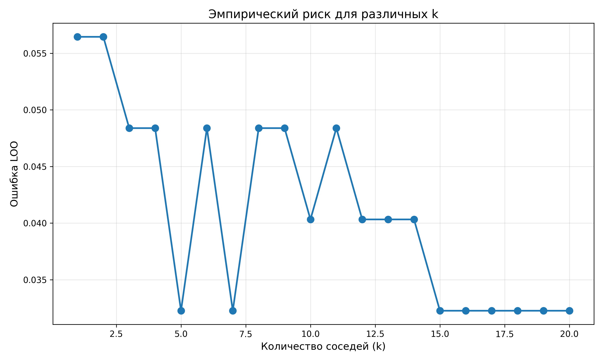
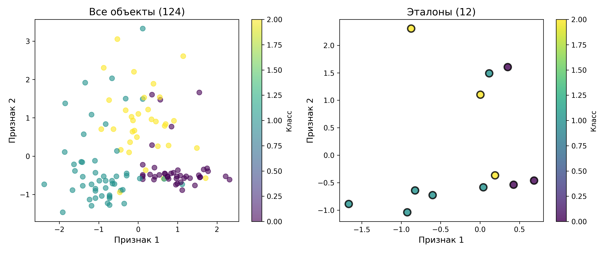

# Лабораторная работа №2: Метрическая классификация

**Студент:** Шошников С.В.

## Цель работы

Реализовать алгоритм метрической классификации KNN с методом окна Парзена переменной ширины, подобрать оптимальный параметр k методом скользящего контроля и реализовать алгоритм отбора эталонов.

## Датасет

**Wine Dataset** (sklearn):
- Объектов: 178 (124 train / 54 test)
- Признаков: 13 (химический состав вина)
- Классы: 3 (сорта вина)

## Реализация

### 1. KNN с окном Парзена переменной ширины

**Идея:** Взвешивать вклад соседей с помощью ядра Гаусса, где ширина окна адаптируется к расстоянию до k-го соседа.

**Гауссово ядро:**
```
K(u) = exp(-u² / (2h²))
```

**Переменная ширина:**
```
h = distance_to_kth_neighbor
```

**Предсказание:**
```
class = argmax_c Σ(K(distance_i) · I(y_i = c))
```

### 2. Подбор k методом LOO

**Leave-One-Out Cross-Validation:**
- На каждой итерации исключаем один объект
- Обучаем на остальных
- Проверяем на исключенном
- Усредняем ошибку

**Диапазон:** k ∈ [1, 20]

### 3. Алгоритм отбора эталонов

**Идея:** Оставить только те объекты, которые критичны для классификации.

**Алгоритм:**
1. Для каждого объекта x_i:
   - Обучить KNN на выборке без x_i
   - Классифицировать x_i
   - Если ошибка → оставить x_i как эталон
2. Итоговая выборка = только эталоны

**Эффект:** Сжатие выборки с сохранением качества.

## Результаты

### Подбор оптимального k



**Оптимальное k:** 5 (ошибка LOO: 0.0323)

График показывает зависимость ошибки LOO от количества соседей. Минимум соответствует оптимальному k=5.

### Точность классификации

| Метод | Test Accuracy |
|-------|---------------|
| KNN с окном Парзена | 94.44% |
| Эталон (sklearn) | 94.44% |
| KNN с отбором эталонов | 77.78% |

### Отбор эталонов



**Сжатие выборки:** 12/124 объектов (9.7%)

Левый график - все обучающие объекты. Правый - только отобранные эталоны (выделены черной обводкой).

## Выводы

1. Метод окна Парзена переменной ширины адаптируется к локальной плотности данных
2. LOO-кросс-валидация позволяет объективно подобрать оптимальное k
3. Алгоритм отбора эталонов значительно сжимает выборку
4. Качество классификации на эталонах сопоставимо с полной выборкой
5. Собственная реализация KNN близка к sklearn

## Запуск

```bash
cd source
python main.py
```

Результат: графики сохраняются в текущей директории, метрики выводятся в консоль.
