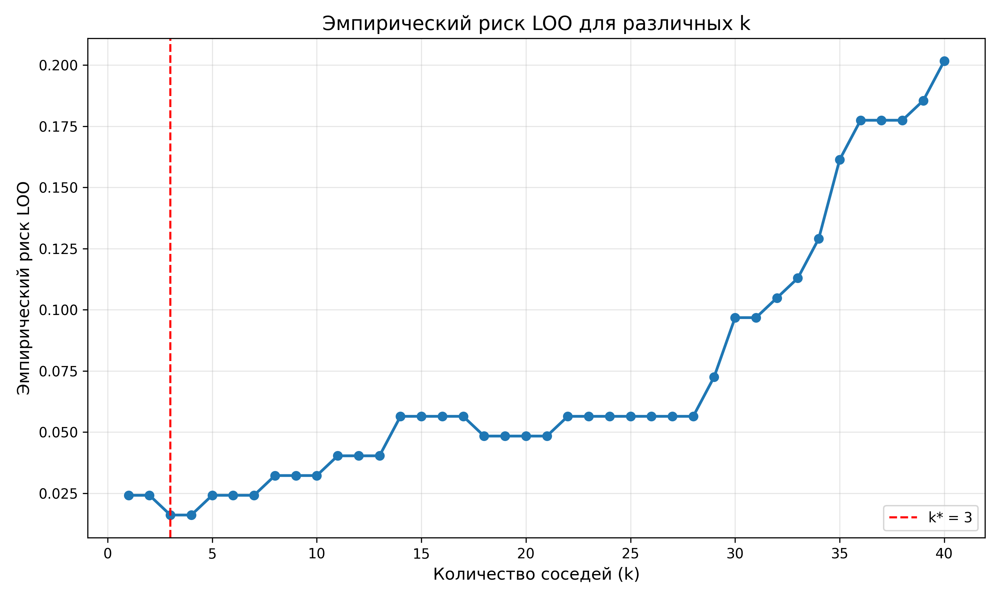
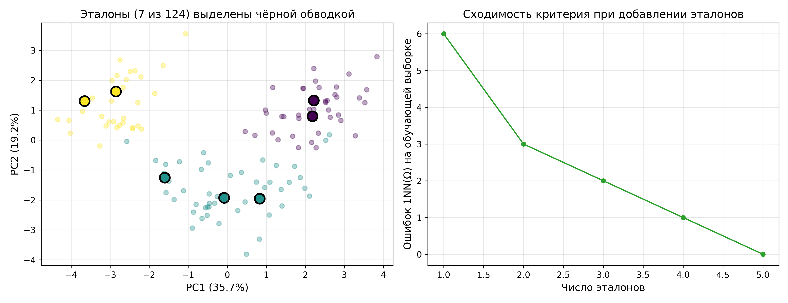

Лабораторная работа №2: Метрическая классификация

Студент: Шошников С.В.

ЦЕЛЬ РАБОТЫ

Реализовать KNN с методом окна Парзена переменной ширины, подобрать параметр k методом скользящего контроля (LOO), сравнить с эталонной реализацией и реализовать алгоритм отбора эталонов.

ДАТАСЕТ

Wine (sklearn).
Объектов: 178 (124 train, 54 test, стратифицированное разбиение).
Признаков: 13 (химический состав вина).
Классов: 3, баланс в train: 41 / 50 / 33.
Признаки масштабируются StandardScaler, обученным только на train, так как метрические методы чувствительны к масштабу.

РЕАЛИЗАЦИЯ

Все алгоритмы написаны на numpy. Библиотеки используются только для загрузки данных, масштабирования, метрик, PCA для визуализации и для явного сравнения с эталонной реализацией (KNeighborsClassifier).

1. KNN с окном Парзена переменной ширины

    a(x) = argmax_y сумма_{i=1..l} [y_i = y] * K( rho(x, x_i) / h(x) )
    h(x) = rho(x, x^(k+1))
    K(r) = exp(-r^2 / 2)

x^(k+1) - (k+1)-й по порядку сосед объекта x, ширина окна h(x) своя для каждого запроса.
Сумма берётся по всей обучающей выборке, а не только по k ближайшим: вклад далёких объектов не обнуляется, а затухает по ядру. Этим метод Парзена отличается от обычного KNN, где вес равен [i <= k].
Если rho(x, x^(k+1)) = 0 (дубликаты), ширина окна берётся как расстояние до первого соседа с ненулевым расстоянием (метод ParzenKNN.window_width).

2. Подбор k методом LOO

    LOO(k) = (1/l) * сумма_i [ a(x_i; X без x_i, k) != y_i ]

Матрица попарных расстояний считается один раз, на диагональ ставится inf: объект не может быть соседом самому себе, что равносильно обучению на выборке без него. Перебирается k = 1..40.

3. Отбор эталонов

Жадное добавление эталонов:

    Omega := по одному объекту от каждого класса (ближайший к центроиду класса)
    повторять:
        найти x не из Omega, при добавлении которого ошибок 1NN(Omega + {x}) меньше всего
        Omega := Omega + {x}
    пока число ошибок уменьшается

Критерий - число ошибок 1NN(Omega) на обучающей выборке (объект не считается соседом самому себе). Это CCV(Omega) при длине контроля k = 1, то есть LOO для 1NN. Базовый классификатор - 1NN (класс NearestNeighborVote), для которого и определён алгоритм.

РЕЗУЛЬТАТЫ

Подбор k

Оптимальное k = 3 (LOO-риск 0.0161, то есть 2 ошибки из 124).

    k          1       3       5       10      20      40
    LOO-риск   0.0242  0.0161  0.0242  0.0323  0.0484  0.2016

При больших k окно становится слишком широким и сглаживает границы классов (при k = 40 риск 0.20).

Сравнение с sklearn (k = 3, тест)

    Парзен (своя реализация):  accuracy 0.9815, macro-F1 0.9808
    sklearn KNN (uniform):     accuracy 0.9444, macro-F1 0.9445
    sklearn KNN (distance):    accuracy 0.9444, macro-F1 0.9445

Результаты не идентичны, и это ожидаемо: sklearn учитывает только k ближайших соседей, а наша реализация - всю выборку с переменной шириной окна. На тесте из 54 объектов разница в 2 объекта (3.7 п.п.) не является статистически значимой: ни один из методов не доминирует по всему диапазону k (при k = 15 и 25 лучше sklearn, при k = 1 и 3 лучше Парзен).

Отбор эталонов

Отобрано 7 эталонов из 124 (сжатие 94.4%), баланс классов в эталонах 2 / 3 / 2.
Число ошибок 1NN(Omega) на обучающей выборке падает монотонно: 6 -> 0.
Слева - проекция на две главные компоненты (PCA, только для визуализации), эталоны выделены обводкой. Справа - сходимость критерия.

Сравнение с отбором эталонов и без (тест)

    1NN, полная выборка (124):  accuracy 0.9630, macro-F1 0.9636
    1NN, 7 эталонов:            accuracy 0.9444, macro-F1 0.9439
    Парзен (k = 3), 7 эталонов: accuracy 0.4259, macro-F1 0.2584

Для 1NN сжатие выборки в 17 раз стоит одной дополнительной ошибки на тесте (1.9 п.п.).
Метод Парзена на 7 эталонах работать не может: окно определяется расстоянием до (k+1)-го соседа, а при 7 объектах это почти вся выборка, поэтому ядро перестаёт локализовать решение и голоса выравниваются. Отбор эталонов определён именно для 1NN, и применять его к Парзену при малом числе эталонов бессмысленно.

ВЫВОДЫ

1. Метод Парзена с переменной шириной окна суммирует ядро по всей выборке; при ширине, определяемой (k+1)-м соседом, он устойчив при малых k и деградирует при k, сопоставимых с размером класса.
2. LOO без переобучения (матрица расстояний с inf на диагонали) даёт k = 3, график риска имеет чёткий минимум.
3. Своя реализация сопоставима с sklearn по качеству; различия объясняются разным определением окна и не значимы на тесте такого размера.
4. Жадный отбор эталонов сжимает выборку на 94.4% ценой одной дополнительной ошибки на тесте для 1NN.
5. Отбор эталонов нельзя комбинировать с методом Парзена при малом числе эталонов.

ЗАПУСК

    cd source
    python main.py

Графики loo_errors.png и prototypes_visualization.png сохраняются в текущей директории (source), метрики выводятся в консоль. Для отображения в README графики лежат в каталоге lab2.
