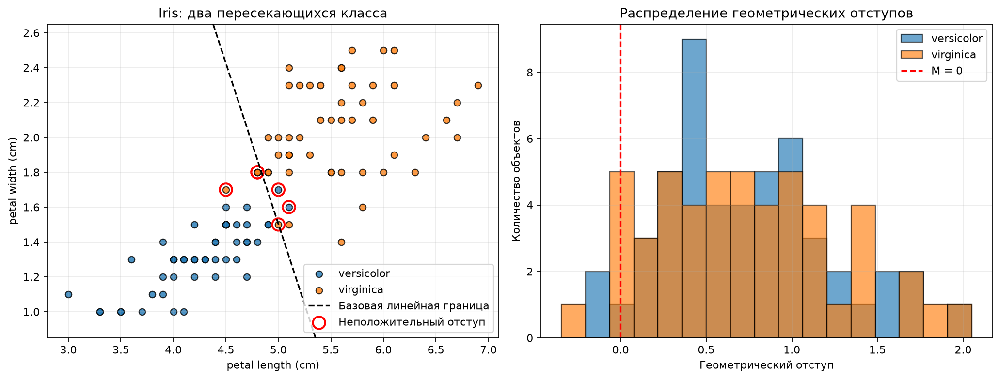
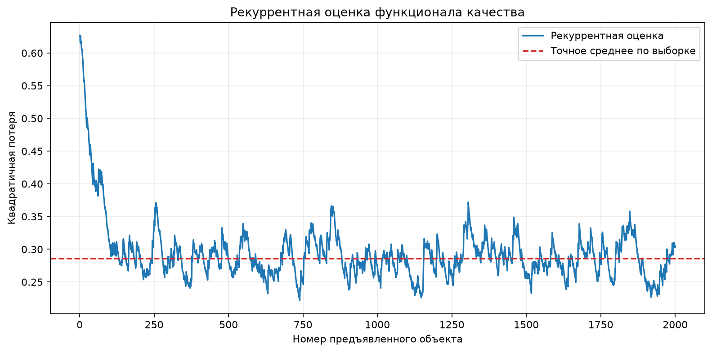
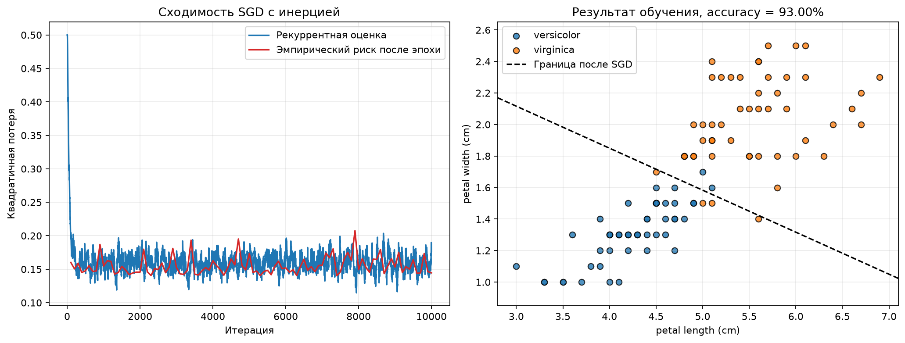
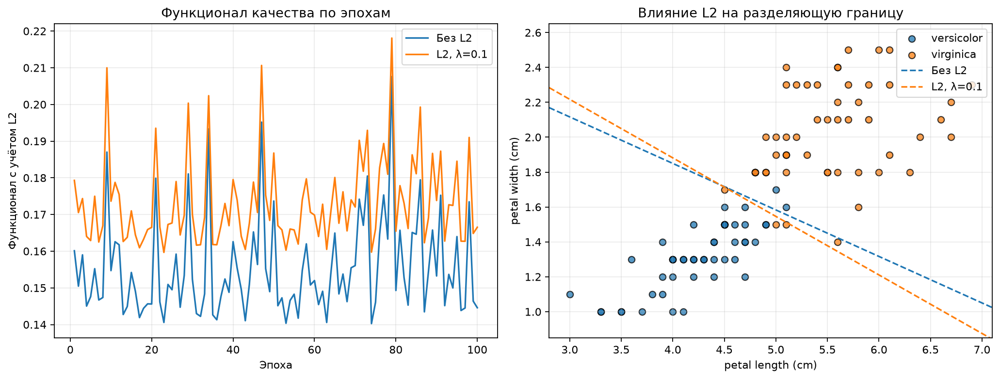
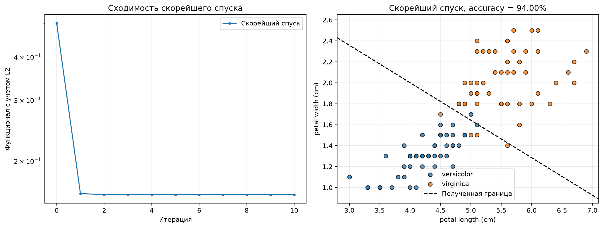
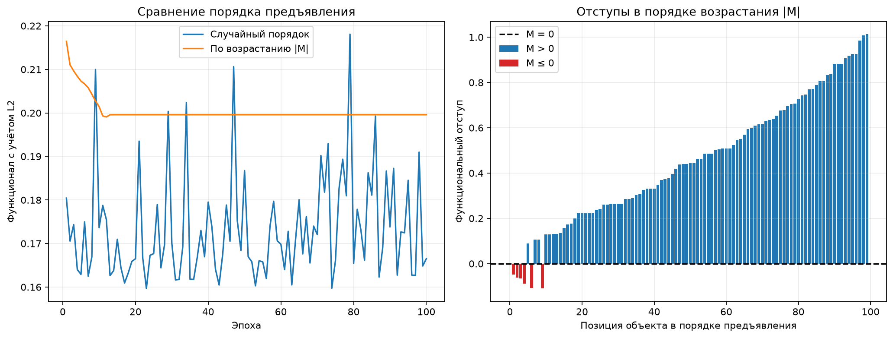
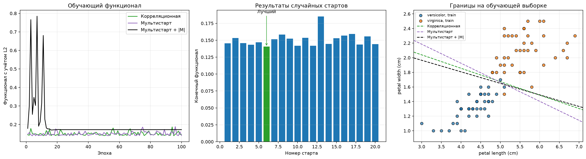
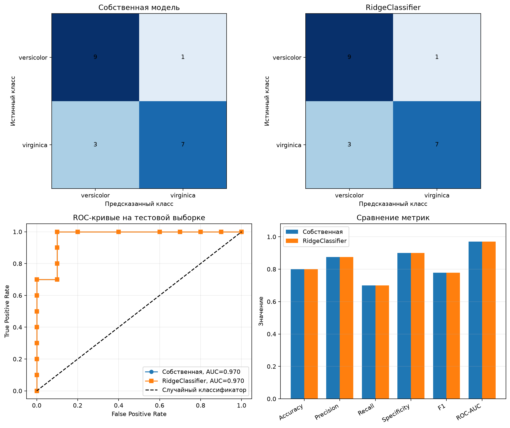

# Лабораторная работа № 1. Линейная классификация

## 1. датасет

выбраны два наиболее похожих класса ирисов: `versicolor` и `virginica`. У
`versicolor` метка `-1`,  `virginica` метка `+1`.

Всего в выборке 100 объектов: по 50 объектов каждого класса

Эти классы линейно неразделимы

## 2. Отступ объекта

Для линейного классификатора с решающей функцией

$$
a(x) = \langle w, x \rangle + b
$$

функциональный отступ объекта определяется как

$$
M_i = y_i a(x_i) = y_i(\langle w, x_i \rangle + b).
$$

Первая разделяющая поверхность перпендикулярно отрезку между центрами классов

Красными окружностями на левом графике отмечены объекты с неположительным
отступом. Их наличие и перекрытие распределений отступов около нуля показывают,
что выбранные классы нельзя безошибочно разделить данной линейной границей.

- минимальный отступ: `-0.3455`;
- средний отступ: `0.7347`;
- неположительный отступ имеют 6 из 100 объектов.

как видно классы пересекаются

## 3. Градиент функции потерь

В качестве функции потерь используется средняя квадратичная ошибка, записанная
через отступ объекта:

$$
Q(w, b) = \frac{1}{2n}\sum_{i=1}^{n}(1-M_i)^2
        = \frac{1}{2n}\sum_{i=1}^{n}(\langle w,x_i\rangle+b-y_i)^2.
$$

 Обозначив вектор ошибок как
`e = Xw + b - y`, получаем:

$$
\nabla_w Q = \frac{1}{n}X^T e,
\qquad
\frac{\partial Q}{\partial b}=\frac{1}{n}\sum_{i=1}^{n}e_i.
$$

реализация в `source/losses.py` 

## 4. Рекуррентная оценка функционала качества

эмпирический риск требует вычислить потери всех объектов:

$$
Q(w,b)=\frac{1}{n}\sum_{i=1}^{n}L_i(w,b).
$$

в сгд используется рекуррентная оценка:

$$
\widetilde Q_t=(1-\alpha)\widetilde Q_{t-1}+\alpha L_t,
\qquad 0<\alpha\leq1.
$$

Это экспоненциальное скользящее среднее. Последняя потеря входит в оценку с
весом `alpha`, а влияние более старых наблюдений геометрически уменьшается.
Малое значение `alpha` сильнее сглаживает, но медленнее
реагирует на изменение модели

В `source/quality.py` реализованы одно рекуррентное обновление и построение
истории оценки. Для демонстрации объекты предъявлялись в случайном порядке в
течение 20 эпох при `alpha = 0.02`.

Для базовой центроидной границы точное значение функционала составило
`0.285828`, конечная рекуррентная оценка - `0.304122`, абсолютное отклонение -
`0.018294` видно как колеблется из-за сгд

## 5. Стохастический градиентный спуск с инерцией

На каждой итерации случайно выбирается очередной объект и вычисляется градиент
его квадратичной потери а направление обновления и от накопленной скорости:

$$
v_t=\gamma v_{t-1}+\eta\nabla L_{i_t}(w_{t-1},b_{t-1}),
$$

$$
w_t=w_{t-1}-v_t.
$$

Такие же формулы применяются к смещению `b`. Здесь `eta` — скорость обучения,
а `gamma` — коэффициент инерции. При `gamma = 0` алгоритм превращается в
обычный SGD. Инерция сглаживает колебания отдельных стохастических градиентов
и сохраняет движение в направлении, которое последовательно уменьшает
функцию потерь.

После 100 эпох эмпирический риск уменьшился до `0.144583`.
Точность классификации на используемой выборке составила `93%`.

## 6. L2-регуляризация

К эмпирическому риску добавляется штраф за большую норму весов:

$$
Q_{L2}(w,b)=Q(w,b)+\frac{\lambda}{2}\lVert w\rVert_2^2.
$$

Градиент по весам принимает вид

$$
\nabla_w Q_{L2}=\nabla_w Q+\lambda w.
$$

Смещение `b` не регуляризуется, поскольку оно не определяет чувствительность
модели к отдельным признакам. При каждом обновлении добавка `lambda * w`
немного уменьшает веса

Для демонстрации сравнивается SGD без регуляризации и с `lambda = 0.1` при
одинаковых начальных условиях и порядке предъявления объектов.

Без L2 норма весов после обучения равна `0.656327`, потеря на данных —
`0.144583`, точность — `93%`. При `lambda = 0.1` норма весов уменьшается до
`0.600180`, потеря на данных составляет `0.148513`, L2-штраф — `0.018011`, а
точность — `94%`.

## Шаг 7. Скорейший градиентный спуск

длина шага расчитывается каждый раз, каждой итерации решается одномерная задача:

$$
\eta_t=\arg\min_{\eta\geq0}
Q_{L2}(w_t-\eta\nabla Q_{L2}(w_t)).
$$

Для квадратичного функционала оптимальный шаг вычисляется аналитически. Если
`g_w` и `g_b` — компоненты градиента, то

$$
\eta_t=\frac{\lVert g_w\rVert^2+g_b^2}
{\frac{1}{n}\lVert Xg_w+g_b\rVert^2+\lambda\lVert g_w\rVert^2}.
$$

После этого веса и смещение обновляются как

$$
w_{t+1}=w_t-\eta_t g_w,
\qquad
b_{t+1}=b_t-\eta_t g_b.
$$

В отличие от SGD, здесь на каждой итерации используется вся выборка, а

При `lambda = 0.1` алгоритм выполнил 10 итераций и уменьшил функционал с
`0.500000` до `0.159594`. Точность классификации составила `94%`. Расстояние
между найденными параметрами и точным решением нормальных уравнений равно
`2.67e-13`, что подтверждает корректную сходимость. Значения автоматически
выбранного шага находились в диапазоне от `0.520224` до `3.600355`.

## Шаг 8. Предъявление объектов по модулю отступа

Для каждого объекта вычисляется текущий отступ

$$
M_i=y_i(\langle w,x_i\rangle+b).
$$

В начале каждой эпохи объекты сортируются по возрастанию `|M_i|`. Первыми
предъявляются объекты, расположенные ближе всего к разделяющей границе.

В сравнении используются одинаковые начальные веса,
100 эпох, `eta = 0.01`, инерция `0.9` и `lambda = 0.1`.

Обе стратегии дали точность `94%` и 6 объектов с неположительным отступом.
Итоговый функционал при случайном порядке равен `0.166524`, а при порядке по
возрастанию `|M|` — `0.199588`.

## 9. Обучение линейного классификатора

Перед экспериментами данные делятся на обучающую и тестовую части в отношении
80/20 со стратификацией по классам. Среднее и стандартное отклонение признаков
вычисляются только по обучающей части. Тестовая выборка не используется для
выбора и настройки модели и будет исследована на шаге 10.

### Корреляционная инициализация

Начальный вес каждого признака равен коэффициенту корреляции Пирсона между
этим признаком и целевой меткой:

$$
w_j^{(0)}=\operatorname{corr}(X_j,y).
$$

Знак веса сразу задаёт правильное направление влияния признака, а его модуль
характеризует силу линейной связи с классом. Начальное смещение выбирается так,
чтобы средний ответ модели совпадал со средней меткой.

### Случайная инициализация и мультистарт

Выполняются 20 независимых запусков. Начальные веса и смещение генерируются из
нормального распределения с нулевым средним и стандартным отклонением `0.5`.
Для каждого запуска используется воспроизводимый, но отличный порядок
объектов. Лучшим считается запуск с минимальным обучающим функционалом после
100 эпох.

Квадратичный функционал с L2 является выпуклым, поэтому при точной сходимости
все старты должны приводить к одному минимуму.

### Сравнение способов предъявления

Из одной и той же лучшей случайной начальной точки выполняется обучение со
случайным порядком и с сортировкой по возрастанию `|M|`. Благодаря одинаковой
инициализации различия связаны именно с порядком предъявления объектов.

Получены следующие результаты на 80 обучающих объектах:

| Инициализация и предъявление | Функционал | Train accuracy | `M <= 0` |
|---|---:|---:|---:|
| Корреляционная, случайный порядок | `0.145321` | `97.5%` | 2 |
| Лучший случайный старт, случайный порядок | `0.140560` | `97.5%` | 2 |
| Лучший случайный старт, порядок по `|M|` | `0.172279` | `97.5%` | 2 |

Лучшим по обучающему функционалу оказался 6-й из 20 случайных стартов.
Значения по всем стартам лежат в диапазоне `0.140560–0.185106`. Одинаковая
точность при разных значениях функционала объясняется тем, что accuracy
учитывает только знак ответа, тогда как квадратичная потеря также зависит от
величины и уверенности ответа. Вариант по `|M|` снова показал более высокий
функционал из-за устойчивого детерминированного порядка обновлений.

## 10. Оценка качества классификации

Качество оценивается на 20 объектах, которые не участвовали в обучении,
стандартизации, выборе случайного старта или выборе режима предъявления.
Положительным классом считается `virginica`. Рассчитываются accuracy,
precision, recall, specificity, F1, ROC-AUC, квадратичная потеря и матрица
ошибок.

Из-за малого размера тестовой выборки вместе с accuracy приводится 95%-й
интервал Уилсона. Он характеризует статистическую неопределённость доли
правильных ответов и не является интервалом для параметров модели.

Все три собственные модели дали одинаковые дискретные прогнозы:

| Модель | Accuracy | Precision | Recall | Specificity | F1 | ROC-AUC | Квадратичная потеря |
|---|---:|---:|---:|---:|---:|---:|---:|
| Корреляционная | `0.80` | `0.875` | `0.70` | `0.90` | `0.778` | `0.97` | `0.244606` |
| Мультистарт | `0.80` | `0.875` | `0.70` | `0.90` | `0.778` | `0.97` | `0.231689` |
| Мультистарт + `|M|` | `0.80` | `0.875` | `0.70` | `0.90` | `0.778` | `0.97` | `0.265252` |

Матрица ошибок лучшей модели: `TN=9`, `FP=1`, `FN=3`, `TP=7`.
95%-й интервал Уилсона для accuracy равен `[58.40%; 91.93%]`. Высокий
ROC-AUC при более низкой accuracy означает, что модель хорошо ранжирует
объекты двух классов, но фиксированный порог `0` не даёт безошибочного
разделения перекрывающихся классов.

## Шаг 11. Сравнение с эталонной реализацией

В качестве эталона используется `sklearn.linear_model.RidgeClassifier`. Он
решает ту же задачу квадратичной классификации с L2-регуляризацией. Наша
функция имеет нормировку

$$
\frac{1}{2n}\lVert Xw+b-y\rVert^2+
\frac{\lambda}{2}\lVert w\rVert^2,
$$

поэтому для эквивалентной регуляризации в `RidgeClassifier` задаётся
`alpha = n * lambda = 80 * 0.1 = 8`. Эталон обучается на той же обучающей
выборке и получает те же стандартизованные признаки.

Лучшей собственной моделью до раскрытия тестовых меток был выбран мультистарт
со случайным предъявлением, поскольку он дал минимальный обучающий функционал.
Таким образом, тестовая выборка не используется для ретроспективного выбора
лучшего варианта.

Эталон получил ту же матрицу ошибок и те же классификационные метрики:
accuracy `0.80`, precision `0.875`, recall `0.70`, specificity `0.90`,
F1 `0.778`, ROC-AUC `0.97`. Его квадратичная потеря равна `0.234612`, тогда
как у выбранной собственной реализации — `0.231689`. Разница невелика и не
свидетельствует о статистически значимом преимуществе, однако показывает, что
собственная реализация достигла качества корректной библиотечной модели.

## 12. Вывод

В работе с нуля реализованы вычисление отступов, квадратичная функция потерь и
её градиент, рекуррентная оценка функционала, SGD с инерцией,
L2-регуляризация, скорейший градиентный спуск, корреляционная и случайная
инициализации, мультистарт и предъявление объектов по модулю отступа.
