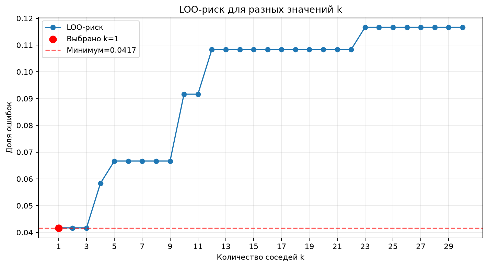
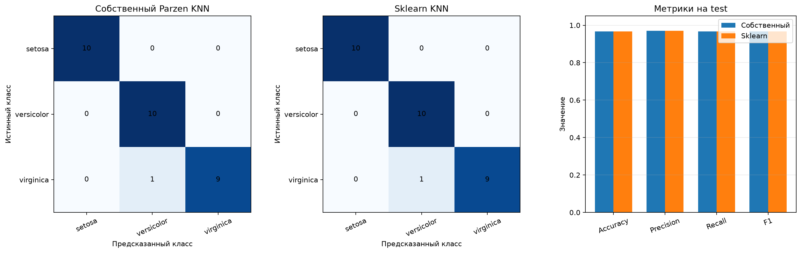
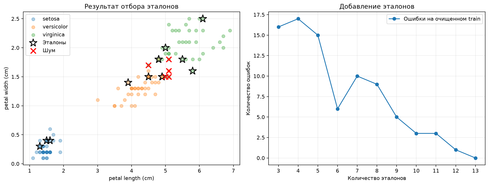
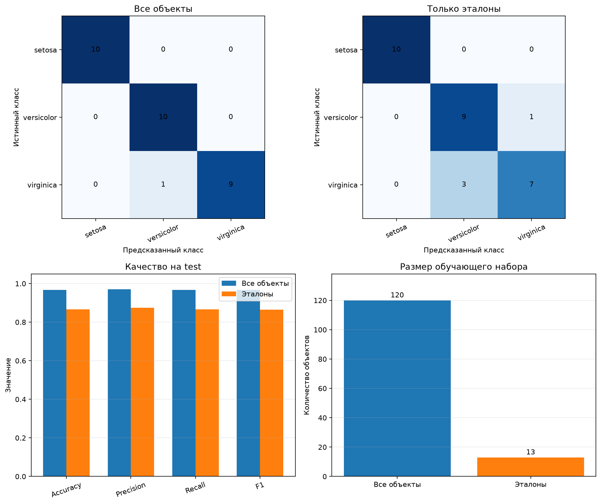

# Лабораторная работа №2. Метрическая классификация

## 1. Выбор и подготовка данных

Используется датасет Iris из `sklearn.datasets`:

- 150 объектов;
- 4 числовых признака;
- 3 класса: `setosa`, `versicolor`, `virginica`;
- по 50 объектов каждого класса.

Данные разделены на обучающую и тестовую выборки 80/20 со
стратификацией. В train находится 120 объектов — по 40 каждого класса. В test
находится 30 объектов — по 10 каждого класса.

Признаки стандартизируются по среднему и стандартному отклонению обучающей
выборки:

$$
x'_{ij}=\frac{x_{ij}-\mu_j}{\sigma_j}.
$$

## 2. KNN с окном Парзена переменной ширины

Для классифицируемого объекта вычисляются евклидовы расстояния до всех
обучающих объектов:

$$
\rho(x,x_i)=\sqrt{\sum_j(x_j-x_{ij})^2}.
$$

Ширина окна зависит от положения объекта и равна расстоянию до его
`k`-го ближайшего соседа:

$$
h(x)=\rho(x,x^{(k)}).
$$

Вес обучающего объекта определяется гауссовым ядром:

$$
K(r)=\exp\left(-\frac{r^2}{2}\right),
\qquad
w_i(x)=K\left(\frac{\rho(x,x_i)}{h(x)}\right).
$$

Для каждого класса веса его объектов суммируются. Выбирается класс с
максимальной суммой:

$$
a(x)=\arg\max_c\sum_{i:y_i=c}w_i(x).
$$

Гауссово ядро не обнуляет дальние объекты полностью, но их влияние быстро
уменьшается с расстоянием. Параметр `k=5` на этом шаге используется только для
проверки реализации. Оптимальное значение будет выбрано методом LOO.

## 3. Подбор параметра k методом LOO

Параметр `k` подбирается методом Leave-One-Out только на обучающей выборке.
Для каждого объекта выполняются следующие действия:

1. объект временно исключается из train;
2. классификатор обучается на оставшихся 119 объектах;
3. исключённый объект классифицируется;
4. результат сравнивается с правильным классом.

LOO-риск равен доле ошибочно классифицированных объектов:

$$
Q_{LOO}(k)=\frac{1}{n}\sum_{i=1}^{n}
[a(x_i;X\setminus\{x_i\},k)\neq y_i].
$$

Проверяются значения `k` от 1 до 30.

Минимальный LOO-риск `0.0417`, или 5 ошибок из 120, получен при `k = 1`,
`k = 2` и `k = 3`. По правилу разрешения равенства выбрано `k = 1`. При
увеличении `k` окно расширяется, поэтому возрастает влияние более далёких
объектов и пересекающихся классов. При `k = 30` риск достигает `0.1167`, или
14 ошибок.

## 4. Обоснование параметров

Используется евклидово расстояние, поскольку все четыре признака являются
числовыми. Перед вычислением расстояний признаки стандартизируются, поэтому ни
один признак не доминирует только из-за масштаба.

Гауссово ядро выбрано как гладкая убывающая функция расстояния. Близкие
объекты получают большой вес, а влияние далёких объектов постепенно
уменьшается без резкого обрыва на границе окна.

Ширина окна определяется расстоянием до `k`-го соседа. Это делает окно
адаптивным к плотности данных. Диапазон `k = 1..30` покрывает как локальные,
так и более сглаженные варианты модели и при этом остаётся существенно меньше
объёма обучающей выборки.

График показывает минимальный риск при `k = 1`, `k = 2` и `k = 3`. Выбрано
`k = 1`. После `k = 3` риск в целом увеличивается, следовательно, дальнейшее
расширение окна ухудшает разделение близких классов `versicolor` и
`virginica`.

## 5. Сравнение с эталонным KNN

Собственная реализация сравнивается с
`sklearn.neighbors.KNeighborsClassifier`. Обе модели получают одинаковые
стандартизованные обучающие и тестовые данные, используют евклидово расстояние
и выбранное методом LOO значение `k = 1`.

Собственная модель использует гауссовы веса всех обучающих объектов и
адаптивную ширину окна. Эталонный KNN при `k = 1` использует класс одного
ближайшего соседа.
Для многоклассовой оценки используются accuracy и macro-усреднение precision,
recall и F1. При macro-усреднении метрика сначала рассчитывается отдельно для
каждого класса, после чего берётся обычное среднее. Каждый класс имеет
одинаковый вес.

Обе модели получили одинаковые результаты:

| Метрика | Собственный Parzen KNN | Sklearn KNN |
|---|---:|---:|
| Accuracy | `0.9667` | `0.9667` |
| Macro precision | `0.9697` | `0.9697` |
| Macro recall | `0.9667` | `0.9667` |
| Macro F1 | `0.9666` | `0.9666` |

Из 30 тестовых объектов правильно классифицированы 29. Все объекты `setosa` и
`versicolor` распознаны правильно. Один объект `virginica` отнесён к классу
`versicolor`. Предсказания собственной и эталонной моделей совпали на 100%.

## Шаг 6. Отбор эталонов

Реализован алгоритм отбора эталонов на основе STOLP. Для каждого обучающего
объекта методом LOO вычисляется классификационный отступ:

$$
M_i=S_{y_i}(x_i)-\max_{c\neq y_i}S_c(x_i),
$$

где `S` — сумма парзеновских весов объектов соответствующего класса.
Положительный отступ означает правильную классификацию, отрицательный — что
другой класс получил больший вес.

Алгоритм выполняет следующие действия:

1. объекты с `M <= 0` отмечаются как потенциальный шум;
2. для каждого класса выбирается объект с максимальным отступом;
3. эти три объекта образуют начальный набор эталонов;
4. оставшиеся объекты классифицируются по текущим эталонам;
5. наиболее уверенно ошибочный объект добавляется в набор;
6. процесс повторяется, пока очищенная выборка не классифицируется без ошибок.

Шумовые объекты не используются как кандидаты в эталоны, поскольку они могут
искажать границу классов.

Из 120 обучающих объектов выбрано 13 эталонов, а 5 объектов отмечены как шум.
Размер опорного набора уменьшился на `89.17%`. В него вошли 3 объекта
`setosa`, 5 объектов `versicolor` и 5 объектов `virginica`. Среди шумовых
объектов находится один `versicolor` и четыре `virginica`. Очищенная
обучающая выборка классифицируется выбранными эталонами с accuracy `100%`.

## 7. Визуализация отбора эталонов

Для визуализации используются длина и ширина лепестка. Эти два признака хорошо
показывают расположение трёх классов на плоскости. Сам отбор эталонов выполнен
по всем четырём стандартизованным признакам, поэтому двумерный график является
только отображением результата.

Обычные точки показывают исходную обучающую выборку, чёрные звёзды - выбранные
эталоны, красные кресты - объекты, отмеченные как шум. Эталоны находятся как
в центральных областях классов, так и около границы между `versicolor` и
`virginica`, где для правильной классификации требуется больше представителей.

Второй график показывает изменение числа ошибок при последовательном
добавлении эталонов. Изменение не монотонно, потому что новый объект влияет на
голосование и на адаптивную ширину окна. При 13 эталонах число ошибок на
очищенной обучающей выборке становится равным нулю.

## Шаг 8. Сравнение KNN с отбором эталонов и без него

Сравниваются две собственные модели с `k = 1`. Первая использует все 120
обучающих объектов, вторая — только 13 выбранных эталонов. Обе модели
оцениваются на одной тестовой выборке из 30 объектов.

Кроме accuracy, macro precision, macro recall и macro F1 измеряется среднее
время классификации всей тестовой выборки. Замер повторяется 1000 раз, чтобы
уменьшить влияние погрешности таймера.

| Метрика | Все 120 объектов | 13 эталонов |
|---|---:|---:|
| Accuracy | `0.9667` | `0.8667` |
| Macro precision | `0.9697` | `0.8750` |
| Macro recall | `0.9667` | `0.8667` |
| Macro F1 | `0.9666` | `0.8653` |
| Время для 30 объектов | `0.0933 мс` | `0.0259 мс` |

После отбора предсказание ускорилось примерно в `3.61` раза, но accuracy
снизилась на 10 процентных пунктов. Полная модель допускает одну ошибку, а
модель на эталонах - четыре. `Setosa` по-прежнему распознаётся без ошибок;
ухудшение происходит на пересекающихся классах `versicolor` и `virginica`.
Следовательно, выбранный вариант STOLP обеспечивает сильное сжатие и
ускорение, но удаляет часть объектов, важных для точного описания границы.
Время зависит от компьютера, поэтому основным устойчивым результатом является
сокращение числа сравнений со 120 до 13.

## Шаг 9. Итоги

В работе реализован собственный метрический классификатор KNN с гауссовым
окном Парзена переменной ширины. Ширина окна для каждого объекта определяется
расстоянием до `k`-го ближайшего соседа.

Параметр `k` выбран методом Leave-One-Out только по обучающей выборке.
Минимальный LOO-риск `0.0417` получен при `k = 1`, `k = 2` и `k = 3`. В
качестве итогового значения выбрано `k = 1`.

На тестовой выборке собственная модель получила accuracy `0.9667` и полностью
совпала по предсказаниям с `sklearn.neighbors.KNeighborsClassifier`.

Алгоритм STOLP сократил обучающий набор со 120 объектов до 13 эталонов. Размер
набора уменьшился на `89.17%`, а предсказание ускорилось примерно в `3.61`
раза. При этом test accuracy снизилась с `0.9667` до `0.8667`.