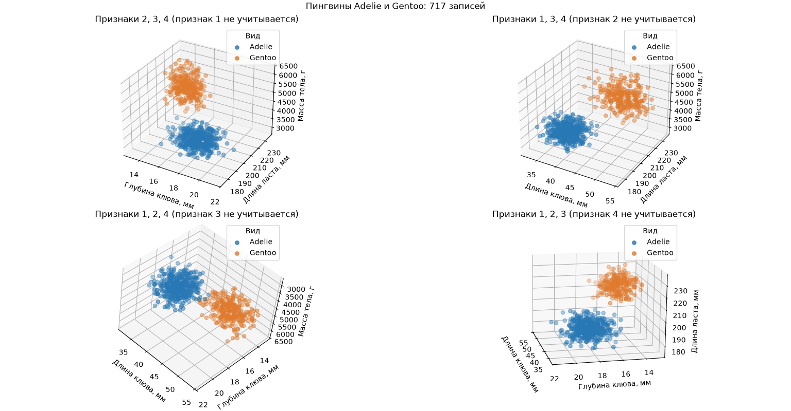
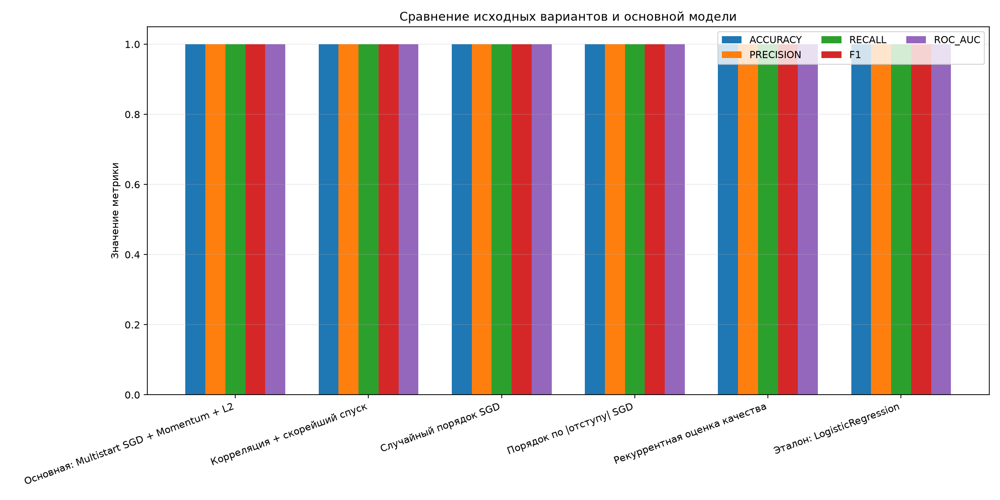
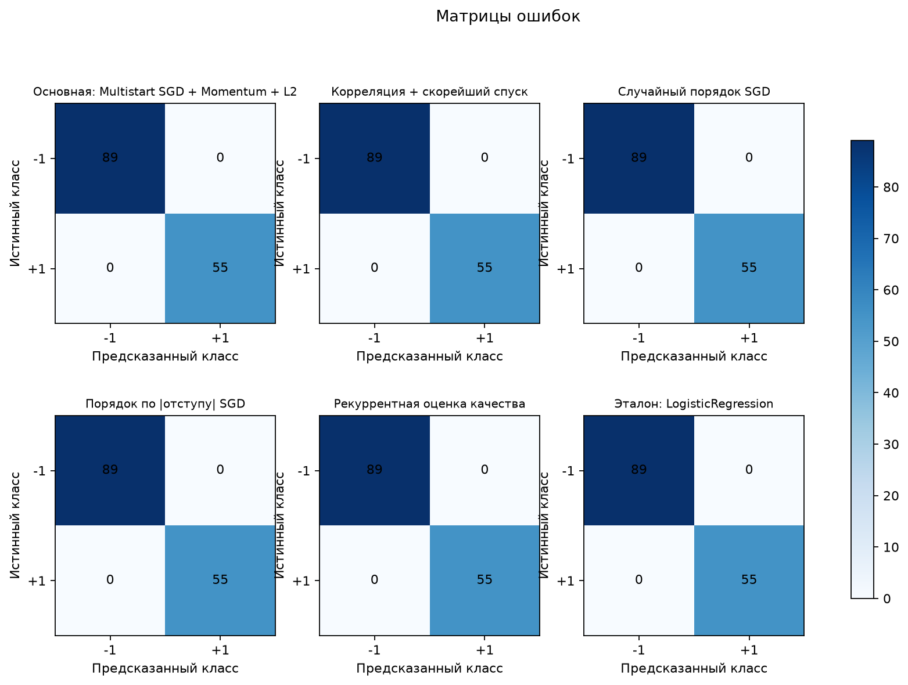
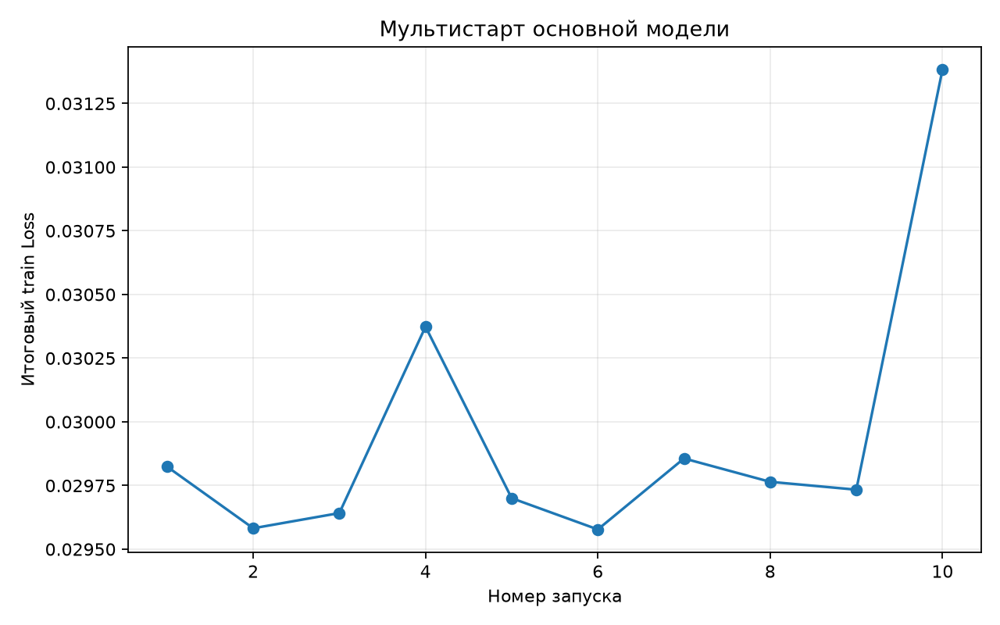
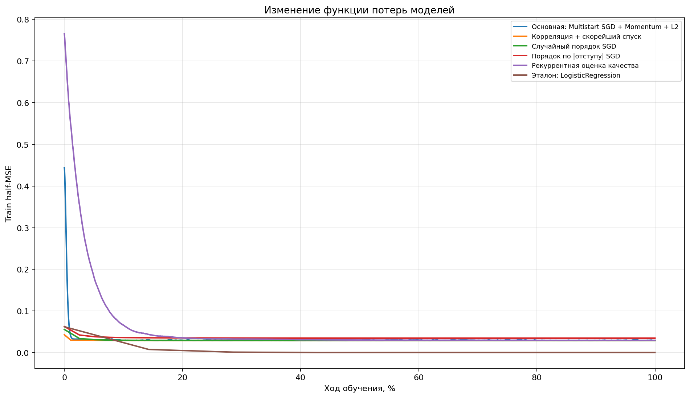
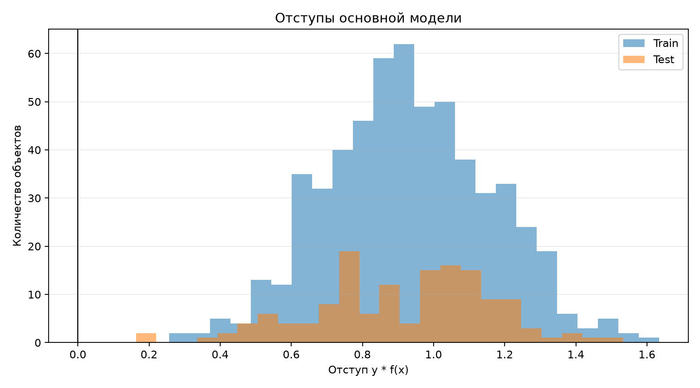

# Лабораторная работа №1. Линейная классификация

Автор: Вавилова Варвара

## Цель работы

Реализовать бинарный линейный классификатор с квадратичной функцией потерь и исследовать несколько способов его обучения: корреляционную инициализацию, стохастический градиентный спуск, momentum, L2-регуляризацию, случайный порядок предъявления объектов и порядок по модулю отступа. Основным результатом является классификатор, обученный через мультистарт SGD с momentum и L2. Остальные реализованные алгоритмы используются для сравнения качества и анализа поведения обучения.

## Данные

Используется файл `source/penguins.csv`. Из исходного набора оставлены два класса:

- Adelie, код метки `-1`;
- Gentoo, код метки `+1`.

Признаки модели:

- длина клюва (`culmen_length_mm`);
- глубина клюва (`culmen_depth_mm`);
- длина ласта (`flipper_length_mm`);
- масса тела (`body_mass_g`).

Строки с пропусками в выбранных признаках удаляются. Затем данные делятся на обучающую и тестовую части в соотношении 80/20 с `stratify=y` и `random_state=42`. В текущем запуске получено 573 обучающих и 144 тестовых объекта. Среднее и стандартное отклонение для масштабирования вычисляются только по train; к тестовым данным применяются те же значения. В начало вектора признаков добавляется единица для свободного коэффициента модели.

## Основная модель

Основная точка запуска реализована как `LinearClassifier.fit_primary` в `source/model.py`. Она выполняет мультистарт: создаёт несколько классификаторов со случайными начальными весами, обучает каждый SGD с momentum и L2-регуляризацией, затем возвращает запуск с минимальной ошибкой на train. В `source/main.py` эта модель обозначена как `Основная: Multistart SGD + Momentum + L2`.

Для объекта с признаками $x$ модель вычисляет вещественный score:

$$
f(x) = x^T w.
$$

Класс определяется знаком score:

$$
\hat y = \begin{cases}+1, & f(x) \ge 0,\\-1, & f(x) < 0.\end{cases}
$$

Отступ объекта - произведение правильной метки на score:

$$
M_i = y_i f(x_i).
$$

Положительный отступ означает правильную классификацию, отрицательный - ошибочную. Чем больше положительный отступ, тем увереннее объект находится на правильной стороне разделяющей гиперплоскости.

Базовая функция потерь - половина среднеквадратичной ошибки:

$$
Q(w) = \frac{1}{2n}\sum_{i=1}^{n}(y_i - x_i^T w)^2.
$$

Полный градиент и стохастический градиент для одного объекта:

$$
\nabla Q(w) = \frac{1}{n}X^T(Xw-y),\qquad
\nabla Q_i(w) = x_i(x_i^T w-y_i).
$$

В основном алгоритме к стохастическому градиенту добавляется L2-слагаемое. Первый вес, соответствующий bias, не регуляризуется:

$$
g_i = x_i(x_i^T w-y_i) + \lambda Rw,
$$

где у матрицы $R$ нулевой первый диагональный элемент, а остальные диагональные элементы равны единице. Обновление с инерцией:

$$
v_t = \mu v_{t-1}+g_i,\qquad w_t = w_{t-1}-\eta v_t.
$$

На каждой итерации случайно выбирается один объект с возвращением. В мультистарте для каждого из 10 запусков используется отдельный seed, веса инициализируются из нормального распределения с параметрами $N(0, 0.1)$.

### Параметры основного запуска

| Параметр | Значение |
|---|---:|
| Число запусков мультистарта | 10 |
| `learning_rate` ($\eta$) | 0.001 |
| `momentum` ($\mu$) | 0.9 |
| `l2_lambda` ($\lambda$) | 0.001 |
| Итераций на один запуск | 5000 |
| Выбор лучшего запуска | Минимум train half-MSE |

В текущем запуске минимальный train half-MSE мультистарта равен `0.029578` (шестой запуск). Важно: L2 добавляется в стохастический градиент, однако метод `loss()` и критерий выбора мультистарта считают half-MSE без L2-штрафа. Поэтому число `0.029578` - именно train half-MSE, а не регуляризованный функционал.

## Сравниваемые варианты

Новые семейства классификаторов не добавлялись. С основной моделью сравниваются исходные варианты алгоритмов из лабораторной:

| Вариант | Инициализация и обучение | Назначение сравнения |
|---|---|---|
| Основная: Multistart SGD + Momentum + L2 | Случайная инициализация, 10 запусков, SGD с momentum и L2 | Главный результат лабораторной |
| Корреляция + скорейший спуск | Веса признаков задаются корреляциями с метками; выполняется полный градиентный спуск с точным шагом для квадратичной функции | Сравнить корреляционную инициализацию и скорейший спуск |
| Случайный порядок SGD | Начальные веса случайны; на каждой эпохе объекты перемешиваются | Сравнить случайное предъявление без momentum и L2 |
| Порядок по модулю отступа SGD | Перед эпохой объекты сортируются по возрастанию модуля отступа | Проверить обучение на объектах, ближайших к границе |
| Рекуррентная оценка качества | Качество обновляется экспоненциальным усреднением ошибки отдельного объекта | Показать динамику рекуррентной оценки |
| Эталон: LogisticRegression | Эталонный линейный классификатор scikit-learn | Сравнить собственную реализацию с библиотечной моделью |

Сравниваемые алгоритмы, кроме LogisticRegression, используют тот же класс `LinearClassifier`, но разные способы инициализации или обновления весов. Поэтому это сравнение способов обучения одного линейного семейства, а не сравнение независимых классов моделей.

## Метрики

На отложенной тестовой выборке рассчитываются:

- **Accuracy** - доля верных предсказаний;
- **Precision** - точность предсказаний положительного класса `+1`;
- **Recall** - доля найденных объектов класса `+1`;
- **F1** - гармоническое среднее Precision и Recall;
- **Train/Test half-MSE** - половина средней квадратичной ошибки score относительно меток `-1/+1`.

Для LogisticRegression вероятность положительного класса преобразуется в шкалу меток по формуле $s = 2p(+1\mid x)-1$, чтобы half-MSE сравнивался на шкале `[-1, +1]`. Классификационные метрики считаются порогом score `0`.

Дополнительно выполняется repeated stratified CV: 5 фолдов, 3 повтора, всего 15 оценок на вариант. Внутри каждого разбиения масштабирование заново подгоняется только по fold-train. Для основной модели в CV выполняется один детерминированный случайный старт на фолд; финальная модель на всей обучающей выборке выбирается мультистартом из 10 запусков. Тестовая выборка не участвует в CV и выборе основной модели.

## Результаты на тестовой выборке

| Модель | Train half-MSE | Test half-MSE | Accuracy | Precision | Recall | F1 | ROC-AUC |
|---|---:|---:|---:|---:|---:|---:|---:|
| **Основная: Multistart SGD + Momentum + L2** | 0.029578 | 0.035757 | 1.000 | 1.000 | 1.000 | 1.000 | 1.000 |
| Корреляция + скорейший спуск | 0.029327 | 0.035397 | 1.000 | 1.000 | 1.000 | 1.000 | 1.000 |
| Случайный порядок SGD | 0.029332 | 0.035406 | 1.000 | 1.000 | 1.000 | 1.000 | 1.000 |
| Порядок по модулю отступа SGD | 0.034929 | 0.041657 | 1.000 | 1.000 | 1.000 | 1.000 | 1.000 |
| Рекуррентная оценка качества | 0.029756 | 0.035013 | 1.000 | 1.000 | 1.000 | 1.000 | 1.000 |
| Эталон: LogisticRegression | 0.000457 | 0.001518 | 1.000 | 1.000 | 1.000 | 1.000 | 1.000 |

Все варианты классифицировали 144 тестовых объекта без ошибок. Это не означает, что все их численные score совпадают: half-MSE различается. У LogisticRegression half-MSE заметно ниже, но Accuracy, Precision, Recall, F1 и ROC-AUC у всех вариантов одинаковы.


## Вывод по 3D-графикам



На 3D-графиках для каждой комбинации трёх признаков точки Adelie и Gentoo образуют хорошо различимые группы. Это показывает, что выбранные признаки делают классы простыми для разделения линейной моделью, что согласуется с Accuracy, Precision, Recall, F1 и ROC-AUC, равными `1.000` на тестовой выборке и во всех фолдах CV. График служит визуальной иллюстрацией разделимости; значения метрик получены отдельно при оценке моделей.

## Разбор графиков

Все изображения автоматически сохраняются в `graphs/` рядом с каталогом `source/`.

### Метрики моделей



Столбцы Accuracy, Precision, Recall, F1 и ROC-AUC у всех моделей достигают 1.0, поэтому группы столбцов практически совпадают. График показывает, что метрики классификации не различают эти варианты на данном разбиении. Для сравнения величины ошибок нужно смотреть на half-MSE в таблице и CSV.

### Матрицы ошибок



Матрица строится с классами `-1` и `+1`. Все объекты лежат на диагонали; внедиагональные ячейки равны нулю. Это визуальное подтверждение отсутствия false positive и false negative на тестовой части.

.

### Мультистарт основной модели



Каждая точка соответствует итоговому train half-MSE после 5000 итераций с собственной случайной инициализацией. Минимум выбранного запуска находится у запуска №6. Разброс небольшой: мультистарт здесь проверяет устойчивость оптимизации, а не разные классы моделей.

### Графики потерь моделей 




### Отступы основной модели



Показаны отступы `y * f(x)` для train и test. Ноль - граница классификации: положительный отступ соответствует верному классу. Размещение тестовых отступов справа от нуля согласуется с Accuracy `1.0`.

## Файлы результатов

- `models/main_multistart_sgd_momentum_l2.joblib` - основная обученная модель;
- `models/correlation_steepest_descent.joblib`, `models/random_order_sgd.joblib`, `models/margin_order_sgd.joblib`, `models/recursive_quality_sgd.joblib` - реализации для сравнения;
- `models/reference_logistic_regression.joblib` - линейный эталон;
- `models/comparison_metrics.csv` - метрики train/test;
- `models/training_loss_history.csv` - история train half-MSE для каждой модели;
- `models/repeated_cv_metrics.csv` - среднее и стандартное отклонение метрик по CV;
- `graphs/loss_comparison.png` - изменение train half-MSE в ходе обучения всех моделей;
- `graphs/` - сравнение метрик, матрицы ошибок, CV, кривые обучения, мультистарт, отступы и рекуррентная оценка.

## Запуск

Из каталога `students/vavilova-vl/lab1`:

```powershell
.\.venv\Scripts\Activate.ps1
python .\source\main.py
python .\source\plot_model_losses.py
```

`main.py` повторно обучает модели и сохраняет истории потерь в CSV. Затем `plot_model_losses.py` строит график из этих историй. Для воспроизводимости используются фиксированные random state; основной мультистарт задаёт seed от номера запуска.
