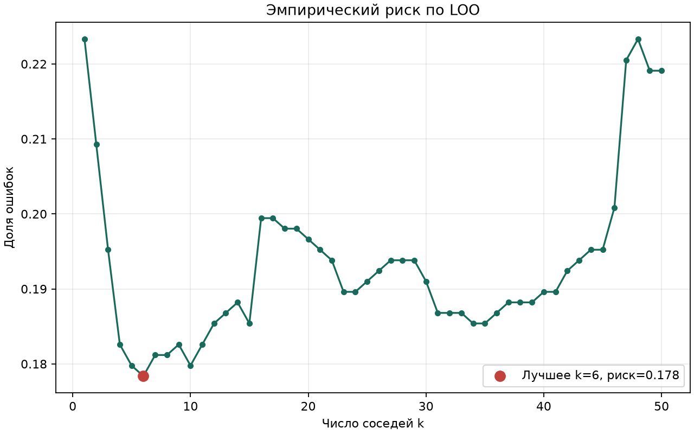
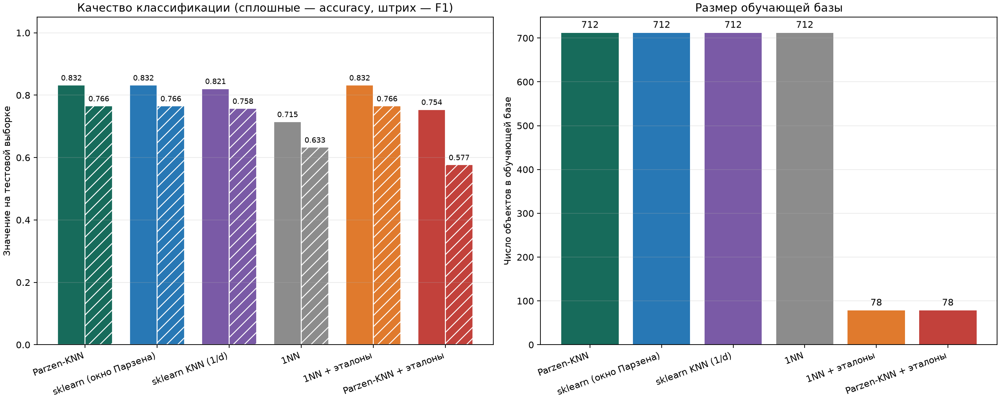
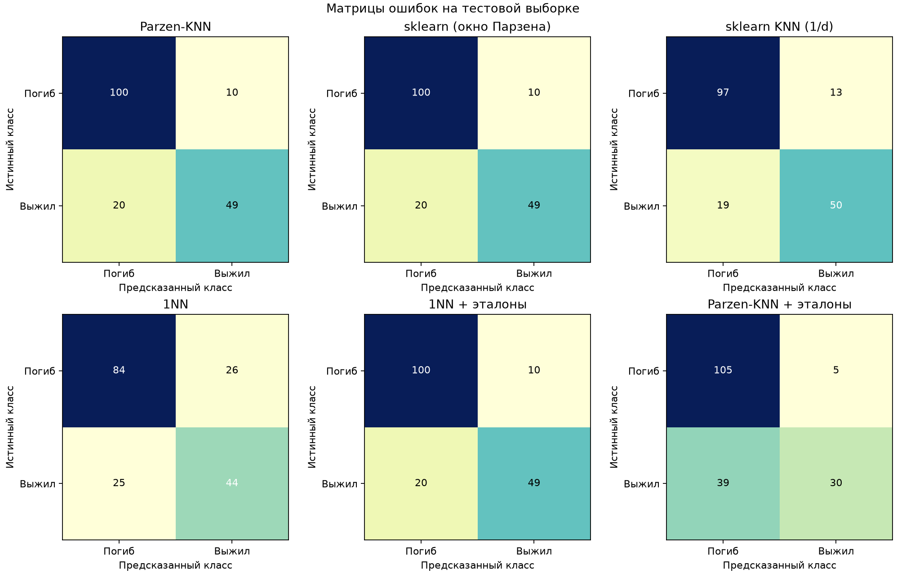
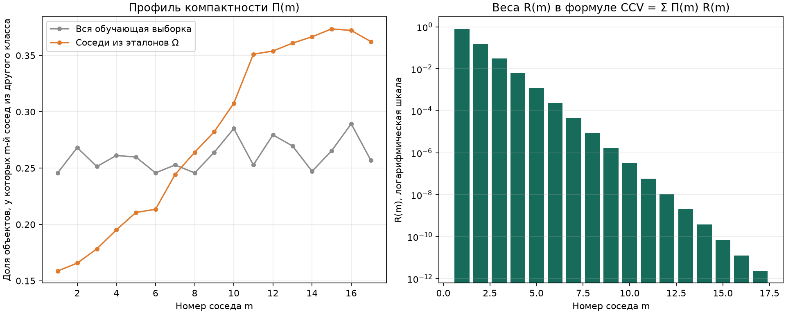
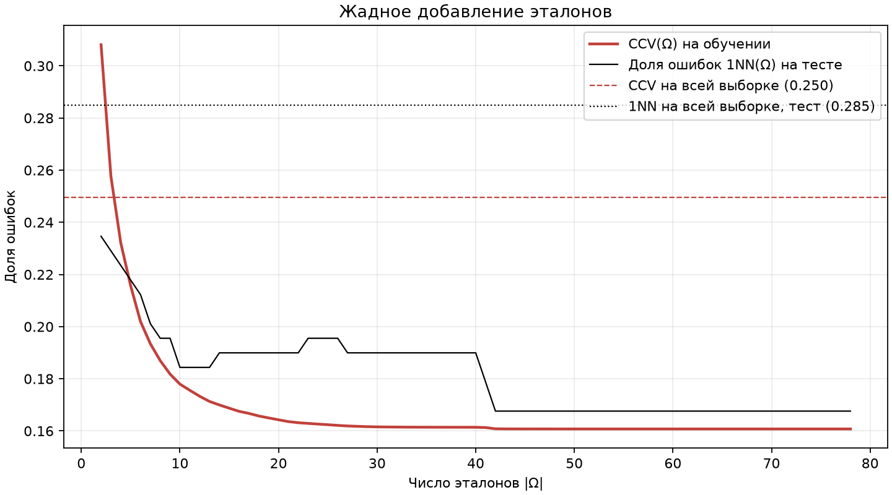
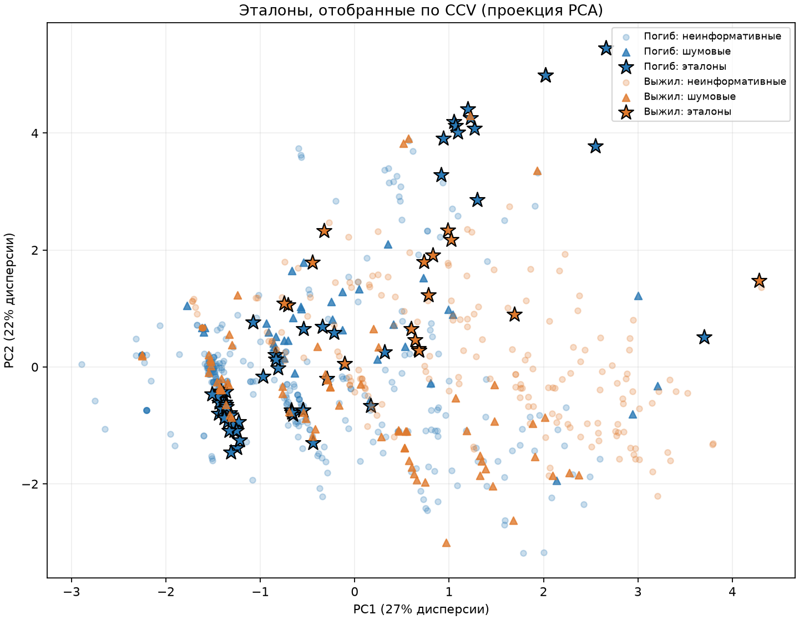

# Лабораторная работа №2. Метрическая классификация

## Задача и данные

Датасет Titanic (`source/Titanic-Dataset.csv`, 891 пассажир). Решается бинарная классификация: выжил пассажир (`Survived=1`) или погиб (`Survived=0`). Классы несбалансированы: 549 погибших и 342 выживших, поэтому, кроме accuracy, считается F1 для класса «Выжил».

### Признаки

| Признак | Описание | Обработка |
|---|---|---|
| `Pclass` | Класс билета: 1 - первый (высший), 2 - второй, 3 - третий | как есть (1–3) |
| `Sex` | Пол пассажира | 1 - женщина, 0 - мужчина |
| `Age` | Возраст в годах | пропуски (177 шт.) заполняются медианой train |
| `SibSp` | Число братьев, сестёр и супругов на борту (siblings / spouses) | как есть |
| `Parch` | Число родителей и детей на борту (parents / children) | как есть |
| `Fare` | Стоимость билета в фунтах стерлингов | $\ln(1 + \text{Fare})$: без логарифма несколько очень дорогих билетов доминируют в расстояниях |
| `Embarked` | Порт посадки: C - Шербур, Q - Квинстаун, S - Саутгемптон | one-hot `Embarked_C`, `Embarked_Q` (S - базовый уровень); 2 пропуска заполняются модой train |

Целевая переменная `Survived` - выжил ли пассажир (1 - выжил, 0 - погиб).

Не используются:
- `PassengerId` - порядковый номер пассажира;
- `Name` - имя;
- `Ticket` - номер билета;
- `Cabin` - номер каюты: пропущен у 77% пассажиров.

Первые три - идентификаторы, по ним нельзя сравнивать пассажиров на близость.

Разбиение на train/test стратифицированное (80/20, `random_state=42`): 712 объектов в train и 179 в test. Стратификация по `Survived` делит каждый класс в пропорции 80/20 отдельно:

| Класс | Всего | Train | Test | Доля в test |
|---|---|---|---|---|
| Погиб | 549 | 439 | 110 | 20.0% |
| Выжил | 342 | 273 | 69 | 20.2% |
| Итого | 891 | 712 | 179 | 20.1% |

Медиана, мода, среднее и стандартное отклонение считаются только на train. Каждый признак стандартизуется:

$$\tilde{x}_j = \frac{x_j - \mu_j}{\sigma_j},$$

где $\mu_j$ и $\sigma_j$ - среднее и стандартное отклонение признака $j$ на train.

## Алгоритмы

### Метод окна Парзена переменной ширины (`source/knn.py`)

 Для объекта $x$ обучающие объекты упорядочиваются по евклидову расстоянию $\rho$: $x^{(1)}, x^{(2)}, \dots$ - первый, второй и т. д. ближайшие соседи. Ширина окна равна расстоянию до $(k+1)$-го соседа, так что окно шире там, где объекты расположены реже:

$$h(x) = \rho\left(x, x^{(k+1)}\right).$$

Вес каждого обучающего объекта задаётся гауссовым ядром:

$$w_i(x) = K\left(\frac{\rho(x, x_i)}{h(x)}\right), \qquad K(r) = e^{-2r^2}.$$

Голосуют все обучающие объекты с этими весами. Объект относится к классу с наибольшей суммой весов:

$$\Gamma_y(x) = \sum_{i=1}^{\ell} \left[y_i = y\right] w_i(x), \qquad a(x; X^\ell, k, K) = \arg\max_{y \in Y} \Gamma_y(x).$$

$k$ ближайших соседей получают веса из диапазона $[e^{-2}, 1] \approx [0.14, 1]$. Вес более далёких объектов быстро убывает: у объекта на расстоянии $2h$ он равен $e^{-8} \approx 3 \cdot 10^{-4}$. Поэтому решение фактически определяется окрестностью из примерно $k$ соседей.

Если $(k+1)$-й сосед совпадает с $x$ ($h(x) = 0$), голосуют только точные совпадения. Вычисления векторизованы через матрицу попарных расстояний.

### Подбор k методом LOO

Для каждого $k = 1, \dots, 50$ каждый обучающий объект $x_j$ по очереди классифицируется по остальным $\ell - 1 = 711$ объектам, и считается доля ошибок:

$$\mathrm{LOO}(k) = \frac{1}{\ell} \sum_{j=1}^{\ell} \Big[ a\left(x_j;\ X^\ell \setminus \lbrace x_j \rbrace,\ k\right) \neq y_j \Big], \qquad k^* = \arg\min_k \mathrm{LOO}(k).$$

Здесь $X^\ell$ - обучающая выборка из $\ell = 712$ объектов. При равенстве рисков выбирается меньшее $k$. Тестовая выборка в подборе не участвует.

### Сравнение с эталонной реализацией

Сравниваются два варианта `sklearn.neighbors.KNeighborsClassifier` с тем же `k`:
- **sklearn (окно Парзена)** - `n_neighbors` равно размеру обучающей выборки (голосуют все объекты), а в `weights` передана та же функция весов `parzen_weights`, что и в нашей реализации. Это проверка корректности: предсказания должны совпасть;
- **sklearn KNN (1/d)** - стандартный kNN с `weights="distance"`: голосуют $k$ ближайших соседей с весом $w(i, x) = [i \le k] / \rho\left(x, x^{(i)}\right)$.

### Отбор эталонов по критерию CCV (`source/reference_selection.py`)

Реализована жадная стратегия добавления эталонов для 1NN из лекции.

**Полный скользящий контроль** (CCV) - доля ошибок на контроле, усреднённая по всем $C_L^\ell$ разбиениям выборки $X^L$ на обучение $X^\ell$ и контроль $X^q$ длины $q = L - \ell$:

$$\mathrm{CCV}(X^L) = \frac{1}{C_L^\ell} \sum_{X^L = X^\ell \sqcup X^q} \frac{1}{q} \sum_{x_i \in X^q} \Big[ a(x_i; X^\ell) \ne y_i \Big].$$

Здесь длина контроля она обозначена $q$, чтобы не путать с числом соседей.

Для 1NN перебирать разбиения не нужно: CCV выражается через **профиль компактности** $\Pi(m, \Omega)$ - долю объектов, у которых $m$-й ближайший сосед из множества эталонов $\Omega$ лежит в другом классе:

$$\Pi(m, \Omega) = \frac{1}{L} \sum_{i=1}^{L} \left[ y_i \ne y_i^{(m \mid \Omega)} \right], \qquad \mathrm{CCV}(\Omega) = \sum_{m=1}^{q} \Pi(m, \Omega)\, R(m), \qquad R(m) = \frac{C_{L-1-m}^{\ell-1}}{C_{L-1}^{\ell}}.$$

$R(m)$ - вероятность того, что для контрольного объекта ближайшим обучающим окажется именно его $m$-й сосед. Сумма $\sum_m R(m) = 1$, поэтому CCV - средневзвешенное значение профиля компактности. В нашем случае $L = 712$, длина контроля $q = 142$ (20%, как при разбиении train/test), $R(1) = \ell / (L-1) \approx 0.80$, $R(2) \approx 0.16$, $R(3) \approx 0.03$. Слагаемые, где $R(m) < 10^{-12}$, отбрасываются: остаётся $m \le 17$.

**Алгоритм:**

1. $\Omega :=$ по одному объекту от каждого класса - ближайшему к центру класса.
2. Повторять: найти $x \in X^L \setminus \Omega$ с минимальным $\mathrm{CCV}(\Omega \cup \lbrace x \rbrace)$ и добавить его в $\Omega$.
3. Остановиться, как только CCV перестаёт уменьшаться.

Шумовые объекты в эталоны не попадают: их добавление ухудшает классификацию соседей и увеличивает CCV. При проверке каждого кандидата CCV пересчитывается инкрементально. Новый объект вставляется в список ближайших эталонов каждого объекта, а следующие за ним соседи сдвигаются на одну позицию: вклад $[y_i \ne y_i^{(m)}] R(m)$ становится $[y_i \ne y_i^{(m)}] R(m+1)$.

## Запуск

Из каталога `lab2`:

```powershell
uv run --locked python source/run_lab.py
```

Результаты сохраняются в `graphs/`:

- `loo_empirical_risk.png`, `loo_risks.csv` - эмпирический риск для разных `k`;
- `compactness_profile.png` - профиль компактности $\Pi(m)$ всей выборки и эталонов, веса $R(m)$;
- `selection_history.png` - CCV на обучении и доля ошибок 1NN на тесте в зависимости от числа эталонов;
- `selected_references.png` - эталонные, шумовые и неинформативные объекты в проекции на две главные компоненты (PCA);
- `model_comparison.png`, `comparison_metrics.csv` - accuracy, F1 и размер обучающей базы;
- `confusion_matrices.png` - матрицы ошибок на тестовой выборке.

## Результаты

### Выбор k



При малых `k` риск высокий (0.223 при `k=1`): окно узкое, решение определяют один-два ближайших соседа, и классификатор переобучается на шумных объектах. При больших `k` риск снова растёт (0.22 при `k≈50`): окно захватывает объекты из далёких областей, и начинает преобладать больший класс «Погиб». Минимум LOO-риска **0.178 при k=6**. На участке `k=4–11` риск почти не меняется (0.178–0.183), так что выбор устойчив. Скачок при `k=16` (до 0.199) говорит о том, что более широкое окно начинает захватывать соседние группы пассажиров.

### Сравнение моделей на тестовой выборке

| Модель | k | Accuracy | F1 | Объектов в базе |
|---|---|---|---|---|
| Parzen-KNN | 6 | 0.832 | 0.766 | 712 |
| sklearn (окно Парзена) | 6 | 0.832 | 0.766 | 712 |
| sklearn KNN (1/d) | 6 | 0.821 | 0.758 | 712 |
| 1NN | 1 | 0.715 | 0.633 | 712 |
| 1NN + эталоны | 1 | 0.832 | 0.766 | 78 |
| Parzen-KNN + эталоны | 6 | 0.754 | 0.577 | 78 |




- Собственная реализация и sklearn с теми же весами дают одинаковые предсказания на 100% тестовых объектов, то есть реализация корректна.
- Окно Парзена и стандартный kNN с весами 1/d отличаются на 2 тестовых объекта (0.832 против 0.821). Стандартная ошибка accuracy на 179 объектах $\sqrt{p(1-p)/179} \approx 0.028$, так что разница в пределах шума: качество слабо зависит от вида ядра.
- Основная ошибка всех моделей - выжившие, которых модель отнесла к погибшим.

### Отбор эталонов



Профиль компактности всей выборки почти горизонтальный: $\Pi(m) \approx 0.25$ при всех $m$. Даже у ближайшего соседа класс другой в четверти случаев, то есть гипотеза компактности на Titanic выполняется слабо. Поэтому 1NN на всей выборке работает плохо: $\mathrm{CCV} = 0.250$, $\mathrm{LOO} = \Pi(1) = 0.246$. Если соседи берутся только из эталонов, профиль становится возрастающим: у ближайшего эталона класс другой лишь в 16% случаев. Веса $R(m)$ убывают быстрее геометрической прогрессии со знаменателем $q/(L-1) \approx 0.2$, поэтому CCV определяется в основном $\Pi(1)$ и $\Pi(2)$.



Жадное добавление остановилось на **78 эталонах из 712 (11%)**: 61 погибший и 17 выживших. CCV снизился с 0.308 (два начальных эталона) до 0.161. Основная часть выигрыша приходится на первые 10–20 шагов: при 10 эталонах CCV равен 0.178, при 42 - 0.161, дальше он почти не меняется. Доля ошибок на тесте в целом убывает вместе с CCV (с колебаниями на 1–2 объекта) и остаётся заметно ниже, чем у 1NN на всей выборке: при отборе эталонов по CCV переобучения нет.



Эталоны при жадном добавлении - не пограничные объекты, а представители однородных групп. Больше половины эталонов (44 из 78) - погибшие мужчины 3-го класса из плотного скопления слева: на 95% это пассажиры 3-го класса, на 86% - мужчины. Все 17 эталонов класса «Выжил» - женщины, в основном 1-го и 2-го класса. По результатам можно предположить, что женщин спасали в первую очередь»: женщины выживают, мужчины и часть женщин 3-го класса - нет. «Шумовые» (113 объектов) - те, на которых 1NN по эталонам ошибается. Это пассажиры, чей исход не совпал с похожими на них людьми, например выжившие мужчины 3-го класса.

**Сравнение с отбором эталонов и без него:**

- **1NN:** отбор эталонов повышает accuracy с 0.715 до 0.832 (+21 тестовый объект, это около 4 стандартных ошибок) и уменьшает базу в 9 раз. На всей выборке 1NN «запоминает» шумовые объекты, и каждый из них портит свою окрестность. Эталоны отфильтровывают шум, и 1NN по 78 объектам работает так же, как окно Парзена по всем 712. Матрицы ошибок совпадают случайно: предсказания совпадают на 90% объектов, а в остальных 18 объектах ошибки разошлись поровну.
- **Окно Парзена:** на эталонах accuracy падает с 0.832 до 0.754, а recall выживших - с 49 до 30 из 69. Эталоны отбирались для 1NN, а не для окна с $k = 6$. Кроме того, среди эталонов выживших в 3.6 раза меньше, чем погибших, и окно из 7 ближайших эталонов обычно набирает большинство погибших.
