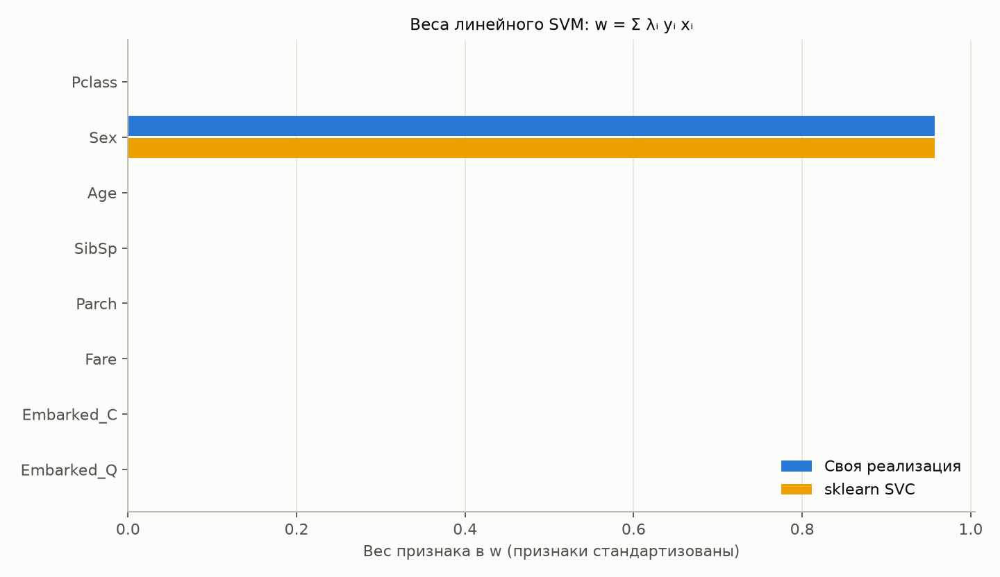
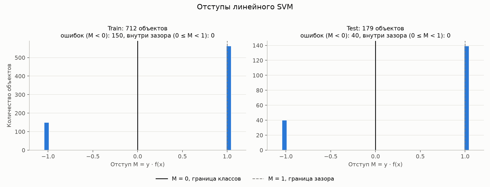
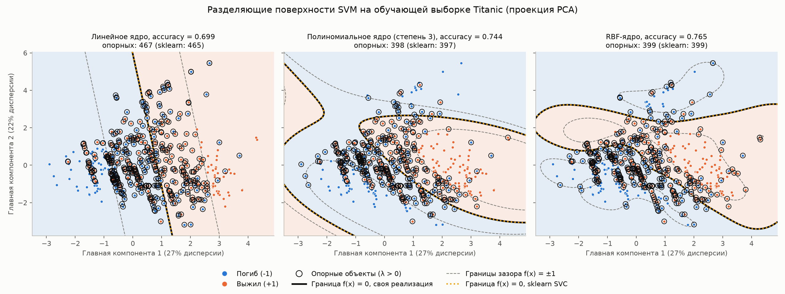
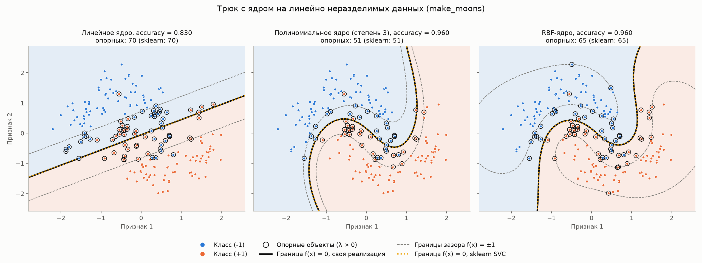
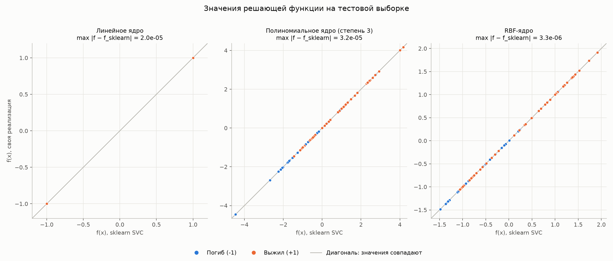

# Лабораторная работа №3. SVM

Автор: Вавилова Варвара

## Цель работы

Реализовать метод опорных векторов через решение двойственной задачи по $\lambda$, применить трюк с ядром, построить линейный классификатор, визуализировать решение и сравнить его с эталонной реализацией `sklearn.svm.SVC`.

## Данные

Используется датасет Titanic (`source/Titanic-Dataset.csv`, 891 пассажир). Задача — бинарная классификация: выжил пассажир или нет. Метки кодируются как в лекции:

- погиб — $y = -1$;
- выжил — $y = +1$.

Подготовка данных (`source/data_preparation.py`):

| Признак | Преобразование |
|---|---|
| `Pclass` | как есть: 1, 2, 3 (порядковый признак) |
| `Sex` | female → 1, male → 0 |
| `Age` | пропуски заменяются медианой по train |
| `SibSp`, `Parch` | как есть |
| `Fare` | $\ln(1 + \text{Fare})$ — распределение цены сильно скошено вправо |
| `Embarked` | пропуски заменяются модой по train, затем one-hot: `Embarked_C`, `Embarked_Q` |

Столбцы `PassengerId`, `Name`, `Ticket`, `Cabin` не используются. Данные делятся на train и test в соотношении 80/20 с `stratify` по целевому признаку и `random_state=42`: 712 обучающих объектов (439 погибших, 273 выживших) и 179 тестовых (110 и 69). Все 8 признаков стандартизуются; медиана, мода, среднее и стандартное отклонение считаются только по train.

Стандартизация для SVM обязательна: и скалярное произведение $\langle x, x' \rangle$, и расстояние $\lVert x - x' \rVert$ внутри ядер зависят от масштаба признаков, и без неё признак с большим разбросом (возраст) подавил бы остальные.

## Постановка задачи

### Линейный классификатор и отступ

Обучающая выборка $X^\ell = \lbrace (x_i, y_i) \rbrace_{i=1}^{\ell}$, $x_i \in \mathbb{R}^n$, $y_i \in \lbrace -1, +1 \rbrace$. Линейная модель классификации с параметрами $w \in \mathbb{R}^n$, $w_0 \in \mathbb{R}$:

$$
a(x; w, w_0) = \text{sign}\left(\langle x, w \rangle - w_0\right).
$$

Отступ объекта: $M_i(w, w_0) = \left(\langle x_i, w \rangle - w_0\right) y_i$. Объект классифицируется неверно, когда $M_i < 0$.

### Две постановки задачи SVM

**Аналитическая.** Эмпирический риск $\sum_i [M_i < 0]$ — кусочно-постоянная функция, минимизировать её напрямую нельзя. Пороговая функция потерь заменяется непрерывной оценкой сверху $(1 - M)_+ = \max(0, 1 - M)$, и к ней добавляется регуляризатор:

$$
\sum_{i=1}^{\ell} \left(1 - M_i(w, w_0)\right)_+ + \frac{1}{2C} \lVert w \rVert^2 \to \min_{w, w_0}.
$$

Аппроксимация штрафует объекты за приближение к границе классов, регуляризация — неустойчивые решения.

**Геометрическая.** Для линейно разделимой выборки параметры нормируются так, что $\min_i M_i = 1$. Тогда между классами лежит разделяющая полоса $\lbrace x : -1 \le \langle w, x \rangle - w_0 \le 1 \rbrace$ шириной $2 / \lVert w \rVert$, и её ширина максимизируется: $\frac{1}{2} \lVert w \rVert^2 \to \min$ при $M_i \ge 1$. Для линейно неразделимой выборки объектам разрешается нарушать ограничение на величину $\xi_i$:

$$
\frac{1}{2} \lVert w \rVert^2 + C \sum_{i=1}^{\ell} \xi_i \to \min_{w, w_0, \xi}, \qquad \xi_i \ge 1 - M_i(w, w_0), \quad \xi_i \ge 0, \quad i = 1, \dots, \ell.
$$

Это задача квадратичного программирования. В оптимуме $\xi_i = (1 - M_i)_+$, поэтому она эквивалентна аналитической постановке, умноженной на $C$. Константа $C$ управляет регуляризацией: большой $C$ — слабая регуляризация и узкая полоса, малый $C$ — сильная регуляризация и широкая полоса с большим числом нарушителей.

### Двойственная задача

Функция Лагранжа, где $\lambda_i$ — переменные, двойственные к ограничениям $M_i \ge 1 - \xi_i$, а $\eta_i$ — к ограничениям $\xi_i \ge 0$:

$$
\mathscr{L}(w, w_0; \xi, \lambda, \eta) = \frac{1}{2} \lVert w \rVert^2 - \sum_{i=1}^{\ell} \lambda_i \left(M_i(w, w_0) - 1\right) - \sum_{i=1}^{\ell} \xi_i \left(\lambda_i + \eta_i - C\right).
$$

Необходимые условия седловой точки:

$$
\frac{\partial \mathscr{L}}{\partial w} = 0 \Rightarrow w = \sum_{i=1}^{\ell} \lambda_i y_i x_i, \qquad
\frac{\partial \mathscr{L}}{\partial w_0} = 0 \Rightarrow \sum_{i=1}^{\ell} \lambda_i y_i = 0, \qquad
\frac{\partial \mathscr{L}}{\partial \xi_i} = 0 \Rightarrow \eta_i + \lambda_i = C.
$$

Подстановка этих равенств в $\mathscr{L}$ исключает $w$, $w_0$, $\xi$, $\eta$ и оставляет задачу только по $\lambda$:

$$
-\mathscr{L}(\lambda) = -\sum_{i=1}^{\ell} \lambda_i + \frac{1}{2} \sum_{i=1}^{\ell} \sum_{j=1}^{\ell} \lambda_i \lambda_j y_i y_j \langle x_i, x_j \rangle \to \min_{\lambda}, \qquad \sum_{i=1}^{\ell} \lambda_i y_i = 0, \quad 0 \le \lambda_i \le C.
$$

В матричном виде: $\frac{1}{2} \lambda^\top Q \lambda - \mathbf{1}^\top \lambda \to \min$, где $Q_{ij} = y_i y_j \langle x_i, x_j \rangle$. Градиент целевой функции равен $Q \lambda - \mathbf{1}$. Ограничение $\lambda_i \le C$ следует из $\eta_i = C - \lambda_i \ge 0$.

### Опорные объекты

Объект $x_i$ называется опорным, если $\lambda_i \ne 0$. Из условий дополняющей нежёсткости ($\lambda_i = 0$ либо $M_i = 1 - \xi_i$; $\eta_i = 0$ либо $\xi_i = 0$) следует типизация объектов:

| $\lambda_i$ | $\eta_i$ | $\xi_i$ | Отступ | Тип объекта |
|---|---|---|---|---|
| $\lambda_i = 0$ | $\eta_i = C$ | $\xi_i = 0$ | $M_i \ge 1$ | периферийный: не влияет на решение |
| $0 < \lambda_i < C$ | $0 < \eta_i < C$ | $\xi_i = 0$ | $M_i = 1$ | опорный-граничный: лежит на границе полосы |
| $\lambda_i = C$ | $\eta_i = 0$ | $\xi_i > 0$ | $M_i < 1$ | опорный-нарушитель: внутри полосы или на чужой стороне |

### Решение прямой задачи через двойственную

$$
w = \sum_{i=1}^{\ell} \lambda_i y_i x_i, \qquad w_0 = \langle w, x_i \rangle - y_i \quad \text{для любого } i: \ \lambda_i > 0, \ M_i = 1.
$$

Формула для $w_0$ — это равенство $M_i = 1$ для опорного-граничного объекта. Теоретически подходит любой такой объект; в коде берётся среднее по всем, чтобы погрешность оптимизатора в отдельных $\lambda_i$ меньше влияла на результат. Итоговый классификатор зависит только от опорных объектов:

$$
a(x) = \text{sign}\left( \sum_{i=1}^{\ell} \lambda_i y_i \langle x, x_i \rangle - w_0 \right).
$$

## Реализация двойственной задачи

Код: класс `DualSVM` в `source/svm.py`.

1. Строится матрица Грама $K_{ij} = K(x_i, x_j)$ и матрица $Q = (y y^\top) \circ K$.
2. Задача решается функцией `scipy.optimize.minimize` методом `SLSQP` (последовательное квадратичное программирование). В неё передаются целевая функция, её аналитический градиент $Q\lambda - \mathbf{1}$, границы $0 \le \lambda_i \le C$ и ограничение-равенство $\sum_i \lambda_i y_i = 0$. Начальная точка $\lambda = 0$ допустима.
3. По найденным $\lambda$ определяются опорные объекты и вычисляется $w_0$.
4. Для новых объектов считается $f(x) = \sum_i \lambda_i y_i K(x, x_i) - w_0$, класс — знак $f(x)$.

**Дубликаты.** В Titanic много пассажиров с одинаковыми признаками и одинаковой меткой: среди 712 обучающих объектов только 639 различных. У таких объектов совпадают строки и столбцы $Q$, поэтому в задачу они входят только через сумму своих $\lambda$. Группа из $m$ дубликатов заменяется одной переменной с границей $m C$, а после решения её значение делится между дубликатами поровну. Задача при этом остаётся той же самой, но переменных становится меньше, и исчезает произвол в распределении $\lambda$ внутри группы.

**Проверка решения.** Оптимальность проверяется независимо от сообщения оптимизатора: по типизации объектов для каждого объекта считается нарушение условий Каруша — Куна — Таккера (например, для $\lambda_i = 0$ это $\max(0, 1 - M_i)$). В отчёт идёт наибольшее нарушение по всем объектам; в точном оптимуме оно равно нулю.

## Трюк с ядром

В двойственную задачу и в классификатор объекты входят только через скалярные произведения $\langle x_i, x_j \rangle$. Идея: заменить $\langle x, x' \rangle$ функцией $K(x, x')$. Функция $K$ называется ядром, если $K(x, x') = \langle \psi(x), \psi(x') \rangle$ при некотором отображении $\psi: X \to H$ в спрямляющее пространство $H$. Получается линейный SVM в пространстве $H$, причём само отображение $\psi$ вычислять не нужно. Гиперплоскости в $H$ соответствует нелинейная разделяющая поверхность в исходном пространстве:

$$
a(x) = \text{sign}\left( \sum_{i=1}^{\ell} \lambda_i y_i K(x, x_i) - w_0 \right).
$$

В коде замена ядра — это замена одной функции, вычисляющей матрицу Грама; оптимизатор и всё остальное не меняются. Реализованы три ядра из лекции:

| Ядро | Формула | Параметры |
|---|---|---|
| линейное | $K(x, x') = \langle x, x' \rangle$ | — |
| полиномиальное с мономами степени $\le d$ | $K(x, x') = \left(\gamma \langle x, x' \rangle + 1\right)^d$ | $d = 3$, $\gamma = 1/8$ |
| RBF (гауссовское) | $K(x, x') = \exp\left(-\gamma \lVert x - x' \rVert^2\right)$ | $\gamma = 1/8$ |

Полиномиальное ядро отличается от лекционного $\left(\langle x, x' \rangle + 1\right)^d$ множителем $\gamma$. Это то же ядро, вычисленное на растянутых объектах: $\gamma \langle x, x' \rangle = \langle \varphi(x), \varphi(x') \rangle$ при $\varphi(x) = \sqrt{\gamma}\, x$, а подстановка $K_0(\varphi(x), \varphi(x'))$ в ядро $K_0$ снова даёт ядро. Множитель нужен, чтобы скалярные произведения 8-мерных стандартизованных объектов не уходили далеко от единицы при возведении в куб.

$\gamma = 1/n$, где $n = 8$ — число признаков: для стандартизованных данных это то же значение, что даёт `gamma="scale"` в sklearn. Во всех моделях $C = 1$. Параметры не подбирались по тестовой выборке.

**SVM как двухслойная нейросеть.** Первый слой вычисляет ядра $K(x, x_i)$ между объектом и опорными объектами, второй — их взвешенную сумму с весами $\lambda_i y_i$ и порогом $w_0$. Число нейронов скрытого слоя равно числу опорных объектов и определяется автоматически. Именно так устроен метод `DualSVM.decision_function`: после обучения хранятся только опорные объекты и их коэффициенты $\lambda_i y_i$.

## Результаты на Titanic

Все числа — из запуска `source/run_lab.py`; таблица сохраняется в `results/comparison_metrics.csv`. Качество измеряется на тестовой выборке (179 объектов), положительный класс — «Выжил».

| Ядро | Accuracy (train) | Accuracy (test) | Precision | Recall | F1 | Ошибок на test |
|---|---|---|---|---|---|---|
| линейное | 0.789 | 0.777 | 0.738 | 0.652 | 0.692 | 40 |
| полиномиальное, $d = 3$ | 0.850 | 0.810 | 0.843 | 0.623 | 0.717 | 34 |
| RBF | 0.843 | 0.810 | 0.857 | 0.609 | 0.712 | 34 |

Метрики своей реализации и sklearn совпадают во всех знаках, поэтому в таблице они приведены один раз; сравнение — в разделе «Сравнение с эталонным решением».

Нелинейные ядра дают на 6 правильных ответов больше, чем линейное (145 против 139 из 179). Разница невелика: стандартная ошибка accuracy на 179 объектах около 0.03, то есть сравнима с самой разницей. Полиномиальное и RBF-ядро по качеству неразличимы. У всех моделей precision выше recall: модель редко ошибочно объявляет пассажира выжившим, но пропускает 35–40% реально выживших.

## Линейный классификатор

Для линейного ядра вектор весов восстанавливается явно: $w = \sum_i \lambda_i y_i x_i$ (метод `DualSVM.linear_weights`). Веса сохраняются в `results/linear_weights.csv`.



| | Своя реализация | sklearn SVC |
|---|---|---|
| вес признака `Sex` | 0.95723 | 0.95723 |
| наибольший по модулю вес остальных признаков | $5 \cdot 10^{-8}$ | $2 \cdot 10^{-6}$ |
| $w_0$ | 0.28933 | 0.28933 |

Результат неожиданный, но верный: **линейный SVM на Titanic выродился в правило «женщины выживают, мужчины погибают»**. Ненулевой вес только у пола, а $w$ и $w_0$ таковы, что $f(x) = \langle w, x \rangle - w_0 = +1$ для каждой женщины и $f(x) = -1$ для каждого мужчины. Это видно по отступам:



Отступ принимает только два значения. На train у 562 объектов $M = 1$ (пол «угадал» судьбу — они лежат точно на границе зазора), у 150 объектов $M = -1$ (выжившие мужчины и погибшие женщины). Объектов с $M > 1$ нет вообще.

**Проверка через прямую задачу.** У 150 нарушителей $\xi_i = 1 - M_i = 2$, у остальных $\xi_i = 0$, поэтому

$$
\frac{1}{2} \lVert w \rVert^2 + C \sum_i \xi_i = \frac{0.95723^2}{2} + 1 \cdot 150 \cdot 2 = 0.45814 + 300 = 300.45814.
$$

Минимум двойственной задачи равен $-300.45815$. Значения прямой и двойственной задач совпадают с точностью до знака (двойственная задача записана на минимум, поэтому знак противоположный), значит, найденное решение оптимально.

Содержательно это означает, что при $C = 1$ линейной модели невыгодно использовать остальные признаки: наклон границы исправил бы часть из 150 ошибок, но увёл бы внутрь зазора объекты, которые сейчас лежат точно на его границе, и суммарный штраф вырос бы. Линейной модели не хватает гибкости — это и есть мотивация для трюка с ядром.

**Неединственность $\lambda$.** В этой задаче у всех 712 объектов $M_i \le 1$, то есть опорным может быть любой из них, а $w$ зависит от 712 переменных $\lambda_i$ лишь через 8 чисел. Поэтому двойственное решение не единственно: одному и тому же $w$ соответствует целое семейство векторов $\lambda$. Своя реализация нашла решение с 708 опорными объектами (150 нарушителей с $\lambda_i = C$ и 558 объектов с $0 < \lambda_i < C$), sklearn — с 307. Это разные точки одного множества оптимальных решений: значение целевой функции, $w$, $w_0$ и все предсказания у них одинаковы. Для линейного ядра сравнивать нужно именно $w$ и $w_0$, а не число опорных объектов.

Это не противоречит утверждению лекции о единственности решения задачи выпуклого квадратичного программирования: единственным является $w$, потому что прямая задача строго выпукла по $w$. Двойственная задача строго выпукла только при невырожденной матрице $Q$, а для линейного ядра её ранг не превышает числа признаков — 8 при 712 переменных.

## Визуализация решения

### Разделяющие поверхности на Titanic

Объекты 8-мерные, поэтому для рисунка обучающая выборка проецируется на две главные компоненты (PCA, 27% и 22% дисперсии), и модели обучаются заново на этих двух координатах ($C = 1$, $\gamma = 1/2$). Это отдельные модели: их качество ниже, чем у моделей на 8 признаках, потому что проекция сохраняет только половину дисперсии.



- Сплошная чёрная линия — граница классов $f(x) = 0$ своей реализации, жёлтый пунктир поверх неё — граница sklearn. Они совпадают на всех трёх панелях.
- Серый пунктир — границы зазора $f(x) = \pm 1$. Обведены опорные объекты.
- Линейное ядро даёт прямую (accuracy на train 0.699), полиномиальное — кривую третьего порядка (0.744), RBF — замкнутую область вокруг скопления выживших (0.765).
- Классы на проекции сильно перекрываются, поэтому опорных объектов много: 467, 398 и 399 из 712. Зазор накрывает большую часть выборки. Это типичная картина для плохо разделимых данных: SVM описывает решение небольшим числом объектов только тогда, когда классы хорошо разделяются.

### Трюк с ядром на линейно неразделимых данных

На Titanic выигрыш от ядер умеренный, поэтому эффект дополнительно показан на синтетических данных `make_moons` (200 объектов, шум 0.2), где линейной границы заведомо недостаточно. Код и параметры те же, меняется только функция ядра.



Линейное ядро ошибается на 17% объектов, полиномиальное и RBF — на 4%: граница огибает «полумесяцы». Число опорных объектов при этом уменьшается с 70 до 51 и 65.

## Сравнение с эталонным решением

Эталон — `sklearn.svm.SVC` (библиотека LIBSVM, алгоритм SMO) с теми же $C$, ядрами и параметрами ядер, `tol=1e-6`.

| Ядро | Реализация | Минимум двойственной задачи | $w_0$ | Опорных | Нарушение ККТ |
|---|---|---|---|---|---|
| линейное | своя | −300.458145 | 0.289326 | 708 | $4 \cdot 10^{-7}$ |
| линейное | sklearn | −300.458145 | 0.289327 | 307 | — |
| полиномиальное | своя | −237.486408 | 0.563875 | 291 | $1 \cdot 10^{-5}$ |
| полиномиальное | sklearn | −237.486408 | 0.563875 | 287 | — |
| RBF | своя | −262.310853 | 0.262336 | 342 | $4 \cdot 10^{-6}$ |
| RBF | sklearn | −262.310853 | 0.262336 | 338 | — |

| Ядро | $\max \lvert f - f_{\text{sklearn}} \rvert$ на test | Совпадение предсказаний на test |
|---|---|---|
| линейное | $2 \cdot 10^{-5}$ | 100% |
| полиномиальное | $3 \cdot 10^{-5}$ | 100% |
| RBF | $3 \cdot 10^{-6}$ | 100% |



- **Решения совпадают.** Минимум двойственной задачи совпадает с эталоном до 9 значащих цифр, $w_0$ — до 5–6 знаков, значения $f(x)$ на тесте отличаются не более чем на $3 \cdot 10^{-5}$, предсказания одинаковы на всех 179 объектах. На графике все точки лежат на диагонали. Для линейного ядра точек всего две, $(-1, -1)$ и $(1, 1)$: в них сливаются все мужчины и все женщины.
- **Число опорных объектов** у нелинейных ядер отличается на 4 (291 против 287, 342 против 338). Вероятная причина — дубликаты: своя реализация делит $\lambda$ группы поровну между одинаковыми объектами, а SMO может распределить её иначе. На решающую функцию это не влияет. Для линейного ядра различие принципиальное и объяснено выше.
- **Оптимизатор.** Для линейного ядра `SLSQP` завершился с сообщением «Positive directional derivative for linesearch», а не «Optimization terminated successfully»: в вырожденной задаче он остановился, не найдя направления убывания. Что точка остановки — оптимум, подтверждают нарушение ККТ $4 \cdot 10^{-7}$, равенство значений прямой и двойственной задач и совпадение с эталоном. Для остальных ядер оптимизация завершилась штатно.
- **Скорость.** Своя реализация решает задачу на 712 объектах примерно за 10 секунд для линейного ядра и за полторы минуты для полиномиального и RBF; sklearn справляется с нелинейными ядрами за сотые доли секунды. `SLSQP` — метод общего назначения: он работает со всеми переменными сразу. SMO использует структуру задачи и на каждом шаге аналитически обновляет две переменные.

## Выводы

1. Двойственная задача SVM по $\lambda$ решена через `scipy.optimize.minimize`; решение совпадает с `sklearn.svm.SVC` по значению целевой функции, $w$, $w_0$, значениям решающей функции и предсказаниям для всех трёх ядер.
2. Трюк с ядром реализуется заменой одной функции — вычисления матрицы Грама. На Titanic нелинейные ядра повышают accuracy на тесте с 0.777 до 0.810, на `make_moons` — accuracy на обучающих данных с 0.83 до 0.96.
3. Линейный SVM на Titanic при $C = 1$ вырождается в классификацию по одному признаку — полу. Каждый объект оказывается либо точно на границе зазора, либо нарушителем, и двойственное решение становится неединственным, хотя $w$ и $w_0$ определены однозначно.
4. Titanic плохо разделим: опорными оказываются не менее 40% обучающих объектов. Свойство SVM описывать решение небольшим числом опорных объектов здесь не проявляется.

## Структура и запуск

```
lab3/
├── README.md
├── pyproject.toml
├── source/
│   ├── data_preparation.py   # загрузка Titanic, кодирование признаков, стандартизация
│   ├── svm.py                # ядра и DualSVM: решение двойственной задачи
│   ├── visualization.py      # графики
│   ├── run_lab.py            # точка запуска: обучение, сравнение с sklearn, графики
│   └── Titanic-Dataset.csv   # датасет (не хранится в репозитории)
├── graphs/                   # графики отчёта
└── results/                  # таблицы с метриками и весами
```

Запуск из папки `lab3`:

```
uv sync
uv run python source/run_lab.py
```

Полный запуск занимает около 7 минут: решается 9 двойственных задач (3 ядра на 8 признаках, 3 на проекции PCA, 3 на `make_moons`).
