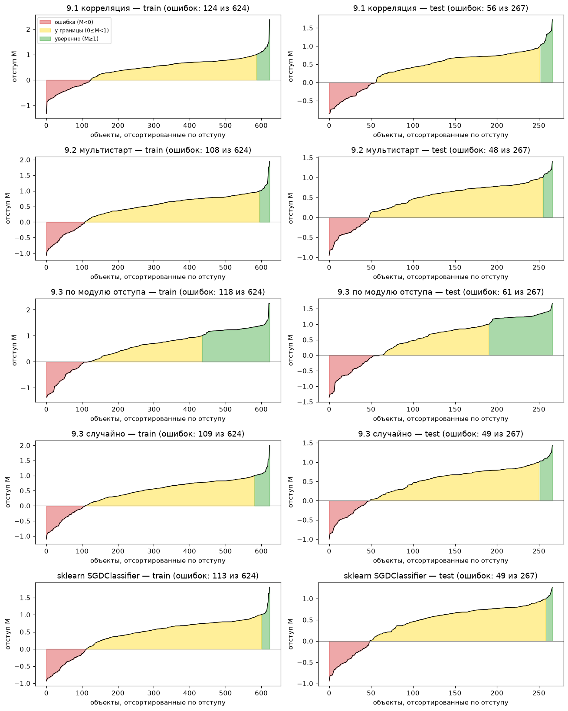
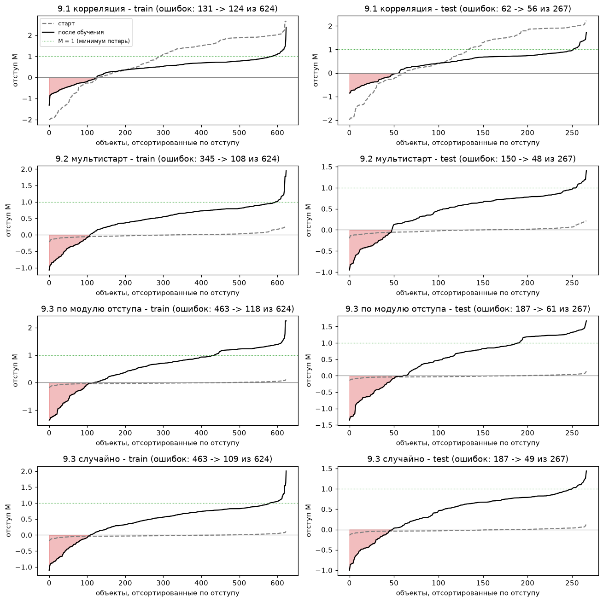
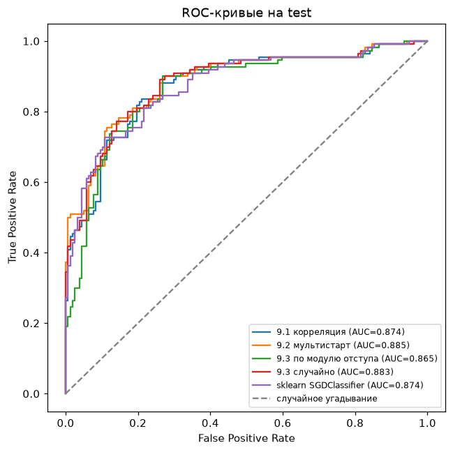

# Лабораторная работа №1. Линейная классификация

## Задание

В рамках лабораторной работы предстоит реализовать линейный классификатор и обучить его методом стохастического градиентного спуска с инерцией, L2-регуляризацией и квадратичной функцией потерь.

1. выбрать датасет для классификации;
2. реализовать вычисление отступа объекта (визуализировать, проанализировать);
3. реализовать вычисление градиента функции потерь;
4. реализовать рекуррентную оценку функционала качества;
5. реализовать метод стохастического градиентного спуска с инерцией;
6. реализовать L2-регуляризацию;
7. реализовать скорейший градиентный спуск;
8. реализовать предъявление объектов по модулю отступа;
9. обучить линейный классификатор на выбранном датасете:
   1. с инициализацией весов через корреляцию;
   2. со случайной инициализацией весов через мультистарт;
   3. со случайным предъявлением и с предъявлением по п. 8;
10. оценить качество классификации;
11. сравнить лучшую реализацию с эталонной;
12. подготовить отчет.

## Описание

Модель угадывает по данным пассажира «Титаника», выжил ли он. Это линейный классификатор, у каждого признака есть вес, баллы признаков складываются, и по знаку суммы выбирается ответ. Веса подбираются стохастическим градиентным спуском (SGD) с инерцией, L2-регуляризацией и квадратичной функцией потерь.

**Общая сводка**

- Лучшая своя модель (9.2, мультистарт) дает на test accuracy **0.820**, F1 **0.778**, AUC **0.885**. Эталон `sklearn` – 0.817 / 0.766 / 0.874. Результаты на уровне эталона.
- Около 82% – это почти предел линейной модели на этих данных, примерно каждый пятый пассажир не угадывается никак (например, мужчины из 3-го класса, которые все же выжили).
- Главное, что пришлось поменять в алгоритме, это взять шаг скорейшего спуска **не целиком, а его долей** (1%) и **масштабировать** признаки `Age` и `Fare`. Без этого обучение «прыгало» (accuracy от 0.37 до 0.80).

## Запуск

```sh
cd source
uv sync
uv run python main.py
```

Датасет скачивается сам при первом запуске. Скрипт печатает все таблицы из отчета и пересохраняет графики в `images/`. Случайность зафиксирована (`seed = 42`), результаты воспроизводятся.

| файл | что внутри |
|---|---|
| `source/data_preprocessing.py` | подготовка данных, разбиение train/test, стандартизация |
| `source/model.py` | отступ, потери, градиент, оценка Q, L2, скорейший спуск, предъявление по отступу, SGD |
| `source/initialization.py` | стартовые веса и стартовое Q |
| `source/task.py` | эксперименты 9.1, 9.2, 9.3 |
| `source/metric.py` | accuracy, матрица ошибок, precision, recall, F1, ROC |
| `source/sklearn_baseline.py` | эталон |
| `source/report.py`, `source/main.py` | вывод таблиц и графиков, запуск всего |

---

## 1. Датасет

**Titanic** (Kaggle), 891 пассажир, нужно предсказать `Survived`. Погибли 549 человек (62%), выжили 342 (38%). Сильнее всего с исходом связаны пол (выжили 74% женщин и 19% мужчин) и класс билета (63%, 47% и 24% для 1-го, 2-го и 3-го классов).

Ниже перечислено все, что сделано с данными.

| шаг | зачем |
|---|---|
| ответы переведены в $-1$ (погиб) и $+1$ (выжил) | так определяется отступ (п. 2) |
| пол (`male` → 0, `female` → 1) | модель работает только с числами |
| из имени взято обращение (`Mr`, `Mrs`, `Miss`, `Master`), редкие объединены в `Rare` | обращение несет пол, возраст и статус |
| пропуски в `Embarked` заполнены самым частым значением, в `Age` медианой по группе (обращение, класс, пол) | 2 и 177 пропусков |
| удалены `PassengerId`, `Ticket`, `Name`, `Cabin` | номера, имя уже использовано, у `Cabin` 77% пропусков |
| `Pclass`, `Embarked`, `Title` разбиты на столбцы 0/1 с `drop_first=True` | см. ниже |
| добавлен столбец `bias` из единиц | свободный член модели |
| разбиение 70/30 (624 объекта в train, 267 в test) | test – «экзамен», модель его не видит |
| `Age` и `Fare` стандартизированы по формуле $x \to (x - \mu) / \sigma$, где $\mu$ и $\sigma$ считаются по train | см. ниже |

**Зачем `drop_first`.** Если оставить все три столбца `Pclass_1`, `Pclass_2`, `Pclass_3`, их сумма у любого пассажира равна 1, то есть совпадает со столбцом `bias`. Тогда одинаково хорошее решение можно записать бесконечным числом способов, и веса теряют смысл (у нас получалось, что 1-й класс «хуже» 2-го). Это та самая мультиколлинеарность из лекции. Удалены базовые категории `Pclass_1`, `Embarked_C`, `Title_Master`, веса остальных читаются как отличие от них.

**Зачем стандартизация.** Градиент пропорционален значениям признака. У `Fare` значения до 512, у остальных признаков 0 или 1, поэтому вес `Fare` дергался в сотни раз сильнее. Среднее и разброс считаются **только по train**, test масштабируется теми же числами, иначе информация о test просочилась бы в обучение.

В итоге получилось 14 признаков (`bias, Sex, Age, SibSp, Parch, Fare, Pclass_2, Pclass_3, Embarked_Q, Embarked_S, Title_Miss, Title_Mr, Title_Mrs, Title_Rare`).

---

## 2. Отступ объекта

**Простыми словами.** Модель выдает балл $\langle w, x\rangle$. Отступ – это балл, умноженный на правильный ответ, то есть $M_i = y_i \langle w, x_i\rangle$. Если $M > 0$, модель права, если $M < 0$, ошибается, а чем больше модуль, тем увереннее ответ. Это как ставка на матч, чем увереннее и точнее угадан исход, тем больше отступ.

В коде это `calculate_margin`, график строит `plot_margins`. Объекты отсортированы по отступу слева направо. Красная зона – ошибки, желтая – верно, но у границы ($0 \le M < 1$), зеленая – уверенно верно ($M \ge 1$).



| метод | ошибок на train (из 624) | ошибок на test (из 267) |
|---|---|---|
| 9.1 корреляция | 124 | 56 |
| 9.2 мультистарт | **108** | **48** |
| 9.3 по модулю отступа | 118 | 61 |
| 9.3 случайно | 109 | 49 |
| sklearn | 113 | 49 |

**Что видно на графике.**

- Ошибается примерно каждый пятый. На train и test доля ошибок почти одинаковая, значит сильного переобучения нет.
- Кривая «упирается» в $M \approx 1$, зеленой зоны мало. Так и должно быть при квадратичных потерях, их минимум ровно в единице, и за «слишком уверенные» ответы ($M > 1$) модель тоже штрафуется.
- Глубокий левый «хвост» – пассажиры, на которых модель уверенно ошибается. Это нетипичные люди (например, мужчины 3-го класса, которые выжили). Линейная модель такого угадать не может.
- Ступеньки на кривой – группы пассажиров с одинаковыми признаками, у них одинаковый балл.
- У 9.3 по модулю отступа зеленая зона самая широкая, но ошибок на test больше всех (61). Подробнее в п. 9.3.

### Отступы до и после обучения



Серый пунктир – отступы при стартовых весах, черная линия – после обучения.

| метод | ошибок на train | ошибок на test |
|---|---|---|
| 9.1 корреляция | 131 → 124 | 62 → 56 |
| 9.2 мультистарт | 345 → 108 | 150 → 48 |
| 9.3 по модулю отступа | 463 → 118 | 187 → 61 |
| 9.3 случайно | 463 → 109 | 187 → 49 |

- **Случайный старт** (9.2, 9.3). Стартовые веса крошечные, поэтому баллы у всех объектов около нуля и ошибок больше половины. Обучение «раздувает» отступы и сокращает ошибки в 3–4 раза.
- **Корреляционный старт** (9.1) устроен наоборот. Он сразу хорош, но «перегрет». У 53% объектов $M > 1$, у 56 пассажиров уверенная ошибка ($M < -1$). Причина – признаки пересекаются (`Sex` и `Title_Mrs` описывают одно и то же), и их вклады складываются с повторами. Если просто уменьшить все стартовые веса в 2.3 раза, accuracy не изменится, а средняя потеря упадет с 1.25 до 0.64. Обучение делает то же самое и даже лучше, потеря падает до 0.58, а уверенных ошибок остается 2. Поэтому ошибок после обучения лишь немного меньше (131 → 124), а выигрыш в «калибровке» уверенности большой.

---

## 3. Градиент функции потерь

**Простыми словами.** Потеря – штраф за ошибку на одном объекте, $\mathcal{L}(M) = (1 - M)^2$, ноль при $M = 1$. Градиент показывает, в какую сторону сдвигать веса, чтобы штраф рос быстрее всего, а мы идем в обратную сторону. Как нащупать ногой склон в тумане и идти вниз.

$$\nabla_w \mathcal{L} = -2(1 - M_i)  y_i  x_i$$

Из формулы следует, что если $M_i = 1$, градиент нулевой, исправлять нечего. Если признак объекта равен нулю, его вес не меняется. Если признак большой, поправка к его весу тоже большая, поэтому нужна стандартизация (п. 1). В коде это `calculate_gradient`.

Число ошибок напрямую минимизировать нельзя, оно меняется скачками, и градиент почти везде нулевой. Гладкая потеря всегда не меньше счетчика ошибок, поэтому уменьшая ее, мы уменьшаем и число ошибок.

---

## 4. Рекуррентная оценка функционала качества

**Простыми словами.** Нужно следить, хорошо ли идет обучение. Честная оценка – средняя потеря по всей выборке, но считать ее на каждом шаге слишком долго. Поэтому оценка $Q$ обновляется «на ходу» по формуле ниже.

$$Q := \lambda \xi_i + (1 - \lambda)  Q$$

где $\xi_i$ – потеря на текущем объекте. Это как средний балл за последнее время, свежая оценка весит больше, старые постепенно «выцветают». Число $\lambda$ – темп забывания, $Q$ усредняет примерно $1/\lambda$ последних объектов. У нас $\lambda = 0.001$ (около 1000 объектов, полторы эпохи). В лекции рекомендуется брать $\lambda$ порядка $1/m$, у нас $m = 624$.

Стартовое $Q$ – средняя потеря на 50 случайных объектах (`calculate_q_start`). В коде это `calculate_q`.

С $\lambda = 0.1$ (память ~10 объектов) $Q$ прыгал в 3 раза при неизменной модели, и по нему нельзя было понять, когда остановиться.

**Когда останавливаться.** Раз в эпоху (624 шага) $Q$ сравнивается с его значением эпоху назад. Если изменение не больше `tolerance` три эпохи подряд, обучение заканчивается. Страховочный лимит – $10^5$ шагов. Сравнивать соседние шаги нельзя, их разница зависит от одного случайного объекта и срабатывала случайно.

---

## 5. SGD с инерцией

**Простыми словами.** Обычный градиентный спуск на каждый шаг обходит всю выборку. Стохастический берет **одного случайного пассажира**, смотрит на его ошибку и сразу чуть поправляет веса. Это как учиться стрелять, берешь случайный выстрел и подправляешь прицел, не дожидаясь тысячи выстрелов.

Один шаг в коде (`calculate_sgd`) состоит из выбора объекта, расчета отступа, потери и градиента, добавления штрафа L2, вычисления шага и обновления весов и $Q$.

**Инерция** помнит прошлое движение, как тяжелая тележка. Мелкие кочки (шум отдельных объектов) ее не останавливают, а устойчивое направление разгоняет.

$$v := \gamma v + h \nabla, \qquad w := w - v$$

Здесь $\gamma$ (`momentum`, у нас 0.5) – какая доля прошлой скорости сохраняется, $h$ – шаг.

---

## 6. L2-регуляризация

**Простыми словами.** К потере добавляется штраф за большие веса, $\frac{\tau}{2}\lVert w\rVert^2$. Градиент штрафа равен $\tau w$ и «тянет» все веса к нулю. Чем проще объяснение, тем лучше, модели с огромными весами разных знаков подгоняются под шум в данных (переобучение).

Вес `bias` не штрафуется, это не зависимость от признака, а базовая склонность модели. В коде это `calculate_l2`, $\tau = 0.001$ (слабая регуляризация).

---

## 7. Скорейший градиентный спуск

**Простыми словами.** Для одного объекта можно найти идеальный шаг $h^{\ast}$, после которого отступ этого объекта станет ровно 1, то есть потеря на нем обнулится.

$$y_i \langle w - h^{\ast}\nabla,  x_i\rangle = 1 \quad\Rightarrow\quad h^{\ast} = \frac{M_i - 1}{y_i \langle \nabla,  x_i\rangle}$$

В коде это `calculate_h`. Проверка на 200 объектах показала, что после такого шага отступ равен 1.000000.

**Проблема.** Идеальный шаг для одного объекта плох для всех. Модель подгоняется под очередного пассажира и «забывает» остальных, как учитель, который перестраивает весь урок под каждого, кто задал вопрос. Accuracy на train при этом скакала от 0.37 до 0.80 в зависимости от того, какие объекты попались последними.

**Решение.** Шаг умножается на $\eta$ (`learning_rate`), то есть $h = \eta  h^{\ast}$. Мы идем на 1% от идеального шага ($\eta = 0.01$), и каждый объект лишь слегка поправляет веса. Итог получается компромиссом по всем объектам. Этого приема в лекции нет, это наше решение.

---

## 8. Предъявление объектов по модулю отступа

**Простыми словами.** Вместо равновероятного выбора объект выбирается с вероятностью

$$p_i \propto \frac{1}{\lvert M_i\rvert + \epsilon}$$

Чем ближе объект к границе классов (маленький модуль отступа), тем чаще он попадает в обучение. Как репетитор, который чаще дает задачи, в которых ученик «плавает». Малое $\epsilon$ защищает от деления на ноль. Вероятности пересчитываются раз в 100 шагов (пересчет по всей выборке дорогой). В коде это `calculate_p`, режим `sampling="margin"`.

---

## Подбор гиперпараметров

$\eta$ и `tolerance` подобраны перебором, 5 значений $\eta$ на 4 значения `tolerance`, для каждой пары все 4 метода обучения по 3 seed. Выбирали по accuracy **на train**. Test в подборе не участвовал, иначе мы подогнали бы настройки под него, и он перестал бы быть честной проверкой.

| $\eta$ | tolerance | train, среднее | train, худший–лучший | время |
|---|---|---|---|---|
| 0.1 | 0.01 | 0.803 | 0.697–0.837 | 37 с |
| 0.03 | 0.01 | 0.819 | 0.771–0.840 | 22 с |
| 0.01 | 0.005 | 0.827 | 0.801–0.838 | 46 с |
| **0.01** | **0.01** | **0.821** | **0.803–0.838** | **12 с** |
| 0.01 | 0.05 | 0.808 | 0.795–0.833 | 3 с |
| 0.003 | 0.01 | 0.807 | 0.795–0.838 | 11 с |
| 0.001 | 0.01 | 0.805 | 0.790–0.841 | 8 с |

- Большой шаг ($\eta = 0.1$) иногда проваливается до 0.68–0.70, обучение неустойчиво.
- Маленький шаг ($\eta \le 0.003$) не успевает доучиться до остановки.
- $\eta = 0.01$ дает хорошее среднее и самый узкий разброс. `tolerance = 0.01` почти не уступает 0.005 и в 4 раза быстрее.

| параметр | значение | что это |
|---|---|---|
| `learning_rate` $\eta$ | 0.01 | доля от шага скорейшего спуска |
| `tolerance` | 0.01 | порог изменения $Q$ за эпоху для остановки |
| `q_update_rate` $\lambda$ | 0.001 | темп забывания в $Q$ |
| `momentum` $\gamma$ | 0.5 | инерция |
| `l2_strength` $\tau$ | 0.001 | сила L2 |
| `n_starts` | 5 | число запусков в мультистарте |

---

## 9. Обучение

### 9.1. Инициализация весов через корреляцию

**Простыми словами.** Каждый признак оценивается сам по себе, смотрим, насколько он связан с ответом.

$$w_j = \frac{\langle y, f_j\rangle}{\langle f_j, f_j\rangle}$$

Для признака 0/1 это просто **средний ответ среди объектов, у которых признак есть**. Например, у `Sex` вес 0.455, потому что среди женщин в среднем исход ближе к $+1$. Знаменатель делает вес независимым от единиц измерения (годы или месяцы). В коде это `calculate_w_correlation`.

Это точное решение метода наименьших квадратов, но только если признаки не зависят друг от друга. У нас они сильно перекрываются, поэтому это хороший старт, а не конечный ответ. Accuracy на test до всякого обучения уже 0.768. Обучение потом уточняет веса, а так как стартовая точка близка к решению, 9.1 останавливается за 5.6 тыс. шагов, остальные методы за 18–42 тыс.

### 9.2. Случайная инициализация и мультистарт

Веса берутся случайными и маленькими, из $U(-\tfrac{1}{2n}, \tfrac{1}{2n})$. Обучение запускается 5 раз с разных стартов, выбирается запуск с лучшей accuracy **на train**. Это как пять попыток штурма горы с разных троп, одна может упереться в скалу.


Accuracy на train по запускам составила 0.821, 0.821, **0.827**, 0.804, 0.814. Результаты близки, так как после масштабирования признаков обучение слабо зависит от стартовых весов. Ось на графике начинается с 0.755, поэтому разброс выглядит сильнее, чем есть (разница лучшего и худшего всего около 14 объектов).

### 9.3. Случайное предъявление и по модулю отступа

Оба варианта стартуют с **одних и тех же** случайных весов, поэтому разница объясняется только способом выбора объектов.

| | accuracy train | accuracy test | precision | recall |
|---|---|---|---|---|
| случайно | 0.825 | 0.817 | 0.791 | 0.755 |
| по модулю отступа | 0.811 | 0.772 | **0.836** | 0.555 |

Предъявление по отступу дает на train почти такой же результат, но на test заметно хуже, и модель смещена к ответу «погиб». Она редко называет кого-то выжившим, зато почти не ошибается, когда называет (precision высокий, recall низкий). Модель постоянно разбирает пограничные объекты, сильнее «раскручивает» веса и подстраивается под них. На новых пассажирах это работает хуже.

---

## 10. Оценка качества классификации

Все метрики, кроме `acc train`, считаются на test.

| метод | acc train | acc test | precision | recall | F1 | AUC | итераций |
|---|---|---|---|---|---|---|---|
| 9.1 корреляция | 0.801 | 0.790 | 0.755 | 0.727 | 0.741 | 0.874 | 5 616 |
| **9.2 мультистарт** | 0.827 | **0.820** | 0.793 | **0.764** | **0.778** | **0.885** | 42 432 |
| 9.3 по модулю отступа | 0.811 | 0.772 | **0.836** | 0.555 | 0.667 | 0.865 | 18 720 |
| 9.3 случайно | 0.825 | 0.817 | 0.791 | 0.755 | 0.772 | 0.883 | 18 096 |
| sklearn | 0.819 | 0.817 | 0.808 | 0.727 | 0.766 | 0.874 | 42 эпохи |

**Как читать метрики.**
- **accuracy** – доля верных ответов (но погибших 62%, поэтому «всем отвечать погиб» дало бы 0.59, и одной accuracy мало).
- **precision** – когда модель говорит «выжил», как часто права.
- **recall** – какую долю выживших нашла.
- **F1** – одно число из двух предыдущих, высокое только если оба высокие.
- **AUC** – вероятность, что случайный выживший получит балл выше случайного погибшего (0.5 – угадывание, 1 – идеально).


Строки – правда, столбцы – ответ модели. В test 110 выживших и 157 погибших. У всех методов выживших «хоронят» чаще, чем наоборот. У предъявления по отступу 49 пропущенных выживших (recall 0.55) и всего 12 ложных тревог.



Модель выдает балл, и порог «с какого балла отвечать выжил» можно двигать. Каждая точка кривой соответствует одному порогу, по X доля погибших, ошибочно названных выжившими, по Y доля найденных выживших. Чем ближе к левому верхнему углу, тем лучше. Кривые всех методов почти совпадают (AUC 0.865–0.885) и одинаково хорошо упорядочивают пассажиров. У предъявления по отступу порядок почти правильный, но порог нуль для нее неудачный (сдвинут к ответу «погиб»), поэтому accuracy ниже при близком AUC.

---

## Анализ весов


**Как читать.** Вес – это вклад признака в балл. Положительный сдвигает ответ к «выжил», отрицательный к «погиб». Веса сравнимы между собой, потому что `Age` и `Fare` стандартизированы (вес показывает эффект на одно стандартное отклонение, то есть около 13 лет и 51 фунта). Веса столбцов `Pclass`, `Embarked`, `Title` – это отличие от базы (`Pclass_1`, `Embarked_C`, `Title_Master`). Столбец `bias` – это балл «базового» пассажира, мальчика (`Master`) 1-го класса из Cherbourg, без родственников, среднего возраста, со средним билетом.

Веса лучшей модели (9.2) приведены ниже.

| признак | вес | что значит |
|---|---|---|
| `bias` | +0.63 | базовый пассажир скорее выжил |
| `Sex` | +0.30 | женщины выживали чаще |
| `Age` | −0.11 | старше на 13 лет – шанс чуть ниже |
| `SibSp` | −0.14 | каждый брат/сестра/супруг на борту снижает шанс |
| `Parch` | −0.02 | почти не влияет |
| `Fare` | +0.13 | дороже билет – выше шанс |
| `Pclass_2` | −0.17 | 2-й класс немного хуже 1-го |
| `Pclass_3` | −0.43 | 3-й класс заметно хуже 1-го |
| `Embarked_Q` | −0.03 | примерно как Cherbourg |
| `Embarked_S` | −0.14 | Southampton хуже Cherbourg |
| `Title_Miss` | −0.15 | см. ниже |
| `Title_Mr` | **−0.81** | взрослые мужчины – самый сильный минус |
| `Title_Mrs` | +0.13 | замужние женщины |
| `Title_Rare` | −0.47 | редкие обращения, в основном мужчины-офицеры, священники, доктора |

**Два примера расчета** (балл = bias + вклады признаков).
- мужчина `Mr`, 3-й класс, Southampton, дешевый билет ($-0.5\sigma$) получает $0.63 - 0.43 - 0.81 - 0.14 - 0.07 \approx -0.82$, ответ «погиб».
- женщина `Mrs`, 1-й класс, Cherbourg, дорогой билет ($+1\sigma$) получает $0.63 + 0.30 + 0.13 + 0.13 \approx +1.19$, ответ «выжила».

**Что устойчиво.** Знаки `bias`, `Sex`, `Age`, `SibSp`, `Fare`, `Pclass_3`, `Embarked_S`, `Title_Mr`, `Title_Rare` одинаковы у всех пяти моделей, включая `sklearn`. Это главные факторы выживания, и они совпадают с историей («женщины и дети первыми», 1-й класс ближе к шлюпкам).

**Что нестабильно.** Веса `Title_Miss`, `Title_Mrs`, `Embarked_Q` различаются между методами, даже по знаку (например, у `Title_Miss` +0.19 у 9.1, −0.15 у 9.2, +0.09 у sklearn), при почти одинаковом качестве. Причина в том, что признаки пересекаются, `Miss` и `Mrs` всегда означают `Sex = 1`, а `Mr` – `Sex = 0`. Одно и то же предсказание получается разными комбинациями весов, и SGD приходит к одной из них в зависимости от старта. Поэтому сравнивать лучше итоговый балл типичного пассажира, а не отдельный вес. Слабая L2 ($\tau = 0.001$) лишь немного ограничивает этот выбор.

---

## 11. Сравнение с эталоном

Эталон – `SGDClassifier` из `sklearn` в тех же условиях (`loss='squared_error'`, `penalty='l2'` с тем же коэффициентом, `fit_intercept=False`, bias уже в данных). С шагом по умолчанию веса `sklearn` расходились до $10^{12}$, поэтому темп обучения подобран отдельно (`learning_rate='adaptive'`, `eta0=0.001`). Числа $\eta$ и `eta0` напрямую не сравнить, у нас это доля шага скорейшего спуска, у `sklearn` множитель градиента.

| | accuracy test | F1 | AUC |
|---|---|---|---|
| **9.2 мультистарт** (наша лучшая) | **0.820** | **0.778** | **0.885** |
| sklearn | 0.817 | 0.766 | 0.874 |

Наша реализация на уровне эталона.

---

## Выводы

- Скорейший шаг целиком использовать нельзя, веса подгоняются под последний объект, и результат скачет. Помогло брать его долю (1%).
- Признаки надо масштабировать, иначе `Fare` перетягивает обучение на себя.
- Лишние столбцы (`Pclass_1 + Pclass_2 + Pclass_3 = bias`) убрал через `drop_first`, после этого веса стали осмысленными.
- Остановку по $Q$ пришлось проверять раз в эпоху, по соседним шагам она срабатывала случайно.
- Своя реализация получилась на уровне `sklearn`, лучшая – мультистарт.
- Предъявление по модулю отступа на новых данных хуже случайного, модель слишком подстраивается под пограничные объекты.
- Линейная модель упирается примерно в 0.82. Веса сходятся с тем, что известно о катастрофе, главное – пол и класс билета.
