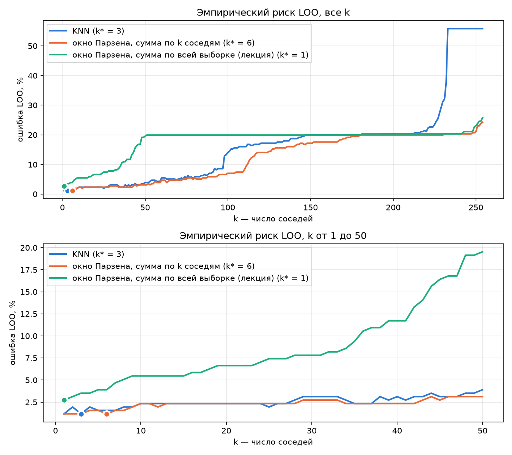

git add students/volkov-ir/lab2# Лабораторная работа №2. Метрическая классификация

## Задание

В рамках лабораторной работы предстоит реализовать алгоритм классификации KNN и подобрать параметр k методом скользящего контроля.

1. выбрать датасет для классификации;
2. реализовать алгоритм KNN с методом окна Парзена переменной ширины;
   1. в качестве ядра можно использовать гауссово ядро;
3. подобрать параметр k методом скользящего контроля (LOO);
4. обосновать выбор параметров алгоритма, построить графики эмпирического риска для различных k;
5. сравнить с эталонной реализацией KNN;
   1. сравнить качество работы алгоритмов;
6. реализовать алгоритм отбора эталонов;
7. подготовить визуализацию результатов работы алгоритма отбора эталонов;
8. сравнить качество работы KNN с и без отбора эталонов;
9. подготовить небольшой отчет о проделанной работе.

## Описание

Модель определяет вид пингвина по размерам его тела. Это метрический классификатор, он ничего не обучает, а хранит всю выборку и для нового пингвина ищет похожих среди уже известных. Ответ – вид, который преобладает среди ближайших соседей. В варианте с окном Парзена близкие соседи весят больше дальних.

**Общая сводка**

- Ошибка LOO на train – **1.17%** (3 пингвина из 256) у KNN при $k^\ast = 3$ и у окна Парзена при $k^\ast = 6$. На test KNN ошибается на 1 пингвине из 86, окно Парзена – ни разу.
- Своя реализация совпадает с эталоном `sklearn` по LOO при всех 50 проверенных $k$.
- Окно Парзена реализовано в двух вариантах. Вариант из лекции (голосует вся выборка) с гауссовым ядром работает заметно хуже, чем вариант, где голосуют только $k$ ближайших.

## Запуск

```sh
cd source
uv sync
uv run python loo_experiment.py
uv run python sklearn_baseline.py
```

Датасет скачивается сам при первом запуске (`kagglehub`). `loo_experiment.py` печатает результаты LOO и пересохраняет график в `images/`, `sklearn_baseline.py` печатает сравнение с эталоном. Разбиение train/test зафиксировано (`random_state = 42`), результаты воспроизводятся.

| файл | что внутри |
|---|---|
| `source/data_preprocessing.py` | загрузка и подготовка данных, разбиение train/test, стандартизация |
| `source/main.py` | KNN, два варианта окна Парзена, LOO |
| `source/loo_experiment.py` | LOO для всех $k$, выбор $k^\ast$, график эмпирического риска |
| `source/sklearn_baseline.py` | эталон |

---

## 1. Датасет

**Palmer Penguins** (Kaggle), 344 пингвина трех видов с островов архипелага Палмер в Антарктиде, нужно предсказать вид (`species`). Adelie – 152 пингвина, Gentoo – 124, Chinstrap – 68. Виды хорошо различаются по размерам, например у Gentoo самые длинные ласты и самый большой вес, а у Adelie короткий клюв.

Ниже перечислено все, что сделано с данными.

| шаг | зачем |
|---|---|
| взяты 4 признака: длина и глубина клюва, длина ласты, масса | числовые, расстояние между ними имеет смысл |
| не взят `island` | остров почти однозначно задает вид (на Torgersen живут только Adelie, Chinstrap есть только на Dream), модель угадывала бы место, а не внешний вид |
| не взят `sex` | категориальный, 10 пропусков и одно значение `.` |
| удалены 2 пингвина | у них пропущены все 4 признака, заполнять нечем |
| виды переведены в номера: Adelie → 0, Chinstrap → 1, Gentoo → 2 | модель работает только с числами |
| разбиение 75/25 со стратификацией (256 пингвинов в train, 86 в test) | test – «экзамен», модель его не видит |
| признаки стандартизированы по формуле $x \to (x - \mu) / \sigma$, где $\mu$ и $\sigma$ считаются по train | см. ниже |

| | Adelie | Chinstrap | Gentoo | всего |
|---|---|---|---|---|
| train | 113 | 51 | 92 | 256 |
| test | 38 | 17 | 31 | 86 |

**Зачем стратификация.** Chinstrap всего 68, при обычном случайном разбиении их доля в test могла бы сильно отличаться от исходной. Со стратификацией доли видов в train и test одинаковые.

**Зачем стандартизация.** KNN ищет соседей по расстоянию, а масштабы признаков различаются на два порядка, длина клюва около 44 мм, масса около 4200 г. Без стандартизации расстояние почти целиком определяет масса, и остальные признаки ни на что не влияют. Среднее и разброс считаются **только по train**, test масштабируется теми же числами, иначе информация о test просочилась бы в модель.

---

## 2. KNN с методом окна Парзена переменной ширины

**Простыми словами.** Похожие пингвины обычно одного вида. Чтобы узнать вид нового пингвина, находим самых похожих на него среди известных и смотрим, какой вид среди них преобладает. Как узнать о новом районе, спросив ближайших соседей.

«Похожесть» меряется евклидовым расстоянием между векторами признаков.

$$\rho(u, x) = \sqrt{\sum_j (u_j - x_j)^2}$$

Все алгоритмы ниже устроены одинаково. Для каждого вида складываются веса его объектов, и побеждает вид с наибольшей суммой. Отличаются они только весами.

$$a(u) = \arg\max_y \sum_{i=1}^{\ell} [y_u^{(i)} = y]  w(i, u)$$

Здесь $x_u^{(i)}$ – $i$-й по близости к $u$ объект, $y_u^{(i)}$ – его вид.

### KNN

Каждый из $k$ ближайших соседей голосует с весом 1, остальные не голосуют, $w(i, u) = [i \le k]$. В коде это `calculate_knn`, он считает расстояния до всех объектов, сортирует их, берет виды $k$ ближайших и возвращает самый частый.

**Проблема.** Близкий и далекий сосед весят одинаково. При равенстве голосов (например, 2 на 2 при $k = 4$) ответ решают не данные, а порядок видов, побеждает вид с меньшим номером.

### Окно Парзена

**Простыми словами.** Ближних соседей слышно громче, дальних тише. Громкость задает ядро $K$, а ширина окна $h$ – насколько далеко «слышно».

$$w = K\left(\frac{\rho}{h}\right), \qquad K(r) = e^{-r^2/2}$$

Для соседа вплотную вес равен 1, на расстоянии $h$ – 0.61, на $2h$ – 0.14, на $3h$ – 0.01.

**Переменная ширина.** При фиксированной $h$ в густых областях в окно попадает много пингвинов, а в редких – почти никого. Поэтому ширина своя для каждого нового объекта, это расстояние до его $(k+1)$-го соседа.

$$h(u) = \rho(u, x_u^{(k+1)})$$

Окно растягивается, пока не захватит $k$ соседей. Как опрос «иду, пока не наберу $k$ человек», в центре города это 50 метров, в деревне километр. Граница проходит по $(k+1)$-му соседу, а не по $k$-му, чтобы у ядер, которые на границе окна дают 0, все $k$ соседей сохранили голос.

### Два варианта

В лекции сумма идет по **всей** выборке, а $k$ нужен только для ширины окна. Реализованы оба варианта.

| вариант | кто голосует | в коде |
|---|---|---|
| из лекции | все объекты, вес $K(\rho(u, x_i) / h(u))$ | `calculate_parzen_lecture` |
| KNN с весами окна | только $k$ ближайших, вес $K(\rho(u, x_u^{(i)}) / h(u))$ | `calculate_parzen` |

Для прямоугольного или треугольного ядра варианты совпадают, за границей окна вес и так 0. Гауссово ядро нигде не обнуляется, поэтому в варианте из лекции голосуют все 256 пингвинов, дальние тихо.

**Что следует из весов.** Во втором варианте у первых $k$ соседей $\rho / h$ от 0 до 1, значит вес от 0.61 до 1. Один сосед никогда не перевесит двух, и окно меняет ответ обычного KNN только при равенстве или почти равенстве голосов, отдавая победу более близким соседям.

---

## 3. Подбор k методом скользящего контроля (LOO)

**Простыми словами.** Проверять KNN на той же выборке, где он ищет соседей, нельзя. Каждый пингвин находит сам себя на расстоянии 0, и при $k = 1$ ошибок всегда ноль. Поэтому каждый пингвин по очереди «закрывается», его вид угадывается по остальным и сверяется с настоящим. Как учитель, который закрывает оценку ученика и угадывает ее по соседям по парте.

$$\mathrm{LOO}(k) = \frac{1}{\ell} \sum_{i=1}^{\ell} \left[ a\left(x_i;  X^\ell \setminus \lbrace x_i \rbrace,  k\right) \neq y_i \right], \qquad k^\ast = \arg\min_k \mathrm{LOO}(k)$$

В коде это `calculate_loo`, параметр `method` выбирает алгоритм (`knn`, `parzen`, `parzen_lecture`). Пингвины закрываются по очереди, без случайности, поэтому результат каждый раз один и тот же. LOO считается только на train ($\ell = 256$) для всех $k$ от 1 до 254 (для окна Парзена нужен $(k+1)$-й сосед среди 255 оставшихся).

---

## 4. Эмпирический риск и выбор k



Сверху – все $k$, снизу – $k$ от 1 до 50. Точкой отмечено выбранное $k^\ast$.

Ошибка LOO, %.

| $k$ | 1 | 3 | 6 | 10 | 30 | 50 | 100 | 150 | 200 | 254 |
|---|---|---|---|---|---|---|---|---|---|---|
| KNN | 1.17 | 1.17 | 1.56 | 2.34 | 3.12 | 3.91 | 14.06 | 19.92 | 20.31 | 55.86 |
| окно Парзена, голосуют $k$ ближайших | 1.17 | 1.17 | 1.17 | 2.34 | 2.73 | 3.12 | 7.03 | 17.19 | 19.92 | 24.22 |
| окно Парзена из лекции | 2.73 | 3.52 | 3.91 | 5.47 | 7.81 | 19.53 | 19.92 | 19.92 | 20.31 | 25.78 |

**Что видно на графике.**

- При малых $k$ ошибка минимальна, 3 пингвина из 256. Виды хорошо разделяются по размерам.
- С ростом $k$ ошибка растет. Это недообучение, в голосование попадают пингвины чужих видов. Первым «теряется» самый малочисленный Chinstrap (51 в train).
- При $k$, близком к 256, KNN отвечает всем самым частым видом, Adelie (113 из 256), и ошибка доходит до 56%. Это крайний случай «спросить весь город».
- Окно Парзена, где голосуют $k$ ближайших, почти везде не хуже KNN и портится заметно медленнее, при $k = 100$ 7% против 14%, при $k = 254$ 24% против 56%. Близкие соседи весят больше, и толпа дальних перевешивает не сразу.
- Вариант из лекции хуже двух других при всех $k$ примерно до 150. Уже к $k \approx 50$ ошибка выходит на 20%, это 50–51 пингвин, то есть почти все Chinstrap. Каждый дальний пингвин весит мало, но их сотни, и с ростом окна их суммарный голос перекрикивает близких соседей.

**Выбор k.** Минимум LOO у KNN – 1.17% при $k = 1$ и $k = 3$, у окна Парзена с $k$ ближайшими – 1.17% при $k = 1, 2, 3, 6$, у варианта из лекции – 2.73% только при $k = 1$. Когда минимум достигается при нескольких $k$, берется наибольшее, ответ тогда решают больше соседей, и один шумный пингвин его не перевернет. Итого $k^\ast = 3$ для KNN, $k^\ast = 6$ для окна Парзена с $k$ ближайшими, $k^\ast = 1$ для варианта из лекции.

Разница между $k = 1$, 3 и 6 – один-два пингвина из 256, LOO на такой выборке их надежно не различает. Честный вывод такой, что при $k$ от 1 примерно до 10 качество почти одинаковое и очень высокое.

---

## 5. Сравнение с эталоном

Эталон – `KNeighborsClassifier` из `sklearn`.

**Проверка реализации.** Сначала нужно убедиться, что свои функции считают то же самое, что и эталон. LOO посчитан для $k$ от 1 до 50 своими функциями и через `sklearn` (`cross_val_score` с `LeaveOneOut`). Готового окна Парзена переменной ширины в `sklearn` нет, поэтому `KNeighborsClassifier` получает свою функцию весов с тем же правилом.

| своя реализация | эталон | совпадение LOO |
|---|---|---|
| KNN | `KNeighborsClassifier()` | 50 из 50 $k$ |
| окно Парзена, голосуют $k$ ближайших | $k+1$ соседей, $h$ – расстояние до последнего, гауссовы веса, последний не голосует | 50 из 50 $k$ |
| окно Парзена из лекции | соседи – вся выборка, $h$ – расстояние до $(k+1)$-го, гауссовы веса | 50 из 50 $k$ |

Ошибки совпадают при каждом $k$, свои реализации верны.

**Качество на test.** У всех моделей $k$ выбирается одним правилом, минимум LOO на train, при равенстве наибольшее. Иначе разница в результатах зависела бы от правила, а не от алгоритма (например, `GridSearchCV` при равенстве берет наименьшее $k$). Дополнительно приведен `weights='distance'`, штатное взвешивание `sklearn` с весом $1/\rho$.

| модель | $k$ | accuracy | macro-F1 | ошибок из 86 |
|---|---|---|---|---|
| свой KNN | 3 | 0.988 | 0.986 | 1 |
| **свое окно Парзена, голосуют $k$ ближайших** | 6 | **1.000** | **1.000** | **0** |
| свое окно Парзена из лекции | 1 | 0.977 | 0.971 | 2 |
| sklearn, uniform | 3 | 0.988 | 0.986 | 1 |
| sklearn, distance | 3 | 0.988 | 0.986 | 1 |
| sklearn, гауссово окно по $k$ ближайшим | 6 | 1.000 | 1.000 | 0 |
| sklearn, гауссово окно из лекции | 1 | 0.977 | 0.971 | 2 |

**Как читать метрики.**
- **accuracy** – доля верных ответов.
- **macro-F1** – среднее качество по видам, каждый вид весит одинаково. Chinstrap в test всего 17, и accuracy могла бы скрыть, что модель плохо его узнает, macro-F1 не скроет.

Ошибка KNN – один Adelie, принятый за Chinstrap. У варианта из лекции два Chinstrap приняты за Adelie. Свои реализации дают те же предсказания, что и эталон.

Разница между KNN и окном Парзена на test – один пингвин из 86, поэтому сказать, что окно Парзена точно лучше, по test нельзя. Его преимущество видно на графике LOO, оно гораздо устойчивее к слишком большому $k$.

---

## Выводы

- Признаки надо стандартизировать, иначе соседей ищет одна масса.
- Своя реализация KNN и обоих вариантов окна Парзена совпадает с `sklearn` по LOO при всех проверенных $k$.
- По LOO лучшие малые $k$, $k^\ast = 3$ для KNN и $k^\ast = 6$ для окна Парзена, ошибка 1.17%. На test 1 и 0 ошибок из 86.
- Гауссово окно, где голосуют $k$ ближайших, дает веса от 0.61 до 1. Оно решает ничьи в пользу близких соседей и делает алгоритм заметно устойчивее к большому $k$.
- Вариант из лекции, где голосует вся выборка, с гауссовым ядром хуже. Сотни дальних пингвинов с маленькими весами в сумме перекрикивают близких соседей, и при $k$ около 50 модель перестает узнавать Chinstrap.
