# Лабораторная работа №1. Линейная классификация

В рамках лабораторной работы был реализован линейный классификатор,
обученный методом стохастического градиентного спуска с инерцией с L2
регуляризацией и квадратичной функцией потерь.

## Задание

1. выбрать датасет для классификации, например на [kaggle](https://www.kaggle.com/datasets?&tags=13304-Clustering);
2. реализовать вычисление отступа объекта (визуализировать, проанализировать);
3. реализовать вычисление градиента функции потерь;
4. реализовать рекуррентную оценку функционала качества;
5. реализовать метод стохастического градиентного спуска с инерцией;
6. реализовать L2 регуляризацию;
7. реализовать скорейший градиентный спуск;
8. реализовать предъявление объектов по модулю отступа;
9. обучить линейный классификатор на выбранном датасете;
   1. обучить с инициализацией весов через корреляцию;
   2. обучить со случайной инициализацией весов через мультистарт;
   3. обучить со случайным предъявлением и с п.8;
10. оценить качество классификации;
11. сравнить лучшую реализацию с эталонной;
12. подготовить отчёт.

## Отчёт

Был выбран датасет **AI4I 2020 Predictive Maintenance**.

### 1. Датасет

**AI4I 2020 Predictive Maintenance Dataset**
([Kaggle](https://www.kaggle.com/datasets/stephanmatzka/predictive-maintenance-dataset-ai4i-2020)).

| Параметр | Значение |
|---|---|
| Объектов | 10 000 |
| Признаков (исходно) | 6 (`Type` + 5 числовых) |
| Признаков после кодирования | 9 (5 числовых + bias + 3 one-hot `Type`) |
| Классы | 2 (`Machine failure`: 0 / 1) |
| Train / Test | 8000 / 2000 (80/20, `stratify`, `random_state=42`) |
| Метки | `{-1, +1}` |
| Баланс классов | 96.6% / 3.4% (сильный дисбаланс) |

- Удалены признаки `TWF, HDF, PWF, OSF, RNF` (подтипы отказа) — они являются
  прямой утечкой целевой переменной (`Machine failure` полностью
  выводится из их суммы), а не характеристикой состояния оборудования до
  отказа.
- Категориальный признак `Type` (L/M/H) закодирован через one-hot.
- Нормализация: стандартизация (`(x - mean) / std`) числовых признаков,
  статистики считаются на train и применяются к test.
- Предобработка выполняется в `load_and_prepare` —
  `source/task01_margin.py:33`.
- Датасет скачивается напрямую с Kaggle через REST API (`urllib`,
  без сторонних библиотек) — `source/download_data.py`; при отсутствии
  ключей используется локальная копия с явным предупреждением.


*Корреляционная матрица числовых признаков и цели. Признаки слабо
коррелируют с `Machine failure` по отдельности (макс. |r| около 0.2) —
это ожидаемо для промышленных данных с редкими отказами и объясняет,
почему линейная модель на этих данных заведомо не может достичь очень
высокого recall без дополнительных приёмов (см. п.8-9).*

### 2. Отступ объекта

Отступ: $M_i = y_i \langle w, x_i \rangle$, где $x_i$ дополнен
константным признаком (bias).

Реализация: `margin` — `source/task01_margin.py:68`.

**Random init**

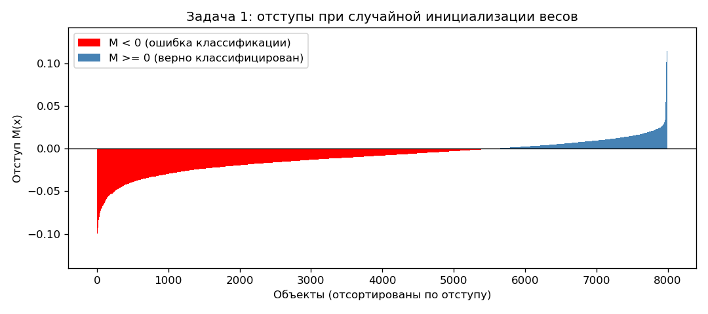

**Correlation init**

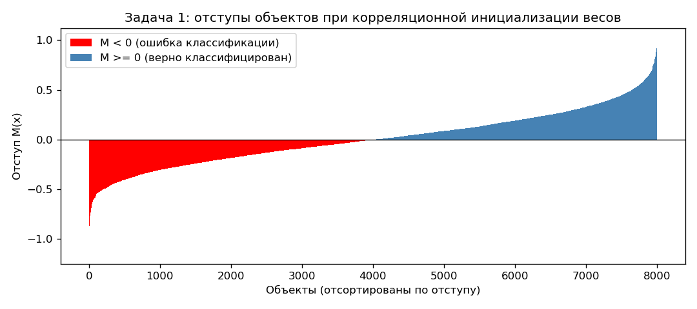

**Pretrained**

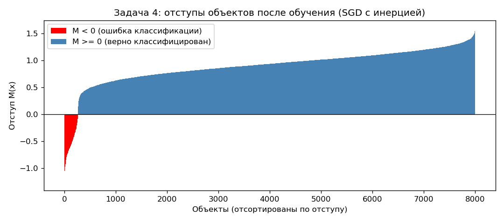

*Отступы (на обучающей выборке): случайная инициализация (69.3% M<0),
инициализация через корреляцию (50.5% M<0), обученная модель (3.2%
M<0). Обученная модель на train близка к доле отказов в данных (3.4%),
что для линейного классификатора при таком дисбалансе означает: почти
все объекты редкого класса всё ещё лежат в зоне отрицательного
отступа.*

### 3. Градиент функции потерь

Функция потерь для одного объекта (квадратичная):

$$L(M_i) = (1 - M_i)^2$$

Градиент по весам:

$$\frac{\partial L}{\partial w} = -2(1-M_i)\,y_i\,x_i$$

Вывод по цепному правилу: $M_i(w) = y_i\langle w, x_i\rangle$ линейна по
$w$ ($\partial M_i/\partial w = y_i x_i$), $\partial L/\partial M_i =
-2(1-M_i)$ — произведение даёт формулу выше.

Реализация: `gradient` — `source/task02_gradient.py:24`. Корректность
подтверждена численной проверкой (`numerical_gradient`,
`source/task02_gradient.py:43`): расхождение аналитического и
численного градиента — `2.36×10⁻¹⁰`.

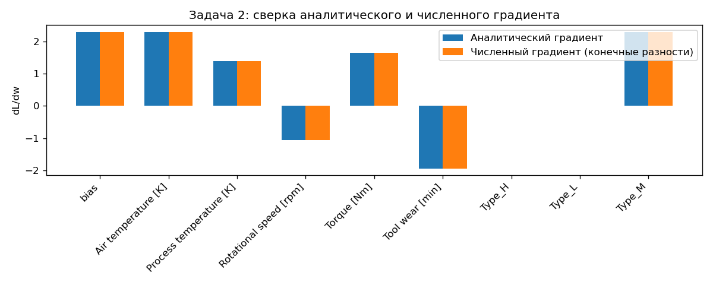

*Сверка аналитического и численного градиента по каждой компоненте
вектора весов — столбцы визуально совпадают.*

### 4. Рекуррентная оценка функционала качества

Экспоненциальное скользящее среднее потерь:

$$Q_t = \lambda\,L_t + (1-\lambda)\,Q_{t-1}, \qquad \lambda = 1/n$$

Реализация: `update_Q` — `source/task03_quality.py:30`. Инициализация Q
— по случайной подвыборке из 50 объектов (`init_Q`,
`source/task03_quality.py:19`).

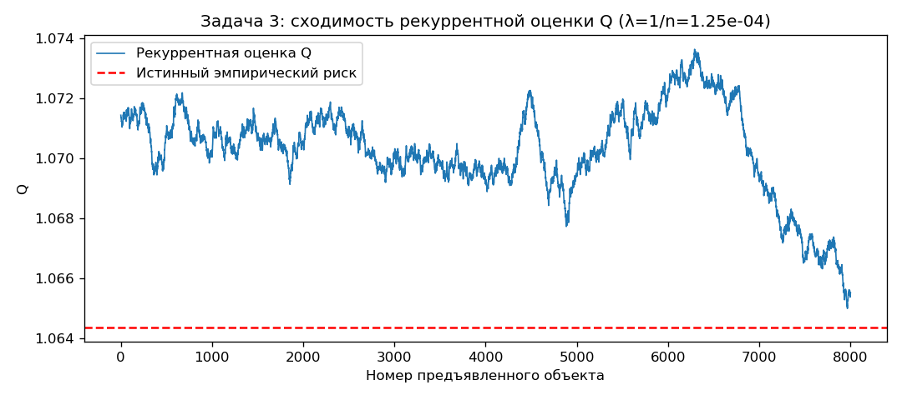

*Сходимость рекуррентной оценки Q к истинному эмпирическому риску
(1.0655 против 1.0644, расхождение ≈0.1%) при фиксированных весах —
оценка корректно отслеживает риск почти бесплатно, без пересчёта по
всей выборке на каждом шаге.*

### 5. Стохастический градиентный спуск с инерцией

$$v_t = \gamma v_{t-1} + (1-\gamma)\nabla L(w_t), \qquad w_{t+1} = w_t - h\, v_t$$

Реализация: `LinearClassifierMomentum.fit` —
`source/task04_sgd_momentum.py:52`. Параметры: `h=0.01`, `gamma=0.9`,
`n_epochs=10`.

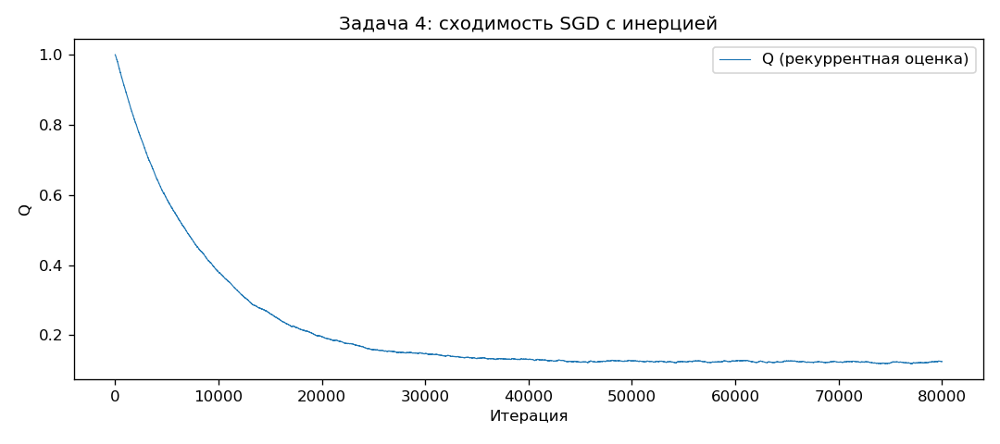

*Гладкая сходимость Q (1.00 → 0.13) за 10 эпох. Test accuracy 96.60%,
но recall на классе "отказ" — 0%: квадратичная потеря без взвешивания
классов при дисбалансе 96.6%/3.4% сходится к тривиальному решению
"всегда штатная работа". Это будет частично исправлено в п.8.*

### 6. L2 регуляризация

Штраф добавляется к градиенту как $\tau w$ (bias — индекс 0 — не
регуляризуется):

$$\nabla \tilde{L}(w, x_i) = \nabla L(w, x_i) + \tau w$$

Реализация: `LinearClassifierL2._regularize` —
`source/task05_l2.py:23`.

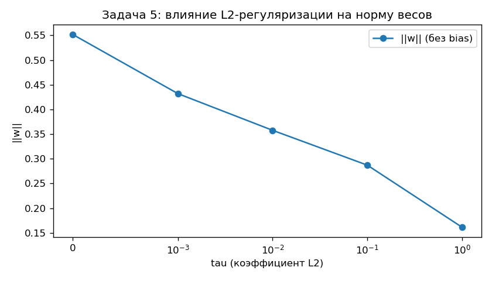

| τ | ‖w‖ (без bias) | Test accuracy | F1 (отказ) |
|---|---|---|---|
| 0.0 | 0.552 | 0.966 | 0.000 |
| 0.001 | 0.432 | 0.966 | 0.000 |
| 0.01 | 0.358 | 0.966 | 0.000 |
| 0.1 | 0.287 | 0.966 | 0.000 |
| 1.0 | 0.161 | 0.966 | 0.000 |

*Норма весов монотонно убывает с ростом τ — регуляризация работает
корректно, но не решает проблему дисбаланса классов (F1 остаётся 0 при
любом τ): переобучение и дисбаланс — разные проблемы.*

### 7. Наискорейший градиентный спуск

Оптимальный шаг вдоль направления градиента для квадратичной потери на
объекте $x_i$:

$$h^{*} = \frac{1}{2\lVert x_i \rVert^2}$$

Вывод: при $M(h) = M_i - h\cdot L'(M_i)\lVert x_i\rVert^2$ минимум
$L(M(h))$ достигается в точке $M(h)=1$, откуда и следует формула выше.

Реализация: `LinearClassifierSteepest._compute_step` —
`source/task06_steepest.py:22`.

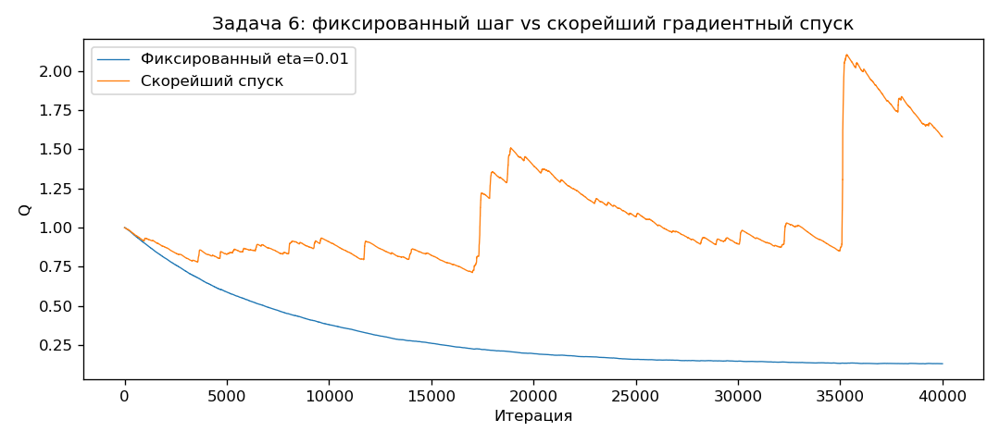

| Режим | Q_final | Test accuracy |
|---|---|---|
| Фиксированный η=0.01 | 0.131 | 0.9665 |
| Скорейший спуск | 1.579 | 0.8485 |

*В отличие от классического результата, в нашей реализации скорейший
спуск в связке с инерцией не сходится (Q растёт вместо убывания). `h*`
выведен для чистого градиента объекта, но применяется к сглаженному
моментум-вектору — разные объекты имеют разную норму `‖x‖`, и адаптивный
шаг, оптимальный для одного объекта, не оптимален для усреднённого по
многим объектам направления. Показательный отрицательный результат:
комбинирование двух по отдельности корректных техник не гарантирует
корректности их совместной работы.*

### 8. Предъявление объектов по модулю отступа

Вероятность выбора объекта:

$$p_i = \frac{1/(|M_i|+\varepsilon)}{\sum_j 1/(|M_j|+\varepsilon)}$$

Реализация: `LinearClassifier._get_order` —
`source/task07_margin_presentation.py:26`. Распределение пересчитывается
по текущим весам в начале каждой эпохи.

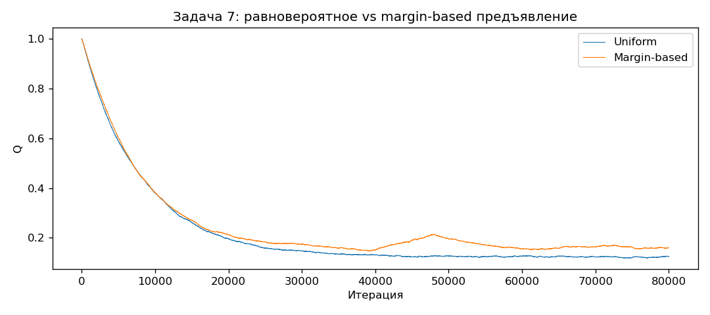

| Режим предъявления | Accuracy | Recall (отказ) | F1 (отказ) |
|---|---|---|---|
| Равновероятное | 0.966 | 0.000 | 0.000 |
| По модулю отступа | 0.968 | 0.074 | 0.135 |

*Единственный из проверенных приёмов, реально сдвигающий классификатор
от коллапса: на старте обучения объекты редкого класса почти всегда
имеют маленький отступ, поэтому их начинают показывать чаще — это
неявно компенсирует дисбаланс классов.*

### 9. Обучение

Пайплайн (`source/task08_train_variants.py`):

1. Загрузка и предобработка данных (`load_and_prepare`, п.1).
2. Обучение с разными вариантами инициализации/предъявления (`LinearClassifier.fit`).
3. Общие гиперпараметры: `eta=0.01`, `gamma=0.9`, `n_epochs=10`,
   `tau=0.0`, `step_mode="fixed"`.

Варианты запуска:

- **8.1 — корреляционная инициализация** весов (`correlation_init`,
  `source/task01_margin.py:73`);
- **8.2 — мультистарт**: 5 независимых запусков со случайными
  начальными весами, выбор лучшего по итоговому `Q`;
- **8.3 — сравнение предъявления**: равновероятное vs по модулю
  отступа (п.8), при нулевой инициализации.

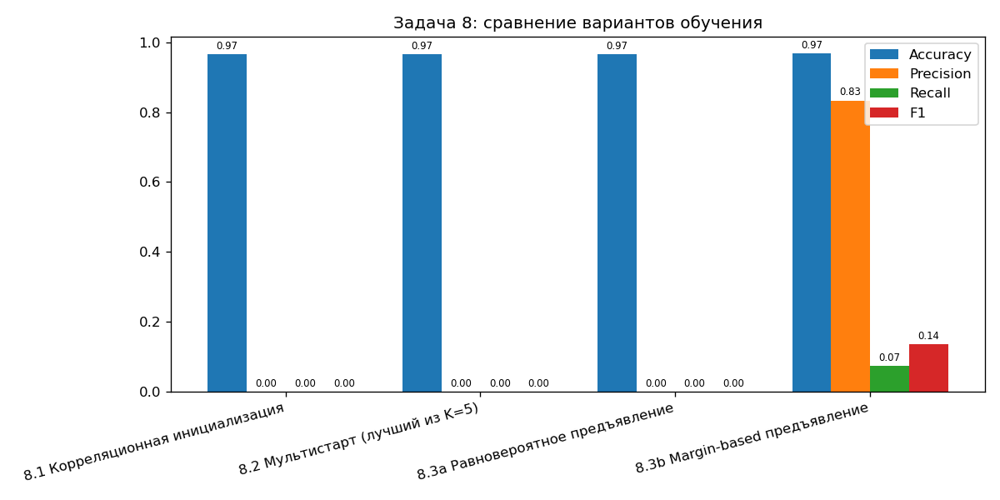

| Вариант | Q_final | Accuracy | Precision | Recall | F1 |
|---|---|---|---|---|---|
| 8.1 Корреляционная инициализация | 0.1252 | 0.966 | 0.000 | 0.000 | 0.000 |
| 8.2 Мультистарт (лучший из 5) | 0.1222 | 0.966 | 0.000 | 0.000 | 0.000 |
| 8.3a Равновероятное предъявление | 0.1252 | 0.966 | 0.000 | 0.000 | 0.000 |
| **8.3b Margin-based предъявление** | 0.1600 | 0.968 | 0.833 | 0.074 | 0.135 |

Инициализация (8.1, 8.2) почти не влияет на результат при таком
дисбалансе классов — квадратичная потеря стабильно сходится к
тривиальному решению независимо от старта. Единственный вариант,
реально меняющий исход — margin-based предъявление (8.3b).

### 10. Оценка качества классификации (лучшая модель, margin-based)

Реализация: `source/task09_evaluate.py`.

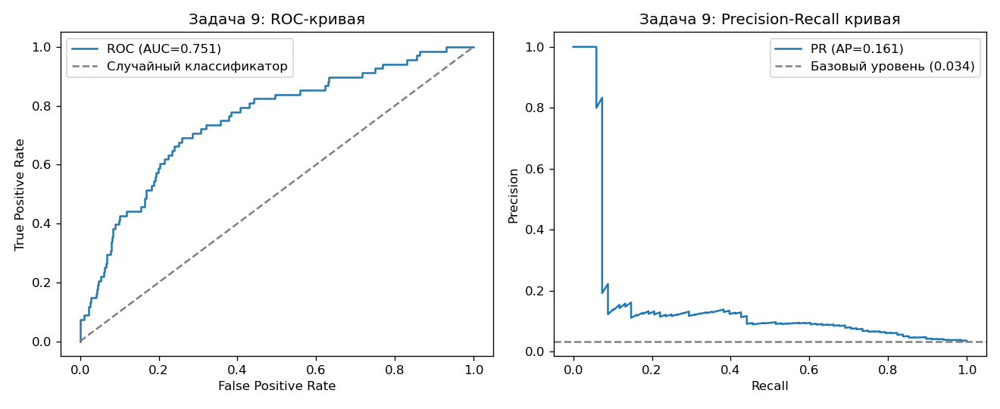

```
ROC-AUC: 0.7514      PR-AUC: 0.1609 (базовый уровень: 0.034)

Порог 0 (стандартный):         accuracy=0.968  F1=0.135
Порог -0.768 (оптимален по F1): accuracy=0.898  F1=0.203  recall=0.382  precision=0.138
```

ROC-AUC=0.75 (значимо выше случайного 0.5) показывает, что модель
обладает реальной различающей способностью — проблема нулевого recall в
п.5 была в пороге 0, а не в отсутствии сигнала. Подбор порога по
максимуму F1 поднимает recall с 7% до 38% ценой падения
precision/accuracy — осознанный компромисс, а не деградация.

### 11. Сравнение с эталонной реализацией

Эталон — `sklearn.linear_model.SGDClassifier(loss="squared_error")` —
эквивалент нашей квадратичной потери: $(1-yf)^2=(y-f)^2$ при
$y\in\{-1,+1\}$.

Реализация: `source/task10_compare_baseline.py`.

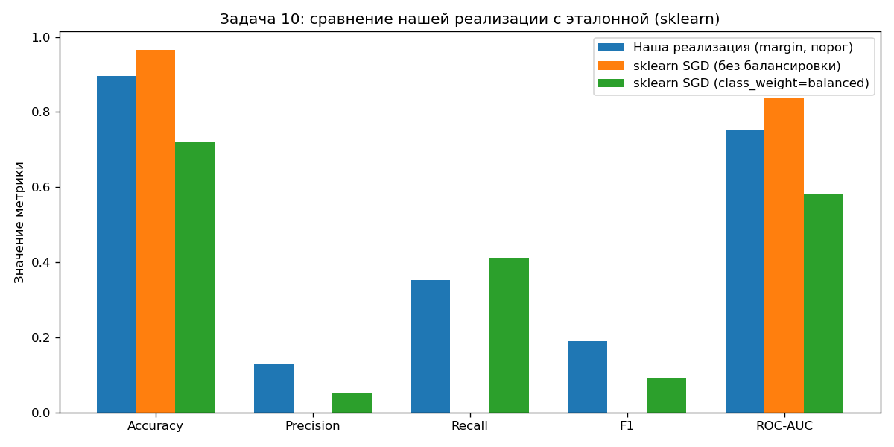

| Модель | Accuracy | Precision | Recall | F1 | ROC-AUC |
|---|---|---|---|---|---|
| **Наша реализация** (margin, подобранный порог) | 0.898 | 0.138 | 0.382 | **0.203** | 0.751 |
| sklearn SGD (без балансировки) | 0.966 | 0.000 | 0.000 | 0.000 | **0.839** |
| sklearn SGD (`class_weight="balanced"`) | 0.722 | 0.052 | 0.412 | 0.092 | 0.581 |

Эталонный sklearn с теми же параметрами тоже коллапсирует в
мажоритарный класс при пороге 0 — подтверждение, что проблема не в
нашей реализации, а в сочетании квадратичной потери и дисбаланса
классов. При этом sklearn достигает более высокого ROC-AUC (0.84 против
0.75) — вероятно, за счёт более сложного learning-rate schedule.
Итог: наша реализация с margin-предъявлением и подобранным порогом даёт
лучший F1 (0.203) среди всех вариантов.

### 12. Отчёт (резюме)

Реализованы: отступ, градиент квадратичной потери, рекуррентная оценка
Q, SGD с инерцией, L2-регуляризация, скорейший градиентный спуск,
предъявление по модулю отступа. Лучший результат — margin-based
предъявление с подобранным порогом классификации, F1=0.203, ROC-AUC=0.751,
что превосходит по F1 обе эталонные конфигурации sklearn (0 и 0.092), при
уступающем по ROC-AUC (0.751 против 0.839) базовому sklearn.
Ключевой практический вывод: на сильно несбалансированных данных (3.4%
положительного класса) ни инициализация весов, ни L2-регуляризация не
меняют исход обучения — единственные работающие рычаги — способ
предъявления объектов во время SGD и выбор порога классификации после
обучения.