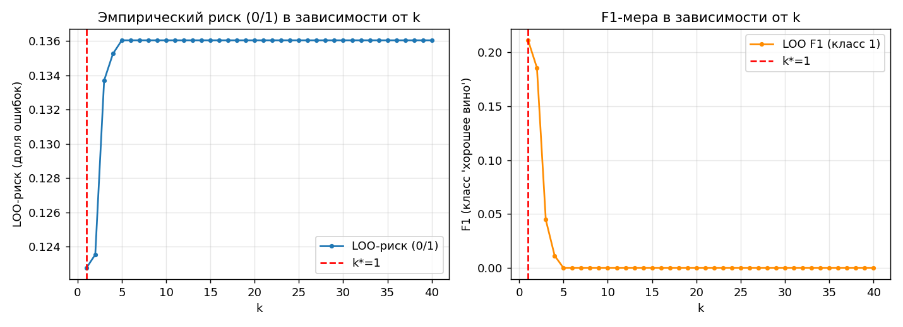
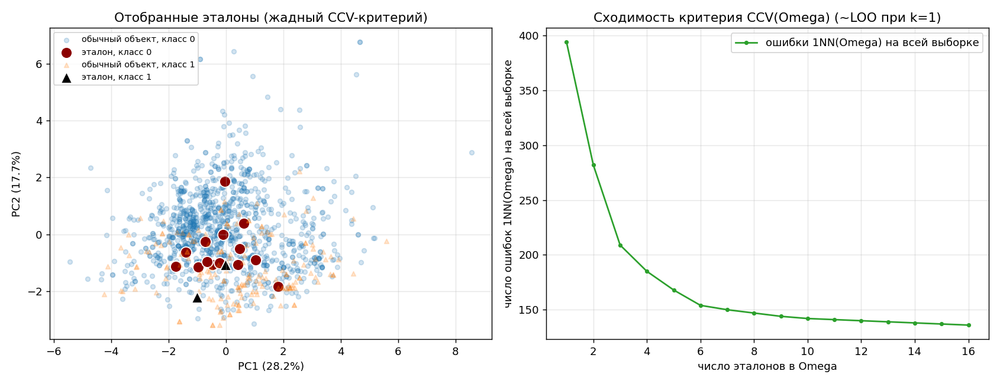

# Лабораторная работа: KNN, окно Парзена, LOO, отбор эталонов

## Задание

1. Выбрать датасет для классификации.
2. Реализовать алгоритм KNN с методом окна Парзена переменной ширины
   (ядро — гауссово).
3. Подобрать параметр k методом скользящего контроля (LOO).
4. Обосновать выбор параметров, построить графики эмпирического риска
   для различных k.
5. Сравнить с эталонной реализацией KNN (scikit-learn).
6. Реализовать алгоритм отбора эталонов.
7. Подготовить визуализацию результатов отбора эталонов.
8. Сравнить качество работы KNN с отбором эталонов и без.
9. Подготовить отчет о проделанной работе (этот файл).

## Датасет

**Wine Quality (red)**, Cortez et al., 2009 — физико-химический анализ
1599 образцов красного вина "Vinho Verde" (11 числовых признаков:
кислотность, сахар, плотность, алкоголь и т.д.) с оценкой качества
`quality` от 3 до 8, выставленной экспертами.

Источник: **OpenML, data_id=44972** ("red_wine"). Датасет **не хранится в
репозитории** — скачивается в момент выполнения через
`sklearn.datasets.fetch_openml` (см. `sources/data.py`).

Задача бинаризована: `quality ≥ 7 → класс 1` ("хорошее вино"), иначе
класс 0. Итоговый баланс: 217 / 1382 (13.6% / 86.4%). Исходная 6-балльная
шкала сильно смещена к оценкам 5-6 (82% всех объектов), из-за чего кривые
LOO по k были бы почти плоскими и неинформативными; бинаризация дает
умеренный, содержательный дисбаланс.

Разбиение: 1279 train / 320 test, `train_test_split(..., stratify=y)` —
стратификация сохраняет долю классов в обеих частях. Признаки
масштабированы `StandardScaler`'ом, обученным **только на train** (иначе
была бы утечка информации о распределении test в предобработку).

## Структура репозитория

```
.
├── README.md                       -- этот отчет
├── sources/
│   ├── data.py                     -- загрузка датасета (OpenML) и препроцессинг
│   ├── knn_parzen.py               -- своя реализация: ParzenKNN, KNNVote (п.2)
│   ├── loo.py                      -- своя реализация LOO (п.3)
│   ├── prototype_selection.py      -- своя реализация отбора эталонов (п.6)
│   ├── run_loo_selection.py        -- скрипт для п.3-4 (график в images/)
│   ├── run_sklearn_comparison.py   -- скрипт для п.5
│   └── run_prototype_selection.py  -- скрипт для п.6-8 (график в images/)
└── images/
    ├── loo_risk_curve.png
    └── prototype_selection.png
```

Запуск (из папки `sources/`, по порядку):
```bash
python run_loo_selection.py
python run_sklearn_comparison.py
python run_prototype_selection.py
```

## Библиотеки

Только `numpy`, `pandas`, `matplotlib`, `sklearn` (плюс стандартная
библиотека). `sklearn` используется для:
- загрузки датасета (`fetch_openml`) и препроцессинга (`train_test_split`,
  `StandardScaler`) — служебные, не алгоритмические задачи;
- метрик (`accuracy_score`, `f1_score`, `classification_report`);
- визуализации (`PCA` — только для проекции в 2D, не для классификации);
- **явного сравнения с эталонной реализацией** в п.5
  (`sklearn.neighbors.KNeighborsClassifier`) — единственное место, где
  используется готовая реализация *алгоритма*, и это прямо предусмотрено
  заданием.

Собственные алгоритмы (`ParzenKNN`, `KNNVote`, `greedy_prototype_selection`)
реализованы только на `numpy`, без каких-либо готовых реализаций из
библиотек.

---

## П.2. KNN + окно Парзена переменной ширины

**Соответствие лекции.** "Метрические методы классификации и регрессии"
(26.09.2025). Формула переменной ширины окна — слайд 11:

$$a(x;X^\ell,k,K)=\arg\max_{y\in Y}\sum_{i=1}^{\ell}[y_i=y]\;K\!\left(\frac{\rho(x,x_i)}{\rho(x,x^{(k+1)})}\right)$$

где $x^{(k+1)}$ — (k+1)-й по счету сосед объекта $x$, то есть **переменная
ширина окна** $h(x)=\rho(x,x^{(k+1)})$ — своя у каждой точки запроса.
Ядро — гауссово (слайд 34 лекции): $K(r)=\exp(-0.5r^2)$.

Принципиальное отличие от простого метода k ближайших соседей (слайд 8,
$w(i,x)=[i\le k]$): в формуле Парзена сумма берется **по всей** обучающей
выборке $i=1,\dots,\ell$, а не только по k ближайшим — вклад далеких точек
не обнуляется жестко, а плавно затухает по ядру. Лекция отдельно
подчеркивает это различие в резюме (слайд 39).

Парзеновская ширина окна равна расстоянию до (k+1)-го соседа (не k-го), и сумма берётся по всей выборке (не только по k ближайшим — за пределами окна вес просто быстро затухает).

**Реализация** (`sources/knn_parzen.py`, класс `ParzenKNN`):
```python
weights = np.exp(-0.5 * (dists / h[:, None]) ** 2)  # веса по ВСЕЙ выборке # G(r) = exp(−2r^2) — гауссовское
```
Здесь `dists` — матрица расстояний (запросы × вся обучающая выборка),
`h` — вектор индивидуальных ширин окна (расстояние до (k+1)-го соседа для
каждой точки запроса). Каждая обучающая точка получает свой вес, класс с
максимальной суммой весов — ответ алгоритма (обобщенный метрический
классификатор, слайд 7: $a(x;X^\ell)=\arg\max_y\Gamma_y(x)$).

**Санити-чек** на игрушечных данных (два разделенных кластера по 3 точки):
точки внутри кластеров классифицируются с полной уверенностью (вероятность
1.0/0.0), граничная точка — с небольшим обоснованным перевесом в сторону
геометрически чуть более близкого кластера. Корректное поведение
метрического классификатора подтверждено.

Дополнительно реализован класс `KNNVote` — простое голосование по формуле
$w(i,x)=[i\le k]$ (слайд 8) без ядра, используется в п.8 (см. ниже).

---

## П.3-4. Подбор k методом LOO, эмпирический риск

**Соответствие лекции.** Критерий (слайд 8):

$$\mathrm{LOO}(k,X^\ell)=\sum_{i=1}^{\ell}\big[a(x_i;X^\ell\setminus\{x_i\},k)\neq y_i\big]\ \to\ \min_k$$

Эмпирический риск — доля (0/1-функция потерь) ошибок:
$Q=\sum_i[M_i<0]$ (кусочно-постоянная функция; общее определение для
курса, используется в частности в лекции по SVM). Для каждого k от 1 до 40
считается доля ошибок на LOO и, дополнительно, F1-мера по редкому классу
(поскольку accuracy на несбалансированных данных может маскировать
деградацию по нему).

**Оптимизация вычислений** (`sources/loo.py`): матрица попарных расстояний
(1279×1279) считается один раз, диагональ выставлена в `+inf`, чтобы объект
не мог быть сам себе соседом — это и реализует LOO без явного цикла
переобучения 1279×40 раз.

### Результат



- **k\* = 1** — единогласно по обоим критериям (0/1-риск и F1).
- 0/1-риск растет с k и выходит на **плато 0.136** уже при k ≥ 5.
- F1 по редкому классу падает **до нуля** при k ≥ 5.

**Обоснование выбора k\*=1.** Число 0.136 — ровно доля положительного
класса в train (174/1279): при k≥5 классификатор вырождается в константу
"всегда класс 0". Причина — архитектурное следствие формулы Парзена: раз
веса считаются по всей выборке, при расширении окна суммарная "масса"
1105 объектов мажоритарного класса быстро перевешивает 174 объекта
миноритарного в любой точке пространства. Это иллюстрирует эффект,
описанный в лекции (слайды 12-17: влияние ширины окна h на форму
разделяющей поверхности) — на несбалансированных данных чувствительность
к ширине окна проявляется резче.

---

## П.5. Сравнение с эталонной реализацией sklearn

При k=1: accuracy 0.888 (своя реализация) против 0.909 (sklearn), F1 0.280
против 0.659. Расхождение объяснимо, а не является ошибкой: `sklearn` при
k=1 — это жесткий 1NN (метка единственного ближайшего соседа), наша
реализация даже при k=1 суммирует вклад **всех** 1279 точек с узким окном.

При росте k (до 40) `sklearn` с `weights=distance` только улучшается
(F1 до 0.75 при k=25), собственная реализация полностью коллапсирует до
нуля (см. таблицу в выводе `run_sklearn_comparison.py`) — количественно
показывает разницу в устойчивости двух формулировок метода к дисбалансу
классов.

---

## П.6. Отбор эталонов

**Соответствие лекции.** Точный алгоритм ("Жадная стратегия добавления
эталонов", слайд 26):
```
Omega := {по одному объекту от каждого класса}
повторять:
    найти x из X^L, не входящий в Omega: CCV(Omega + {x}) -> min
    Omega := Omega + {x}
пока CCV уменьшается
```
Точная формула критерия (слайд 25):
$$\mathrm{CCV}(\Omega)=\frac1L\sum_{i=1}^{L}\sum_{m=1}^{k}[y_i\neq y_i^{(m|\Omega)}]\,\frac{C^{\ell-1}_{L-1-m}}{C^{\ell}_{L-1}}$$
требует биномиальных коэффициентов. Лекция сама дает упрощение (слайд 24):
**при длине контроля k=1, $\mathrm{CCV}(\Omega)=\Pi(1)=\mathrm{LOO}(\Omega)$**,
и отдельно отмечает, что "CCV слабо зависит от длины контроля k". Поэтому
в качестве практического критерия используется доля ошибок классификатора
**1NN(Ω)** на всей выборке (в LOO-постановке) — это в точности $\mathrm{CCV}(\Omega)$
при k=1, применение упрощения, явно обоснованного самой лекцией.

Начальный объект от каждого класса (способ выбора лекция не уточняет)
взят как ближайший к центроиду класса — реализационная деталь, не
следующая из лекции напрямую.

### Результат

- Отобрано **17 эталонов из 1279** (сжатие **98.7%**).
- Ошибки 1NN(Ω) на обучающей выборке падают монотонно с 394 до 136, без
  единого отката — соответствует наблюдению лекции (слайд 30):
  "при отборе эталонов по критерию CVV переобучения нет".
- Баланс классов в эталонах: 15 (класс 0) / 2 (класс 1).

---

## П.7. Визуализация отбора эталонов



Первые 2 главные компоненты (PCA) объясняют лишь ~46% дисперсии — классы
сильно перекрываются в линейной проекции (ожидаемо для физико-химических
показателей вина без явной линейной разделимости). Правый график —
монотонная сходимость числа ошибок с ростом |Ω|.

---

## П.8. Сравнение качества KNN с отбором эталонов и без

Алгоритм отбора эталонов определен именно для классификатора **1NN(Ω)**
(слайд 25), поэтому для сравнения используется собственная реализация
`KNNVote(k=1)` (жесткое голосование, слайд 8) — не парзеновская формула из
п.2 (как показано в п.5, она плохо работает уже на полной выборке из 1279
точек, и тем более непригодна для 17 эталонов) и не готовая реализация из
`sklearn`.

| Метрика | Полная выборка (1279) | Эталоны Ω (17) |
|---|---|---|
| Accuracy (test) | 0.9094 | 0.8750 |
| F1 (класс 1, test) | 0.6588 | 0.3548 |
| Время предсказания | 33.3 мс | 3.3 мс |

- Сжатие выборки: **98.7%**.
- Ускорение предсказания: **≈10×**.
- Цена сжатия: accuracy −3.4 п.п., F1 почти вдвое ниже — при экстремальном
  сжатии до 17 объектов теряется часть локальной структуры границы
  классов, особенно для миноритарного класса.

---

## П.9. Общие выводы

1. Метод парзеновского окна переменной ширины (слайд 11) — is **different from**, что kNN (слайд 8): cause формула суммирует веса по **всей** обучающей выборке, а не **только по k ближайшим** соседям.
На несбалансированных данных (13.6% / 86.4%) это делает парзеновскую сумму way more чувствительной к дисбалансу: уже при k≥5 собственная реализация вырождается в константный классификатор, тогда как ограниченный k-ближайшими `sklearn` KNN остается работоспособным на всем диапазоне k.
2. LOO по критерию 0/1-риска и по F1 согласованно выбирают k\*=1 — рост k
   в этой формуле только ухудшает результат на несбалансированных данных.
3. Жадный отбор эталонов по критерию CCV (≈LOO(1NN) при k=1, как показано в лекции) дает 
   экстремальное сжатие выборки (98.7%, до 17 объектов) со сходимостью без переобучения на обучающей выборке — но
   ценой заметного (особенно по F1 редкого класса) снижения качества на независимом тесте.
4. Ограничение работы: умеренный дисбаланс классов (13.6% положительных)
   существенно влияет на поведение обеих взвешенных схем (окно Парзена и
   отбор эталонов) — все ключевые сравнения дополнительно проверялись по
   F1 редкого класса, а не только по accuracy.
