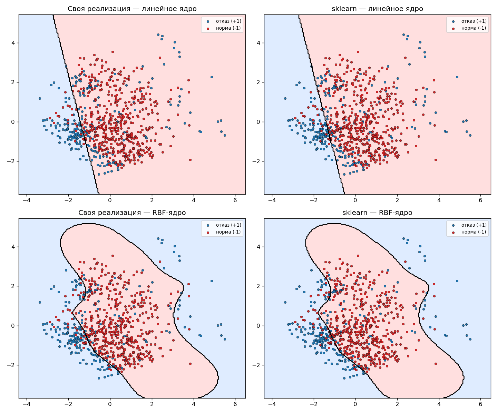

# Лабораторная работа №3. SVM
 
В рамках лабораторной работы предстоит реализовать SVM и сравнить с эталонной реализацией алгоритма.
 
# Теоретическая часть
 
На лекции рассмотрели две постановки задачи SVM: аналитическая и геометрическая. Показали, как геометрическая постановка приводит к задаче квадратичного программирования. Рассмотрели решение двойственной задачи по лямбда. Показали, как с помощью трюка с ядром можно строить нелинейные классификаторы. Рассмотрели различные ядра и их свойства. Рассмотрели различные способы регуляризации и их влияние на отбор признаков.
 
## Задание
 
1. выбрать датасет для бинарной классификации;
2. реализовать решение двойственной задачи по лямбда; для решения задачи использовать scipy.optimize.minimize или любую другую библиотеку;
3. провернуть трюк с ядром;
4. построить линейный классификатор;
5. визуализировать решение;
6. сравнить с эталонным решением;
## Отчёт
 
Был выбран датасет **AI4I 2020 Predictive Maintenance**.
 
Ссылки вида «сл. N» — номера слайдов лекции «Метод опорных векторов» (11.10.2025). Код лежит в каталоге `svm_lab/`, запуск: `python svm_lab/main.py ai4i2020.csv`.
 
| Шаг задания | Файл |
|---|---|
| 1. датасет, предобработка | `data.py` |
| 2. двойственная задача по λ | `svm_dual.py` |
| 3. трюк с ядром | `kernels.py` |
| 4. классификатор (опорные векторы, `w0`, предсказание) | `classifier.py` |
| 5. визуализация | `visualize.py` |
| 6. сравнение с `sklearn.svm.SVC` | `compare.py`, `main.py` |
 
---
 
## 1. Датасет и предобработка
 
**AI4I 2020 Predictive Maintenance** (UCI): 10 000 записей работы станка, бинарная цель `Target` (1 — отказ). Признаков 7: `air_temp`, `process_temp`, `rot_speed`, `torque`, `tool_wear` и две dummy-переменные от `Type` (L/M/H, `drop_first=True`). Отказов 339 (3.39%).
 
Что и зачем сделано:
 
- **Метки $y_i\in\{-1,+1\}$.** Так заданы данные в лекции (сл. 3: $Y=\{-1,+1\}$), и знак метки входит в отступ $M_i=(\langle x_i,w\rangle-w_0)y_i$ и в двойственную задачу.
- **Подвыборка 1017 объектов**: все 339 отказов + 678 случайных нормальных (1:2). Причины: сильный дисбаланс и то, что двойственная задача требует матрицу Грама $\ell\times\ell$ (сл. 11), а универсальный QP-солвер на 10 000 объектах не решается за разумное время. Соотношение 1:2 выбрано вручную, без отдельного эксперимента.
- **Разбиение 75/25** со `stratify=y`: train 762, test 255.
- **`StandardScaler`**, обученный только на train: ядро зависит от скалярных произведений/расстояний, поэтому признак с большим масштабом (`rot_speed` ~1500) иначе доминировал бы. Обучение скейлера только на train исключает утечку данных.
```python
# svm_lab/data.py
idx_pos = df.index[df['target'] == 1].to_numpy()
idx_neg = rng.choice(df.index[df['target'] == 0].to_numpy(), size=len(idx_pos) * 2, replace=False)
...
y = np.where(y_full[idx_sample] == 1, 1, -1)
```
 
---
 
## 2. Постановка задачи SVM (сл. 3–6)
 
### 2.1 Линейный классификатор и отступ (сл. 3)
 
$$a(x;w,w_0)=\operatorname{sign}(\langle x,w\rangle-w_0),\qquad M_i(w,w_0)=(\langle x_i,w\rangle-w_0)\,y_i .$$
 
Отступ (margin) $M_i>0$ — объект классифицирован верно, $M_i<0$ — ошибка. Эмпирический риск $\sum_i[M_i<0]$ — кусочно-постоянная функция, её нельзя минимизировать градиентными методами.
 
> **Соглашение о знаке.** В лекции порог входит со знаком «минус»: $\langle x,w\rangle-w_0$. В коде решающая функция записана как `K @ (alpha*y) + b`, то есть `b = -w0`. Это только разное обозначение.
 
### 2.2 Аппроксимация и регуляризация риска (сл. 4)
 
Заменяем пороговую функцию потерь $[M<0]$ на непрерывную оценку сверху — кусочно-линейную (hinge):
 
$$Q(w,w_0)=\sum_{i=1}^{\ell}[M_i<0]\le\sum_{i=1}^{\ell}(1-M_i(w,w_0))_+ +\frac{1}{2C}\|w\|^2\to\min_{w,w_0}.$$
 
Hinge-потеря штрафует объекты не только за ошибку, но и за приближение к границе ($M_i<1$), тем самым увеличивая зазор. L2-регуляризатор $\frac1{2C}\|w\|^2$ штрафует неустойчивые решения при мультиколлинеарности. **Параметр `C`** в коде — именно эта константа (сл. 18: большой $C$ — слабая регуляризация, малый $C$ — сильная).
 
### 2.3 Оптимальная разделяющая гиперплоскость (сл. 5)
 
Для линейно разделимой выборки нормируем $\min_i M_i=1$. Полоса $\{x:-1\le\langle w,x\rangle-w_0\le1\}$; для опорных точек $x_\pm$: $\langle w,x_+\rangle-w_0=+1$, $\langle w,x_-\rangle-w_0=-1$. Вычитая, $\langle w,x_+-x_-\rangle=2$, значит ширина полосы
 
$$\frac{\langle x_+-x_-,w\rangle}{\|w\|}=\frac{2}{\|w\|}\to\max\quad\Longleftrightarrow\quad\|w\|^2\to\min.$$
 
### 2.4 Постановка с мягким зазором (сл. 6)
 
$$\begin{cases}\dfrac12\|w\|^2+C\sum_{i}\xi_i\to\min_{w,w_0,\xi},\\[2mm]\xi_i\ge 1-M_i(w,w_0),\quad\xi_i\ge0,\quad i=1,\dots,\ell.\end{cases}$$
 
Исключая $\xi_i=(1-M_i)_+$, получаем эквивалентную безусловную задачу $C\sum_i(1-M_i)_++\frac12\|w\|^2\to\min$ — то же, что в п. 2.2 с точностью до умножения на $C$. Это **прямая** задача; в лабораторной мы решаем **двойственную** (п. 4).
 
---
 
## 3. Условия ККТ и опорные векторы (сл. 7–10)
 
### 3.1 Функция Лагранжа (сл. 8)
 
С множителями $\lambda_i$ (для $M_i\ge1-\xi_i$) и $\eta_i$ (для $\xi_i\ge0$):
 
$$\mathcal L(w,w_0;\xi,\lambda,\eta)=\frac12\|w\|^2-\sum_{i=1}^{\ell}\lambda_i\,(M_i(w,w_0)-1)-\sum_{i=1}^{\ell}\xi_i\,(\lambda_i+\eta_i-C).$$
 
### 3.2 Необходимые условия седловой точки (сл. 9)
 
$$\frac{\partial\mathcal L}{\partial w}=0\Rightarrow w=\sum_{i}\lambda_iy_ix_i;\qquad
\frac{\partial\mathcal L}{\partial w_0}=0\Rightarrow\sum_i\lambda_iy_i=0;\qquad
\frac{\partial\mathcal L}{\partial\xi_i}=0\Rightarrow\eta_i+\lambda_i=C.$$
 
Из $\eta_i\ge0$ и $\eta_i+\lambda_i=C$ следует **box-ограничение** $0\le\lambda_i\le C$.
 
### 3.3 Дополняющая нежёсткость и типы объектов (сл. 10)
 
$\lambda_i=0$ либо $M_i=1-\xi_i$; $\eta_i=0$ либо $\xi_i=0$. Объект **опорный**, если $\lambda_i\ne0$. Три типа:
 
| Тип | $\lambda_i$ | $\xi_i$ | $M_i$ |
|---|---|---|---|
| периферийный | $0$ | $0$ | $\ge1$ |
| опорный-граничный | $0<\lambda_i<C$ | $0$ | $=1$ |
| опорный-нарушитель | $C$ | $>0$ | $<1$ |
 
В коде эта типизация используется напрямую: опорные — все $\lambda_i>0$, а для порога берутся только **граничные** ($0<\lambda_i<C$), для которых точно выполнено $M_i=1$.
 
```python
# svm_lab/classifier.py
sv_mask = alpha > self.tol * self.C                       # λ_i ≠ 0  → опорные (сл. 10)
...
free_mask = (self.alpha_ > self.tol * self.C) & (self.alpha_ < self.C * (1 - self.tol))
                                                           # 0 < λ_i < C → опорные-граничные, M_i = 1
```
 
---
 
## 4. Двойственная задача (сл. 11) и её решение
 
### 4.1 Вывод
 
Подставим $w=\sum_i\lambda_iy_ix_i$ в $\mathcal L$. Слагаемое с $\xi$ обнуляется по $\eta_i+\lambda_i=C$, слагаемое с $w_0$ — по $\sum\lambda_iy_i=0$:
 
$$\mathcal L=\tfrac12\|w\|^2-\sum_i\lambda_iy_i\langle w,x_i\rangle+w_0\!\underbrace{\sum_i\lambda_iy_i}_{=0}+\sum_i\lambda_i=\sum_i\lambda_i-\frac12\sum_{i,j}\lambda_i\lambda_jy_iy_j\langle x_i,x_j\rangle .$$
 
Двойственная задача (сл. 11, с ядром — сл. 12):
 
$$\boxed{\;-\mathcal L(\lambda)=-\sum_i\lambda_i+\frac12\sum_{i=1}^{\ell}\sum_{j=1}^{\ell}\lambda_i\lambda_jy_iy_jK(x_i,x_j)\to\min_\lambda,\qquad \sum_i\lambda_iy_i=0,\;\;0\le\lambda_i\le C\;}$$
 
В матричном виде, с $Q_{ij}=y_iy_jK(x_i,x_j)$: $f(\lambda)=\tfrac12\lambda^TQ\lambda-\mathbf 1^T\lambda$. Это выпуклая задача квадратичного программирования с единственным решением (сл. 20). Градиент $\nabla f=Q\lambda-\mathbf 1$ и гессиан $\nabla^2 f=Q$ известны точно.
 
### 4.2 Реализация через `scipy.optimize.minimize`
 
В коде $\lambda_i$ названы `alpha`. Целевая функция, градиент, гессиан, box-ограничение и ограничение-равенство передаются явно:
 
```python
# svm_lab/svm_dual.py
Q = np.outer(y, y) * K                                   # Q_ij = y_i y_j K(x_i, x_j)
 
def objective(alpha): return 0.5 * alpha @ Q @ alpha - alpha.sum()   # -L(λ)
def grad(alpha):      return Q @ alpha - 1.0                          # ∇f = Qλ − 1
def hess(alpha):      return Q                                        # ∇²f = Q
 
bounds = Bounds(0.0, C)                                  # 0 ≤ λ_i ≤ C
eq_constraint = LinearConstraint(y.reshape(1, -1), 0.0, 0.0)   # Σ λ_i y_i = 0
 
res = minimize(objective, alpha0, jac=grad, hess=hess,
               bounds=bounds, constraints=[eq_constraint],
               method='trust-constr',
               options={'maxiter': 500, 'gtol': 1e-8, 'xtol': 1e-10})
```
 
Метод `trust-constr` выбран потому, что он поддерживает одновременно box- и линейное равенство-ограничения и умеет использовать точный гессиан. Значения $\lambda_i<10^{-5}C$ обнуляются как численный шум.
 
### 4.3 Восстановление прямого решения (сл. 11)
 
$$w=\sum_{i=1}^{\ell}\lambda_iy_ix_i,\qquad w_0=\langle w,x_i\rangle-y_i\ \text{ для любого } i:\ \lambda_i>0,\ M_i=1.$$
 
Для ядра $\langle w,x_i\rangle$ заменяется на $\sum_j\lambda_jy_jK(x_j,x_i)$. В коде $b=-w_0$, усреднение по всем граничным опорным (устойчивее, чем по одному):
 
```python
# svm_lab/classifier.py
K_sv = self._kernel(self.sv_X_[free_mask], self.sv_X_)
margin = self.sv_y_[free_mask] - (K_sv @ (self.alpha_ * self.sv_y_))   # y_i − Σ λ_j y_j K(x_j,x_i) = −w_0
self.b_ = margin.mean()
 
if self.kernel == 'linear':
    self.w_ = (self.alpha_ * self.sv_y_) @ self.sv_X_                    # w = Σ λ_i y_i x_i
```
 
### 4.4 Классификатор (сл. 11–12)
 
$$a(x)=\operatorname{sign}\Big(\sum_{i=1}^{\ell}\lambda_iy_iK(x,x_i)-w_0\Big)$$
 
Слагаемые с $\lambda_i=0$ выпадают, поэтому суммирование идёт только по опорным векторам:
 
```python
# svm_lab/classifier.py
def decision_function(self, X):
    K = self._kernel(X, self.sv_X_)
    return K @ (self.alpha_ * self.sv_y_) + self.b_    # Σ λ_i y_i K(x, x_i) − w_0
 
def predict(self, X):
    return np.sign(self.decision_function(X))
```
 
**Интерпретация (сл. 19).** Это двухслойная нейросеть: первый слой вычисляет ядра $K(x,x_i)$, веса первого слоя — сами опорные объекты, число нейронов скрытого слоя определяется автоматически — это число опорных векторов (в нашем эксперименте 303–327 из 762 объектов).
 
---
 
## 5. Трюк с ядром (сл. 12–17)
 
### 5.1 Идея и определение (сл. 12–13)
 
Скалярное произведение $\langle x,x'\rangle$ заменяется функцией $K(x,x')=\langle\psi(x),\psi(x')\rangle_H$, где $\psi:X\to H$ — отображение в спрямляющее пространство (обычно большей размерности). Гиперплоскость в $H$ соответствует нелинейной границе в $X$ (сл. 17). Сам $\psi$ вычислять не нужно — в двойственную задачу входит только матрица Грама $K(x_i,x_j)$. Теорема (сл. 13): $K$ — ядро тогда и только тогда, когда она симметрична и неотрицательно определена.
 
Единственное место в коде, где меняется постановка — выбор ядра при вычислении `K`:
 
```python
# svm_lab/classifier.py
def _kernel(self, X1, X2):
    if self.kernel == 'linear': return linear_kernel(X1, X2)
    elif self.kernel == 'rbf':  return rbf_kernel(X1, X2, self.gamma)
    elif self.kernel == 'poly': return poly_kernel(X1, X2, self.degree, self.coef0)
```
 
### 5.2 Линейное ядро (сл. 14, п. 1)
 
$K(x,x')=\langle x,x'\rangle$ — исходная линейная постановка.
 
```python
# svm_lab/kernels.py
def linear_kernel(X1, X2):
    return X1 @ X2.T
```
 
### 5.3 Пример спрямляющего пространства (сл. 15)
 
Для $K(u,v)=\langle u,v\rangle^2$ при $u,v\in\mathbb R^2$:
 
$$\langle u,v\rangle^2=u_1^2v_1^2+u_2^2v_2^2+2u_1v_1u_2v_2=\langle(u_1^2,u_2^2,\sqrt2u_1u_2),(v_1^2,v_2^2,\sqrt2v_1v_2)\rangle,$$
 
то есть $H=\mathbb R^3$, $\psi(u)=(u_1^2,u_2^2,\sqrt2u_1u_2)$. Линейная поверхность в $H$ — квадратичная в $X$. Иллюстрация (в код лабораторной не входит):
 
```python
psi = lambda u: np.array([u[0]**2, u[1]**2, np.sqrt(2) * u[0] * u[1]])
u, v = np.array([1., 2.]), np.array([3., -1.])
assert np.isclose((u @ v) ** 2, psi(u) @ psi(v))
```
 
### 5.4 Полиномиальное ядро (сл. 16, п. 3)
 
$K(x,x')=(\langle x,x'\rangle+1)^d$ — все мономы степени $\le d$. В коде `degree` = $d$, `coef0` = 1.
 
```python
def poly_kernel(X1, X2, degree=3, coef0=1.0):
    return (X1 @ X2.T + coef0) ** degree
```
 
### 5.5 RBF-ядро (сл. 16, п. 5; сл. 17)
 
$$K(x,x')=\exp\!\big(-\gamma\|x-x'\|^2\big).$$
 
Это ядро: по правилам сл. 14 его можно собрать как $K=e^{-\gamma\|x\|^2}\,e^{-\gamma\|x'\|^2}\,e^{2\gamma\langle x,x'\rangle}$, где первые два множителя — вида $\psi(x)\psi(x')$ (правило 4), третий — $f(K_0)$ для линейного ядра $K_0$ и степенного ряда $e^t$ с неотрицательными коэффициентами (правило 8), а произведение ядер — ядро (правило 3). Пространство $H$ бесконечномерно, но явно не строится.
 
Для вычисления используется разложение $\|x-x'\|^2=\|x\|^2+\|x'\|^2-2\langle x,x'\rangle$, что позволяет посчитать всю матрицу Грама матричным умножением без циклов:
 
```python
# svm_lab/kernels.py
def rbf_kernel(X1, X2, gamma):
    sq1 = np.sum(X1**2, axis=1)[:, None]
    sq2 = np.sum(X2**2, axis=1)[None, :]
    sqdist = sq1 + sq2 - 2 * X1 @ X2.T
    return np.exp(-gamma * np.maximum(sqdist, 0))   # max(.,0) гасит отрицательный численный шум
```
 
Параметр $\gamma$ задаёт «радиус влияния» объекта: большой $\gamma$ — локальная, более изрезанная граница, малый — гладкая.
 
---
 
## 6. Влияние константы $C$ (сл. 18, 20)
 
Как следует из п. 2.2 и 3.2, $C$ — верхняя граница на $\lambda_i$. Большой $C$ — слабая регуляризация, меньше нарушителей зазора, но выше риск переобучения; малый $C$ — сильная регуляризация, шире полоса и больше опорных векторов. В лабораторной использовано $C=1.0$, подбор по кросс-валидации не проводился (сл. 20 отмечает, что подбор $C$ — недостаток классического SVM).
 
---
 
## 7. Результаты и сравнение с эталоном
 
Эталон — `sklearn.svm.SVC` (libsvm, SMO) с теми же $C=1.0$, ядрами и $\gamma=0.2$ для RBF.
 
```python
# svm_lab/main.py
fit_own(..., C=1.0, kernel='linear')               fit_sklearn(..., C=1.0, kernel='linear')
fit_own(..., C=1.0, kernel='rbf', gamma=0.2)       fit_sklearn(..., C=1.0, kernel='rbf', gamma=0.2)
```
 
**Линейное ядро** (test, 255 объектов):
 
| | своя реализация | sklearn |
|---|---|---|
| Accuracy | 0.8353 | 0.8353 |
| Precision | 0.7792 | 0.7792 |
| Recall | 0.7059 | 0.7059 |
| F1 | 0.7407 | 0.7407 |
| Опорных векторов | 327 / 762 | 294 / 762 |
| Время обучения | 68.9 с | 0.007 с |
 
**RBF-ядро** ($\gamma=0.2$):
 
| | своя реализация | sklearn |
|---|---|---|
| Accuracy | 0.8941 | 0.8941 |
| Precision | 0.8372 | 0.8372 |
| Recall | 0.8471 | 0.8471 |
| F1 | 0.8421 | 0.8421 |
| Опорных векторов | 303 / 762 | 290 / 762 |
| Время обучения | 69.9 с | 0.005 с |
 
Доля совпадающих предсказаний на тесте: **1.0000** для обоих ядер (проверка `(pred_own == pred_sk).mean()`). Это строже, чем близость метрик: совпали все 255 индивидуальных предсказаний.
 
**Выводы.**
 
- **Корректность.** 100%-е совпадение с эталоном подтверждает, что двойственная задача, восстановление $w_0$ и решающая функция реализованы верно.
- **Число опорных векторов** у реализаций слегка различается (327 vs 294, 303 vs 290). Различие объясняется разным порогом отсечения малых $\lambda_i$ у `trust-constr` и у критерия остановки libsvm; на границу и предсказания оно не повлияло.
- **RBF лучше линейного ядра** (accuracy +5.9 п.п., F1 +0.10). По описанию датасета один из механизмов отказа (overstrain) срабатывает, когда произведение `torque × tool_wear` превышает порог. Это нелинейная граница, и линейная гиперплоскость её хорошо приблизить не может (сл. 17 — различие границ для разных ядер). Это объяснение взято из описания датасета и не проверялось отдельным экспериментом.
- **Скорость.** Собственная реализация ~10⁴ раз медленнее: libsvm использует специализированный SMO на C++, а мы решаем QP общего вида в `scipy` с плотной матрицей $762\times762$. Для $\ell=10\,000$ такой подход не масштабируется (сл. 20: на больших данных SVM обучается медленно).
- **Основная метрика — F1**, так как при дисбалансе классов accuracy может быть завышена.
**Ограничения.** Гиперпараметры $C$ и $\gamma$ не подбирались; пропорция классов в подвыборке выбрана вручную; результаты получены на одном разбиении (`random_state=42`).
 
---
 
## 8. Визуализация
 
Границы нельзя нарисовать в 7-мерном пространстве, поэтому признаки проецируются на 2 главные компоненты (PCA, объясняют 56.5% дисперсии), и **обе модели заново обучаются в этом 2D-пространстве** (`C=1.0`, $\gamma=0.5$ для RBF). Точность таких моделей не равна метрикам из п. 7, график иллюстративный.
 
```python
# svm_lab/visualize.py
pca = PCA(n_components=2, random_state=42)
X_train_2d = pca.fit_transform(X_train)
own_rbf = DualSVM(C=C, kernel='rbf', gamma=gamma_rbf).fit(X_train_2d, y_train)
sk_rbf  = SVC(C=C, kernel='rbf', gamma=gamma_rbf).fit(X_train_2d, y_train)
```
 
Чтобы сохранить рисунок: `visualize(X_train, y_train, save_path='images/boundaries.png')`.
 

 
Чёрная линия — граница $\sum_i\lambda_iy_iK(x,x_i)-w_0=0$; цвет фона — предсказанный класс. Границы своей реализации и sklearn визуально практически совпадают (сл. 17 — типичная форма границ для линейного и RBF-ядер).
 
---
 
## 9. Регуляризация и отбор признаков (сл. 25–33, теоретически)
 
В лабораторной использован **L2-регуляризатор** (сл. 4), поэтому отбора признаков нет: в модели участвуют все 7 признаков. «Встроенный» отбор происходит по объектам — негладкость hinge-потерь обнуляет $\lambda_i$ у периферийных объектов (сл. 34). Отбор по признакам даёт негладкий регуляризатор; варианты из лекции:
 
| Метод | Функционал | Свойства |
|---|---|---|
| **1-norm SVM / LASSO SVM** (сл. 25–26) | $\sum_i(1-M_i)_++\mu\sum_j\lvert w_j\rvert$ | отбор признаков с параметром селективности $\mu$; слишком агрессивен, может отбросить значимый признак. Подстановка $u_j=\tfrac12(\lvert w_j\rvert+w_j)$, $v_j=\tfrac12(\lvert w_j\rvert-w_j)$ даёт $w_j=u_j-v_j$, $\lvert w_j\rvert=u_j+v_j$, $u_j,v_j\ge0$; при росте $\mu$ всё больше пар $u_j=v_j=0$, т.е. $w_j=0$ |
| **Elastic Net SVM** (сл. 28–29) | $C\sum_i(1-M_i)_++\mu\sum_j\lvert w_j\rvert+\tfrac12\sum_jw_j^2$ | эффект группировки (зависимые значимые признаки отбираются вместе), но и шумовые признаки группируются; два параметра |
| **SFM** (сл. 30) | $C\sum_i(1-M_i)_++\sum_jR_\mu(w_j)$, $R_\mu=2\mu\lvert w_j\rvert$ при $\lvert w_j\rvert\le\mu$, $\mu^2+w_j^2$ иначе | один параметр; значимые признаки группируются (как в Elastic Net), шумовые подавляются независимо (как в LASSO) |
| **RFM** (сл. 31) | $C\sum_i(1-M_i)_++\sum_j\ln(w_j^2+\tfrac1\mu)$ | один параметр; лучше отбирает признаки, которые хороши только совместно |
| **RVM** (сл. 32–33) | $\lambda_i$ независимые гауссовские с дисперсиями $\alpha_i$: $\sum_i(1-M_i)_++\tfrac12\sum_i(\ln\alpha_i+\lambda_i^2/\alpha_i)\to\min_{\lambda,\alpha}$ | регуляризатор действует на $\lambda_i$, а не на $w$; решение разреженнее (меньше опорных), выбросы не входят в опорные, $\alpha_i$ оптимизируются вместо подбора параметра |
 
Сравнение L1 и L2 по путям весов — сл. 27.
 
---
 
## 10. Итог
 
- Реализована двойственная задача SVM через `scipy.optimize.minimize` (`trust-constr`, точные градиент и гессиан), ядра linear / RBF / poly, восстановление $w$ и $w_0$ по граничным опорным векторам.
- Решение идентично `sklearn.svm.SVC` (совпадение 100% предсказаний на тесте); на данных AI4I RBF-ядро даёт F1 0.842 против 0.741 у линейного.
- Отличия от эталона: скорость (~10⁴ раз медленнее) и небольшое расхождение в числе опорных векторов из-за разных порогов отсечения $\lambda_i$.
 
