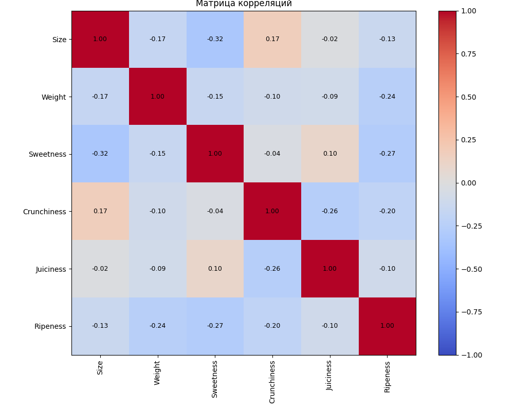

# Лабораторная работа 1

## Данные

Взят датасет [Apple Quality](https://www.kaggle.com/datasets/nelgiriyewithana/apple-quality), содержащий информацию о яблоках.

**Источник:** Kaggle, Apple Quality (NELGIRIYE WITHANA).

### Описание признаков датасета

| Признак | Описание |
|---|---|
| `A_id` | Уникальный идентификатор для каждого фрукта |
| `Size` | Размер фрукта |
| `Weight` | Вес фрукта |
| `Sweetness` | Степень сладости фрукта |
| `Crunchiness` | Текстура, отражающая хрусткость фрукта |
| `Juiciness` | Уровень сочности фрукта |
| `Ripeness` | Стадия зрелости фрукта |
| `Acidity` | Уровень кислотности фрукта |
| `Quality` | Общая оценка качества фрукта |

### Предобработка

- Целевая переменная `Quality` закодирована в формате $\{-1, 1\}$.
- Удалена служебная (пустая) нижняя строка датасета.
- Признак `A_id` исключён из обучения как неинформативный идентификатор.

### Корреляционный анализ

Для оценки взаимосвязей между признаками датасета была построена **карта корреляций**.

**Цель построения:** выявить линейные зависимости между числовыми признаками, обнаружить сильно коррелирующие пары переменных (для отбора признаков и борьбы с мультиколлинеарностью).

## Вычисление отступов

Была реализована функция вычисления **отступов** — величины, показывающей, насколько уверенно модель относит объект к правильному классу:

$$M = y \cdot f(x)$$

где $y$ — истинная метка, $f(x)$ — предсказание модели. Положительный отступ означает верную классификацию, отрицательный — ошибочную, значения около нуля соответствуют пограничным объектам.

Ниже представлена визуализация распределения отступов для трёх случаев:

- **обученная модель** — отступы смещены в положительную область, что говорит о корректной классификации;
- **модель со случайной инициализацией весов** — распределение отступов близко к нулю, модель работает на уровне 50/50;
- **модель со скоррелированными весами** — показывает более приемлемый результат, чем случайная инициализация.

## Реализация линейного классификатора

### 1. Вычисление градиента функции потерь

Была реализована функция `mse_grad`, вычисляющая градиент функции потерь по весам модели. В качестве функции потерь используется MSE относительно отступов:

$$L = \frac{1}{n}\sum_{i=1}^{n}(1 - M_i)^2, \quad M_i = y_i \cdot (w^T x_i + w_0)$$

Градиент вычисляется в векторном виде:

$$\nabla L = -\frac{2}{n} X^T\big((1 - M) \odot y\big)$$

где $X$ — матрица признаков с добавленным столбцом единиц, $M$ — вектор отступов, $\odot$ — поэлементное умножение.

### 2. Рекуррентная оценка функционала качества

Реализована экспоненциальная скользящая средняя (EMA) значения функции потерь в методе `update_q_ema`:

$$Q_t = (1 - \alpha)\,Q_{t-1} + \alpha\,L_t$$

где $\alpha$ — коэффициент сглаживания, $L_t$ — текущее значение потерь на батче. EMA позволяет сгладить шум стохастической оценки и отслеживать динамику обучения без усреднения по всей выборке.

### 3. Стохастический градиентный спуск с инерцией

Реализован метод SGD с моментом (инерцией) в функции `sgd_momentum`:

$$v_t = \mu\,v_{t-1} + (1 - \mu)\,\nabla L$$

$$w_t = w_{t-1} - \eta\,v_t$$

где $\mu$ — коэффициент инерции, $\eta$ — шаг обучения. Накопление «скорости» сглаживает колебания градиента и ускоряет сходимость. Также реализован вариант с адаптивным шагом (`steepest`), где величина шага вычисляется аналитически по направлению градиента.

### 4. L2-регуляризация

В функции потерь и её градиенте добавлен член L2-регуляризации с коэффициентом $\tau$:

$$L_{reg} = L + \frac{\tau}{2}\sum_{j=1}^{d} w_j^2, \quad \nabla L_{reg} = \nabla L + \tau w$$

Смещение $w_0$ при этом не регуляризуется. L2-регуляризация штрафует большие веса и снижает риск переобучения.

## Тестирование классификатора

### Сравнение способов инициализации и обучения модели

| Способ | F1-score | Accuracy |
|---|---|---|
| Инициализация весов через корреляцию (`correlation`) | 0.7526 | 0.7575 |
| Случайная инициализация весов (`random`) | 0.7465 | 0.7537 |
| Мультистарт (`multi`) | 0.7545 | 0.7587 |
| Reference-модель (`reference_model`, scikit-learn) | 0.7585 | 0.7613 |

**Вывод:** лучший результат показала reference-модель из scikit-learn (F1 = 0.7585, Accuracy = 0.7613). Среди собственных реализаций наилучшей оказалась модель с мультистартом (F1 = 0.7545, Accuracy = 0.7587), которая уступает sklearn-модели менее чем на 0.5 п.п. Инициализация через корреляцию (F1 = 0.7526) немного опережает случайную (F1 = 0.7465), что говорит об эффективности корреляционной инициализации.